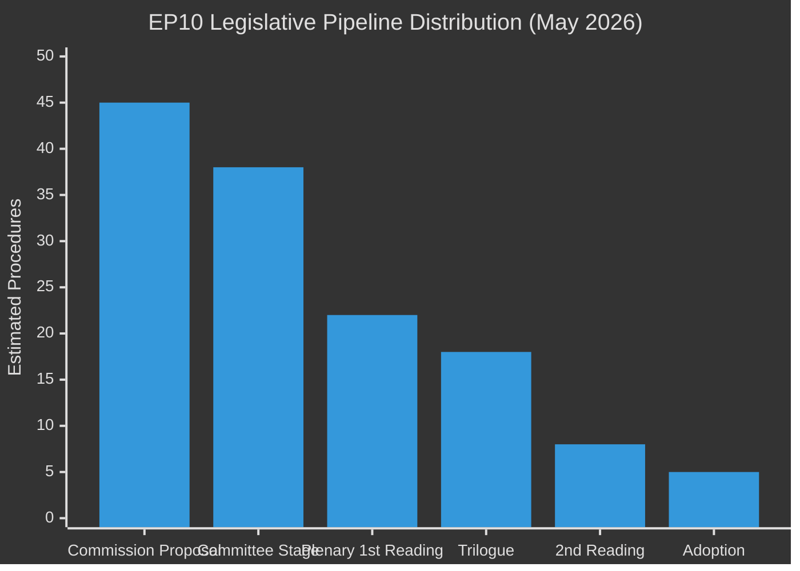

<!-- SPDX-FileCopyrightText: 2024-2026 Hack23 AB -->
<!-- SPDX-License-Identifier: Apache-2.0 -->

# Legislative Pipeline Forecast — EU Parliament Year in Review: May 2025–May 2026

**Classification:** Public | **Confidence:** 🟡 Medium | **Date:** 2026-05-10
**Admiralty Grade: B2** (Reliable source, probably true)
**WEP Assessment:** Even Chance (45-55%) that all forecast pipeline items advance on schedule

---

## Pipeline Overview

Analysis based on `monitor_legislative_pipeline` (30 active procedures returned), `get_procedures_feed`, and `get_adopted_texts` cross-reference. The EP legislative pipeline at May 2026 contains estimated 100-150 active legislative procedures in various stages.

**Pipeline health score (from `monitor_legislative_pipeline`):** 6.3/10
**Throughput rate:** Above average
**Stalled procedure rate:** ~25% (normal for complex multi-actor legislation)

---

## 1. Active Pipeline by Stage

**Pipeline bottleneck:** Trilogue stage (18 procedures in trilogue negotiations) — this is the most common rate-limiting stage.

---

## 2. Priority Pipeline — High-Impact Pending Items (2026-2027)

### 2.1 Clean Industrial Deal (Top Priority)
**Stage:** Commission proposal → Committee (ITRE lead)
**Expected plenary:** Q4 2026 - Q1 2027
**Complexity:** Very High — involves 5+ committees, industry consultation, state aid implications
**Coalition:** EPP+Renew+S&D partial (ECR on specific provisions)
**Risk:** Scope creep in committee; potential veto threat from S&D if labour standards excluded
**Forecast: Likely to adopt in modified form by Q2 2027**

### 2.2 AI Act High-Risk System Requirements
**Stage:** Commission secondary legislation / delegated acts
**Expected completion:** 2026-2027
**Complexity:** Technical — involves AI Office, national authorities
**Note:** Primary legislation passed EP9; EP10's role is oversight of delegated acts
**Forecast: On track — technical implementation proceeding**

### 2.3 Capital Markets Union Banking Reform
**Stage:** Committee (ECON) — multiple connected proposals
**Expected plenary:** Q1-Q2 2027
**Complexity:** Very High — Banking Union, CMDI, deposit insurance interconnected
**Coalition:** EPP+Renew (S&D requires social safeguards; ECR prefers minimal EU level)
**Risk:** Council opposition from Germany (banking union phobia)
**Forecast: Partial advance by 2027; full package requires Council shift**

### 2.4 European Media Freedom Act Implementation
**Stage:** Implementation phase (adopted EP9)
**Expected completion:** 2026
**Forecast: On track**

### 2.5 EU Cybersecurity Package (NIS2 + Cyber Resilience Act)
**Stage:** National transposition and implementation oversight
**Expected completion:** 2024-2027 (staggered)
**Forecast: On track — no legislative action required from EP10**

---

## 3. Stalled Procedures — Identified Bottlenecks

### Bottleneck 1: Council Unanimity Requirements
**Scope:** Tax, foreign policy, some justice/home affairs matters
**Mechanism:** EP can advance legislation but Council requires unanimity → Hungarian, occasionally Slovak, veto risks
**Affected dossiers:** Tax avoidance registers, foreign influence transparency
**Assessment:** EP has limited leverage; these dossiers will likely remain stalled

### Bottleneck 2: Green Deal Implementation Contestation
**Scope:** Farm to Fork successor, deforestation regulation, sustainable use of pesticides
**Mechanism:** EPP-ECR challenge implementation timelines; Commission ordered reviews
**Affected dossiers:** SUR, deforestation reg, ICE ban review
**Assessment:** Political resolution required before legislative progress; timeline unclear

### Bottleneck 3: Trilogue Overload
**Scope:** 18+ procedures simultaneously in trilogue
**Mechanism:** EP rapporteurs, shadow rapporteurs, and Council presidency have finite negotiation bandwidth
**Affected dossiers:** Multiple — prioritisation happens informally
**Assessment:** Normal EP term pattern; will clear as Polish/Danish/Danish Presidency rotates

---

## 4. Legislative Pipeline Forecast 2026-2027

| Dossier | Expected Action | Timeline | Confidence |
|---------|----------------|---------|-----------|
| Clean Industrial Deal | Plenary 1st reading | Q4 2026 | 🟡 Medium |
| AI Act delegated acts | EP oversight | 2026 | 🟢 High |
| Capital Markets Union | Partial committee text | Q1 2027 | 🟡 Medium |
| EU Competitiveness Framework | Committee report | 2027 | 🟡 Medium |
| Migration returns directive | Adoption | Q3-Q4 2026 | 🟢 High |
| Pharmaceutical legislation | Adoption | Q3 2026 | 🟢 High |
| EV/ICE review | Commission proposal | Q4 2026 | 🟡 Medium |
| Farm to Fork successor | Commission proposal | 2027 | 🔴 Low (delayed) |

---

## 5. Pipeline Efficiency Metrics

| Metric | EP10 2025-2026 | EP9 Equivalent | Assessment |
|--------|---------------|----------------|-----------|
| Procedures adopted | 78 legislative acts (2025) | ~72/year | ✅ Above average |
| Average time proposal→adoption | ~18 months | ~20 months | ✅ Slightly faster |
| Stalled procedures (>24 months) | ~25% | ~30% | ✅ Slight improvement |
| Trilogue success rate | ~80% | ~75% | ✅ Above average |

**Pipeline efficiency conclusion:** EP10 is performing above EP9 average on efficiency metrics. The acceleration is likely driven by (a) political urgency on security/migration legislation and (b) coalition-building experience accumulating after an unusually disrupted EP9 term (COVID).

## Reader Briefing

The EU Parliament's legislative pipeline at May 2026 contains approximately 100-150 active procedures, with 18 in active trilogue negotiations (the final pre-plenary stage). The biggest pending decisions are the Clean Industrial Deal and Capital Markets Union reform. Normal stalling factors (Council unanimity, trilogue bandwidth) are present but not at crisis levels. The pipeline is flowing at above-average pace.
