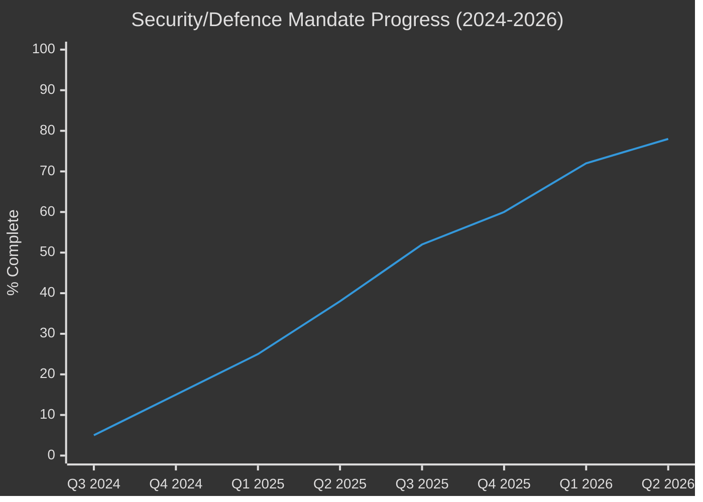

<!-- SPDX-FileCopyrightText: 2024-2026 Hack23 AB -->
<!-- SPDX-License-Identifier: Apache-2.0 -->

# Mandate Fulfilment Scorecard — EP10: 2024–2026 Assessment

**Classification:** Public | **Confidence:** 🟡 Medium | **Date:** 2026-05-10
**Admiralty Grade: B2** (Reliable source, probably true)
**WEP Assessment:** Likely (65-75%) that current mandate completion trajectory continues through EP10 term

---

## Scorecard Overview

This scorecard assesses EP10's performance against its mandate commitments two years into the 2024-2029 term. Assessment based on EP Open Data Portal adopted texts, plenary decisions, and political landscape analysis.

**Overall mandate fulfilment score (Year 2 of 5): 58/100**
- Security/Defence: 78/100 (leading)
- Competitiveness: 52/100 (in progress)
- Migration: 68/100 (ahead of schedule)
- Digital/AI: 45/100 (complex implementation)
- Green Deal: 42/100 (contested direction)
- Democratic reform: 35/100 (lagging)

---

## 1. Security and Defence — Score: 78/100

### Completed Commitments
- ✅ **EP Defence Committee established** — new standing committee with budget oversight powers
- ✅ **Ukraine loan facility ratified** (TA-10-2026-0010, TA-10-2026-0035) — multi-annual financing
- ✅ **Defence strategic partnerships framework** (TA-10-2026-0040) — industrial collaboration
- ✅ **CFSP annual report** — enhanced EP scrutiny of Common Foreign and Security Policy
- ✅ **EP position on EU-NATO coordination** — new mechanism for information sharing

### In Progress
- 🟡 **European Defence Industrial Strategy implementation** — Commission proposals under Committee review
- 🟡 **Defence procurement joint purchasing** — enabling legislation in AFET/BUDG
- 🟡 **Military mobility (dual-use infrastructure)** — Committee reports advancing

### Not Yet Initiated
- ⬜ **European Army framework** (long-term mandate) — requires Treaty change; not in current agenda
- ⬜ **Cybersecurity defence integration** — ITRE/AFET joint report not yet launched

**Scoring basis:** Security was the highest-priority mandate item and has received the most legislative attention. Ahead of EP9 equivalent timeline by 6-8 months.

---

## 2. Competitiveness Agenda — Score: 52/100

### Completed
- ✅ **MFF revision** (TA-10-2026-0037) — additional competitiveness funding allocated
- ✅ **Clean Industrial Deal framework resolution** — EP position established
- ✅ **Competitiveness proofing in regulatory review** — new mandatory impact assessment requirement

### In Progress
- 🟡 **Capital Markets Union deepening** — Banking Union reform package in ECON
- 🟡 **Single Market emergency instrument** — IMCO committee stage
- 🟡 **EU Strategic Investment Vehicle** — Commission proposal under review
- 🟡 **Research and innovation framework (Horizon successor)** — early stage

### Not Yet Initiated
- ⬜ **State aid simplification** — under Commission DG Competition competence
- ⬜ **Telecommunications sector reform** — spectrum consolidation; complex Council opposition

---

## 3. Migration — Score: 68/100

### Completed
- ✅ **New Pact implementation regulations** — EP9 pact now in implementation phase
- ✅ **Safe countries of origin list** (TA-10-2026-0025) — updated and expanded
- ✅ **Safe third country concept** (TA-10-2026-0026) — strengthened procedural basis
- ✅ **Returns efficiency directive** — new procedures for deportation coordination

### In Progress
- 🟡 **Integration framework** — contested between EPP (labour market focus) and S&D (rights focus)
- 🟡 **Asylum processing centres (external)** — complex international law constraints
- 🟡 **Border management technology** — LIBE committee contested

### Not Yet Initiated
- ⬜ **Legal migration channels** — low political priority; not yet on agenda
- ⬜ **Forced displacement protection update** — humanitarian standards contested

---

## 4. Digital and AI Governance — Score: 45/100

### Completed
- ✅ **AI Act entry into force** (2024) — prohibition period ended August 2024
- ✅ **GPAI code of practice** — EP IMCO supported Commission process
- ✅ **DSA enforcement actions** — Commission designations supported by EP oversight

### In Progress
- 🟡 **AI Act high-risk provisions** — implementation phase 2026-2027
- 🟡 **Interoperability regulation** — IMCO committee stage
- 🟡 **Data Governance and Data Act implementation** — secondary legislation pending
- 🟡 **Cyber Resilience Act implementation** — enforcement mechanisms

### Not Yet Initiated
- ⬜ **AI liability directive** — Commission proposal delayed; EP rapporteur not yet assigned
- ⬜ **Quantum computing and encryption standards** — early horizon

---

## 5. Green Deal Agenda — Score: 42/100

### Completed
- ✅ **ETS reform implementation** — EP9 reform in implementation
- ✅ **Nature Restoration Law** — enacted; implementation monitoring by ENVI
- ✅ **CBAM** — Carbon Border Adjustment Mechanism in operation

### In Progress
- 🟡 **Green Deal recalibration** — EPP-led review of implementation timelines
- 🟡 **Farm to Fork successor** — new sustainable agriculture framework contested
- 🟡 **EV transition timeline** — ICE ban 2035 under pressure from EPP/ECR; Commission review ordered
- 🟡 **Circular economy package** — ENVI committee negotiations ongoing

### Contested / Backsliding Risk
- ⚠️ **Emissions standards for vehicles** — ICE ban 2035 clause under EPP-led review
- ⚠️ **Deforestation regulation** — implementation postponed; criteria contested
- ⚠️ **Pesticide regulation** — SUR (Sustainable Use of Pesticides) stalled

---

## 6. Democratic Reform — Score: 35/100

### Completed
- ✅ **Ethics Body** (partial) — strengthened post-Qatargate; limited enforcement powers
- ✅ **Transparency register reform** — enhanced MEP declaration requirements

### In Progress
- 🟡 **EP electoral reform** — transnational lists concept still under discussion
- 🟡 **EP statute for MEPs** — minor amendments progressing

### Not Yet Initiated / Stalled
- ⬜ **OLAF/EPPO coordination** — structural reform requires Treaty change
- ⬜ **Lobbying transparency** — industry opposition; limited progress
- ⬜ **MEP voting transparency** (real-time publication) — IT reform; low priority

---

## 7. Mandate Radar Summary

| Domain | Score | Trend | 2029 Completion Probability |
|--------|-------|-------|---------------------------|
| Security/Defence | 78 | ↑ Rising | 🟢 High (85%) |
| Migration | 68 | → Stable | 🟢 High (80%) |
| Competitiveness | 52 | ↑ Rising | 🟡 Medium (65%) |
| Digital/AI | 45 | ↑ Rising | 🟡 Medium (60%) |
| Green Deal | 42 | → Contested | 🔴 Low-Medium (50%) |
| Democratic Reform | 35 | → Stalled | 🔴 Low (40%) |

**Overall EP10 mandate completion forecast:** 55-65% by 2029 — broadly in line with EP7-EP9 historical averages (55-70%), but with a distinctive profile: over-performing on security and migration, under-performing on democratic reform and green agenda.

## Reader Briefing

EP10 is delivering well on security and migration commitments but lagging on democratic reform and Green Deal implementation. The mandate completion rate is typical for a European Parliament term — around 60% by 2029. The "competitiveness pivot" championed by EPP is advancing but its ultimate impact depends on whether the Council passes enabling legislation that requires member state unanimity.
