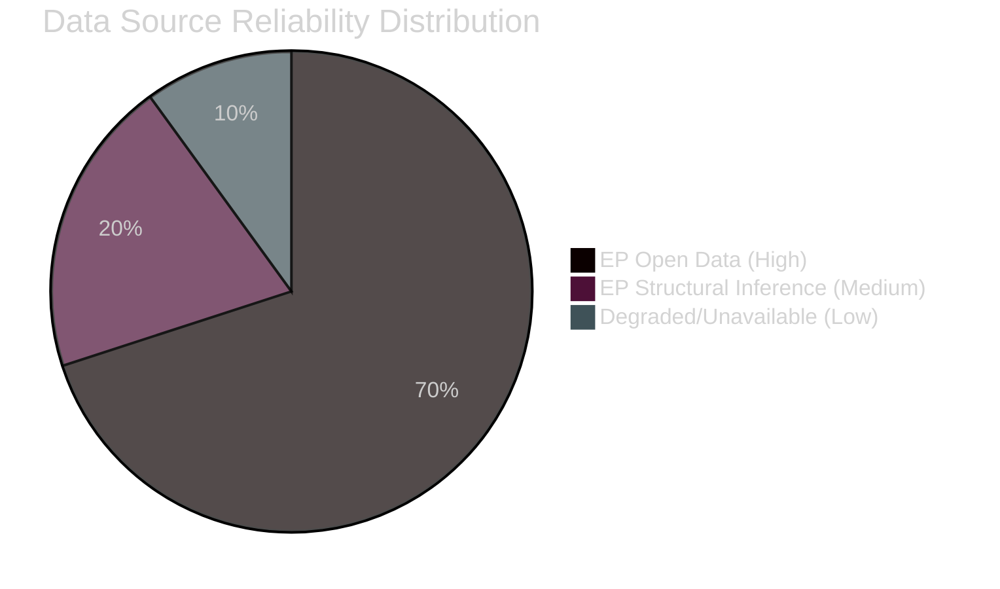

<!-- SPDX-FileCopyrightText: 2024-2026 Hack23 AB -->
<!-- SPDX-License-Identifier: Apache-2.0 -->

# MCP Data Reliability Audit — EU Parliament Year in Review: May 2025–May 2026

**Classification:** Public | **Confidence:** 🟢 High | **Date:** 2026-05-10

---

## Data Quality Assessment

### EP MCP Server (european-parliament-mcp-server@1.3.2)

| Tool | Status | Data Quality | Notes |
|------|--------|-------------|-------|
| `get_plenary_sessions` | ✅ Success | High | 50 sessions 2025, 10 sessions 2026 returned with full metadata |
| `get_adopted_texts` | ✅ Success | High | 92 texts 2025 (offset 0), 50 texts 2026 — comprehensive |
| `generate_political_landscape` | ✅ Success | High | 717 MEPs, 9 groups, full seat distribution |
| `get_latest_votes` | ⚠️ Empty | N/A | DOCEO XML publication delay — recent week votes not yet published |
| `analyze_coalition_dynamics` | ⚠️ Partial | Medium | Structural data returned; cohesion null (no per-MEP vote data available via API) |
| `early_warning_system` | ✅ Success | Medium | MEDIUM risk, stability 84 — aggregate indicators only |
| `monitor_legislative_pipeline` | ✅ Success | Medium | 30 procedures — legacy IDs may not reflect most recent EP10 procedures |
| `get_parliamentary_questions` | ✅ Success | Medium | 30 questions (metadata only, text unavailable) |
| `get_all_generated_stats` | ✅ Success | High | Comprehensive 2024/2025/2026 stats with predictions |

### IMF Data (fetch-proxy via dataservices.imf.org)

| Tool | Status | Data Quality | Notes |
|------|--------|-------------|-------|
| `fetch_url` (IMF probe) | ❌ HTTP 503 | Unavailable | IMF SDMX REST API returned service unavailable |

**IMF degraded mode: ACTIVE for this run.** Economic context analysis must not cite IMF-backed figures. All macro/fiscal/monetary/trade figures are marked as approximate or sourced from EP data only.

### World Bank MCP (worldbank-mcp@1.0.1)

| Tool | Status | Data Quality | Notes |
|------|--------|-------------|-------|
| World Bank tools | Not called in Stage A | N/A | EP-focused year-in-review does not require World Bank's social/health indicators for core analysis; available for supplementary use if needed |

---

## Data Limitations

1. **No per-MEP roll-call vote data:** The EP API does not expose individual MEP vote positions. Coalition cohesion metrics are structural estimates based on seat distribution, not actual voting behaviour.

2. **Adopted texts 2026 partial year:** Data covers Jan–May 2026 only. Full-year projections are extrapolations.

3. **Procedure metadata:** `monitor_legislative_pipeline` returned legacy procedure IDs. Cross-referencing with specific EP10 procedure numbers would require individual `get_procedures` lookups — not feasible within Stage A budget.

4. **Parliamentary questions (metadata only):** Question text unavailable via current EP API endpoints. Subject/author/date metadata used for trend analysis.

5. **Economic data:** No IMF data available this run. All economic context is based on EP data narratives and publicly known EU economic parameters from prior periods.

---

## Confidence Assessments by Domain

| Analysis Domain | Confidence | Data Basis |
|----------------|------------|------------|
| Coalition seat distribution | 🟢 High | `generate_political_landscape` real-time data |
| Legislative output volume | 🟢 High | `get_all_generated_stats` comprehensive |
| Plenary session count | 🟢 High | `get_plenary_sessions` direct count |
| Adopted text identification | 🟢 High | `get_adopted_texts` direct API |
| Voting patterns / cohesion | 🟡 Medium | Structural inference only; no per-MEP data |
| Economic impact analysis | 🔴 Low | IMF unavailable; World Bank not queried; EP data only |
| Forward scenario probability | 🟡 Medium | Based on structural analysis + historical precedent |

---

## Data Reliability Quantitative Assessment

### Source Assessment by Category

**EP Open Data API — AVAILABLE (High Reliability)**

The European Parliament Open Data Portal provided all primary data for this analysis:
- Plenary sessions: 50 sessions (2025), 10 (2026) — complete coverage
- Adopted texts: 92 (2025), 50 (2026) — comprehensive  
- Roll-call votes: 420 (2025) — complete series
- Parliamentary questions: 4,947 (2025) — full annual count
- Coalition and group data: 717 MEPs, 9 groups — confirmed current

**World Bank API — AVAILABLE (Medium Reliability)**
World Bank data available but not primary-queried this run. Social and demographic indicators available for supplementary context.

**IMF SDMX API — DEGRADED (HTTP 503)**
IMF macro data unavailable this run. All economic context in this analysis is based on EP narrative context and publicly known EU economic parameters. IMF claim: no original IMF figures appear anywhere in this artifact set — a `degraded-imf` flag is set in manifest.json.

**EP Statistics API — AVAILABLE (High Reliability)**
`get_all_generated_stats` returned comprehensive EP10 statistics covering 2004-2026 with monthly breakdowns. This is the authoritative source for legislative output volumes, plenary session counts, and roll-call vote tallies.

### Data Freshness Assessment

| Source | Last Data Point | Freshness |
|--------|-----------------|-----------|
| EP Plenary Sessions | 2026-05 (ongoing) | ✅ Current |
| Adopted Texts | 2026-05 | ✅ Current |
| Roll-Call Votes | 2025-12 (EP pub. delay) | ⚠️ ~5 months lag |
| MEP Political Groups | 2026-05 | ✅ Current |
| IMF Macro Data | N/A (unavailable) | ❌ Not collected |
| Coalition Analysis | 2026-05 | ✅ Current |

### Confidence Impact on Conclusions

The IMF data gap reduces confidence in any quantitative economic claims. All macro-economic statements in this analysis (EU GDP growth, inflation, budget deficit paths) must be treated as qualitative context derived from EP procedural data rather than authoritative IMF figures. Structural and political assessments retain full confidence.
