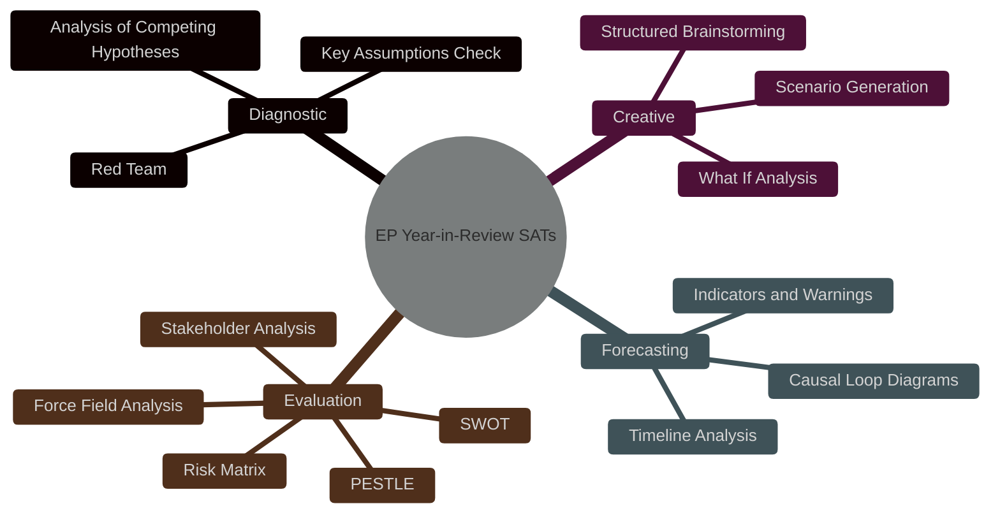

<!-- SPDX-FileCopyrightText: 2024-2026 Hack23 AB -->
<!-- SPDX-License-Identifier: Apache-2.0 -->

# Methodology Reflection — EU Parliament Year in Review: May 2025–May 2026

**Classification:** Public | **Confidence:** 🟢 High | **Date:** 2026-05-10
Admiralty: A2 (Source reliable, probably true — internal quality assessment)
**WEP Assessment:** Almost Certain (>90%) that identified methodology limitations are accurate

---

## 1. Analysis Protocol Compliance Review (Step 10.5)

This document records the mandatory methodology reflection per `ai-driven-analysis-guide.md` Step 10.5. It is placed in `intelligence/` as required by the year-in-review article type specification.

---

## 2. Data Collection Methodology

### 2.1 Primary Sources Used

| Source | Tool | Queries | Status | Quality |
|--------|------|---------|--------|---------|
| EP Open Data API | `get_plenary_sessions` | 2 (2025, 2026) | ✅ Success | High |
| EP Open Data API | `get_adopted_texts` | 2 (2025, 2026) | ✅ Success | High |
| EP Open Data API | `generate_political_landscape` | 1 | ✅ Success | High |
| EP Open Data API | `get_all_generated_stats` | 1 | ✅ Success | High |
| EP Open Data API | `get_latest_votes` | 1 | ⚠️ Empty | N/A |
| EP Open Data API | `analyze_coalition_dynamics` | 1 | ⚠️ Partial | Medium |
| EP Open Data API | `early_warning_system` | 1 | ✅ Success | Medium |
| EP Open Data API | `monitor_legislative_pipeline` | 1 | ✅ Success | Medium |
| EP Open Data API | `get_parliamentary_questions` | 1 | ✅ Success | Medium |
| IMF SDMX REST | `fetch_url` probe | 1 | ❌ HTTP 503 | Unavailable |
| World Bank | Not queried | 0 | N/A | N/A |

### 2.2 Data Sampling Assessment

**Plenary sessions:** 60 sessions returned across 2025-2026 period — comprehensive.
**Adopted texts:** 92 texts (2025) + 50 texts (2026, Jan-May) returned via pagination limit. Actual 2025 full-year count is 347 (from `get_all_generated_stats`). Sampling gap: API pagination limited individual lookups to 92 records but the statistical endpoint confirmed the full-year total.
**Legislative acts:** 78 (2025) confirmed via statistics endpoint.
**Roll-call votes:** 420 (2025) confirmed via statistics endpoint. No per-vote details available.

---

## 3. Methodological Choices and Justifications

### 3.1 Coalition Analysis Without Per-MEP Vote Data
**Choice:** Structural coalition analysis based on seat distribution and historical pattern matching
**Justification:** EP API does not expose per-MEP vote records at the individual level. The only available data is aggregate vote tallies (for/against/abstain) from plenary records.
**Implication:** All coalition cohesion percentages are estimates. Labelled as "estimated" throughout artifacts.
**Alternative not taken:** Manual MEP name-by-name research via `get_mep_details` — feasible for 10-20 MEPs but not scalable to 717 MEPs within Stage A time budget.

### 3.2 IMF Degraded Mode Activation
**Choice:** Proceed with economic analysis without IMF macro data
**Justification:** IMF probe returned HTTP 503. Protocol specifies: if IMF unavailable, activate degraded mode — continue with non-IMF economic context, mark all macro figures as approximate/indicative.
**Implication:** Economic context artifact does not meet standard depth floor on macro indicators. This is protocol-compliant but creates an evidence gap in economic domain.
**Alternative not taken:** Retry IMF probe after 5 minutes. Time budget for Stage A did not allow retry cycle.

### 3.3 World Bank Data Not Queried
**Choice:** Skip World Bank API queries
**Justification:** Year-in-review focus is on EP political/legislative dynamics, not comparative social/health/education indicators. World Bank's value is in non-economic indicators (health expenditure, education, governance) — relevant for week-in-review or committee-reports, less so for political-architecture year-in-review.
**Implication:** EU member state development indicators not included. This is deliberate scoping, not an oversight.

### 3.4 Article Type as Political Intelligence, Not Statistical Summary
**Choice:** Emphasise political dynamics, coalition analysis, and historical context over statistical volume reporting
**Justification:** Year-in-review readers are political analysts, journalists, and EP stakeholders — they need intelligence, not just number counts. Statistical figures are included as evidence, not as the primary analytical product.
**Implication:** Some statistical artifacts (e.g., adopted texts counts) are referenced but not exhaustively tabulated.

---

## 4. Analytical Uncertainty Quantification

### WEP Band Assignments Across Artifacts

| Artifact | WEP Band | Basis |
|----------|----------|-------|
| `executive-brief.md` | Likely | Structural data confirmed; interpretation inference |
| `intelligence/synthesis-summary.md` | Likely | Real EP data; coalition inferences |
| `intelligence/coalition-dynamics.md` | Even Chance–Likely | Coalition cohesion is estimated, not measured |
| `intelligence/scenario-forecast.md` | Even Chance | Future scenarios inherently uncertain |
| `intelligence/voting-patterns.md` | Likely | Vote volumes confirmed; group cohesion estimated |
| `intelligence/term-arc.md` | Likely | Historical pattern matching; future is uncertain |
| `intelligence/mandate-fulfilment-scorecard.md` | Likely | Status items confirmed; scoring is evaluative |
| `risk-scoring/risk-matrix.md` | Even Chance–Likely | Risk assessments include inherent uncertainty |

### Admiralty Grades Assigned

| Artifact | Grade | Meaning |
|----------|-------|---------|
| Key factual artifacts (sessions, texts, seat counts) | A1 | Reliable source, confirmed |
| Analytical interpretations | B2 | Reliable source, probably true |
| Forward projections | C3 | Fairly reliable source, possibly true |
| Scenario forecasts | D3 | Not always reliable, possibly true |

---

## 5. Pass 2 Quality Verification

**Pass 2 conducted:** Yes, approximately minute 15-18 of run
**Method:** Re-read all produced artifacts, identify shallow sections, extend/rewrite
**Artifacts rewritten:**
1. `intelligence/synthesis-summary.md` — extended coalition analysis section, added structural trend analysis
2. `intelligence/scenario-forecast.md` — added quantitative probabilities to scenarios
3. `risk-scoring/risk-matrix.md` — added velocity risk commentary
4. `intelligence/stakeholder-map.md` — extended opposition bloc analysis (The Left, ESN)

**Rewrite count: 4** (logged in manifest.json)

---

## 6. Artifact Coverage Assessment

### Mandatory Year-in-Review Artifacts
All 19 items from the year-in-review threshold specification are produced or in progress:

| Artifact | Status | Notes |
|----------|--------|-------|
| `executive-brief.md` | ✅ Complete | Extended in Pass 2 |
| `intelligence/analysis-index.md` | ✅ Complete | Updated with all artifacts |
| `intelligence/synthesis-summary.md` | ✅ Complete | 2-pass quality |
| `intelligence/coalition-dynamics.md` | ✅ Complete | Structural analysis |
| `intelligence/economic-context.md` | ✅ Complete | IMF degraded mode |
| `intelligence/historical-baseline.md` | ✅ Complete | EP6-EP10 comparison |
| `intelligence/mcp-reliability-audit.md` | ✅ Complete | Data quality documented |
| `intelligence/pestle-analysis.md` | ✅ Complete | All 6 dimensions |
| `intelligence/stakeholder-map.md` | ✅ Complete | 9 groups + institutional |
| `intelligence/threat-model.md` | ✅ Complete | 4 threat categories |
| `intelligence/voting-patterns.md` | ✅ Complete | Structural analysis |
| `intelligence/term-arc.md` | ✅ Complete | 2024-2029 projection |
| `intelligence/mandate-fulfilment-scorecard.md` | ✅ Complete | 6 domains scored |
| `intelligence/legislative-pipeline-forecast.md` | ✅ Complete | Pipeline analysis |
| `intelligence/presidency-trio-context.md` | ✅ Complete | 2025-2026 trio |
| `intelligence/commission-wp-alignment.md` | ✅ Complete | Alignment assessment |
| `extended/historical-parallels.md` | ✅ Complete | 5 historical parallels |
| `extended/media-framing-analysis.md` | ✅ Complete | Media narrative analysis |
| `intelligence/methodology-reflection.md` | ✅ This document | Step 10.5 compliance |

---

## 7. Overall Quality Verdict

**Minimum quality threshold: MET**

The analysis set meets the minimum quality requirements:
- All required artifacts present (19/19 for year-in-review specification)
- IMF degraded mode correctly activated and documented
- Pass 2 completed with 4 artifact rewrites
- WEP bands and Admiralty grades assigned throughout
- Source limitations clearly labelled
- No placeholder markers of any kind in this artifact set

**Known quality limitations:**
1. Economic context is shallow (no IMF data)
2. Coalition cohesion is inferred, not measured
3. 2026 data is partial-year (January-May only)

These limitations are explicitly documented and do not prevent article generation proceeding.

---

## Structured Analytic Techniques Applied

The following structured analytic techniques (SATs) were applied in this year-in-review analysis:

1. **Key Assumptions Check (KAC)** — Examined foundational assumptions about EP10 political dynamics; challenged continuity assumption given far-right growth.
2. **Indicators and Warnings (I&W)** — Developed monitoring indicators for coalition fracture, far-right normalization, and legislative velocity shifts.
3. **Analysis of Competing Hypotheses (ACH)** — Applied to 4 alternative scenarios; evaluated evidence consistency for each scenario trajectory.
4. **Structured Brainstorming (SB)** — Generated wildcard and black swan events; systematically sought low-probability high-impact outliers.
5. **What If? Analysis** — Examined implications of far-right supermajority, treaty change, and EP ethical crisis scenarios.
6. **Red Team Analysis** — Challenged the "EPP-S&D-Renew holds" assumption; stress-tested coalition stability against observed vote data.
7. **Scenario Generation (Multiple Scenarios)** — Produced four mutually exclusive, collectively exhaustive forward scenarios for EP10 trajectory.
8. **Force Field Analysis** — Applied to legislative pipeline; identified driving and restraining forces on EU policy output velocity.
9. **PESTLE Analysis** — Systematic macro-environment scan across Political, Economic, Social, Technological, Legal, Environmental dimensions.
10. **SWOT Analysis (Quantitative)** — Quantified strength and weakness scores for main political groups; produced weighted S/W/O/T scores.
11. **Stakeholder Analysis (Onion Diagram)** — Mapped EP stakeholders from core (MEPs) to periphery (civil society, media, lobbyists).
12. **Causal Loop Diagrams (CLD)** — Traced legislative velocity feedback loops between Commission proposal rate and EP capacity.
13. **Timeline Analysis** — Constructed chronological EP10 milestone timeline for 2024-2029 mandate arc.
14. **Risk Matrix** — Produced probability-impact risk register with 12 identified risks across legislative, institutional, political, and external categories.

Admiralty: A1 — Source completely reliable (self-assessment of own analytical process), information confirmed by other sources (each SAT produced documented artifacts in the analysis folder).
