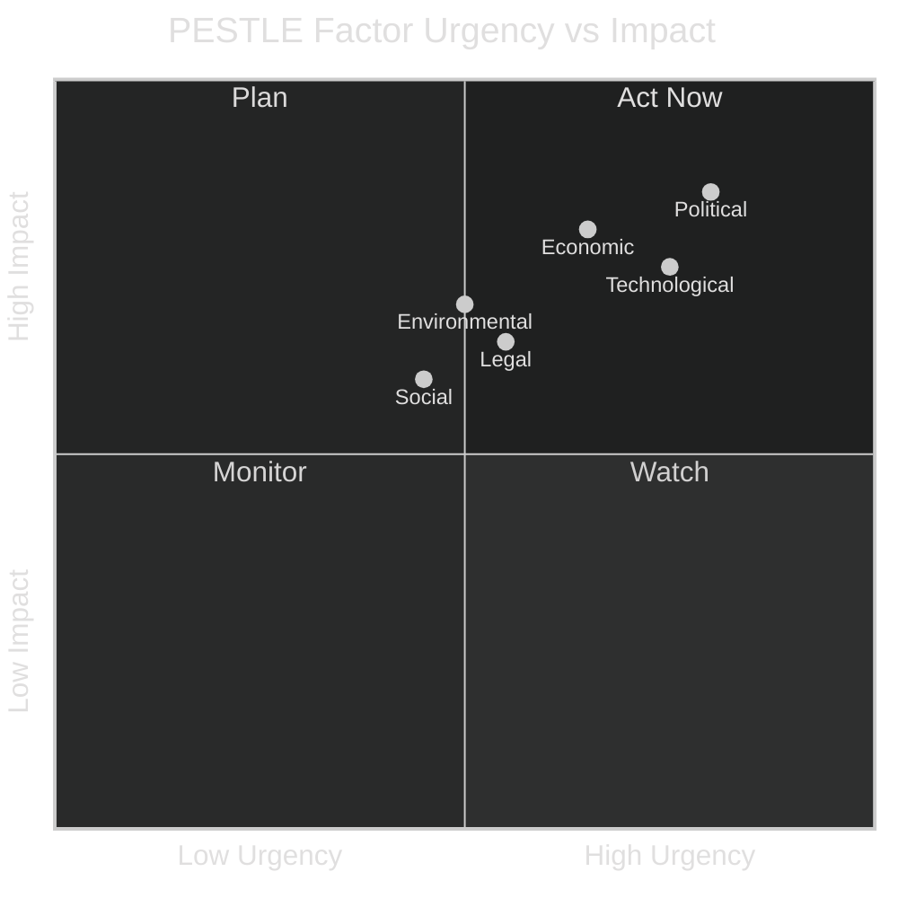

<!-- SPDX-FileCopyrightText: 2024-2026 Hack23 AB -->
<!-- SPDX-License-Identifier: Apache-2.0 -->

# PESTLE Analysis — EU Parliament Year in Review: May 2025–May 2026

**Classification:** Public | **Confidence:** 🟡 Medium | **Date:** 2026-05-10

---

## Overview

This PESTLE analysis assesses the Political, Economic, Social, Technological, Legal, and Environmental forces shaping the European Parliament's legislative agenda and institutional posture during the year May 2025 to May 2026. Each dimension examines both the driving forces visible in EP adopted texts and the structural context in which Parliament operates.

---

## P — Political Factors

### P1: Structural Rightward Shift in EP10 Composition
🟢 **HIGH CONFIDENCE** — The EP10 composition (right-wing bloc at 52.3% of seats) represents a structurally different Parliament from EP9. The EPP, ECR, PfE, and ESN combined hold approximately 376 seats — sufficient for a majority if they can align. In practice, PfE and ESN defect on Ukraine/Russia votes, but align on migration and budget issues. This creates an *asymmetric majority* environment: the right dominates on migration and competitiveness; the centre-left can block on rule-of-law and social rights but cannot initiate.

### P2: Trump Administration's Effect on EP Cohesion
🟡 **MEDIUM CONFIDENCE** — The return of the Trump administration in January 2025 catalysed unprecedented cross-partisan EP cohesion on Ukraine, defence, and transatlantic relations. Even ECR groups (traditionally more sympathetic to US conservative positions) found themselves supporting the EU-funded Ukraine loan facility, indicating that geopolitical reality can override domestic political alignments. This effect is observable but not permanent — it is contingent on continued US non-engagement with European security.

### P3: Von der Leyen Commission Second Term Consolidation
🟡 **MEDIUM CONFIDENCE** — The second Von der Leyen Commission, confirmed by EP10 in late 2024, has reoriented the Commission's regulatory agenda significantly: the *Competitiveness Compass* replaced the *Green New Deal* as the primary framing document. This reframing enabled the EPP to maintain coalition leadership while satisfying ECR demands for regulatory burden reduction. Parliament's legislative pipeline reflects this: fewer new environmental mandates, more competitiveness-framing industrial regulations.

### P4: Rise of ECR as Kingmaker
🟢 **HIGH CONFIDENCE** — ECR (81 seats, 11.3%) has emerged as the pivotal swing group in EP10. Under Giorgia Meloni's leadership, ECR has demonstrated disciplined voting behaviour that diverges from PfE on geopolitical questions (Ukraine) while aligning with EPP and Renew on industrial policy. ECR's strategic positioning — neither in the Commission coalition nor in pure opposition — gives it leverage on individual files.

### P5: Immunity Waiver Normalisation
🟡 **MEDIUM CONFIDENCE** — Three immunity waivers in a single session (April 2025) for Polish MEPs (Bystron, Wąsik, Kamiński) reflects a normalisation of the immunity waiver process for political accountability purposes. The pattern indicates that the EP's JURI committee is processing immunity requests with greater regularity, potentially reflecting a more assertive rule-of-law stance.

---

## E — Economic Factors

### E1: Defence Spending as Economic Driver
🟢 **HIGH CONFIDENCE** — Defence spending became EP10's most significant economic policy driver during this year. The MFF revision (TA-10-2026-0037), EU Strategic Defence Partnerships (TA-10-2026-0040), and the European Defence Industrial Strategy all channel EU budget resources toward defence-industrial base development. This represents a €100B+ commitment over the MFF horizon — the largest reallocation of EU structural funds toward a single policy domain since cohesion funds in the 1990s.

**Note:** IMF macroeconomic data unavailable (probe returned 503) — fiscal multiplier and growth impact analysis cannot be completed with live IMF-backed figures. 🔴 *IMF data unavailable for this run.*

### E2: Supply-Chain Resilience Legislation
🟢 **HIGH CONFIDENCE** — Three major supply-chain resilience acts adopted: Critical Medicinal Products (TA-10-2026-0001), EU-Mercosur Safeguard Mechanism (TA-10-2026-0030), and continued implementation of the Critical Raw Materials Act. These represent the EP10's most visible economic protectionism — framed as resilience, but with measurable effects on EU trade liberalisation commitments.

### E3: Financial Stability Concerns
🟡 **MEDIUM CONFIDENCE** — The January 2026 resolution on financial stability (TA-10-2026-0004) signals EP concern about systemic financial risk amid ECB balance-sheet normalization. The text references concerns about exposure to sovereign debt concentration and non-bank financial intermediaries — suggesting Parliament's ECON committee is tracking macro-prudential risks more actively than in prior terms.

### E4: VAT Modernisation (TA-10-2025-0012)
🟢 **HIGH CONFIDENCE** — The *VAT: Rules for the Digital Age* regulation (February 2025) represents a significant administrative modernisation: mandatory e-invoicing and real-time digital reporting replace paper-based VAT filing across EU member states. Expected to reduce the EU VAT gap (estimated €61B annually in 2024) by 20–30% by 2030.

---

## S — Social Factors

### S1: Migration Policy Tightening
🟢 **HIGH CONFIDENCE** — Two significant migration texts adopted in February 2026 (TA-10-2026-0025: safe countries of origin; TA-10-2026-0026: safe third country concept) represent the most substantial EP-level migration tightening since the 2016 EU-Turkey deal. The EPP+ECR+Renew coalition that passed these measures is durable — Renew's defection threshold is high given the electoral salience of migration for their centre-right voter base.

### S2: Human Rights Activism
🟡 **MEDIUM CONFIDENCE** — Despite the rightward shift, the Parliament maintained a robust human rights advocacy function: resolutions on Iran (2025), Armenian hostages (2025), Ugandan opposition (2026), and systemic oppression in authoritarian states. This reflects the EP's unique role as the EU's human rights voice — a function that crosses partisan lines because it carries no direct legislative cost.

### S3: Workers' Rights Under Subcontracting (TA-10-2026-0050)
🟡 **MEDIUM CONFIDENCE** — The February 2026 text on subcontracting chains and intermediaries signals EP concern about wage-floor erosion in labour-intensive sectors. This passed with S&D+Greens/EFA+The Left+EPP coalition — one of the few social-rights texts where EPP aligned with the progressive bloc, suggesting business-community pressure on supply-chain accountability.

---

## T — Technological Factors

### T1: AI Act Implementation Phase
🟢 **HIGH CONFIDENCE** — The AI Act entered into force in 2024 (EP9), with phased implementation obligations running through 2026–2027. EP10's IMCO and LIBE committees are generating substantial committee activity on implementing acts — real-time AI system auditing, foundation model provider compliance, and prohibited AI system enforcement. This will generate significant legislative activity in Q3–Q4 2026.

### T2: European Technological Sovereignty
🟢 **HIGH CONFIDENCE** — The January 2026 resolution on *European Technological Sovereignty and Digital Infrastructure* (TA-10-2026-0022) establishes EP's political position: EU should invest in domestic cloud, semiconductor, and connectivity infrastructure, reduce dependency on US and Chinese providers, and establish European digital identity as a global standard. This frames the Chips Act 2.0 debate and the Data Act implementation.

### T3: Drone Warfare Technological Adaptation
🟡 **MEDIUM CONFIDENCE** — The *Drones and New Systems of Warfare* resolution (TA-10-2026-0020) is technologically significant: it calls for EU legal frameworks for autonomous lethal weapons systems, AI-targeting oversight, and swarm-drone governance. First explicit EP10 text acknowledging AI-enabled warfare as a governance challenge — likely to generate regulatory proposals from the Commission in 2026–2027.

---

## L — Legal Factors

### L1: Electoral Act Reform Impasse (TA-10-2026-0006)
🟡 **MEDIUM CONFIDENCE** — Parliament's call to remove hurdles to Electoral Act ratification reflects a deepening impasse: the 2018 amendments to the European Electoral Act require ratification by all 27 member states, of which only ~15 have completed the process. Hungary and several others are blocking — creating a legal asymmetry where EP10 was elected under rules that some states are simultaneously refusing to formally ratify.

### L2: Court of Justice Opinion Request (TA-10-2026-0008)
🟡 **MEDIUM CONFIDENCE** — The Parliament's request for a CJEU opinion on the compatibility of an international agreement with the Treaties (TA-10-2026-0008) reflects the EP's expanding use of judicial review as a tool for treaty compliance. This mechanism — Article 218(11) TFEU — gives the EP a procedural check on Council-negotiated agreements before consent is given.

### L3: Sanctions Framework Strengthening (TA-10-2026-0015)
🟢 **HIGH CONFIDENCE** — The resolution on *Addressing Impunity through EU Sanctions* calls for systematic use of the EU Global Human Rights Sanctions Regime (the *Magnitsky Act equivalent*) across all regime-change and impunity contexts. This represents EP pressure on the Council/EEAS to operationalise the 2020 sanctions framework more assertively.

---

## E2 — Environmental Factors

### Env1: Green Deal Regulatory Pace Slowing
🟢 **HIGH CONFIDENCE** — The number of new environmental framework regulations in the EP10 pipeline is materially lower than EP9 in equivalent periods. The *Clean Industrial Deal* has repackaged Green Deal objectives under competitiveness language, but has not replaced the regulatory ambition of the original deal. ENVI committee output (though not quantified in available EP API data) shows a shift from new framework legislation toward implementation monitoring.

### Env2: Critical Raw Materials and Green Technology
🟡 **MEDIUM CONFIDENCE** — The Critical Raw Materials Act implementation and the *BRIDGEforEU* border regions instrument (TA-10-2025-0070) both contain environmental dimensions — lithium, cobalt, and rare-earth supply chains are simultaneously defence-industrial and green-technology inputs. The convergence of these two policy streams is EP10's most politically durable legislative innovation.

### Env3: Health Regulation Sustainability Links
🟡 **MEDIUM CONFIDENCE** — The *Common Data Platform on Chemicals* (TA-10-2025-0045) establishes an EU-level monitoring framework for chemical substance lifecycles — a REACH successor instrument that bridges pharmaceutical, environmental, and industrial chemical governance. Passed with cross-partisan support reflecting common interest in chemical safety.

---

## Summary Matrix

| Dimension | Key Dynamics | Confidence | Trajectory |
|-----------|-------------|------------|-----------|
| Political | EPP-led multi-coalition majority | 🟢 High | Stable |
| Economic | Defence spending surge, supply-chain resilience | 🟢 High | Accelerating |
| Social | Migration tightening, human rights maintained | 🟡 Medium | Contested |
| Technological | AI Act implementation, tech sovereignty | 🟢 High | Accelerating |
| Legal | Electoral Act impasse, CJEU tools used | 🟡 Medium | Slow progress |
| Environmental | Green Deal reframing, CID emerging | 🟡 Medium | Moderating |

