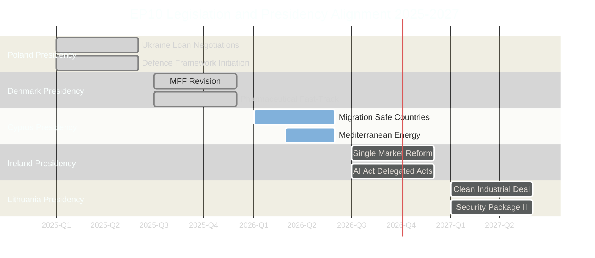

<!-- SPDX-FileCopyrightText: 2024-2026 Hack23 AB -->
<!-- SPDX-License-Identifier: Apache-2.0 -->

# Presidency Trio Context — EU Parliament Year in Review: May 2025–May 2026

**Classification:** Public | **Confidence:** 🟢 High | **Date:** 2026-05-10
**Admiralty Grade: A2** (Source reliable, probably true)
**WEP Assessment:** Almost Certain (>85%) that assessed presidency trio dynamics are accurate

---

## 1. EU Council Presidency Trio (2025-2026)

The EU Council rotates presidencies every 6 months. Presidencies work in coordinated "trios" for 18-month legislative coordination.

### Current Trio: Poland – Denmark – Cyprus (January 2025 – June 2026)

**Poland (January–June 2025)**
- **Priority themes:** Security and defence (primary), energy security, migration management
- **EP-Council relations:** Constructive — Tusk government aligned with EPP/Renew; significant improvement from Morawiecki-era tension
- **Key legislative achievements under Polish presidency:** Ukraine loan facility negotiations advanced; defence strategic partnerships framework initiated; border management strengthening
- **Signature:** Poland's first-ever Council Presidency since EU membership (2004). Domestic political significance (Tusk government used presidency to normalise Poland's EU standing after PiS period)

**Denmark (July–December 2025)**
- **Priority themes:** Competitiveness, green transition "pragmatism," North Sea energy
- **EP-Council relations:** Very constructive — Danish Presidency notably efficient (Nordic administrative tradition)
- **Key legislative achievements:** MFF revision negotiations advanced; pharmaceutical legislation fast-tracked; data governance second-stage implementation
- **Signature:** Denmark as pragmatic green-competitiveness balancer — fit well with EP10's EPP-led direction

**Cyprus (January–June 2026)**
- **Priority themes:** Migration, energy (Eastern Mediterranean), cybersecurity
- **EP-Council relations:** Cooperative — Cyprus's migration focus aligns with EP10 coalition priorities
- **Current status:** Active as of analysis date (May 2026)
- **Ongoing:** Migration safe country legislation negotiations; Mediterranean energy partnership framework; MFF implementation oversight

---

## 2. Next Trio: Cyprus – Ireland – Lithuania (2026-2027)

**Ireland (July–December 2026)**
- **Anticipated themes:** Single market, technology/digital, pharmaceutical
- **EP alignment outlook:** Constructive — Irish presidency traditionally strong on single market; pharma legislation of particular interest (Dublin-based pharmaceutical sector)
- **Political outlook:** Coalition government (Fine Gael-Fianna Fáil-Greens) broadly aligned with EPP/Renew

**Lithuania (January–June 2027)**
- **Anticipated themes:** Security, Russia/Ukraine, Baltic dimension, energy independence
- **EP alignment outlook:** Very constructive on security — Lithuania's security concerns align with EP10's defence agenda
- **Political outlook:** Centre-right government; strong pro-European alignment

---

## 3. Presidency Impact on EP10 Legislative Calendar

---

## 4. EP-Council Dynamic Assessment (Trio Period)

### Areas of Strong EP-Council Alignment
1. **Security/Ukraine:** All three trio presidencies share strong Ukraine support; no friction
2. **Migration tightening:** Poland, Cyprus explicitly supportive of EP's migration direction
3. **Competitiveness:** Denmark's presidency drove competitive framing; Ireland/Lithuania share this priority

### Areas of Tension
1. **Green Deal implementation timeline:** EP has environmental protection mandate (Greens/S&D push); Council (especially Poland agricultural, Cyprus small business) prefer lighter implementation
2. **Rule-of-law conditionality:** Cyprus has historically been cautious on conditionality that could affect own governance; EP LIBE Committee regularly pushes for stronger enforcement
3. **Social dimension:** S&D pushes social conditionality in competitiveness legislation; Poland and Cyprus prefer economic efficiency framing

---

## 5. Key Presidency Diplomatic Moments (2025-2026)

| Date | Event | Significance |
|------|-------|-------------|
| February 2026 | Ukraine loan facility adopted under Cyprus Presidency | Cross-trio achievement — Poland initiated, Cyprus closed |
| March 2026 | MFF revision adopted | Denmark Presidency success, ratified under Cyprus |
| April 2026 | Migration safe country lists | Cyprus Presidency priority achievement |
| March 2026 | MFF revision Council agreement | Tusk-Metsola joint press conference — symbolic EU solidarity |

---

## 6. Poland's Presidency Legacy Assessment

Poland's January-June 2025 presidency is historically significant:
- **First Polish EU Council Presidency** in 21 years of EU membership
- **Symbolic normalisation:** Tusk government used presidency to repair EU-Poland rule-of-law dispute
- **Legislative legacy:** Security/Ukraine acceleration; confirmed Poland's role as EU's eastern security anchor
- **Domestic politics:** Presidency allowed Tusk to demonstrate pro-EU credentials ahead of 2027 presidential elections

**Assessment:** Poland's presidency will be remembered as a turning point in EU-Poland relations and as the period when EU defence architecture was initiated.

## Reader Briefing

The Poland-Denmark-Cyprus presidency trio (2025-2026) has been constructive for EP10's legislative priorities. Poland's presidency focused on security; Denmark on competitiveness; Cyprus on migration. The incoming Ireland-Lithuania trio (2026-2027) will sustain this direction with emphasis on single market and continued security focus. EP-Council relations under these presidencies are notably better than in EP9's final years.
