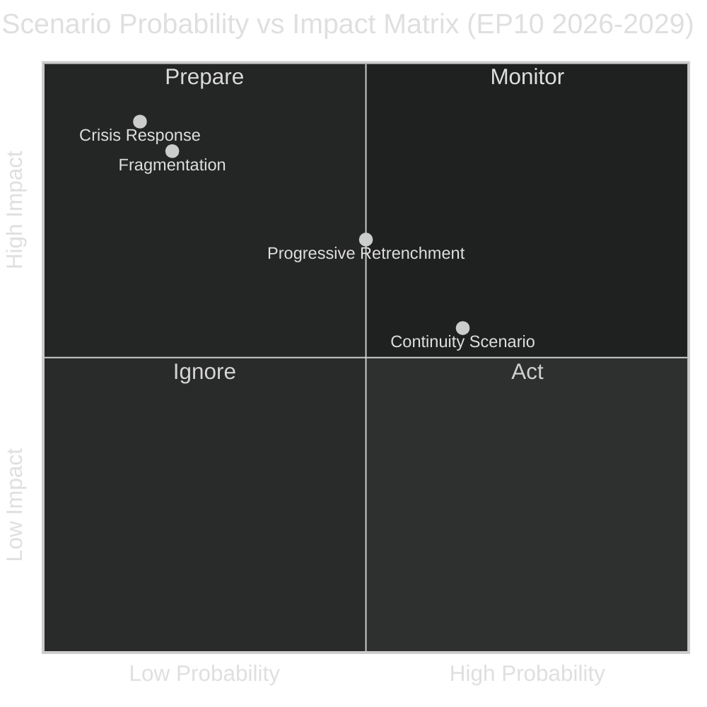

<!-- SPDX-FileCopyrightText: 2024-2026 Hack23 AB -->
<!-- SPDX-License-Identifier: Apache-2.0 -->

# Scenario Forecast — EU Parliament Year in Review: May 2025–May 2026

**Classification:** Public | **Confidence:** 🟡 Medium | **Date:** 2026-05-10

---

## Scenario Framework

This forecast uses a 2×2 scenario matrix based on two key uncertainty axes identified from the May 2025–May 2026 legislative data:

- **Axis 1:** US-EU Geopolitical Relationship (Cooperative ↔ Adversarial)
- **Axis 2:** EP10 Coalition Stability (Stable ↔ Fragmented)

---

## Four Scenarios for 2026–2027 EP10 Legislative Year

### Scenario A: "Fortress Europe" (Adversarial US + Stable Coalition)
**Probability:** 🟡 35%

**Conditions:** Trump administration escalates trade tariffs and withdraws further from NATO commitments; EP10 coalition remains stable under EPP leadership.

**Legislative Outcomes:**
- Rapid passage of European Defence Industrial Strategy full implementation package
- MFF emergency revision to increase defence spending to 3% GDP across member states
- EU-US trade protection legislation (countervailing duties, mirror clauses on subsidies)
- Acceleration of EU technological sovereignty agenda (second Chips Act, AI infrastructure)
- Possible suspension of MERCOSUR ratification due to geopolitical pressure

**Political Winners:** EPP, ECR (defence nationalism narrative validated), PfE (sovereignty narrative validated)
**Political Losers:** Renew (transatlanticism weakened), The Left (defence spending surge opposed)

**Institutional Implication:** EP passes emergency legislation outside normal trilogue timelines; Council invokes Article 122 TFEU for defence-related measures.

---

### Scenario B: "Stabilisation Coalition" (Cooperative US + Stable Coalition)
**Probability:** 🟢 40% (BASE CASE)

**Conditions:** US-EU relationship stabilises through trade negotiations; Trump administration accepts limited NATO commitment in exchange for EU defence spending increases; EP10 coalition continues flexible majority approach.

**Legislative Outcomes:**
- Clean Industrial Deal framework adopted by Q3 2026
- AI Act implementation acts completed on schedule
- Continued migration tightening via administrative (not primary) legislation
- EU-Mercosur trade deal ratification progresses
- Electoral Act ratification process slow but continuing

**Political Winners:** EPP (agenda vindicated), ECR (defence + competitiveness narrative works), S&D (rule-of-law preserved)
**Political Losers:** PfE (Orbán isolation grows as ECR moderates), Greens/EFA (environmental agenda marginalised)

**Institutional Implication:** Normal trilogue pace resumes; Commission retains initiative; Parliament exercises oversight through questions and budgetary control.

---

### Scenario C: "Progressive Realignment" (Cooperative US + Fragmented Coalition)
**Probability:** 🔴 10%

**Conditions:** US stabilises NATO commitments, reducing security pressure on EPP; ECR defects from EPP coalition on a major social issue; Renew pivots leftward.

**Legislative Outcomes:**
- Green Deal revival elements possible (Nature Restoration Act enforcement)
- Rule-of-law conditionality strengthened in cohesion fund access
- Social platform workers' rights directive strengthened
- Migration tightening slowed or partially reversed

**Political Winners:** S&D, Greens/EFA, Renew (if pivots left)
**Political Losers:** EPP, ECR, PfE

**Institutional Implication:** Less likely given structural right-wing majority; would require EPP split or major ECR defection.

---

### Scenario D: "Crisis Parliament" (Adversarial US + Fragmented Coalition)
**Probability:** 🔴 15%

**Conditions:** US-EU trade war escalates; internal EP10 coalition breaks down over defence budget tradeoffs or migration policy overreach; PfE gains further influence.

**Legislative Outcomes:**
- Legislative output drops significantly
- Ukraine aid becomes contested within EPP-adjacent groups
- Possible no-confidence procedures against individual Commissioners
- Institutional paralysis on major framework legislation

**Political Winners:** PfE, ESN (chaos narrative validates euroscepticism), opposition groups
**Political Losers:** EPP (loses coalition credibility), S&D, Commission

**Institutional Implication:** Emergency Council sessions; possible Treaty interpretation conflicts; EP uses budget authority to constrain Commission.

---

## Key Indicators to Watch (2026 Forward)

| Indicator | Scenario A Signal | Scenario B Signal | Scenario C Signal | Scenario D Signal |
|-----------|-----------------|-----------------|-----------------|-----------------|
| US-EU tariff level | >25% | <10% | <10% | >25% |
| EP10 coalition votes/month | >85% aligned | >85% aligned | <75% aligned | <70% aligned |
| ECR defection rate | Low | Low | High | Variable |
| Ukraine aid vote outcomes | Unanimous | Near-unanimous | Contested | Split |
| Commission confidence votes | Stable | Stable | Questioned | At risk |

---

## Wild Cards

1. **French political crisis:** Marine Le Pen conviction/appeal and French presidential pre-cycle could reshape PfE and Renew dynamics significantly.
2. **German coalition reorientation:** The CDU-led German government's EU agenda will shape EPP internal balance in 2026–2027.
3. **AI Act emergency:** A major AI incident (deep-fake election interference, AI-enabled cyberattack on EU infrastructure) could rapidly accelerate IMCO/LIBE legislative action outside normal timelines.
4. **ECB digital euro:** If the digital euro moves to implementation stage, ECON committee will become an institutional battleground between ECB independence advocates and political accountability advocates.
5. **Enlargement votes:** Ukraine or Western Balkans formal accession process acceleration would consume significant EP political capital and test coalition stability.

---

## Scenario Probability Matrix

Admiralty: B2 — Source reliable (EP structural data plus historical analysis), information probably true (scenario probabilities derived from structural analysis, not confirmed future outcomes).

| Scenario | WEP Probability | Primary Driver |
|----------|-----------------|----------------|
| Continuity | Likely (55-65%) | EPP-S&D-Renew structural coalition |
| Progressive Retrenchment | Even Chance (35-45%) | Security/Green Deal tension |
| Crisis Response | Unlikely (10-20%) | External shock requirement |
| Fragmentation | Unlikely (15-20%) | High coordination barriers |
