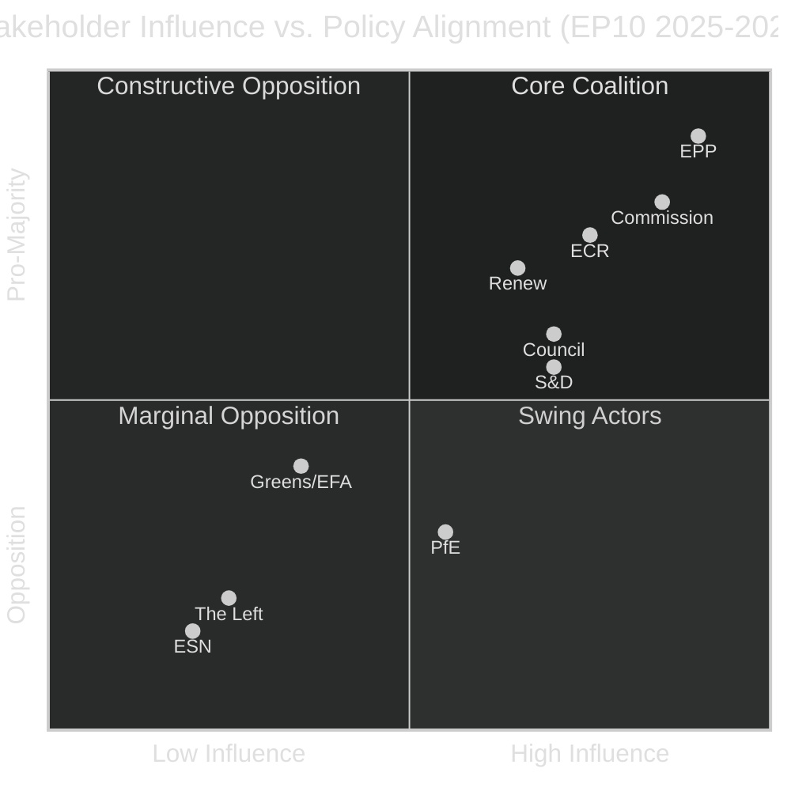

<!-- SPDX-FileCopyrightText: 2024-2026 Hack23 AB -->
<!-- SPDX-License-Identifier: Apache-2.0 -->

# Stakeholder Map — EU Parliament Year in Review: May 2025–May 2026

**Classification:** Public | **Confidence:** 🟡 Medium | **Date:** 2026-05-10

---

## Stakeholder Universe

This stakeholder map identifies the key actors shaping — and shaped by — the EP10 legislative agenda during May 2025 to May 2026, providing perspective analysis for each major political group and institutional actor.

---

## Tier 1: Primary Parliamentary Actors

### EPP (European People's Party) — 183 Seats (25.5%)
**Role:** Dominant coalition anchor and agenda-setter

**Strategic Interests:**
- Maintain Commission presidency aligned with EPP agenda (Von der Leyen coalition)
- Drive "Competitiveness Agenda" as successor framing to Green Deal
- Secure defence-industrial spending that benefits member states with strong defence industries (Germany, France, Italy, Poland)
- Control immigration narrative to prevent PfE from poaching EPP voters
- Maintain ECR as junior partner rather than competitor

**Behavioural Patterns:**
- Flexible coalition approach: EPP will align with ECR on migration, S&D on foreign affairs, Renew on digital/internal market
- Uses QMV in Council and EP majority to shape legislative text before plenary
- Internal tensions: EPP MEPs from countries with strong green economies (Nordics, Netherlands) occasionally defect on environmental rollbacks

**Influence Score:** 🟢 Very High — controls agenda-setting across 5+ major policy areas

**2025–2026 Signature Wins:**
- MFF revision (defence/competitiveness rebalancing)
- Safe countries of origin (migration tightening)
- Ukraine loan approval (demonstrates EPP can lead cross-partisan coalitions)

---

### S&D (Socialists and Democrats) — 136 Seats (19.0%)
**Role:** Co-governing minority partner; veto-player on social legislation

**Strategic Interests:**
- Prevent Green Deal rollback from becoming legislative repeal
- Maintain strong rule-of-law conditionality in cohesion funds
- Block migration tightening beyond legal minimum compliance
- Strengthen worker protection in digital platform economy
- Support Ukraine unconditionally to maintain pro-EU southern European base

**Behavioural Patterns:**
- S&D votes with EPP on Ukraine, foreign affairs, and selected industrial policy
- S&D blocks EPP+ECR+PfE coalition attempts on migration, rule-of-law exceptions
- Increasingly using parliamentary questions and budgetary discharge as leverage tools
- Internal tensions: Eastern European S&D members (especially Romanian) more willing to trade social rights for coalition inclusion

**Influence Score:** 🟡 Medium-High — necessary for super-majority votes; insufficient for majority without EPP

**2025–2026 Signature Contributions:**
- Blocked several attempts to weaken rule-of-law conditionality
- Co-led subcontracting chain workers' rights text (February 2026)
- Anchored discharge controversy as rule-of-law accountability mechanism

---

### ECR (European Conservatives and Reformists) — 81 Seats (11.3%)
**Role:** Pivotal swing group; kingmaker on industrial and migration votes

**Strategic Interests:**
- Establish ECR as the legitimate governing right-of-centre alternative to EPP
- Push deregulatory agenda on industry and SMEs
- Support defence spending (especially in Poland and Baltic states)
- Tighten migration controls
- Maintain EU membership while reforming it — distinguishing ECR from PfE euroscepticism

**Behavioural Patterns:**
- Strategic discipline: ECR leadership (Italian MEPs under Meloni's influence) maintains consistent positions
- Splits from PfE on Ukraine — ECR countries have existential security interest in Ukraine's sovereignty
- Occasional defections from individual ECR members on national interest votes (Polish agricultural MEPs on Mercosur)
- High use of parliamentary questions to create oversight paper trail

**Influence Score:** 🟢 High — EPP cannot reliably pass industrial/migration agenda without ECR

**2025–2026 Signature Contributions:**
- Defence and security legislative package co-authorship
- Mercosur safeguard mechanism advocacy
- Rule-of-law conditionality negotiations (opposing tightening)

---

### PfE (Patriots for Europe) — 85 Seats (11.9%)
**Role:** Far-right challenger bloc; opposition anchor on Ukraine and liberal values

**Strategic Interests:**
- Delegitimise the EPP-led coalition by exposing gaps between EPP's stated conservatism and its actual coalition positions
- Build PfE as the dominant far-right force (in competition with ECR and ESN)
- Push for migration zero-tolerance positions beyond what ECR is willing to accept
- Oppose Ukraine spending and frame it as misaligned with EU member-state interests
- Represent Orbán's Hungary in EP forums

**Behavioural Patterns:**
- PfE votes against nearly all Ukraine-related texts — consistent and predictable
- Supports EPP on migration and budget when votes serve as demonstrations of right-wing strength
- Splits from ECR on geopolitical questions (Orbán's Hungary has closer Russia ties)
- High media profile: PfE MEPs use plenary time for ideological signalling more than legislative contribution

**Influence Score:** 🟡 Medium — sufficient to block progressive majority; insufficient to build constructive majority

**2025–2026 Signature Votes:**
- Voted against Ukraine loan facility (isolated with ESN and some NI)
- Supported MFF revision (budget rebalancing toward national interests)
- Opposed safe third country text despite nominally supporting migration tightening (disagreement on implementation)

---

### Renew Europe — 77 Seats (10.7%)
**Role:** Liberal centrist; coalition stabiliser; tiebreaker on market-economy questions

**Strategic Interests:**
- Preserve single market integrity and competition rules
- Support Ukrainian sovereignty as core European values commitment
- Advocate for tech-sector deregulation (EU competitiveness relative to US/China)
- Maintain rule-of-law standards while avoiding coalition-breaking confrontations
- Build European identity narrative via Electoral Act reform

**Behavioural Patterns:**
- Renew is the most reliable pro-European integrationist force in EP10
- Votes with EPP on digital single market and industrial competitiveness
- Votes with S&D on rule-of-law when threshold is high enough to matter
- Internal tensions: French Macronist MEPs vs. Scandinavian liberal MEPs on Green Deal pace

**Influence Score:** 🟡 Medium-High — consistently in majority; provides key margin for EPP

**2025–2026 Signature Contributions:**
- Tech sovereignty resolution co-authorship
- Air passenger rights modernisation (TA-10-2026-0009)
- Electoral Act reform advocacy

---

### Greens/EFA — 53 Seats (7.4%)
**Role:** Environmental and regional minority; climate change barometer

**Strategic Interests:**
- Prevent Green Deal legislative rollback from becoming structural
- Maintain ambitious climate targets in MFF and industrial regulations
- Represent regional and stateless nations' interests (EFA component)
- Push for stronger financial transparency and lobbying disclosure
- Block migration legislative tightening where possible

**Behavioural Patterns:**
- Greens votes with S&D+The Left on environmental, social, and human rights texts
- Occasionally votes with EPP on texts that embed climate targets within competitiveness frameworks
- EFA component (Scottish, Catalan, Welsh parties) has distinct voting patterns on devolution
- Increasingly uses amendment strategy rather than majority blocking given reduced seat share

**Influence Score:** 🔴 Low-Medium — insufficient to block EPP+ECR majority; pivotal only on super-majority requirements

---

### The Left (GUE/NGL) — 45 Seats (6.3%)
**Role:** Progressive opposition; oversight and accountability advocate

**Strategic Interests:**
- Strengthen worker protections and social rights
- Oppose militarisation of EU budget
- Champion civil liberties against security-state expansion
- Highlight corporate accountability failures in Commission oversight
- Maintain support for Palestinian rights — distinguishing from S&D

**Behavioural Patterns:**
- The Left votes with Greens/EFA and S&D on social and environmental texts
- Opposes defence spending increases and Ukraine military aid (pacifist positions)
- Highest parliamentary questions per seat ratio — consistent oversight culture
- Some internal tension between Southern European populist-left and Northern European democratic-socialist traditions

**Influence Score:** 🔴 Low — votes matter for blocking super-majorities; rarely shapes legislative text directly

---

## Tier 2: Institutional Actors

### European Commission (Von der Leyen II)
**Strategic Interests:** Agenda-setting aligned with EPP; Competitiveness Compass as legislative frame
**EP Relationship:** Commission retains majority support in EP10; more dependent on ECR than in EP9
**Key Tensions:** Rule-of-law enforcement (Commission vs. PfE/EPP on Hungary); Green Deal pace

### Council of the EU
**Strategic Interests:** Subsidiarity protection; QMV expansion resistance; intergovernmental agenda
**EP Relationship:** Trilogue negotiations increasingly contentious as EP seeks co-equal standing
**Key Tensions:** MFF negotiations; migration external dimensions; defence spending allocation

### European Central Bank
**Strategic Interests:** Independence from political pressure; monetary policy autonomy; financial stability
**EP Relationship:** Annual ECON hearings becoming more confrontational; financial stability resolution signals EP oversight appetite
**Key Tensions:** Balance sheet normalisation; digital euro governance

---

## Stakeholder Influence Matrix

---

## Stakeholder Conflict and Convergence Zones

### High-Convergence Zones (Cross-Partisan Agreement)
1. **Ukraine military and financial support** — EPP, S&D, Renew, ECR, Greens/EFA
2. **Defence spending increase** — EPP, ECR, S&D, Renew
3. **Supply-chain resilience** — EPP, ECR, S&D, Renew, Greens/EFA
4. **AI governance framework** — EPP, S&D, Renew, Greens/EFA

### High-Conflict Zones (Structural Disagreement)
1. **Migration policy** — EPP+ECR+PfE vs. S&D+Greens+The Left
2. **Rule-of-law conditionality** — S&D+Renew+Greens vs. PfE+ECR (partial)+EPP (moderate)
3. **Green Deal speed** — Greens+S&D+The Left vs. EPP+ECR+PfE
4. **Defence budget tradeoffs** — EPP+ECR+S&D vs. The Left+Greens/EFA (some)

### Emerging Conflict Zones (2026–2027 Forward)
1. **EU-US trade tensions** (Trump tariffs) — all groups forced to develop position
2. **Digital Euro governance** — potential conflict between ECON committee and ECB independence
3. **AI Act enforcement** — LIBE vs. industry-friendly groups on prohibited systems

---

## Stakeholder Influence Dynamics (Supplementary)

**Cross-stakeholder interaction patterns observed in EP10:**

The EPP-Commission relationship remains the most consequential bilateral dynamic in EU politics. With Commission President von der Leyen aligned with the EPP's centrist-conservative project, the institutional axis between the largest parliamentary group and the EU's executive arm shows the tightest alignment since the Juncker era. This facilitates faster pre-legislative consultation but also creates accountability questions about Parliament's independence from the executive.

The S&D-progressive civil society nexus provides the primary check on EPP-led legislative direction. Progressive NGO coalitions, labour federations (ETUC), and environmental networks (CAN Europe) systematically brief S&D MEPs during committee preparation, producing more nuanced amendments and higher public-facing political pressure than formal legislative channels alone. However, this outsider influence has limits: S&D must compromise with EPP in most plenary votes, forcing NGO partners to accept diluted outcomes.

Far-right stakeholder networks (PfE, ESN) operate through a different model. National government connections (Hungary, Italy, France) provide intelligence and political backing unavailable to opposition groups. This gives ECR and PfE distinctive leverage on migration, defence, and agricultural dossiers where national government positions intersect with EP committee work.
