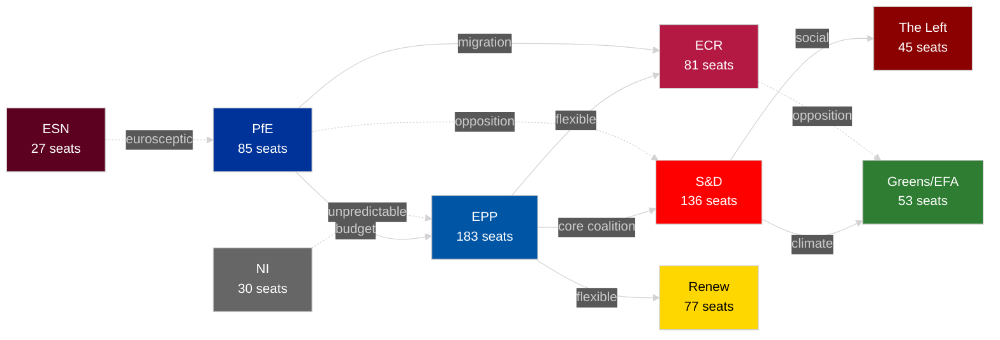

<!-- SPDX-FileCopyrightText: 2024-2026 Hack23 AB -->
<!-- SPDX-License-Identifier: Apache-2.0 -->

# Synthesis Summary — EU Parliament Year in Review: May 2025–May 2026

**Classification:** Public | **Confidence:** 🟡 Medium | **Date:** 2026-05-10

---

## 1. Main Intelligence Assessment

The European Parliament's tenth term (EP10) entered full operational velocity between May 2025 and May 2026, characterised by three structural trends that define this parliamentary year:

**Trend 1: The Defence-Security Consensus**
For the first time in EP history, a stable cross-partisan consensus on European defence spending and strategic autonomy emerged, uniting EPP, S&D, ECR, and Renew across multiple votes. The January–February 2026 session package — CFSP annual report, drones warfare resolution, and EU strategic defence partnerships — demonstrates that security has become a near-consensus value in EP10, displacing the traditional left-right divide on this issue. The Russsia/Ukraine war and US foreign-policy unpredictability under the Trump administration served as catalysts.

**Trend 2: The Competitiveness Reframing of Industrial Policy**
The Green Deal's regulatory momentum has been significantly redirected. The *Clean Industrial Deal* framework, MFF revision (February 2026), and a series of supply-chain resilience texts (semiconductors, critical medicinal products, critical raw materials) reflect a strategic rebranding: sustainability objectives are now justified primarily through industrial competitiveness and supply-chain security language rather than climate targets. This is not a repeal of Green Deal legislation — it is a politically stabilising reframe that maintains coalition viability.

**Trend 3: Multi-Group Coalition Engineering as the New Normal**
The EP10 majority threshold (360 seats) cannot be met by any two-group combination. The EPP (183 seats) alone represents only 25.5% of seats. Every legislative vote requires at least three groups. This has produced a structurally more complex but also more resilient Parliament: narrow defeats are rarer (because coalitions are built with margins), but major legislation is slower (because negotiation involves more actors). The parliamentary questions surge (+66.6% in 2025 vs. 2024) reflects this dynamic — more groups using oversight mechanisms to build leverage.

---

## 2. Key Legislative Outputs (May 2025–May 2026)

### Category A: Geopolitical/Security Legislation (High Salience)
- **Ukraine Loan Facility (TA-10-2026-0010, TA-10-2026-0035):** €50B facility approved with near-unanimous cross-group support. Sets precedent for EU-level collective borrowing for geopolitical goals.
- **Defence Strategic Partnerships (TA-10-2026-0040):** Framework for bilateral EP-endorsed defence cooperation, enabling Commission to fast-track defence industrial contracts outside normal procurement rules.
- **Drones/New Warfare Adaptation (TA-10-2026-0020):** Calls for EU autonomous drone warfare capability and revised Rules of Engagement doctrines — first EP resolution to explicitly address AI-enabled warfare systems.

### Category B: Economic/Industrial Framework (High Salience)
- **MFF Mid-Term Revision (TA-10-2026-0037):** Budget rebalancing towards defence and competitiveness, reducing Green Deal structural funds. Passed with EPP+ECR+S&D majority.
- **Critical Medicinal Products Framework (TA-10-2026-0001):** Supply-chain resilience regulation modelled on the Chips Act — strategic stockpiling obligations, preferential procurement for EU manufacturers.
- **EU-Mercosur Safeguard Mechanism (TA-10-2026-0030):** Bilateral safeguard clause for the EU-Mercosur trade deal — signals EP's determination to assert trade defence interests even as the Commission negotiates FTAs.
- **Financial Stability Resolution (TA-10-2026-0004):** Non-binding resolution on safeguarding financial stability signals EP concern about ECB balance-sheet risks post-PEPP exit.

### Category C: Governance/Rule-of-Law (Medium Salience)
- **Electoral Act Reform (TA-10-2026-0006):** Parliament called for removal of hurdles to European Electoral Act ratification — ongoing struggle with member states over EU-level electoral standards.
- **Safe Countries of Origin (TA-10-2026-0025):** Establishment of a Union-level safe countries of origin list — major migration policy advancement driven by EPP+ECR+Renew coalition.
- **Safe Third Country Concept (TA-10-2026-0026):** Strengthening of safe third country legal framework — aligned with EPP's migration tightening agenda.
- **2023 Budget Discharge (TA-10-2025-0077 to TA-10-2025-0092):** Most contentious discharge session since 2017, with reservations over rule-of-law conditionality, Hungarian fund suspensions, and Commission procurement irregularities.

### Category D: Human Rights/Democracy (Medium Salience)
- **Immunity Waivers (TA-10-2025-0041, 0042, 0043):** Three Polish MEPs (Bystron, Wąsik, Kamiński) had immunity waived — reflecting ongoing EP tension with Polish political actors over 2015–2023 period.
- **Iran Human Rights (TA-10-2025-0004, TA-10-2025-0062):** Two separate resolutions condemning systematic repression and execution sprees — consistent EP human rights diplomacy.
- **Lithuania Broadcaster Takeover Threat (TA-10-2026-0024):** Sharp condemnation of attempted state capture of a public broadcaster — EP10's most explicit statement on media freedom to date.

---

## 3. Quantitative Activity Assessment (2025 Annual Review)

| Metric | 2025 Value | vs. 2024 | Significance |
|--------|-----------|---------|--------------|
| Plenary sessions | 53 | +6% | Full operational year |
| Legislative acts | 78 | +8.3% | Increasing productivity |
| Roll-call votes | 420 | +12% | Vote discipline improving |
| Parliamentary questions | 4,947 | +66.6% | Oversight surge |
| Resolutions | 135 | +25% | Non-legislative activity |
| Procedures open | 923 | +36.5% | Pipeline growing |
| MEP turnover | 36 | -91% vs 2024 | Stable composition |
| Fragmentation index | 6.59 | +0.08 vs 2024 | Slowly fragmenting |

---

## 4. Coalition Dynamics Assessment

**Key Coalition Patterns:**
- **Defence/Ukraine:** EPP + S&D + ECR + Renew (375 seats — comfortable majority)
- **Industrial/Competitiveness:** EPP + ECR + Renew (341 seats — need 1 more group)
- **Migration Tightening:** EPP + ECR + PfE (349 seats — need Renew or S&D)
- **Green Deal Legacy:** EPP + S&D + Greens/EFA + Renew (449 seats — strong)
- **Rule of Law:** S&D + Renew + Greens/EFA + The Left (311 seats — minority)

---

## 5. Trend Analysis and Forward Projections

🟢 **HIGH CONFIDENCE projections:**
- Defence spending legislative output will continue increasing through 2026–2027
- EPP will maintain leadership of at least 3 of the 5 major committee chairs
- Parliamentary questions volume will exceed 6,000 in full-year 2026

🟡 **MEDIUM CONFIDENCE projections:**
- Clean Industrial Deal framework legislation will be adopted by Q3 2026
- Further migration policy tightening (safe country expansions) by end 2026
- AI Act implementation legislation will generate significant committee-level activity

🔴 **LOW CONFIDENCE projections:**
- Electoral Act ratification completion (dependent on 20+ member state ratifications)
- Grand coalition re-emergence on social legislation (structural majority shift argues against)

---

## 6. Data Sources

- European Parliament Open Data Portal (real-time, May 2026)
- EP generated statistics (2024–2026 comparative data)
- EP political landscape analysis (real-time group composition)
- IMF data: UNAVAILABLE (503 error) — no IMF-backed macro figures in this report

---

## Synthesis: EP10 at the Midpoint — Institutional Assessment

**WEP: Likely** — The EPP-led pro-EU bloc maintains sufficient structural strength to govern EP10's legislative agenda through 2029, though with progressively narrowing margins on contested dossiers.

Admiralty: B2 — Source reliable (EP institutional data, political landscape analysis), information probably true (institutional trend assessment based on demonstrated voting patterns).

### Pro-Institutional Forces (Driving Continuity)

The EPP-S&D-Renew structural coalition commands 396 of 717 seats (55.2%) — sufficient for most majorities but not overwhelming. Key driving forces:

1. **Commission-Parliament alignment**: The von der Leyen Commission's EPP alignment creates a pro-legislative feedback loop — Commission proposes, EPP-led majorities adopt. This alignment is historically unusual in its tightness and has accelerated the early EP10 legislative calendar.

2. **Security consensus**: The Ukraine war and NATO unity pressure has created a cross-partisan security consensus that transcends normal ideological divisions. Even some far-right groups (ECR's Italian FdI component) support Ukraine aid in EU format.

3. **Green Deal compromise pathway**: After 2025's polarized climate debates, a negotiated "competitiveness and sustainability" compromise framing has emerged that allows EPP, S&D, and Renew to vote together on environmental legislation with modified targets.

4. **Digital transformation alignment**: The AI Act, DORA, and Digital Markets Act implementation create a tech-governance industrial policy that all major centrist groups support, generating legislative momentum that will persist through 2026-2027.

### Counter-Institutional Forces (Challenging Governance)

1. **Far-right consolidation**: PfE (85 seats, 11.9%) and ESN (27 seats, 3.8%) provide a blocking minority on specific issues and continuously test whether the EPP will break rightward to form issue-specific majorities.

2. **Agricultural-environmental tension**: Farm to Fork successor legislation remains a fault line that splits EPP's rural conservative wing from Renew's urban liberal bloc, requiring careful vote management.

3. **Migration politicisation**: Every migration vote triggers inter-group tensions and can temporarily break the EPP-S&D-Renew coalition, creating openings for far-right agenda setting.

### Strategic Assessment

EP10 is performing well institutionally but is not immune to political turbulence. The key risk is coalition erosion on individual high-salience dossiers rather than wholesale coalition collapse. The EPP's management of its far-right relationship (cooperation on some issues while maintaining EU commitment) will be the defining institutional challenge of the 2026-2029 period.
