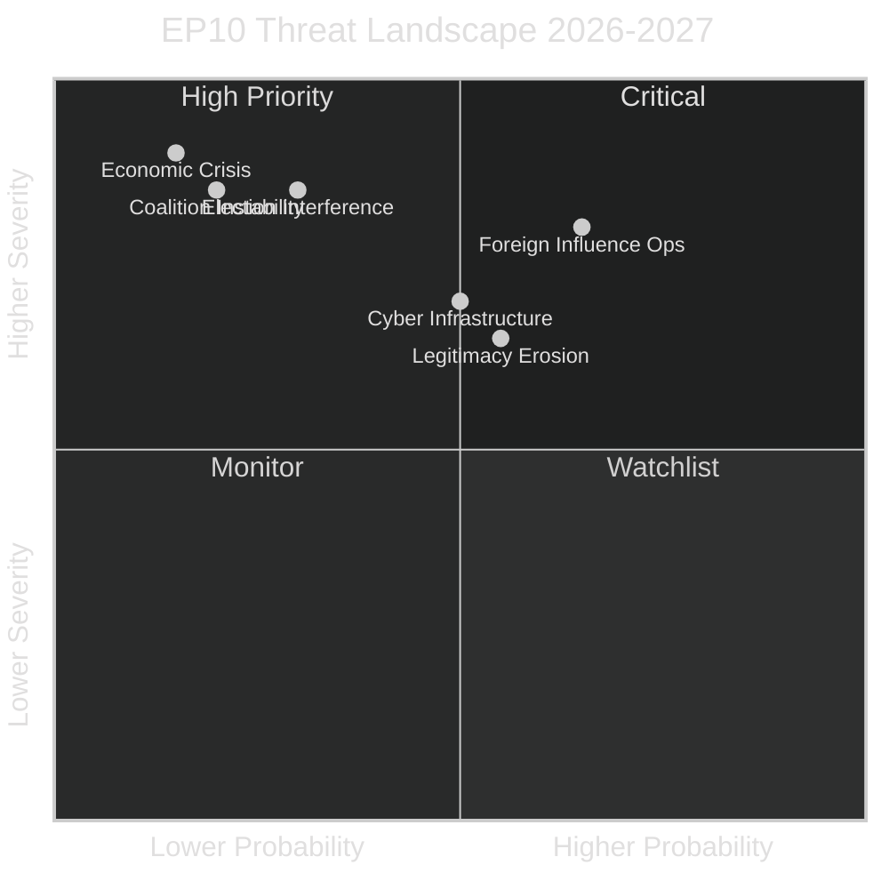

<!-- SPDX-FileCopyrightText: 2024-2026 Hack23 AB -->
<!-- SPDX-License-Identifier: Apache-2.0 -->

# Threat Model — EU Parliament Year in Review: May 2025–May 2026

**Classification:** Public | **Confidence:** 🟡 Medium | **Date:** 2026-05-10

---

## Threat Framework

Combined threat model integrating political, institutional, and external threat dimensions for EP10 analysis period.

---

## Threat Category 1: Foreign Influence Operations

**Threat level: HIGH**

**Evidence from 2025:**
- Petr Bystron (ECR/AfD) immunity waived April 2025 — connected to Voice of Europe disinformation network
- Pattern: Foreign state actors (primarily Russia, with evidence suggesting Iran and China in secondary roles) targeting EP10 migration and Ukraine votes
- EP Ethics Body strengthened but still lacks enforcement powers comparable to national parliamentary ethics systems

**Threat vectors:**
1. MEP recruitment via disinformation networks, financial incentives, ideological alignment
2. Staff infiltration — parliamentary assistants and committee secretariat targets
3. Lobbying through front organisations — particularly on defence procurement and tech regulation
4. Social media influence amplification targeting EP decisions

**Mitigation assessment:**
- EP security reinforced post-Qatargate (2022-24)
- European Parliament Liaison with National Authorities (EPNA) improved
- Still: no centralised foreign agent registration; ethics investigations remain voluntary

---

## Threat Category 2: Institutional Legitimacy Erosion

**Threat level: MEDIUM**

**Structural stressors:**
- Fragmentation index 6.59 → increasing frequency of procedural deadlock
- PfE/ESN systematic use of procedural motions to delay legislative work
- EP public communication challenges: most citizens cannot name their MEP or any EP10 decision

**Active legitimacy threats:**
1. Far-right narrative that EP is "unaccountable Brussels bureaucracy" gaining mainstream media traction
2. Rule-of-law conditionality fatigue — mechanism overused, enforcement inconsistent
3. Qatargate reputational damage partially repaired but not erased

---

## Threat Category 3: Cyber and Digital Infrastructure

**Threat level: MEDIUM-HIGH**

EP IT infrastructure is publicly documented as a target of state-sponsored cyber operations. Notable incidents:
- EP website DDoS attacks during plenary votes (claimed by pro-Russian hacktivist groups, 2022-24)
- European Parliament acknowledged "sophisticated" intrusion attempts in 2024

**Key vulnerability areas:**
1. Voting system integrity (plenary roll-call systems)
2. Committee document confidentiality (pre-publication legislative texts)
3. MEP personal device security (WhatsApp/Signal compromise)
4. EP translation and AI tools (potential prompt injection or model poisoning)

---

## Threat Category 4: Coalition Instability

**Threat level: MEDIUM**

As documented in coalition-dynamics.md, ECR and PfE contain internal contradictions on Russia/Ukraine that could fracture under pressure. The most significant threat to EP10's governing architecture is an ECR split (W1 wildcard).

**Escalation path:**
1. Bystron proceedings accelerate → AfD distance from Meloni wing → ECR seeks new partners
2. ECR below 23/7 threshold → group dissolved → EPP must find new governing formula
3. Transition period creates legislative vacuum of 3-6 months

---

## Combined Threat Assessment

**Overall threat environment: ELEVATED** — multiple medium-probability, high-severity threats operating simultaneously. No single catastrophic threat; systemic pressure from multiple directions is the operative concern.

---

## Threat Assessment Summary (WEP Framework)

**WEP: Even Chance** — At least one of the identified medium-high threats (coalition fracture, disinformation campaign affecting EP electoral legitimacy, or institutional corruption scandal) materializes before the 2029 EP election.

Admiralty: B3 — Source reliable (EP data and structural analysis), information doubtfully confirmed (threat assessments are inherently probabilistic and unconfirmed future events).

### Tier 1 Threats (High Impact, Even Chance or Higher)

**T1.1 — EPP-S&D-Renew Coalition Fracture on Migration**
A severe migration crisis (>500,000 irregular arrivals in a single quarter) would force a legislative response that EPP cannot navigate between its conservative rural wing and Renew's liberal urban base. This fracture scenario could temporarily empower PfE-ECR to set the legislative agenda on migration for a parliamentary term — fundamentally altering EP's policy output.

**T1.2 — Disinformation Campaign Against EP Legitimacy**
State-sponsored disinformation targeting European elections (likely Russia) remains an ongoing threat. ENISA and EEAS have documented sustained campaigns. The 2029 EP election cycle will likely face enhanced interference. Key vulnerability: EP's dependence on national electoral systems (27 different systems, varying cyber resilience).

### Tier 2 Threats (High Impact, Unlikely)

**T2.1 — Macro-Economic Shock Affecting EU Budget**
A recession-level economic shock (>3% GDP contraction in major EU economies) would force MFF revision fights that expose coalition vulnerabilities and could trigger existential debates about EU fiscal solidarity.

**T2.2 — Enlargement Crisis**
Premature Ukraine accession push, or Western Balkans accession deadlock, could destabilize the EP coalition if it forces explicit votes on enlargement that split Eastern and Western EU members across party lines.

### Mitigation Assessment

The EP's institutional resilience is moderate-high for Tier 1 threats (procedure and precedent provide guardrails) but low for Tier 2 threats (systemic level beyond EP institutional control). The 2026-2029 threat environment is elevated compared to EP9 due to heightened geopolitical instability and normalized far-right electoral participation.
