<!-- SPDX-FileCopyrightText: 2024-2026 Hack23 AB -->
<!-- SPDX-License-Identifier: Apache-2.0 -->

# Voting Patterns Analysis — EU Parliament Year in Review: May 2025–May 2026

**Classification:** Public | **Confidence:** 🟡 Medium | **Date:** 2026-05-10
**Data Source:** EP Open Data API, `get_all_generated_stats`, `get_adopted_texts`
Admiralty: B2 (Reliable source, probably true)
**WEP Assessment:** Likely (65-80%) that observed patterns reflect structural EP10 dynamics rather than temporary alignment

---

## 1. Roll-Call Vote Volume (2025 Full Year)

EP10 recorded **420 roll-call votes** in 2025 — the highest recorded pace in the EP data series available through `get_all_generated_stats`. This represents a continuation of the upward trend observed across EP terms:

| Year | Roll-Call Votes | Annual Growth |
|------|----------------|---------------|
| 2019 | ~390 | Baseline EP9 |
| 2020 | ~375 | COVID-reduced |
| 2021 | ~395 | Recovery |
| 2022 | ~408 | Recovery II |
| 2023 | ~415 | EP9 peak |
| 2024 | ~405 | Election year |
| 2025 | 420 | EP10 baseline |

**Analytical significance:** Higher roll-call vote counts indicate MEPs are requesting more recorded votes — a proxy for political contestation. The 2025 increase suggests PfE/ESN groups are systematically requesting roll-call votes to build documentary evidence of EPP's voting alliances for 2029 election campaigns.

---

## 2. Voting Pattern Breakdown by Policy Domain

**Note:** Individual MEP vote data is not available via the EP Open Data API. The following analysis is based on aggregate vote tallies from `get_voting_records`, text subject analysis from adopted texts, and historical patterns from similar EP terms.

### 2.1 Security and Defence Votes
- **Ukraine loan facility (TA-10-2026-0010):** Passed with large majority (EPP+S&D+ECR+Renew)
- **Defence strategic partnerships (TA-10-2026-0040):** Passed with EPP+S&D+ECR
- **CFSP annual report:** Passed — largest security consensus coalition
- **Estimated majority size:** 440-480 votes (61-67% of Parliament)
- **Estimated opposition:** 170-200 votes (PfE partial, ESN, The Left, NI)

### 2.2 Migration Votes
- **Safe countries of origin (TA-10-2026-0025):** Passed with EPP+ECR+PfE+Renew partial
- **Safe third country concept (TA-10-2026-0026):** Passed with EPP+ECR+PfE
- **Estimated majority size:** 370-400 votes (52-56% of Parliament)
- **Estimated opposition:** 280-320 votes (S&D+Greens+Left, Renew partial defections)
- **Key observation:** Migration votes pass by narrower margins than security votes — these are genuinely contested, not consensus, decisions

### 2.3 Budgetary/MFF Votes
- **MFF revision (TA-10-2026-0037):** Passed — budget revisions typically attract broader coalitions
- **Estimated majority size:** 400-440 votes (55-61%)
- **Pattern:** S&D less reliable on MFF if European social investments are cut

### 2.4 Health/Social Policy Votes
- **Medicinal products (TA-10-2026-0001):** Broad majority — health texts attract near-consensus
- **Estimated majority size:** 450-500 votes (63-70%)
- **Pattern:** Health legislation is the policy domain with highest cross-party consensus

---

## 3. Coalition Voting Mathematics

```mermaid
%%{init: {"theme":"dark"}}%%
xychart-beta
    title "Estimated Vote Ranges for Major Coalition Types"
    x-axis ["Security Coalition", "Migration Right", "Health/Social", "Budget", "Opposition max"]
    y-axis "Votes (of 717)" 0 --> 520
    bar [480, 400, 500, 440, 320]
    bar [440, 370, 450, 400, 170]
```

**Key mathematical constraint:** 360 votes needed for majority. Table shows:
- **Security coalition** always clears this comfortably (+80-120 seats margin)
- **Migration coalition** clears by a narrow margin (+10-40 seats)
- **Progressive opposition** cannot reach majority even at maximum (311-320 < 360)

---

## 4. Voting Discipline Assessment

### EPP (183 seats)
- **Estimated cohesion:** Very High (>90% group discipline on most votes)
- **Known defection areas:** Green Deal implementation (10-20 EPP MEPs vote with Greens on environmental enforcement)
- **Strategic behaviour:** EPP leadership uses whipping system effectively; Manfred Weber maintains group discipline

### S&D (136 seats)
- **Estimated cohesion:** High (85-90% discipline)
- **Known defection areas:** Migration tightening (15-25 S&D MEPs from centre-right member states vote with EPP)
- **Strategic behaviour:** S&D's Eastern European contingent (Romanian, Bulgarian, Slovak) regularly crosses over on migration and security

### ECR (81 seats)
- **Estimated cohesion:** Medium-High (75-85%)
- **Known defection areas:** Rule-of-law conditionality (Polish ECR vs. Italian ECR split)
- **Strategic behaviour:** Meloni's ECR is pragmatic and seeks to distinguish from PfE by voting constructively with EPP on legislative texts

### PfE (85 seats)
- **Estimated cohesion:** Medium (65-75%)
- **Known defection areas:** Ukraine (Orbán-aligned vs. Meloni-adjacent wings); EU budget
- **Strategic behaviour:** PfE uses procedural motions extensively; cohesion lower than seat count suggests

### Renew (77 seats)
- **Estimated cohesion:** Medium-High (80-88%)
- **Known defection areas:** Migration (progressive Renew vs. conservative Renew split); Digital regulation (French vs. Nordic MEPs)
- **Strategic behaviour:** Renew is EPP's most reliable single-issue-by-issue partner for non-migration policy

### Greens/EFA (53 seats)
- **Estimated cohesion:** High (88-93%)
- **Known defection areas:** Defence (pacifist wing vs. security-realistic wing)
- **Strategic behaviour:** EFA (regionalist) component sometimes crosses to EPP on subsidiarity texts

### The Left (45 seats)
- **Estimated cohesion:** Medium (70-78%)
- **Known defection areas:** Security/defence (radical pacifists vs. social democrats)
- **Strategic behaviour:** Left is increasingly marginalized as Green Deal retreats; focuses on oversight and parliamentary questions

---

## 5. Voting Pattern Historical Comparison

The EP10 voting patterns diverge from EP9 in two key ways:

**Divergence 1: Migration votes pass with narrower margins**
EP9's New Pact on Migration passed with ~380-400 votes. EP10's safe country votes passed with ~370-400 votes, but with a different coalition — less S&D participation, more PfE participation. The ideological composition of migration majorities has shifted right.

**Divergence 2: Security votes pass with larger margins**
EP9 security votes on Ukraine aid averaged ~420 votes. EP10 security votes average ~450-480 votes. The security consensus is wider in EP10, likely driven by the ongoing military conflict and 2024 election results showing voters prioritize security.

---

## 6. Forward Projection: Voting Patterns 2026-2027

**Likely trends:**
- Security coalition will remain stable unless NATO/Russia situation dramatically changes
- Migration coalition may face pressure if rule-of-law costs become higher profile
- AI/digital regulation will create new coalitions around regulatory vs. competitive approaches
- Green Deal enforcement votes will increase as implementation deadlines approach — expect EPP defections toward progressive bloc on specific enforcement texts

**Risks to current patterns:**
- ECR fragmentation (W1 wildcard) would eliminate largest EPP coalition partner
- S&D leadership change could shift S&D from cooperative to opposition posture on economic texts

## Reader Briefing

EU Parliament voting in 2025-2026 is characterised by a strong security consensus (majority 440-480 votes) and a narrower migration majority (370-400 votes). These are genuinely different coalitions with different compositions. The legislature is not "paralysed" by fragmentation — it is producing above-average output through flexible variable-geometry coalitions assembled issue by issue. The cost is high transaction costs and no predictable governing majority.
