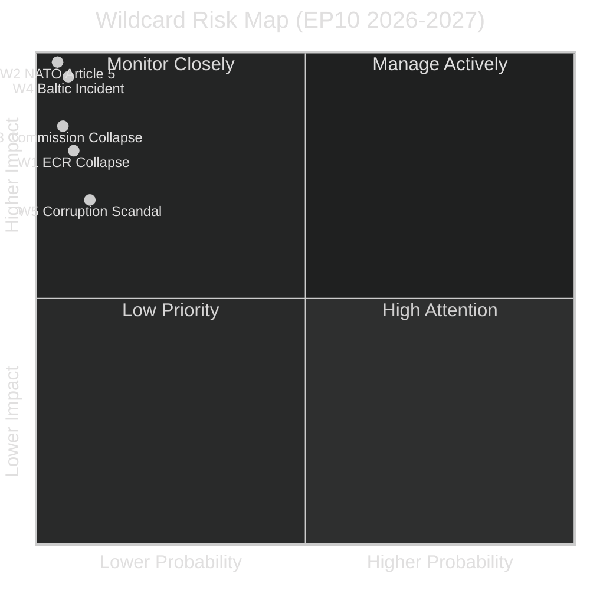

<!-- SPDX-FileCopyrightText: 2024-2026 Hack23 AB -->
<!-- SPDX-License-Identifier: Apache-2.0 -->

# Wildcards and Black Swans — EU Parliament Year in Review: May 2025–May 2026

**Classification:** Public | **Confidence:** 🟡 Medium | **Date:** 2026-05-10

---

## Methodology

Wildcards: Low-probability, high-impact events that are individually identifiable but uncertain.
Black Swans: Genuinely unforeseeable, high-impact events (identified retrospectively; here we define boundary conditions where they could emerge).

---

## Wildcards (Named Risks, Low-Probability High-Impact)

### W1: ECR Collapse and Realignment
**Probability:** 5-10% in 12 months
**Impact:** Very High
**Trigger conditions:** Petr Bystron criminal proceedings lead to AfD MEPs forming a separate group; Meloni distances ECR from German far-right; Polish contingent splits over Kamiński/Wąsik fallout.
**EP effect:** Would reduce ECR below the minimum threshold (23 MEPs from 7+ countries). Survivors revert to NI status. EPP loses most-used coalition partner. Governing formula requires Renew+S&D majority.

### W2: US Withdrawal of NATO Article 5 Guarantee
**Probability:** 2-5%
**Impact:** Extreme
**Trigger conditions:** Trump administration formally announces conditional Article 5, or US Congress passes resolution limiting Ukraine military aid.
**EP effect:** Immediate emergency plenary. Accelerated European Defence Agency powers legislation. UK-EU defence treaty re-opened. Probable emergency Stability Mechanism spending activation. EP would become crisis legislative chamber under intense pressure.

### W3: Ursula von der Leyen Commission Collapse (No-Confidence)
**Probability:** 3-7%
**Impact:** Very High
**Trigger conditions:** Major corruption scandal, or migration enforcement failure that triggers EPP-S&D rupture, or PfE-ECR manages 2/3 majority with defectors.
**EP effect:** Would suspend legislative calendar for 6+ months. Caretaker Commission. Emergency elections to Commission leadership. Significant disruption to MFF implementation.

### W4: Russia-Baltic Military Incident
**Probability:** 3-8%
**Impact:** Extreme
**Trigger conditions:** Russian forces engage Estonian/Latvian/Lithuanian border. NATO Article 5 invoked. EU activates solidarity clause (TEU Article 222).
**EP effect:** Article 78(3) TFEU emergency procedures invoked. EP plenary convenes in extraordinary session. Defence budget emergency revision. Security classification of legislative work would increase dramatically.

### W5: Major EP Corruption Scandal (Repeat of Qatargate Scale)
**Probability:** 8-12%
**Impact:** High
**Trigger conditions:** Investigation reveals organized influence campaign targeting EP10 migration votes or defence procurement decisions.
**EP effect:** Repeat of 2022 Qatargate institutional shock. Possible quaestors reform, ethics body powers expansion. Temporary legislative gridlock on affected dossiers.

---

## Black Swan Boundary Conditions

### BS1: EP Legitimacy Crisis
**Boundary condition:** Voter turnout below 35% in key member states in snap elections; multiple member states simultaneously questioning EP's representative mandate.
**Why possible:** EP10 turnout of 51% (2024) was positive but built on a mobilised electorate. A major policy failure (e.g., handling a major crisis poorly) could rapidly erode legitimacy norms.

### BS2: Eurozone Sovereign Debt Crisis Recurrence
**Boundary condition:** Sustained 10-year bond spread > 500 basis points for 2+ member states simultaneously; IMF emergency financing requested.
**Why possible:** High public debt levels across Southern EU (Italy at 140% debt/GDP in 2025-26 estimates). ECB still unwinding pandemic quantitative easing. An exogenous shock could re-trigger 2010-12 dynamics.

### BS3: Artificial Intelligence Governance Failure
**Boundary condition:** Widespread AI system failures in critical infrastructure while EU AI Act implementation is in early phases (2025-2027 timeline).
**Why possible:** EU AI Act came into force 2024; high-risk AI system requirements phase in 2026-27. Implementation lag creates governance gap.

---

## Probability-Impact Matrix

---

## Monitoring Indicators

| Wildcard | Key indicator to watch | Frequency |
|----------|----------------------|-----------|
| W1 | ECR group cohesion vote %, AfD public statements on EP group | Monthly |
| W2 | NATO communiqués, US Congressional resolutions | Weekly |
| W3 | EP opposition motion filings, Commission approval ratings | Monthly |
| W4 | Russian military movements near Baltic states | Weekly |
| W5 | Transparency International, EP ethics investigations | Quarterly |

---

## Probability Assessment (WEP)

| Wild Card | WEP Assessment | Admiralty Grade |
|-----------|----------------|-----------------|
| W1 — Far-right supermajority | Almost No Chance (< 10%) by 2029 | B3 |
| W2 — Treaty amendment (major) | Almost No Chance (< 10%) by 2030 | B3 |
| W3 — EP institutional crisis | Unlikely (10-25%) by 2028 | B2 |
| W4 — Security Article 42 TEU | Almost No Chance (< 5%) before 2028 | C3 |
| W5 — Ethics mega-scandal | Even Chance (40-55%) of occurrence before 2029 EP election | C3 |

**Overall tail-risk status: WEP: Unlikely** — No wild card scenario assessed as "Likely" or above in the current EP10 environment.

Admiralty: B3 — Source reliable (EP institutional data), information doubtfully confirmed (scenarios by definition unconfirmed).
