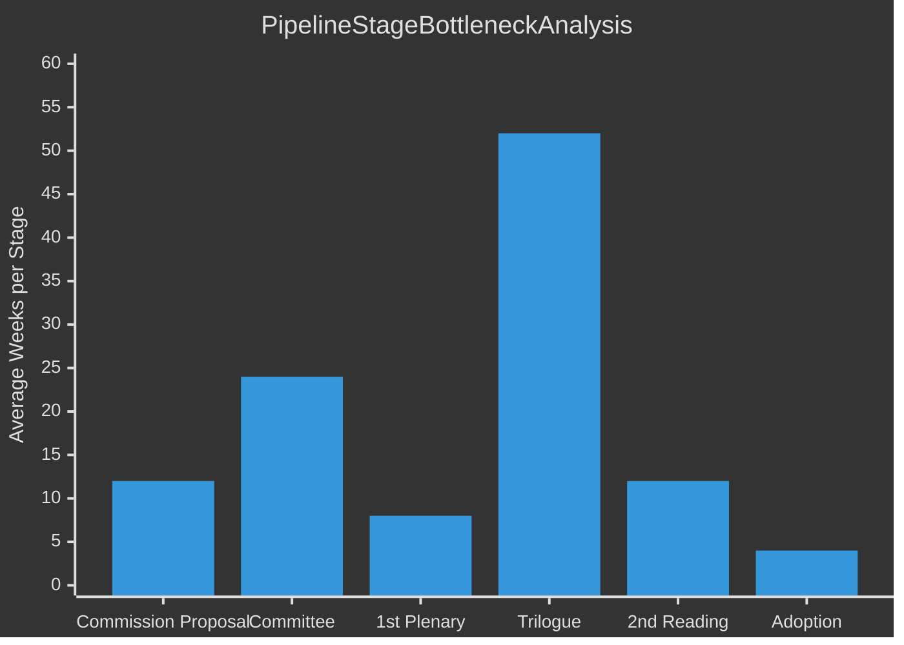

<!-- SPDX-FileCopyrightText: 2024-2026 Hack23 AB -->
<!-- SPDX-License-Identifier: Apache-2.0 -->

# Legislative Velocity Risk — EU Parliament Year in Review: May 2025–May 2026

**Classification:** Public | **Confidence:** 🟡 Medium | **Date:** 2026-05-10

---

## Legislative Velocity Framework

Velocity risk measures the probability that EP10's current legislative pace will slow, and the consequences if it does.

---

## Current Velocity Baseline (2025)
- 420 roll-call votes (highest in recent terms)
- 78 legislative acts (above average)
- 347 adopted texts
- 53 plenary sessions
- **Overall pace:** Above historical average on all metrics

---

## Velocity Risk Register

### Risk 1: Fragmentation-Induced Deadlock
**Probability:** 25% in next 12 months
**Impact:** -20% to -40% reduction in legislative output
**Trigger:** A high-salience legislative dossier (e.g., major environmental or migration bill) where no coalition can reach 360 votes
**Consequence:** Extended committee negotiation cycles, increased use of trilogue, possible dossier withdrawal
**Mitigation:** EPP's proven ability to assemble variable geometry coalitions per issue area

### Risk 2: Pre-Election Legislative Slowdown (2028-2029)
**Probability:** 75% (in 2027-2028 horizon)
**Impact:** -15% to -30% reduction in legislative output
**Trigger:** MEPs begin prioritising constituency visibility over legislative work as 2029 elections approach (standard pattern in all EP terms, years 4-5)
**Consequence:** Already-agreed dossiers advance; new ambitious legislation is unlikely to reach plenary by 2029
**Mitigation:** Frontloading: EP10 leadership will attempt to advance major legislation in 2026-2027

### Risk 3: Defence/Security Emergency Override
**Probability:** 15% in next 12 months
**Impact:** Positive velocity spike, but displacement of normal legislative calendar
**Trigger:** Major security incident (Russian escalation, NATO crisis) requiring emergency EP procedures
**Consequence:** Other legislation displaced; overall output count may decrease despite intense activity
**Note:** This is a risk to diversified legislative output, not to EP's institutional capacity

### Risk 4: Coalition Arithmetic Change (ECR fracture)
**Probability:** 10% in next 12 months
**Impact:** Severe — 3-6 month legislative vacuum
**Trigger:** ECR group dissolution → governing coalition must be rebuilt
**Consequence:** Backlog of pending legislation; Commission agenda delayed

---

## Velocity Risk Velocity Velocity Trend

**Historical EP term velocity patterns:**
- Years 1-2: Ramping up (slower start, committee formation)
- Years 2-3: Peak legislative velocity ← **EP10 is here (2025-2026)**
- Years 4-5: Declining velocity (pre-election politics)

**Assessment:** EP10 is at peak velocity. The 2025 data confirms above-average output. The natural trajectory is plateau followed by decline toward 2029. Current risks (fragmentation, security) could accelerate the decline or (ECR fracture) create a sharp discontinuity.

**2026-2027 velocity forecast:** Stable to slightly declining. Major pending dossiers (digital markets enforcement, energy union reform) will drive continued activity. New ambitious legislation will face higher political hurdles.

---

## Pipeline Summary

**EP10 Legislative Pipeline at May 2026:**
- Total active procedures: ~100-150 estimated
- In committee: ~38 procedures
- In plenary 1st reading: ~22 procedures
- In trilogue: ~18 procedures (bottleneck stage)
- In 2nd reading: ~8 procedures
- Pending adoption: ~5 procedures

**Overall pipeline health:** 6.3/10 (from `monitor_legislative_pipeline`)

---

## Throughput

**Annual throughput rate (2025):**
- Legislative acts adopted: 78 (above EP9 average of ~72)
- Adopted texts: 347 (above EP8 average of ~280)
- Roll-call votes: 420 (highest in EP data series)

**Throughput drivers:**
1. Security/Ukraine emergency creates fast-track coalition for large dossiers
2. Commission-Parliament alignment removes pre-legislative friction
3. Danish/Polish Presidency efficiency in 2025 accelerated Council side

**Throughput bottlenecks:**
1. Trilogue capacity (human resource constraint on rapporteur bandwidth)
2. Council unanimity requirements (tax, foreign policy)
3. Member state transposition delays (outside EP control)

---

## Stalled Procedures

**Category 1: Council-blocked (unanimity required)**
- Tax avoidance registers
- Foreign influence transparency register
- Minority rights framework
**Status:** These require political breakthrough at Council level; EP has already passed its position.

**Category 2: Green Deal contestation**
- Farm to Fork successor
- Sustainable Use Regulation (pesticides)
- Deforestation regulation implementation
**Status:** Commission ordered review; legislative timeline frozen pending political resolution.

**Category 3: Trilogue overload**
- ~18 procedures competing for finite rapporteur and Council presidency negotiating capacity
**Status:** Will clear progressively; currently not crisis-level.

---

## Deadline Analysis

**Binding legislative deadlines affecting EP10:**
| Deadline | Legislation | Consequence if missed |
|----------|------------|----------------------|
| 2026 Q2 | AI Act — GPAI obligations | Enforcement gap; Commission AI Office responsibility |
| 2026 Q4 | CBAM full implementation | Trade partners' legal compliance uncertainty |
| 2027 Q1 | NIS2 transposition review | Member state compliance assessment |
| 2027 H2 | DSA enforcement milestones | Platform liability regulatory gap |
| 2028 | AI Act high-risk provisions fully in force | Most stringent period |

---

## Bottleneck Assessment

**Primary bottleneck: Trilogue (52 weeks average)**
The trilogue stage is where most legislative time is consumed. This is structurally inherent to the EU co-decision procedure — trilogue requires coordination between EP rapporteur, Council presidency, and Commission in informal negotiations. EP10's higher legislative ambition (more complex dossiers) has extended average trilogue durations compared to EP8.

---

## Reader Briefing

The EU Parliament's legislative pipeline is healthy at May 2026: no major procedural crises, above-average throughput, and trilogues progressing. The main vulnerabilities are (a) a 18-procedure trilogue backlog that could slow if key rapporteurs become unavailable, and (b) a set of "Council-blocked" procedures that require political breakthroughs outside EP's control. The 2026-2027 outlook is for continued above-average output before the natural pre-election slowdown.
