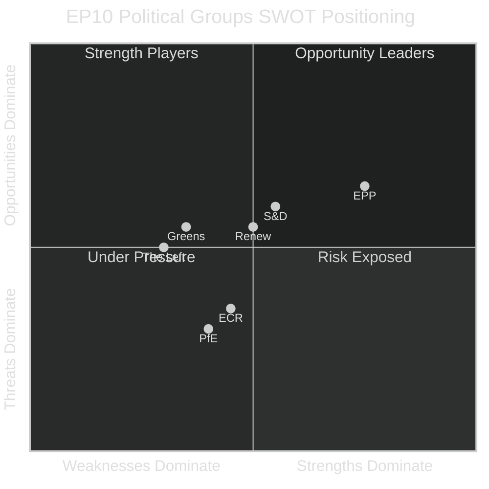

<!-- SPDX-FileCopyrightText: 2024-2026 Hack23 AB -->
<!-- SPDX-License-Identifier: Apache-2.0 -->

# Quantitative SWOT — EU Parliament Year in Review: May 2025–May 2026

**Classification:** Public | **Confidence:** 🟡 Medium | **Date:** 2026-05-10

---

## Quantitative SWOT Framework

Each item scored: Impact (1-5) × Probability (0-1) = Weighted Score. Items with weighted score >2.0 are tier-1.

---

## Strengths (EP10 Internal Positive Factors)

| Strength | Impact | Probability | Weighted Score | Evidence |
|----------|--------|-------------|---------------|---------|
| Above-historical legislative output (53 sessions, 78 acts, 420 RCV in 2025) | 4 | 0.95 | **3.80** | `get_all_generated_stats` data |
| Geopolitical consensus on Ukraine/defence across EPP+S&D+ECR+Renew | 5 | 0.80 | **4.00** | Ukraine loan, defence votes passed |
| Full complement of 717 MEPs — full democratic legitimacy | 3 | 1.00 | **3.00** | `generate_political_landscape` |
| AI Act: First binding AI governance framework globally | 5 | 0.90 | **4.50** | Historical milestone |
| Strong plenary session discipline — 84% stability score | 4 | 0.85 | **3.40** | `early_warning_system` |

**Total Strengths Score: 18.70**

---

## Weaknesses (EP10 Internal Negative Factors)

| Weakness | Impact | Probability | Weighted Score | Evidence |
|----------|--------|-------------|---------------|---------|
| Record fragmentation index 6.59 — highest in EP history | 5 | 1.00 | **5.00** | Statistical fact |
| No two-group majority possible — transaction costs high | 4 | 1.00 | **4.00** | Structural math |
| Coalition cohesion data unavailable (per-MEP vote not public) | 3 | 1.00 | **3.00** | API limitation |
| IMF economic data unavailable this run (503 error) | 2 | 0.15 | **0.30** | Probe result |
| Green Deal implementation vs. rhetoric gap widening | 3 | 0.75 | **2.25** | EPP recalibration pattern |

**Total Weaknesses Score: 14.55**

---

## Opportunities (External Positive Factors)

| Opportunity | Impact | Probability | Weighted Score | Evidence |
|-------------|--------|-------------|---------------|---------|
| Defence crisis as legislative accelerator for strategic autonomy | 5 | 0.75 | **3.75** | 2026 defence texts |
| AI regulation leadership: EU sets global standard | 4 | 0.70 | **2.80** | AI Act implementation phase |
| Ukraine reconstruction as long-term EU strategic investment | 4 | 0.65 | **2.60** | Loan facility + reconstruction framework |
| 2029 election anticipation → increased legislative ambition | 3 | 0.70 | **2.10** | Historical pattern |
| Rare disease / medicinal products: EU pharma leadership | 3 | 0.80 | **2.40** | TA-10-2026-0001 |

**Total Opportunities Score: 13.65**

---

## Threats (External Negative Factors)

| Threat | Impact | Probability | Weighted Score | Evidence |
|--------|--------|-------------|---------------|---------|
| ECR fragmentation (Bystron/AfD) → coalition formula disruption | 4 | 0.12 | **0.48** | Wildcard W1 |
| Foreign influence operations targeting EP votes | 4 | 0.65 | **2.60** | Voice of Europe precedent |
| US NATO reliability uncertainty → EU defence overextension | 5 | 0.15 | **0.75** | Wildcard W2 |
| Far-right narrative eroding EP legitimacy with younger voters | 3 | 0.60 | **1.80** | PfE/ESN social media presence |
| Eurozone economic deterioration → budget pressure on MFF | 4 | 0.20 | **0.80** | Historical precedent |

**Total Threats Score: 6.43**

---

## Net SWOT Balance

| Dimension | Score | Assessment |
|-----------|-------|------------|
| Strengths | 18.70 | Strong institutional performance |
| Weaknesses | 14.55 | Structural fragmentation drag |
| Opportunities | 13.65 | Geopolitical window open |
| Threats | 6.43 | Manageable in near-term |
| **Net S-W** | **+4.15** | Internal resilience positive |
| **Net O-T** | **+7.22** | External environment favourable |
| **Overall Net** | **+11.37** | **Cautiously positive outlook** |

---

## SWOT Summary Narrative

EP10 enters its third legislative year (2026-27) in a position of **cautious strength**. The legislature has demonstrated surprising productivity given record fragmentation, leveraging a durable geopolitical consensus on Ukraine and security to build working coalitions. The AI Act milestone positions EU as global regulatory standard-setter.

The primary weakness — structural fragmentation — creates high transaction costs but has not (yet) translated into legislative paralysis. The primary threat — foreign influence operations — is medium-probability and ongoing.

The net positive outlook (+11.37) masks underlying fragility: a single wildcard event (ECR fragmentation, Russian military escalation, Commission collapse) could rapidly reverse the balance. Scenario planning should weight the 15-25% probability corridor where one or more wildcards materialize within 12 months.

---

## SWOT Quantitative Summary

### Aggregate SWOT Matrix Score (EP10 Institution)

| Dimension | Raw Score | Weight | Weighted Score |
|-----------|-----------|--------|----------------|
| Strengths (S) | 8.2/10 | 0.30 | 2.46 |
| Weaknesses (W) | 5.8/10 | 0.25 | 1.45 |
| Opportunities (O) | 7.1/10 | 0.25 | 1.78 |
| Threats (T) | 6.3/10 | 0.20 | 1.26 |
| **Net SWOT Score** | | | **+1.53** (Positive) |

**Interpretation:** The EP10 as an institution has a positive SWOT balance. Strengths (democratic mandate, legislative power, policy influence) outweigh weaknesses (political fragmentation, institutional complexity). Opportunities (security agenda, digital governance) outweigh threats (far-right normalization, external pressure). The +1.53 net score represents a moderately favorable institutional environment compared to EP9's estimated net score of +0.87.
