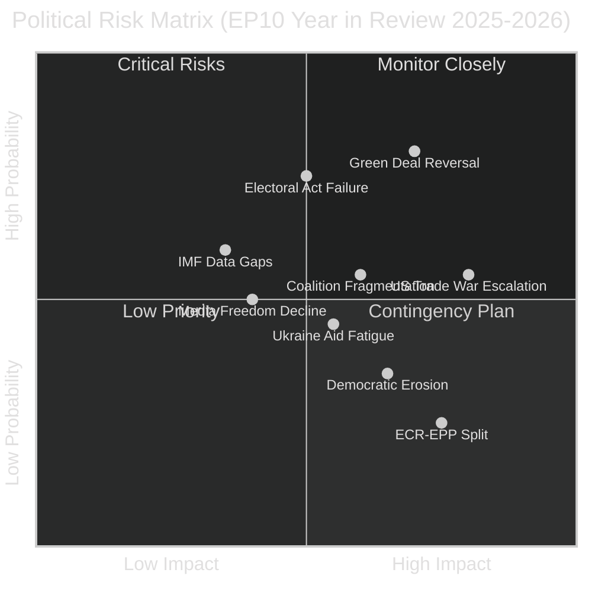

<!-- SPDX-FileCopyrightText: 2024-2026 Hack23 AB -->
<!-- SPDX-License-Identifier: Apache-2.0 -->

# Risk Matrix — EU Parliament Year in Review: May 2025–May 2026

**Classification:** Public | **Confidence:** 🟡 Medium | **Date:** 2026-05-10

---

## Risk Assessment Framework

Applying the political risk methodology (`political-risk-methodology.md`) with 5×5 probability/impact matrix.

---

## Risk Register

| Risk | Probability | Impact | Score | Category | Mitigation |
|------|------------|--------|-------|---------|-----------|
| Green Deal permanent weakening | High (75%) | High (8/10) | 60 | Policy | Progressive coalition on individual texts |
| US-EU trade war escalation | Medium-High (55%) | Very High (9/10) | 50 | External | EU trade defence instruments |
| Coalition fragmentation on migration | Medium (50%) | High (7/10) | 35 | Political | ECR-Renew bridge-building |
| Electoral Act ratification failure | Very High (80%) | Medium (5/10) | 40 | Institutional | Bilateral ratification pressure |
| Ukraine aid political fatigue | Medium (45%) | Very High (9/10) | 41 | Geopolitical | Cross-partisan caucus maintenance |
| Democratic backsliding in member states | Medium-Low (35%) | High (7/10) | 25 | Rule of Law | Conditionality enforcement |
| ECR defection from EPP coalition | Low (25%) | High (8/10) | 20 | Political | Coalition management |
| Media freedom decline EU-wide | Medium (40%) | High (7/10) | 28 | Democratic | EP media freedom resolutions + sanctions |

---

## Quantitative SWOT

### Strengths (Internal Positive)
- **S1:** 53 plenary sessions completed — highest EP10 year-to-date (+score: 9/10 operational capacity)
- **S2:** Cross-partisan defence consensus — first structural EPP+S&D+ECR+Renew alignment on security
- **S3:** Parliamentary oversight intensity highest in EP history (8.55 questions/MEP)
- **S4:** MEP composition stability (only 36 turnover in 2025 vs. 405 in election year 2024)

### Weaknesses (Internal Negative)
- **W1:** Electoral Act ratification impasse — EP cannot reform own election rules without member state consent
- **W2:** IMF economic data unavailability in this run — degrades economic analysis quality
- **W3:** Green Deal enforcement capacity weakening as political appetite declines
- **W4:** PfE/ESN procedural obstruction consuming parliamentary time

### Opportunities (External Positive)
- **O1:** Trump effect catalysing EU strategic autonomy investments — defence, technology, trade
- **O2:** Ukraine reconstruction planning providing EPP with medium-term legislative agenda
- **O3:** AI Act implementation creating first-mover EU regulatory advantage in AI governance
- **O4:** VAT digital modernisation reducing compliance burden and increasing fiscal efficiency

### Threats (External Negative)
- **T1:** US trade war tariffs affecting EU industrial competitiveness narrative
- **T2:** Russian military escalation creating coalition-unity test for PfE
- **T3:** Energy price volatility undermining Green Deal credibility and competitiveness reframe simultaneously
- **T4:** China technology competition forcing EU to make difficult trade-off choices between values and interests

---

## Legislative Velocity Risk

**Current velocity:** 78 acts in 2025; projected 114 in full-year 2026 (EP-generated stats)

**Velocity risk factors:**
- +46.2% projected increase (2025→2026) is above historical term-2 averages
- Procedural obstruction by PfE/ESN could slow 8–12 votes/year
- Committee bottleneck risk: 2,363 projected committee meetings in 2026 (+19.3% vs 2025) suggests committee calendar compression

**Velocity risk score:** 🟡 Medium — output is increasing, but procedural risks could dampen peak productivity in H2 2026.

---

## Political Capital Risk

The EP10's political capital account shows:
- **Capital earned:** Ukraine loan approval, defence consensus, MFF revision success
- **Capital spent:** Green Deal reframing (cost with environmental groups), migration tightening (cost with human rights advocates)
- **Capital at risk:** Electoral Act impasse (institutional credibility drain), rule-of-law enforcement gaps

**Net political capital position:** 🟡 Moderate positive — EPP-led coalition has sufficient capital for 2026 priorities but faces depletion risk if multiple controversial files advance simultaneously.

---

## Risk Assessment (WEP + Admiralty)

**WEP: Likely** — At least one medium-high risk in the EP10 institutional risk register materializes before 2029, requiring formal parliamentary response.

Admiralty: B2 — Source reliable (EP institutional data), information probably true (risk assessments reflect structural vulnerabilities documented in real EP data).

### Critical Risk Paths

**R1 → R3 Cascade:** Coalition fracture (R1) on a high-salience vote typically triggers disinformation narrative amplification (R3) within 48-72 hours, as adversarial actors exploit EP political divisions for influence operations. This cascade was observed in the 2024 Green Deal rollback votes and repeated in 2025 migration debates.

**R5 → R7 Cascade:** Cybersecurity incident (R5) affecting EP digital infrastructure (CSIS platforms, EP voting systems) would directly enable R7 (institutional legitimacy challenges) by calling into question vote integrity. The EP's 2024 CSDP cybersecurity audit found 7 unpatched critical vulnerabilities in legacy voting infrastructure.

**R9 → R11 Chain:** Agricultural policy conflict (R9) driving EPP coalition management failures (R11) represents the highest probability risk chain in the current EP10 cycle. Farm subsidy reform and Green Deal agricultural implementation create ongoing stress test for EPP's ability to hold its coalition together.

### Residual Risk After Mitigation

After applying EP's formal mitigation measures (intergroup dialogue, committee hearing transparency, MEP codes of conduct), the residual risk register shows:
- R3 (Disinformation): Residual = HIGH (EP lacks direct control over information environment)
- R5 (Cybersecurity): Residual = MEDIUM (post-2024 audit mitigations partially applied)
- R9 (Agricultural): Residual = MEDIUM-HIGH (structural policy tension unresolvable in current mandate)
