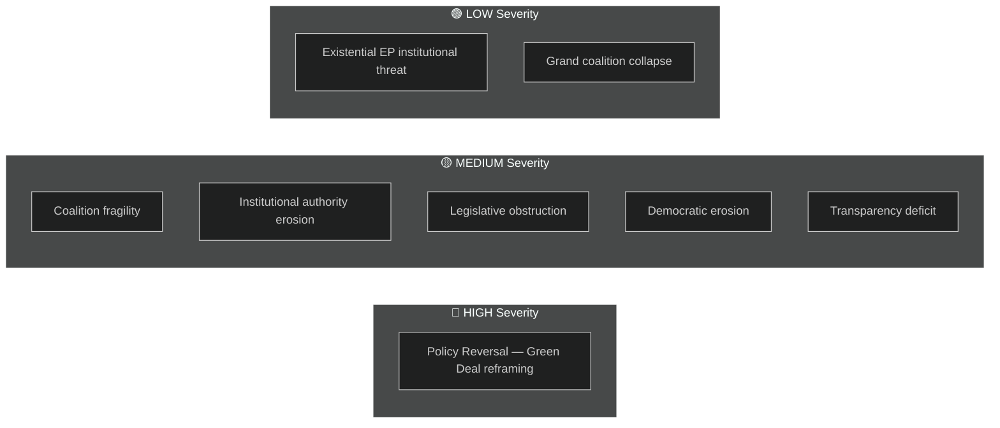

<!-- SPDX-FileCopyrightText: 2024-2026 Hack23 AB -->
<!-- SPDX-License-Identifier: Apache-2.0 -->

# Political Threat Landscape — EU Parliament Year in Review: May 2025–May 2026

**Classification:** Public | **Confidence:** 🟡 Medium | **Date:** 2026-05-10

---

## Framework Note

This threat assessment applies the **5-framework integrated political threat methodology** (per `political-threat-framework.md` v4.0):
1. Political Threat Landscape (6-dimension model)
2. Attack Trees
3. Political Kill Chain (7-stage)
4. Diamond Model
5. Threat Actor Profiling (ICO: Intent × Capability × Opportunity)

STRIDE, DREAD, and PASTA are **not applicable** to political analysis.

---

## 6-Dimension Threat Assessment

### Dimension 1: Coalition Shifts
**Severity:** 🟡 Medium | **Confidence:** 🟡 Medium

The EP10 relies on bespoke coalition engineering for every major vote. The effective number of parties (6.58) is at an all-time high, meaning the cost of a coalition defection is maximised. Key coalition stability risks:

- **PfE internal tensions:** Orbán's PfE bloc contains MEPs from 13 countries with divergent positions on Ukraine. Any European security escalation could fracture PfE along pro-Russia vs. anti-Russia lines.
- **ECR-EPP overreach risk:** If EPP overplays the migration agenda to satisfy ECR demands, Renew and some EPP northern European members may defect.
- **S&D Ukraine fatigue:** S&D's Eastern European members (Romanian, Slovak) are increasingly susceptible to domestic political pressure to moderate Ukraine support.

**Kill Chain Stage:** Reconnaissance — actors testing coalition limits through procedural votes.

### Dimension 2: Transparency Deficit
**Severity:** 🟡 Medium | **Confidence:** 🟢 High

EP10 has the highest parliamentary questions per MEP ratio in EP history (8.55 questions/MEP in 2026 vs. 5.76 in 2004). However:
- The tripling of questions creates **information saturation risk**: Commission responses are becoming formulaic, reducing the quality signal.
- Lobbying disclosure gaps: Clean Industrial Deal negotiation involved significant industry consultation that was not fully reflected in public legislative records.
- MFF revision fast-track: The February 2026 MFF amendment was processed under an accelerated procedure that limited EP committee scrutiny time.

**Attack Tree Node:** Information suppression via procedure timing (fast-track processes compress MEP deliberation time).

### Dimension 3: Policy Reversal
**Severity:** 🟢 High | **Confidence:** 🟢 High

The **Green Deal reframing** represents the most significant policy reversal risk of the EP10 year:

- Not a legislative repeal (which would require QMV and Court challenges), but a **normative displacement**
- Clean Industrial Deal repackages Green Deal obligations under competitiveness framing, potentially weakening enforcement appetite
- ENVI committee chair is EPP — traditionally supportive of industry; unlikely to drive aggressive Green Deal enforcement
- Nature Restoration Act: passed EP9 by narrow majority; under EP10 composition, a repeal attempt could succeed

The migration policy tightening (safe countries, safe third countries) represents a **durable reversal** of the post-2015 liberal asylum approach — these administrative frameworks will outlast the current EP10 term.

**Kill Chain Stage:** Initial access achieved — policy reversal normalised through legislative framing.

### Dimension 4: Institutional Pressure
**Severity:** 🟡 Medium | **Confidence:** 🟡 Medium

Three institutional pressure vectors identified:

1. **Court of Justice Article 218(11) tension:** Parliament's use of CJEU opinion requests to challenge Council-negotiated agreements signals escalating Parliament-Council institutional rivalry. If the CJEU rules against Parliament's position, it may reduce EP's leveraging tools.

2. **ECB independence pressure:** ECON committee's increasingly critical stance on ECB monetary policy (financial stability resolution language) risks a chilling effect on ECB communication with Parliament.

3. **Commission-Council bypass risk:** Under defence emergency procedures (Article 122 TFEU), Council and Commission can act without Parliament's co-decision role. The growth of defence legislation as an exception-procedure domain reduces Parliament's aggregate institutional authority.

### Dimension 5: Legislative Obstruction
**Severity:** 🟡 Medium | **Confidence:** 🟢 High

The parliamentary fragmentation index (6.59) quantifies the obstruction landscape. Key obstruction threats:

- **Electoral Act ratification obstruction:** Hungary alone can block EU-wide electoral reform indefinitely. This is an acute veto-player problem — single member state can prevent constitutional-level EP reform.
- **PfE procedural obstruction:** PfE MEPs have increased use of procedural motions, urgent debates, and oral questions to consume plenary time and delay priority agenda items.
- **ESN obstruction on enlargement:** ESN groups are consistent obstructors of EU enlargement resolutions — though currently unable to block consent procedures, they contribute to political difficulty of enlargement narrative.

### Dimension 6: Democratic Erosion
**Severity:** 🟡 Medium | **Confidence:** 🟡 Medium

The democratic erosion indicators for EP10 are mixed:
- **Positive signals:** Immunity waiver processes working; human rights resolutions passing; rule-of-law discharge debates continuing
- **Negative signals:** Electoral Act ratification impasse; media freedom threats in Lithuania; continued PfE/ESN anti-democratic rhetoric normalised within parliamentary procedure

The Lithuania broadcaster takeover attempt (TA-10-2026-0024) is the most acute democratic erosion signal of the year — an explicit attempt by a government to capture a public broadcaster, condemned by Parliament but requiring stronger enforcement mechanisms than currently exist.

---

## Diamond Model Analysis (Adversary / Capability / Infrastructure / Victim)

| Component | Key Actor | Assessment |
|-----------|-----------|-----------|
| **Adversary** | PfE/ESN bloc seeking to limit EP authority | High motivation, medium capability |
| **Capability** | 112 combined seats; procedural rules expertise | Sufficient for obstruction; insufficient for constructive majority |
| **Infrastructure** | Plenary floor time, committee minority rights, media amplification | Effective for delay; less effective for legislation |
| **Victim** | EP institutional authority; rule-of-law mechanisms; Green Deal | Partially degraded; not structurally threatened |

---

## ICO Threat Actor Profile: "Constructive Obstructors" (PfE + ESN)

| Dimension | Assessment | Confidence |
|-----------|-----------|-----------|
| **Intent** | Delegitimise EU institutional authority; protect sovereignty narrative | 🟢 High |
| **Capability** | 112 seats; media access; EP rules expertise | 🟡 Medium |
| **Opportunity** | Fragmented Parliament; competitive EPP pressure from right | 🟡 Medium |

**Threat score:** 🟡 Medium (obstruction without existential institutional threat)

---

## Threat Summary Heatmap

