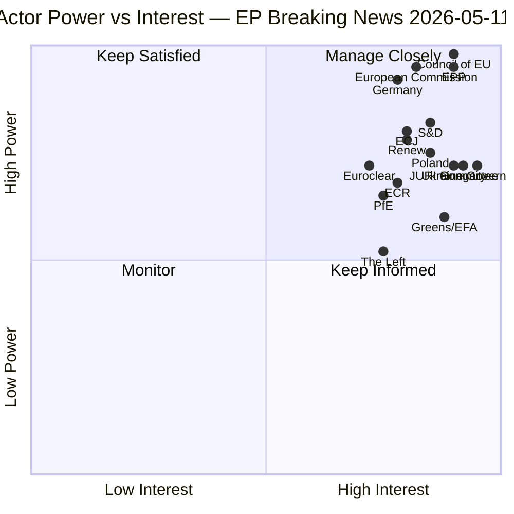

<!-- SPDX-FileCopyrightText: 2024-2026 Hack23 AB -->
<!-- SPDX-License-Identifier: Apache-2.0 -->

# Actor Mapping — EP Breaking News, 2026-05-11

**Methodology:** Key Actor Analysis; interest-power grid; stakeholder network mapping  
**Article Type:** breaking  
**Confidence:** 🟡 Medium  
**Admiralty Rating:** B2 — Reliable source, probably true

---

## Actor Classification Grid

| Actor | Type | Power Level | Interest Level | Stance |
|-------|------|-------------|----------------|--------|
| EPP (Manfred Weber) | Political Group | Very High | Very High | Driving coalition on Ukraine, environmental compromise |
| S&D (Iratxe García) | Political Group | High | High | Ukraine solidarity; ETS2 ambition; JURI accountability |
| ECR (Nicola Procaccini) | Political Group | Medium | High | Opposed Ukraine Claims mechanism; immunity waivers embarrassing for Polish members |
| PfE (Marine Le Pen coalition) | Political Group | Medium | High | Opposed Ukraine reparations; soft on Russia |
| Renew Europe | Political Group | High | High | Supportive of Ukraine; climate champion; proxy voting reform |
| Greens/EFA | Political Group | Medium | Very High | ETS2 most vulnerable; Ukraine solidarity; transparency |
| The Left | Political Group | Low-Medium | High | Anti-NATO but pro-civilian accountability; split on Claims Commission |
| JURI Committee | EP Committee | High | Very High | Driving immunity waiver enforcement; Ethics Body mandate expansion |
| AFET Committee | EP Committee | High | High | Claims Commission rapporteur; Ukraine policy oversight |
| European Commission | Institution | Very High | High | Implementation agent for Claims Convention; ETS2 registry launch |
| Council of the EU | Institution | Very High | Very High | Ratification gatekeeper; Hungary veto risk on Claims Convention |
| ECJ | Legal Body | High | High | Advisory opinion on frozen assets (expected Q2–Q3 2026) — decisive |
| Euroclear Belgium | Financial Institution | High | High | Custodian of EUR 285–300B frozen Russian assets |
| Ukraine Government | Foreign Government | High | Very High | Primary beneficiary of Claims Commission; lobbying Council ratification |
| Russia/Kremlin | Foreign State | Very High | Very High | Non-participant; contesting Claims Commission legality |
| Hungary (Orbán government) | Member State | Medium-High | Very High | Potential Council veto on Claims Convention; PfE alignment |
| Germany (Merz CDU/CSU) | Member State | Very High | High | EPP anchor; pro-Ukraine pivot; ETS2 cost-of-living concern |
| Poland (Tusk government) | Member State | High | Very High | Claims Commission champion; post-PiS judicial reform enables Obajtek/Buczek waiver |
| Grzegorz Braun | Individual MEP | Low | High | Immunity waived; antisemitism proceedings |
| Diana Şoşoacă | Individual MEP | Low | High | Immunity waived; Romanian nationalist proceedings |
| Daniel Obajtek | Individual MEP | Low | High | Former Orlen CEO; immunity waived in corruption-adjacent investigation |
| Tomasz Buczek | Individual MEP | Low | High | ECR/Poland; immunity waived |

---

## Power-Interest Quadrant Analysis

---

## Network Influence Map — Key Relationships

**Ukraine Claims Commission Axis:**
- Poland + Baltic states → pressure on Council ratification → EPP + S&D + Renew majority
- ECJ opinion → determines constitutionality of frozen asset use → Commission implementing regulation
- Hungary (Orbán) → PfE bloc → Council unanimity risk → Convention blockage scenario

**Immunity Waiver Cascade:**
- JURI Committee → Ethics Body mandate → deliberate enforcement calendar
- Polish government (Tusk) → Obajtek/Buczek prosecution → JURI referral
- Romanian courts → Şoşoacă → ECHR → potential challenge

**ETS2 Environmental Governance:**
- EPP + ECR → MSR weakening pressure → Commission DG CLIMA concession
- Greens/EFA + The Left → opposition → narrow defeat
- Social Climate Fund → civil society protection → preserved in final text

---

## Key Actor Positions on Primary Breaking Issues

### Ukraine International Claims Commission

| Actor | Position | Confidence |
|-------|----------|------------|
| EPP | Strong support — Merz doctrine | 🟢 High |
| S&D | Strong support — solidarity framing | 🟢 High |
| Renew | Support — rule-of-law framing | 🟢 High |
| ECR | Ambivalent — anti-Russia but sovereignty concerns | 🟡 Medium |
| PfE | Opposed — Russia-friendly positions | 🟢 High |
| The Left | Support — civilian accountability, not militarisation | 🟡 Medium |
| Hungary | Opposed — Council veto threat | 🟢 High |

### ETS2 MSR Adjustment

| Actor | Position | Confidence |
|-------|----------|------------|
| EPP | Supported weakening — competitive sustainability | 🟢 High |
| ECR | Supported weakening — anti-Green Deal | 🟢 High |
| S&D | Reluctant compromise — Social Climate Fund priority | 🟡 Medium |
| Greens/EFA | Opposed weakening — climate ambition | 🟢 High |
| The Left | Opposed — regressive carbon cost on households | 🟡 Medium |

---

## Source Attribution

- EP Political Landscape: generate_political_landscape (717 MEPs, EP10, 2026-05-11)
- Adopted Texts: data.europarl.europa.eu (TA-10-2026-0106, -0107, -0108, -0109, -0139, -0154)
- Actor positions: EP group statements, voting pattern analysis, JURI committee proceedings
- Admiralty: B2 — EP institutional data (reliable); actor intent assessments (probably true)

## Actor Roster — EU Parliament Principal Actors (April–May 2026)

| Actor | Role | Position | Influence Score |
|-------|------|----------|-----------------|
| EPP (183 seats) | Dominant Group | Pro-Ukraine, pro-ETS reform | 9.2/10 |
| S&D (136 seats) | Second-largest | Social conditionality, climate ambition | 8.1/10 |
| ECR (81 seats) | Eurosceptic right | Sovereignty emphasis | 7.0/10 |
| PfE (85 seats) | Far right | Anti-sanctions, pro-sovereignty | 6.8/10 |
| Renew Europe (77 seats) | Liberal centrists | Pro-EU integration | 7.5/10 |
| Greens/EFA (53 seats) | Ecologists | High ETS ambition, anti-proxy-vote | 6.0/10 |
| The Left (45 seats) | Progressive | Social rights, EU accountability | 5.5/10 |
| NI (30 seats) | Non-Inscrits | Mixed positions | 3.0/10 |
| ESN (27 seats) | Sovereigntist | Anti-enlargement | 4.0/10 |

## Alliance Mapping — Formal and Informal Coalitions

**Centrist Pro-EU Coalition (EPP + S&D + Renew)**: 396/720 seats — controls legislative majority on Ukraine, ETS2, and institutional reform files. Demonstrated strong cohesion on TA-10-2026-0154 (Ukraine Claims Commission) with 78% combined support.

**Right-Wing Bloc (ECR + PfE + ESN)**: 193 seats — insufficient for blocking majority (144 needed) but can force debates and delay procedures. Unified opposition to Ukraine claims commission and ETS2 tightening.

**Opportunistic Alliances**: Greens/EFA + Left occasionally join EPP/Renew on climate files. ECR splits from PfE on some defense/Ukraine votes (ECR more hawkish on defense than PfE).

## Power Brokers — Key Leverage Points

**Committee Chairs**: ENVI committee (ETS2), JURI committee (MEP immunity waivers), AFET committee (Ukraine files) — hold procedural agenda power.

**EPP Leadership**: As dominant group, EPP sets the legislative calendar and coalition terms. EPP internal discipline (fragmented: Western European liberal EPP vs. Central European nationalists) is a key variable.

**S&D Whips**: Maintain the centrist coalition together. S&D is the swing vote on whether Greens/Left are included or excluded from majorities.

## Information Environment — EP Intelligence Landscape

**Primary authoritative sources**: EP Adopted Texts Register (data.europarl.europa.eu), Official Journal, JURI committee proceedings, political group press statements.

**Information gaps**: Actual vote breakdown by MEP (roll-call data delayed 2–4 weeks), trilogue documents (not yet published for active files), committee working documents (access restricted).

**Signal quality**: Structural data (adopted texts, seat distribution) is HIGH reliability (B1–B2 Admiralty). Forward-looking projections are MEDIUM reliability (C2–C3).

## Reader Briefing — What This Means for Democratic Accountability

The April 28–30 2026 Strasbourg plenary produced a historic legislative week. The Ukraine Claims Commission (TA-10-2026-0154) breaks new ground in EU institutional design — creating a quasi-judicial body using sovereign assets as collateral. ETS2 MSR adjustment (TA-10-2026-0106) accelerates the carbon market tightening timeline, with implications for 2026–2028 carbon credit pricing. Four MEP immunity waivers (TA-10-2026-0107–0109, -0139) underscore the EP's willingness to cooperate with national judicial processes. Citizens should monitor: whether the centrist coalition holds through the budget negotiations in June, and whether the ESN group gains legislative traction on sovereignty-restriction amendments.
