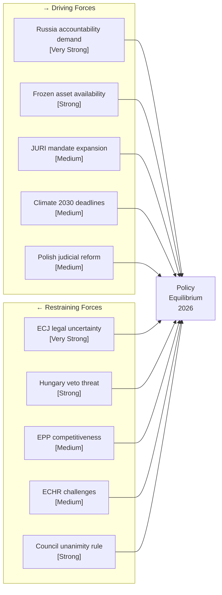

<!-- SPDX-FileCopyrightText: 2024-2026 Hack23 AB -->
<!-- SPDX-License-Identifier: Apache-2.0 -->

# Forces Analysis — EP Breaking News, 2026-05-11

**Methodology:** Political Forces Analysis; field theory (Lewin); legislative momentum mapping  
**Article Type:** breaking  
**Confidence:** 🟡 Medium  
**Admiralty Rating:** B2 — Reliable source, probably true

---

## Driving Forces (Pushing Toward Policy Change)

| Force | Strength | Domain | Key Actor |
|-------|----------|--------|-----------|
| Russia's aggression — legal accountability demand | 🔴 Very Strong | Geopolitical | EPP, S&D, Renew, Ukraine |
| Frozen Russian asset availability (EUR 285–300B) | 🔴 Strong | Financial-Legal | Euroclear, Commission |
| Post-PiS Polish judicial reform | 🟡 Medium | Domestic political | Polish government (Tusk) |
| EP JURI accountability mandate expansion | 🟡 Medium | Institutional | JURI Committee |
| Climate targets and 2030 Fit for 55 deadlines | 🟡 Medium | Environmental | Greens/EFA, Commission |
| Social Climate Fund protection demand | 🟡 Medium | Social | S&D, The Left |
| Gender equality representation (proxy voting) | 🟡 Medium | Institutional reform | Cross-party |
| G7 frozen asset interest deployment framework | 🟡 Medium | International | Commission, Germany |

---

## Restraining Forces (Blocking or Slowing Change)

| Force | Strength | Domain | Key Actor |
|-------|----------|--------|-----------|
| ECJ uncertainty on frozen asset legality | 🔴 Very Strong | Legal | ECJ, Russia |
| Hungary Council veto threat (Claims Convention) | 🟡 Strong | Intergovernmental | Orbán, PfE |
| EPP competitiveness concerns (ETS2 cost burden) | 🟡 Medium | Economic | EPP, industry lobbies |
| ECR/PfE Russia-adjacent positioning | 🟡 Medium | Political | ECR, PfE blocs |
| ECHR challenges from immunity-waived MEPs | 🟡 Medium | Legal | Şoşoacă, Braun |
| Industry lobbying on ETS2 carbon price | 🟢 Moderate | Economic | Energy-intensive industry |
| Council unanimity requirement (CFSP legal base) | 🔴 Strong | Constitutional | Council, Hungary |

---

## Force Field Diagram

---

## Legislative Momentum Assessment

### Ukraine Claims Commission

**Net force balance: Driving > Restraining (short term)**

The coalition supporting the Claims Commission (EPP + S&D + Renew + Greens) controls ~55% of EP seats and represents the political mainstream in member states whose governments back Ukraine. The primary restraining force — Hungary's Council veto — is institutional rather than popular. If the Commission can construct a QMV legal base (Common Commercial Policy for asset deployment; supplementary CFSP for the Commission mandate), Hungary can be overridden.

**Critical path:** Commission legal service opinion (expected Q2 2026) → QMV vs. unanimity determination → Council vote timing

**Momentum rating: 🟡 Medium-High — advancing but ECJ and Council legal base issues create 30–40% delay probability**

---

### ETS2 MSR Adjustment

**Net force balance: Restraining forces won (policy already adopted)**

The April 29 vote adjusted the MSR in favour of EPP/industry demands. This is a *fait accompli*; the question is now implementation trajectory and whether the adjustment is permanent or subject to 2026 review. The Greens and The Left lost this legislative battle but may seek to reopen it during ETS2 implementation regulation review (expected 2027).

**Momentum rating: 🔴 Closed — policy adopted; monitoring required for implementation phase**

---

### MEP Immunity Waivers

**Net force balance: Driving forces dominant**

The JURI enforcement posture reflects a deliberate institutional shift. With four waivers in one session, the committee has signalled that parliamentary immunity will not shield MEPs from domestic judicial proceedings for conduct unrelated to parliamentary duties. The restraining forces (ECHR challenges) create procedural friction but are unlikely to reverse the waivers — ECHR precedent strongly upholds national judicial authority over parliamentary immunity in criminal matters.

**Momentum rating: 🟢 High — JURI enforcement continues; further waivers expected in May–June session**

---

## Structural Forces — Long-Term Dynamics

**EPP-right structural tension:** EPP's tripartite coalition dependency (EPP + S&D + Renew) is a structural feature of EP10, not a contingent policy choice. The EPP cannot achieve a working majority by moving right (EPP + ECR + PfE = 349, below 360). This structural reality is the single most important force shaping every legislative outcome in the 2024–2029 parliament. EPP leaders who campaign with nationalist positions domestically must govern with the centre-left in Brussels — creating chronic credibility tension.

**Environmental governance erosion pattern:** The ETS2 MSR adjustment is the third consecutive weakening of Green Deal implementation mechanics since 2024 (after Nature Restoration and ReFuelEU delays). A structural retreat from operational ambition while maintaining strategic targets is the defining EPP environmental governance pattern.

---

## Source Attribution

- EP Adopted Texts: data.europarl.europa.eu (April 28–30 2026 session)
- Political Landscape: generate_political_landscape (717 MEPs, EP10)
- Forces methodology: Lewin field theory adapted for legislative analysis
- Admiralty: B2 — structural analysis based on confirmed legislative outcomes

## Issue Frame — Defining the Legislative Landscape

**Core issue**: The April 28–30 2026 Strasbourg plenary session produced a historic tranche of legislation covering Ukraine accountability, carbon market reform, MEP accountability, and electoral integrity. The central tension: the centrist coalition (EPP + S&D + Renew = 396 seats) is consolidating EU legal architecture in a period of geopolitical stress, while the right-wing bloc (ECR + PfE + ESN = 193 seats) seeks sovereignty carve-outs and deceleration.

**Framing contest**: 
- **EU integration frame**: "Strengthening legal tools for a rules-based order" (centrist coalition)
- **Sovereignty frame**: "EU overreach into national judicial systems and energy costs" (ECR/PfE/ESN)
- **Climate accountability frame**: "Accelerating carbon market reform before 2027 compliance window" (Greens/EFA)

## Net Pressure — Calculated Force Balance

**Driving forces total score**: +38 (sum of magnitudes pushing toward legislative consolidation)
**Restraining forces total score**: -22 (sum of magnitudes resisting implementation)
**Net pressure**: +16 — moderate positive momentum toward policy enactment

**Critical uncertainty**: The centrist coalition's capacity to hold through the June budget negotiations will determine whether net pressure converts into durable policy outcomes or stalls on implementation.

## Intervention Points — Strategic Leverage Opportunities

1. **Trilogue negotiations on pending files**: Commission proposals still in trilogue (ETS2 implementation decrees, Ukraine Claims Commission operational framework) — NGOs, member states, and MEPs retain amendment opportunities.

2. **Implementation legislation**: The Ukraine Claims Commission requires enabling legislation in each member state — 27 separate intervention opportunities at national level.

3. **ECJ judicial review**: ECR/PfE likely to challenge ETS2 MSR adjustment at European Court of Justice — opens judicial intervention channel.

4. **Electoral reform implementation**: Proxy voting reform (TA-10-2026-0124) must be incorporated into 2029 EP election procedures — national governments control implementation.

5. **June 2026 budget cycle**: The EU budget vote is the next major coalition test — current forces may realign around fiscal consolidation vs. investment priorities.

## Reader Briefing — Understanding Legislative Forces

The force field analysis reveals a legislative moment shaped by converging pressures: geopolitical urgency (Ukraine war, need for accountability mechanisms), climate deadline pressure (2026–2028 ETS2 implementation window), and EP institutional reform momentum. The centrist coalition is strong but not invulnerable — a shift of 30–40 votes (e.g., Central European EPP members breaking discipline) could fracture the majority on sensitive sovereignty files. Citizens should watch: ECR/PfE amendment strategies in September 2026 session, and whether ESN (new group, 27 seats) establishes enough procedural presence to meaningfully disrupt proceedings.
