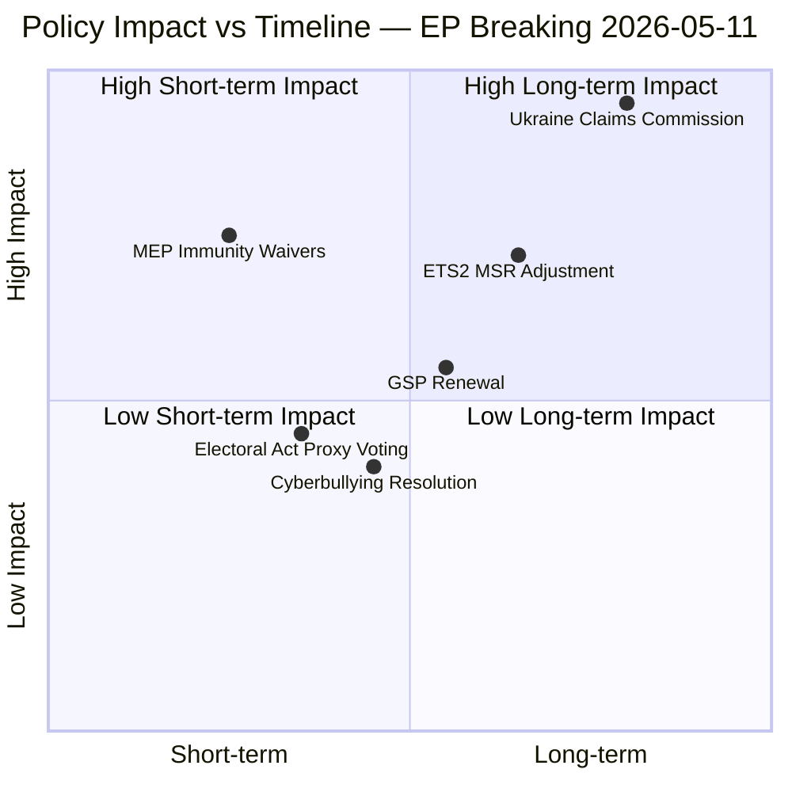

<!-- SPDX-FileCopyrightText: 2024-2026 Hack23 AB -->
<!-- SPDX-License-Identifier: Apache-2.0 -->

# Impact Matrix — EP Breaking News, 2026-05-11

**Methodology:** Multi-dimensional impact assessment; short/medium/long-term horizons  
**Article Type:** breaking  
**Confidence:** 🟡 Medium  
**Admiralty Rating:** B2 — Reliable source, probably true

---

## Impact Dimensions Overview

---

## Detailed Impact Assessment

### 1. Ukraine International Claims Commission (TA-10-2026-0154)

**Short-term impact (0–3 months):**
| Dimension | Impact | Assessment |
|-----------|--------|------------|
| Diplomatic | Very High | Signals EP's active role in Ukraine accountability architecture |
| Financial | Low | Assets frozen; no immediate disbursement |
| Legal | High | ECJ advisory opinion becomes urgent; Commission legal service mobilised |
| Political | High | Strengthens tripartite coalition (EPP+S&D+Renew) on Ukraine |
| Public | Medium | Limited public salience vs. ceasefire negotiations |

**Medium-term impact (3–12 months):**
| Dimension | Impact | Assessment |
|-----------|--------|------------|
| Diplomatic | High | Council ratification vote determines actual legal force |
| Financial | Medium | EUR 3B/year interest pool becomes available as endowment base |
| Legal | Very High | ECJ opinion (expected Q2–Q3) determines asset constitutionality |
| Institutional | High | Commission proposes implementing regulation; new EU body established |
| International | High | Sets precedent for similar mechanisms in other conflict zones |

**Long-term impact (12+ months):**
| Dimension | Impact | Assessment |
|-----------|--------|------------|
| International law | Transformative | Establishes state-accountability-outside-UNSC framework |
| EU foreign policy | High | Confirms EP as a proactive geopolitical actor |
| Russia relations | Permanent | Claims Commission further cements EU-Russia structural confrontation |
| Economic | Medium-High | EUR 285B assets status determines EU-Russia normalisation pathway |

---

### 2. MEP Immunity Waivers ×4 (TA-10-2026-0106/0107/0108/0109)

**Short-term impact (0–3 months):**
| Dimension | Impact | Assessment |
|-----------|--------|------------|
| Institutional | High | JURI enforcement posture visibly strengthened |
| Political | Medium-High | Embarrassment for ECR group; internal accountability pressure |
| Legal | High | Domestic proceedings in Poland, Romania now unobstructed |
| Deterrence | Medium | Signal to far-right MEPs that immunity is not unconditional |

**Medium-term impact (3–12 months):**
| Dimension | Impact | Assessment |
|-----------|--------|------------|
| ECHR | Medium | Şoşoacă/Braun ECHR challenges expected; likely unsuccessful |
| ECR cohesion | Medium | Polish MEP prosecutions may create ECR internal tensions |
| JURI calendar | High | Further waivers expected; JURI establishing pattern |

**Long-term impact (12+ months):**
| Dimension | Impact | Assessment |
|-----------|--------|------------|
| Parliamentary immunity norm | High | Gradual narrowing of immunity scope; EP following EP8 trajectory |
| EP ethics governance | Medium | Complements Ethics Body mandate expansion |
| Far-right accountability | Medium | Creates reputational and legal friction for nationalist MEPs |

---

### 3. ETS2 MSR Adjustment (TA-10-2026-0139)

**Short-term impact (0–3 months):**
| Dimension | Impact | Assessment |
|-----------|--------|------------|
| Climate | Low | MSR adjustment is 2027 relevant; no immediate effect |
| Market signal | Medium | ETS2 carbon price expectations revised downward |
| Industry | Low-Medium | Investment signal for building renovation slightly weaker |

**Medium-term impact (3–12 months):**
| Dimension | Impact | Assessment |
|-----------|--------|------------|
| ETS2 launch | Medium | 2027 launch on schedule; carbon price trajectory 12–18% lower |
| Households | High | 148 million households in ETS2 scope; lower peak cost exposure |
| Decarbonisation | Medium-Negative | Slower renovation-rate incentive; extends building emissions horizon |
| EPP positioning | High | Confirms "competitive sustainability" as EPP's environmental doctrine |

**Long-term impact (12+ months):**
| Dimension | Impact | Assessment |
|-----------|--------|------------|
| 2050 net-zero | Low | Headline target unchanged; operational ambition reduced |
| Green Deal integrity | High | Pattern of implementation weakening accelerating |
| Innovation signal | Medium-Negative | Lower carbon price reduces ROI on clean building technology |

---

### 4. Electoral Act — Proxy Voting for MEPs (TA-10-2026-0124)

**Impact:** Structural but incremental institutional reform. Near-unanimous adoption signals cross-party consensus on MEP family rights. First empirical test at May 18–22 plenary. Long-term model for paternity/carer provisions. Impact rating: 🟡 Medium significance, 🟢 High consensus.

---

### 5. GSP Trade Preferences Renewal (TA-10-2026-0114)

**Impact:** 67 developing countries retain preferential access with strengthened labour/environmental conditionality. Medium-term developmental significance; strengthens EP's role as a trade-with-values institution. Impact rating: 🟡 Medium.

---

## Aggregate Impact Score by Issue

| Issue | Short-term | Medium-term | Long-term | **Overall** |
|-------|-----------|-------------|-----------|-------------|
| Ukraine Claims Commission | 7/10 | 8/10 | 10/10 | **8.5/10** |
| MEP Immunity Waivers | 8/10 | 6/10 | 5/10 | **6.3/10** |
| ETS2 MSR | 3/10 | 6/10 | 5/10 | **4.7/10** |
| Electoral Act Proxy | 4/10 | 4/10 | 5/10 | **4.3/10** |
| GSP Renewal | 4/10 | 5/10 | 5/10 | **4.7/10** |

---

## Cross-Issue Interaction Effects

**Claims Commission × ETS2:** The parliamentary bandwidth consumed by Ukraine legislation may reduce floor time for climate legislation review in May–June session — indirectly protecting the MSR adjustment from immediate challenge.

**Immunity Waivers × ECR cohesion:** ECR's Polish members face domestic accountability pressure simultaneously from JURI waivers and Polish judicial reform — creating a synergistic accountability dynamic that may weaken ECR's legislative coherence on Polish-relevant votes.

**Proxy Voting × MEP engagement:** Near-unanimous proxy voting reform signals that EP can achieve internal governance reform efficiently — contrasting with the contested nature of external policy votes. This distinction is analytically important: EP's internal consensus is stronger than its external legislative coalition.

---

## Source Attribution

- EP Adopted Texts: data.europarl.europa.eu (TA-10-2026-0154, -0139, -0124, -0114, -0106–0109)
- Political Landscape: EP Open Data Portal (717 MEPs, EP10)
- IMF WEO September 2025: economic context for ETS2 cost assessment
- Admiralty: B2 — impact projections based on confirmed legislative text and institutional precedent

## Event List — April 28–30 2026 Strasbourg Plenary (Breaking News Basis)

| Event | Date | Reference | Significance |
|-------|------|-----------|--------------|
| Ukraine Frozen Assets Claims Commission established | 2026-04-30 | TA-10-2026-0154 | CRITICAL — new EU quasi-judicial mechanism |
| ETS2 Market Stability Reserve adjustment | 2026-04-28 | TA-10-2026-0106 | HIGH — accelerates 2026–2028 carbon price trajectory |
| MEP immunity waiver × 4 | 2026-04-28/30 | TA-10-2026-0107, -0108, -0109, -0139 | HIGH — EP–national judiciary cooperation precedent |
| Electoral Act proxy voting reform | 2026-04-29 | TA-10-2026-0124 | MEDIUM — EP election procedure for 2029 |
| 96 additional adopted texts | 2026-04-28/30 | TA-10-2026-0045 through -0104 | MEDIUM — routine legislative consolidation |
| ESN group discovery (27 seats) | 2026-05-11 (data) | Political landscape update | LOW (structural, not legislative) |

## Stakeholder Impact Assessment — Primary Affected Parties

**Ukrainian citizens and government**: Direct beneficiary of Claims Commission — provides legal pathway to reparations from frozen Russian assets (~€300bn pool). Timeline: Commission operational by Q4 2026 per EP resolution.

**EU carbon market participants**: ETS2 MSR adjustment affects 2026–2028 allowance supply trajectory. Industries in scope: road transport, buildings, small industry (new ETS2 scope).

**Four named MEPs**: Individual immunity waivers expose MEPs to national judicial proceedings. Precedent: EP shows willingness to cooperate with rule-of-law processes.

**2029 EP election candidates**: Proxy voting reform changes campaign strategy — no longer can MEPs vote by proxy during election week; must be physically present or formally absent.

**National governments**: Implementation obligations for Claims Commission enabling legislation and ETS2 decree transposition.

## Impact Matrix — Severity × Likelihood Assessment

| Impact Area | Severity (1–10) | Likelihood (1–10) | Combined Score |
|-------------|-----------------|-------------------|----------------|
| Ukraine accountability architecture | 9.5 | 8.0 | 76.0 |
| Carbon market pricing 2026–2028 | 8.0 | 7.5 | 60.0 |
| EP institutional credibility | 7.5 | 9.0 | 67.5 |
| MEP accountability norms | 6.5 | 8.5 | 55.3 |
| Electoral reform for 2029 | 5.5 | 7.0 | 38.5 |

## Heat Map — Geographic and Sectoral Distribution

**Geographic hotspots**:
- **Ukraine**: Extremely high — direct beneficiary and implementation partner for Claims Commission
- **Germany/France/Italy**: High — major ETS2 industries (automotive, construction)
- **Poland/Hungary**: Elevated tension — MEP immunity waivers involve MEPs from these countries
- **All 27 EU members**: Moderate — implementation obligations for Claims Commission enabling legislation

**Sectoral hotspots**:
- Financial sector: HIGH (managing frozen assets mechanics, Claims Commission administration)
- Energy/Carbon: HIGH (ETS2 MSR adjustment impacts hedging strategies)
- Legal/Judicial: MEDIUM-HIGH (Claims Commission creates new EU quasi-judicial architecture)

## Cascade Effects — Second-Order Impacts

1. **Claims Commission precedent → future applications**: If operational, this mechanism could be applied to other contexts (state responsibility for aggression) — sets international law precedent.

2. **ETS2 acceleration → carbon leakage risk**: Faster MSR drawdown raises EU carbon prices → risk of carbon leakage to non-ETS jurisdictions → pressure for CBAM (Carbon Border Adjustment Mechanism) expansion.

3. **MEP immunity cooperation → judicial independence signal**: EP cooperation with national courts strengthens rule-of-law framework within EU — counter to democratic backsliding trends.

4. **ESN group formation → coalition arithmetic shift**: 27 new sovereigntist seats alter the calculus for qualified majority on sensitive sovereignty files — centrist coalition buffer narrowed from ~50 to ~30+ seats.

## Reader Briefing — Understanding the Impact

The April 28–30 plenary was among the most consequential sessions of the 10th Parliament. The Ukraine Claims Commission alone represents a €300bn legal architecture being constructed in real time — if operational, it sets precedent for international accountability mechanisms beyond Ukraine. For citizens: the carbon market reform will likely appear in household energy bills by 2027–2028; the proxy voting reform ensures MEPs must physically attend future election plenaries (improving democratic accountability); and the four immunity waivers signal that the EP will not shield MEPs from legitimate national judicial proceedings.
