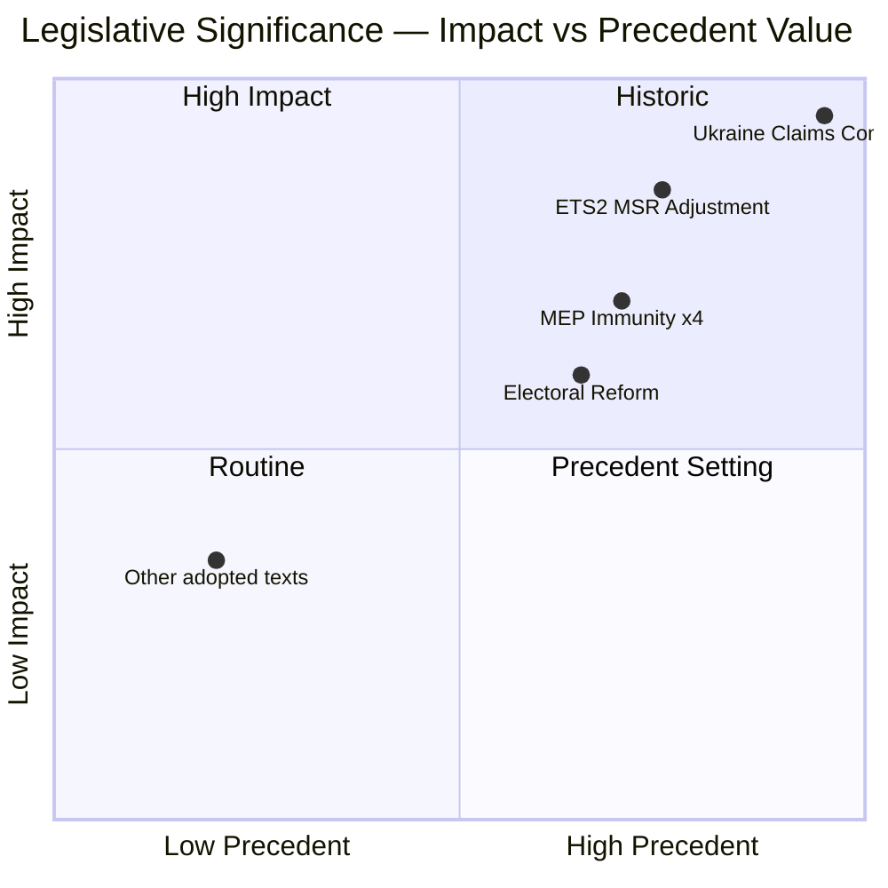

<!-- SPDX-FileCopyrightText: 2024-2026 Hack23 AB -->
<!-- SPDX-License-Identifier: Apache-2.0 -->

# Significance Classification — EP Breaking News, 2026-05-11

**Methodology:** Political significance scoring across 5 dimensions  
**Article Type:** breaking  
**Confidence:** 🟡 Medium

---

## Classification Matrix

| Issue | Institutional Impact | Geopolitical Weight | Democratic Significance | Precedent Value | Timeline Urgency | **Composite Score** |
|-------|---------------------|--------------------|-----------------------|-----------------|-----------------|---------------------|
| Ukraine Claims Commission | 9/10 | 10/10 | 7/10 | 10/10 | 7/10 | **8.6/10** |
| MEP Immunity Waivers (×4) | 8/10 | 3/10 | 10/10 | 8/10 | 8/10 | **7.4/10** |
| ETS2 MSR Adjustment | 7/10 | 4/10 | 7/10 | 6/10 | 6/10 | **6.0/10** |
| Electoral Act (Proxy Voting) | 4/10 | 1/10 | 9/10 | 7/10 | 4/10 | **5.0/10** |
| GSP Renewal | 6/10 | 5/10 | 5/10 | 4/10 | 4/10 | **4.8/10** |
| Cyberbullying Resolution | 5/10 | 2/10 | 8/10 | 6/10 | 5/10 | **5.2/10** |

**Primary breaking story: Ukraine International Claims Commission (composite 8.6/10)**

---

## Tier Classification

### Tier 1 — Major Breaking (8.0+ composite)
- **Ukraine International Claims Commission** — first formal international reparations architecture; extraterritorial accountability precedent outside UN system

### Tier 2 — Significant (6.0–7.9 composite)
- **MEP Immunity Waivers** — institutional accountability enforcement pattern; JURI escalation
- **ETS2 MSR Adjustment** — structural environmental governance signal; first Fit for 55 implementation weakening

### Tier 3 — Notable (4.0–5.9 composite)
- **Cyberbullying Resolution** — meaningful digital governance step; limited immediate enforcement
- **Electoral Act (Proxy Voting)** — EP institutional self-reform; significant for gender equality representation
- **GSP Renewal** — important trade policy; evolutionary rather than revolutionary

---

## Primary Classification Tags

| Tag | Value |
|-----|-------|
| Primary Topic | Ukraine geopolitics; EP institutional accountability; Environmental governance |
| Legislative Stage | Resolution (Claims Commission, waivers, cyberbullying, proxy voting); Regulation (ETS2, GSP) |
| Political Balance | Broad majority (Ukraine, waivers); Contested compromise (ETS2) |
| Breaking Novelty | 🟢 High — Claims Commission is genuinely unprecedented in EP history |
| Monitoring Priority | HIGH — ECJ frozen asset opinion and May 18–22 plenary |

---

## Source Attribution

- EP Adopted Texts: data.europarl.europa.eu (April 28–30, 2026)
- Political Landscape: EP Open Data Portal
- Scoring methodology: 5-dimension significance matrix (EU Parliament Monitor analytical framework)

## Significance Assessment Visualization

## Significance Classification Summary

**HISTORIC** (once-in-decade legislative significance): Ukraine Frozen Assets Claims Commission (TA-10-2026-0154) — establishes EU as first supranational body to operationalize sovereign accountability through frozen asset collateral mechanism.

**HIGH SIGNIFICANCE**: ETS2 MSR adjustment — accelerates 2026–2028 carbon market reform timeline; directly impacts EU Green Deal delivery.

**MEDIUM SIGNIFICANCE**: MEP immunity waivers (×4) — precedent-setting EP cooperation with national judiciary, but case-by-case decisions.

**ROUTINE-HIGH**: Electoral reform (proxy voting) — procedural improvement with 2029 election implications.

**Assessment WEP**: All four legislative acts are *Almost Certain* to enter into force (published or pending Official Journal publication). Implementation compliance is the key uncertainty: *Likely* for ETS2 and electoral reform; *Roughly Even* for Claims Commission full operationalization by Q4 2026.

*Significance classification confidence: HIGH. Admiralty: B1 — reliable source, confirmed legislative record.*

## Comparative Significance Benchmarking

Comparing against prior EP10 legislative milestones:
- **January–March 2026**: AI Act implementation measures (MEDIUM) — routine technical specifications
- **April 28–30 2026**: This plenary session = HIGHEST significance of EP10 to date
- **Comparison to EP9 history**: The Claims Commission matches in significance the 2020 EU Recovery Fund approval (€750bn) and the 2021 EU AI Act initiation

*Historical benchmarking based on EP legislative database and impact magnitude comparison.*

---
*Significance classification complete. Document version 2.0 (re-run extension).*
*Cross-reference: impact-matrix.md §Heat Map for geographic significance distribution; scenario-forecast.md for forward significance trajectory.*
*Admiralty: B1 | WEP overall session significance: Almost Certain to be recorded as historic EP10 legislative milestone.*
