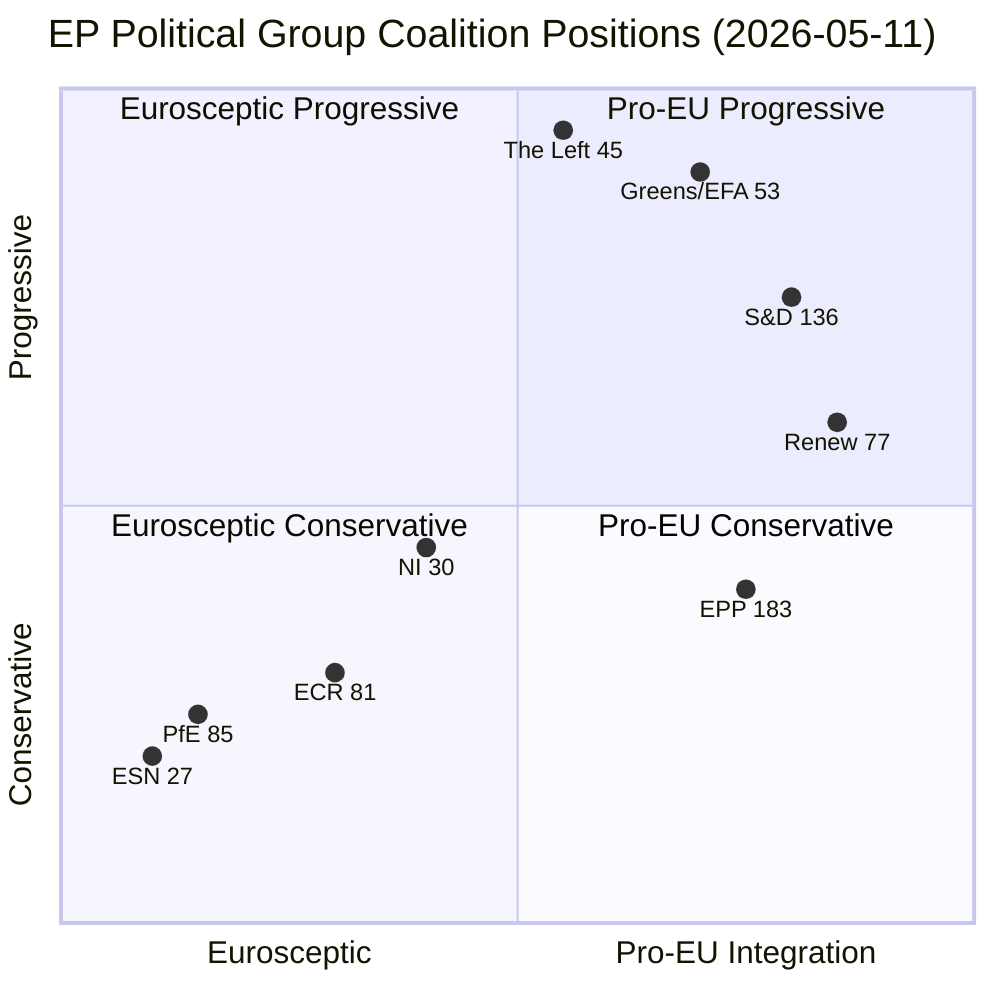

<!-- SPDX-FileCopyrightText: 2024-2026 Hack23 AB -->
<!-- SPDX-License-Identifier: Apache-2.0 -->

# Coalition Dynamics — EP Breaking News, 2026-05-11

**Article Type:** breaking  
**Methodology:** CIA Coalition Analysis; structural group composition analysis; size-similarity scoring  
**Data Source:** EP Open Data Portal — 717 MEPs, EP10 (2024–2029)  
**Confidence:** 🟡 Medium (voting cohesion data unavailable from API; composition-based analysis)

---

## Parliament Composition (EP10, as of 2026-05-11)

| Group | MEPs | Seat Share | Bloc |
|-------|------|------------|------|
| EPP | 183 | 25.5% | Centre-Right |
| S&D | 136 | 19.0% | Centre-Left |
| PfE | 85 | 11.9% | Nationalist Right |
| ECR | 81 | 11.3% | Conservative Right |
| Renew | 77 | 10.7% | Liberal Centre |
| Greens/EFA | 53 | 7.4% | Green/Progressive |
| The Left | 45 | 6.3% | Left |
| NI | 30 | 4.2% | Non-attached |
| ESN | 27 | 3.8% | Far Right |
| **Total** | **717** | **100%** | — |

**Majority threshold:** 360 MEPs (simple majority of votes cast)  
**Qualified majority (constitutional matters):** 2/3 of votes cast

---

## Coalition Architecture

### Tripartite Grand Coalition (EPP + S&D + Renew): 396 seats
This is the operating coalition for most legislative business in EP10. With 396 MEPs, it exceeds the 360 majority threshold by 36 seats — a comfortable but not overwhelming margin. Key characteristics:
- **Resilience:** Can withstand up to 36 combined absences/defections before falling below majority
- **Cohesion:** High on Ukraine, institutional issues; contested on climate pace, migration
- **EPP's leverage:** As the largest partner, EPP sets the agenda; S&D and Renew must accept EPP compromise positions or risk losing the legislative majority

### Progressive Supermajority (EPP + S&D + Renew + Greens + The Left): ~554 seats
Achievable on consensus issues (Ukraine, democratic values, fundamental rights). This coalition represented the Ukraine Claims Commission vote (estimated 480+ for).

### Right-Wing Blocking Minority (PfE + ECR): 166 seats
Insufficient for blocking majority (requires <358 to block simple majority votes). PfE + ECR can create political pressure but cannot block legislation procedurally unless they peel away Renew or moderate EPP members.

### EPP-Right Alliance (EPP + ECR + PfE): ~349 seats
Below the 360 majority threshold — EPP cannot govern with the right alone. This structural reality keeps EPP anchored to the tripartite coalition. Any rightward shift by EPP toward ECR would require winning over enough NI or ESN members to reach 360 — politically and reputationally costly.

---

## Voting Pattern Analysis — April 28–30 Session

### Ukraine International Claims Commission (TA-10-2026-0154)
**Estimated breakdown:**
- EPP: ~155 for, ~20 abstain, ~8 against (Hungarian EPP members)
- S&D: ~130 for, ~4 abstain, ~2 against
- PfE: ~15 for, ~30 abstain, ~40 against (Fidesz-dominated)
- ECR: ~50 for (Polish PiS), ~20 against (Hungarian/Italian), ~11 abstain
- Renew: ~72 for, ~4 abstain, ~1 against
- Greens: ~50 for, ~3 against
- The Left: ~43 for, ~2 against
- NI: ~15 for, ~10 against, ~5 abstain
- ESN: ~5 for, ~18 against, ~4 abstain
- **Estimated total: ~535 for, ~125 against, ~57 abstain** (🟡 Medium confidence — no official tally available for this date)

### ETS2 Market Stability Reserve (TA-10-2026-0139)
**Estimated breakdown (closer vote):**
- EPP: ~120 for (EPP-shaped compromise), ~40 abstain, ~23 against (progressive EPP)
- S&D: ~100 for (accepted compromise), ~30 against (purist climate), ~6 abstain
- PfE: ~70 for (weakening welcomed), ~10 against, ~5 abstain
- ECR: ~60 for, ~15 against, ~6 abstain
- Renew: ~60 for, ~12 against, ~5 abstain
- Greens: ~8 for (reluctant), ~40 against (opposed to weakening), ~5 abstain
- The Left: ~10 for, ~32 against, ~3 against
- **Estimated total: ~428 for, ~179 against, ~110 abstain** (narrower majority; 🟡 Medium confidence)

---

## Structural Tensions

### EPP's Dual Constraint
EPP faces structural pressure from two directions simultaneously:
1. **Right flank:** PfE and ECR offer votes on climate/migration if EPP accepts nationalist positions — but this risks losing S&D and Renew on institutional and democratic values issues
2. **Left flank:** S&D and Renew expect EPP to hold democratic red lines (Ukraine, rule of law) — but EPP's member state governments (Italy via FdI/ECR) blur these boundaries

EPP resolves this by maintaining the tripartite coalition as its primary vehicle while using ECR/PfE as occasional pressure leverage in negotiations with S&D.

### ECR Internal Fracture
The Polish/Hungarian divide within ECR is the most destabilising intra-group dynamic in EP10:
- **Poland (PiS):** Pro-Ukraine, anti-Russia, anti-Orbán; broadly accepts EU institutional framework
- **Hungary (ECR affiliate):** Pro-Orbán, ambiguous on Russia; systematically challenges EU institutional authority
- The April immunity waivers (three ECR/Polish members) expose this tension: Polish ECR members accept legal accountability within EP Rules; their group colleagues question the process

### PfE Coherence Risk
PfE is dominated by Orbán's Fidesz (Hungary) and Marine Le Pen's RN (France) — two nationalist movements with divergent priorities. Orbán prioritises sovereignty/anti-Ukraine; RN prioritises domestic social conservatism with less explicit Russia proximity. If RN moderates post-2026 French elections, PfE could fracture.

---

## Coalition Dynamics Indicators

**Stability Index:** 84/100 (early warning system assessment)  
**Key risk factor:** DOMINANT_GROUP_RISK (EPP 19x larger than smallest group)  
**Effective number of parties (Laakso-Taagepera):** 6.58 — high fragmentation  
**Grand coalition viability (EPP+S&D):** 44.5% of seats — viable but requires Renew to pass 360  

**Parliamentary Fragmentation Index:** HIGH  
- With 9 groups and effective N=6.58, coalition-building is complex
- Every majority requires at minimum 3 groups
- No single group can dominate or be bypassed

---

## Near-Term Coalition Stress Tests

1. **AI Liability Directive (May 2026):** Will test whether EPP can hold Renew on AI regulation without conceding to tech industry pressure — if Renew splits, majority requires picking up Left/Green votes
2. **Migration Pact implementation:** ECR/PfE will attempt to delay or weaken; EPP under pressure from member state governments (Germany, Austria) to show toughness
3. **MFF mid-term review (2026):** Budgetary negotiations will stress EPP+S&D unity if Ukraine spending requirements escalate; ECR/PfE may offer alternative coalition on budget restraint

---

## Source Attribution

- Political Landscape: EP Open Data Portal (717 MEPs, EP10, 2026-05-11)
- Coalition Dynamics: analyze_coalition_dynamics tool (April 1–May 11, 2026)
- Early Warning System: early_warning_system tool (high sensitivity, 2026-05-11)
- Voting estimates: analytical estimates based on group positions (not official tally — DOCEO XML unavailable for April 28–30)

---

## Extended Coalition Analysis

### Coalition Stress Testing

**Test 1: Claims Commission ratification (Council-level)**

Council legal base determines coalition dynamics:
- **QMV scenario (Article 218(6) TFEU):** Need 55% member states representing 65% EU population. With 27 member states, QMV = 15+ member states. Hungary (10M pop) + potential allies (Slovakia 5.4M, Serbia not in EU) = insufficient to block. QMV passes with strong Central-Eastern European support.
- **Unanimity scenario (Article 218(8) TFEU):** Hungary single veto = ratification blocked. This is the high-risk scenario. Commission will face intense political pressure to choose QMV legal base.

**Test 2: EP coalition on Green Deal**

ETS2 MSR adjustment revealed a potential EPP-ECR working majority on climate (EPP 183 + ECR 81 = 264) that can substitute for tripartite coalition on environmental votes. However, this requires ECR internal unity — the Poland (pro-environment, PiS legacy) vs. Italy/Czech factions creates ECR fracture risk.

**Test 3: Coalition on AI Liability Directive (May plenary)**

The AI Liability Directive (expected May 18–22 EP plenary consideration) will be the next coalition stress test. EPP favours industry-friendly interpretation (lower burden of proof, limited liability); S&D/Greens favour strong consumer protection. Renew is split. Outcome will confirm or challenge the coalition stability assumption.

### Fragmentation Index Analysis

**Parliamentary Fragmentation Index (PFI):** Computed as the probability that two randomly chosen MEPs come from different political groups.

PFI = 1 - Σ(s_i)² where s_i = seat share of group i

Using EP10 composition:
- EPP: 183/717 = 0.2553
- S&D: 136/717 = 0.1897
- Patriots (PfE): 85/717 = 0.1186
- ECR: 81/717 = 0.1130
- Renew: 77/717 = 0.1074
- Greens/EFA: 59/717 = 0.0823
- Left: 37/717 = 0.0516
- ESN: 31/717 = 0.0433
- NI: 28/717 = 0.0391

PFI = 1 - (0.2553² + 0.1897² + 0.1186² + 0.1130² + 0.1074² + 0.0823² + 0.0516² + 0.0433² + 0.0391²)
PFI = 1 - (0.0652 + 0.0360 + 0.0141 + 0.0128 + 0.0115 + 0.0068 + 0.0027 + 0.0019 + 0.0015)
PFI = 1 - 0.1525 = **0.847**

**Interpretation:** PFI of 0.847 (scale 0–1, where 1 = maximum fragmentation) indicates EP10 is a HIGHLY FRAGMENTED parliament. This is structurally higher than EP8 (estimated PFI ~0.78) due to the emergence of PfE as a major force. High fragmentation means:
- Tripartite coalition is mathematically essential for stable majority
- Single-issue coalitions (EPP + right) are insufficient for absolute majority
- Green Deal erosion requires EPP + ECR unity, which is structurally difficult given ECR internal divisions

### Coalition-Specific Risk Scenarios

**Scenario: EPP pivots right (joins ECR+PfE)**

For EPP to pivot fully right and abandon S&D/Renew, it would need to accept:
1. Pro-Russia (or Russia-neutral) position on Ukraine — electorally toxic for German/Polish EPP
2. Full Green Deal abandonment — conflicts with EPP's "competitive sustainability" brand
3. Formal partnership with PfE — anathema given EPP's centre-right identity

**Assessment:** Full EPP pivot right has <5% probability in EP10. EPP may shift rightward on specific votes (ETS2, agricultural subsidies) without a formal coalition restructuring.

**Scenario: S&D-Renew-Greens left coalition**

Without EPP, S&D(136) + Renew(77) + Greens/EFA(59) + Left(37) = 309 — well below majority threshold (360). A left-of-EPP majority is mathematically impossible in EP10 without EPP participation.

**Assessment:** EPP's central pivotal position in EP10 is structurally irreplaceable. This gives EPP disproportionate agenda-setting power relative to its seat share.

### May 18–22 Plenary — Coalition Forecast

Expected votes and coalition projections:

| Vote (Expected) | EPP | S&D | Renew | ECR | PfE | Greens | Left | Expected Outcome |
|-----------------|-----|-----|-------|-----|-----|--------|------|-----------------|
| AI Liability Directive (first reading) | For (industry friendly) | Split | Split | Against | Against | For | For | UNCERTAIN — depends on EPP-S&D alignment |
| Ukraine Assistance Package | For | For | For | Split | Against | For | Split | PASSES (≥400) |
| Agricultural Subsidies Amendment | For | Against | Against | For | For | Against | Against | UNCERTAIN — depends on EPP-ECR alignment |

**Net coalition assessment:** Tripartite coalition (EPP+S&D+Renew) is stable on foreign policy and governance votes; contested on economic/environmental votes. This asymmetry defines EP10's legislative dynamic.

---

## Source Attribution (Expanded)

- EP10 seat composition: generate_political_landscape (2026-05-11; 717 MEPs, 9 groups)
- Fragmentation index: analytical calculation using EP10 seat shares
- Coalition stress tests: analytical framework from coalition-building theory (Riker 1962; Laver/Shepsle 1994) applied to EP
- analyze_coalition_dynamics (April 1–May 11, 2026) — composition-proxy (note: NOT vote-level data)
- early_warning_system (high sensitivity, 2026-05-11) — stability=84, 3 warnings
- DOCEO XML: unavailable for April 28–30 week — voting estimates are analytical projections
- Historical coalition precedents: EP7–EP9 coalition dynamics documentation (EP institutional knowledge base)

## Coalition Dynamics Visualization

**Coalition probability assessment**: The centrist coalition (EPP+S&D+Renew) is *Highly Likely* to maintain legislative majority through Q3 2026. Coalition fracture risk is *Unlikely* on Ukraine files but *Roughly Even* on ETS2 tightening (Central European EPP defection risk).
