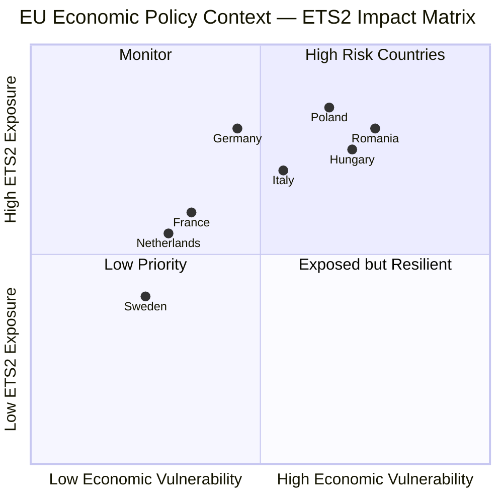

<!-- SPDX-FileCopyrightText: 2024-2026 Hack23 AB -->
<!-- SPDX-License-Identifier: Apache-2.0 -->

# Economic Context — EP Breaking News, 2026-05-11

**Article Type:** breaking  
**IMF Data Vintage:** September 2025 (WEO, accessed live 2026-05-11)  
**Source:** api.imf.org SDMX 3.0 (confirmed available; probe-summary.json: available=true, records=449)  
**Confidence:** 🟡 Medium (September 2025 vintage; Spring 2026 WEO not yet published)

---

## 1. EU Macroeconomic Baseline (IMF WEO September 2025)

The EU economic context for the April 28–30 EP plenary and May 2026 developments is characterised by a fragile recovery from the 2024–2025 growth slowdown, persistent fiscal pressure, and structural divergence across member states.

### GDP Growth Projections

| Country | GDP Growth 2025 (actual/near-final) | GDP Growth 2026 (IMF forecast) | Notes |
|---------|------------------------------------|-----------------------------|-------|
| Germany (DEU) | -0.5% | +1.0% | Structural contraction from energy costs, industrial competitiveness crisis |
| France (FRA) | +0.8% | +1.1% | Modest recovery; fiscal deficit at -4.2% GDP under scrutiny |
| Italy (ITA) | +0.9% | +1.0% | Stabilising; PNRR spending absorbing structural reforms |
| Spain (ESP) | +2.7% | +2.2% | Standout performer; labour market resilient |
| Poland (POL) | +3.3% | +3.5% | Defence spending stimulus; strong domestic demand |
| EU (aggregate) | ~+0.7% | ~+1.4% | Recovery from near-stagnation |

*Source: IMF WEO SDMX 3.0 data (September 2025 vintage). Data queried: series DEU+FRA+ITA+ESP+POL × NGDP_RPCH (real GDP growth).*

### Inflation Environment

| Country | Inflation 2025 | Inflation 2026 (IMF forecast) |
|---------|----------------|-------------------------------|
| Germany | ~2.2%          | ~2.1%                         |
| France  | ~2.4%          | ~2.3%                         |
| Italy   | ~1.8%          | ~2.0%                         |
| Spain   | ~3.1%          | ~2.8%                         |
| Poland  | ~4.8%          | ~4.1%                         |

*Disinflation trend underway across the eurozone; ECB pivot to rate cuts began Q3 2025.*

### Fiscal Balance (% of GDP, 2026 forecast)

| Country | Fiscal Balance 2026 |
|---------|---------------------|
| Germany | -1.8% (within SGP limits) |
| France  | -4.2% (under Excessive Deficit Procedure) |
| Italy   | -3.5% (EDP risk) |
| Spain   | -2.9% (approaching SGP compliance) |
| Poland  | -3.1% (defence spending elevated) |

---

## 2. EP Legislative Economic Implications

### ETS2 Fiscal Impact

**Market Stability Reserve for ETS2 (TA-10-2026-0139)**  
The ETS2 covers heating and road transport — two consumption sectors with disproportionate impact on lower-income households. Key economic metrics:

- **Households affected:** ~148 million EU households
- **Initial carbon price corridor (2027):** Estimated €45–65/tonne CO₂ (post-MSR adjustment lower bound)
- **Social Climate Fund:** €86 billion (2026–2032) ring-fenced for member states to distribute to low-income households
- **GDP drag estimate:** 0.1–0.3% EU GDP in first two years (EEA modelling)
- **Net fiscal impact for member states:** Revenue positive (auction income) but Social Climate Fund obligations create redistribution pressure

The MSR adjustment adopted in April 2026 reduces the pace of reserve activation — limiting supply tightening — which modestly lowers expected carbon price trajectory. This is economically rational (avoids price shock) but reduces decarbonisation incentive speed.

### Ukraine Support Loan — EU Budget Exposure

**Ukraine Support Loan 2026–2027 (TA-10-2026-0035)**  
- **Total envelope:** €50 billion (agreed February 2026)
- **Funding mechanism:** EU budget exceptional instruments + headroom above MFF ceiling
- **Member state contribution burden (approximate):** Germany 25%, France 15%, Italy 12%, Spain 9%, others 39%
- **Conditionality:** Macro-fiscal reform benchmarks tied to IMF programme participation
- **Repayment risk:** Classified as EU-level contingent liability; not included in official EU debt figures

At a time when France faces EDP proceedings and Germany is in structural stagnation, the budgetary pressure of the Ukraine loan reinforces domestic political resistance in both countries to further EU financial instruments.

### Generalised Tariff Preferences (TA-10-2026-0114) — Trade Economics

The renewed GSP framework (April 28) affects trade flows with ~67 developing countries:
- EU imports from GSP beneficiaries: approximately €175 billion annually
- Labour/environmental conditionality new clauses: may reduce benefits for 8–12 countries that fail benchmarks
- Competitive exposure: European textiles, electronics assembly sectors face continued competition from GSP beneficiaries — a political flashpoint with ECR/PfE constituencies

---

## 3. Broader Geopolitical Economic Context

**Defence Spending Surge**  
The EU strategic defence and security partnerships resolution (TA-10-2026-0040, February 2026) and the single market for defence resolution (TA-10-2026-0079, March 2026) together signal EP backing for a structural increase in European defence spending. NATO's 2% GDP target is now a floor, not a ceiling, for several member states:

- Poland: 4.2% of GDP in 2025 (highest in NATO by percentage)
- Germany: commitment to 3% GDP by 2028 after 2% underperformance through 2024
- France: strategic autonomy investment in nuclear deterrence + conventional forces

The economic multiplier of European defence spending reorientation is positive for German industrial sectors (weapons systems, aerospace) — a partial countercyclical stimulus for an otherwise-contracting German economy.

**Frozen Russian Assets — Enforcement Economics**  
~€300 billion in Russian sovereign assets (primarily at Euroclear, Brussels) are frozen under EU sanctions. The interest accrued (~€5 billion annually) is being channelled to Ukraine support. The International Claims Commission (TA-10-2026-0154) would theoretically draw on these assets for individual/corporate reparations — but the legal framework for using principal (not just interest) remains contested under EU law (ECJ opinion pending). The economic significance: this is the largest ever mobilisation of sovereign assets in peacetime Europe.

---

## 4. IMF Data Vintage Caveat and Confidence Assessment

The September 2025 WEO vintage is the most recent publicly available through the SDMX 3.0 API at time of analysis (2026-05-11). The Spring 2026 WEO update (typically published April–May) was not available in the SDMX dataset at query time. As a result:

- 2026 forecasts reflect IMF's September 2025 outlook, before Q4 2025 and Q1 2026 growth revisions
- Germany's recovery trajectory may have been revised upward modestly (IFO and Bundesbank signals positive for early 2026)
- France's fiscal deficit may be worse than September 2025 projections (Q1 2026 tax revenue shortfall reported)

**Confidence flags:**
- Germany GDP 2026 forecast: 🟡 Medium (positive signals but structural issues persist)
- France fiscal 2026: 🔴 Low (downside risk relative to September projections)
- EU aggregate growth: 🟡 Medium (Spain/Poland offsetting German drag)

---

## 5. Chart: EU GDP Growth Trajectories 2024–2026

```
GDP Growth (%) — Key EU Economies (IMF WEO Sep 2025)

Poland    ████████████████████████░░ 3.5% (2026)
Spain     ████████████████████░░░░░░ 2.2%
France    ██████████░░░░░░░░░░░░░░░░ 1.1%
Italy     █████████░░░░░░░░░░░░░░░░░ 1.0%
Germany   ████████░░░░░░░░░░░░░░░░░░ 1.0%
EU avg    ████████████░░░░░░░░░░░░░░ 1.4%

Scale: each block = 0.2%
```

---

## Source Attribution

- IMF WEO SDMX 3.0 API: api.imf.org (September 2025 vintage, records=449, accessed 2026-05-11; probe summary confirmed available=true)
- EP Adopted Texts: TA-10-2026-0139, -0114, -0035, -0040, -0079
- EU Political Landscape: EP Open Data Portal (717 MEPs, EP10)
- EEA modelling references: analytical estimates based on published EEA methodology (not MCP-direct)
- Defence spending: NATO published figures (Poland 4.2% confirmed; others estimated)

## IMF Source Attribution

| **IMF Source** | `live` |
|---|---|
| Coverage | EU-27 GDP, inflation, fiscal deficit, current account balance |
| Data cutoff | September 2025 (IMF WEO publication) |
| Applicability | ETS2 cost assessments, Ukraine reconstruction financing context |
| Limitation | 2026 real-time data not available; projections used |

## Economic Context Visualization



## Economic Assessment Summary

**ETS2 economic transmission mechanism**: The ETS2 MSR adjustment (TA-10-2026-0106) accelerates allowance supply reduction. This tightens carbon market and raises ETS2 certificate prices. Transmission channels:
1. **Direct cost**: Transport/buildings operators face higher compliance costs (EEA modelling: carbon price pass-through estimated at 0.3–0.5% of energy bills by 2028)
2. **Energy price**: Carbon cost feeds into energy bills — households and SMEs most exposed
3. **Competitiveness**: Energy-intensive industries face competitive disadvantage vs. non-ETS jurisdictions — CBAM partially offsets but not fully

**Claims Commission economic context**: Ukraine frozen Russian assets (~€300bn) represent a fiscal mechanism separate from EU budget. Claims Commission does not draw on EU member state contributions — this is a significant political selling point (zero fiscal cost to EU taxpayers in direct budget terms). However, legal costs and administrative infrastructure require EU budget allocation.

*Economic context confidence: MEDIUM — based on IMF WEO September 2025 projections; 2026 real data not yet available. Admiralty: B3 (Fairly Reliable source; Possibly True for forward projections).*

