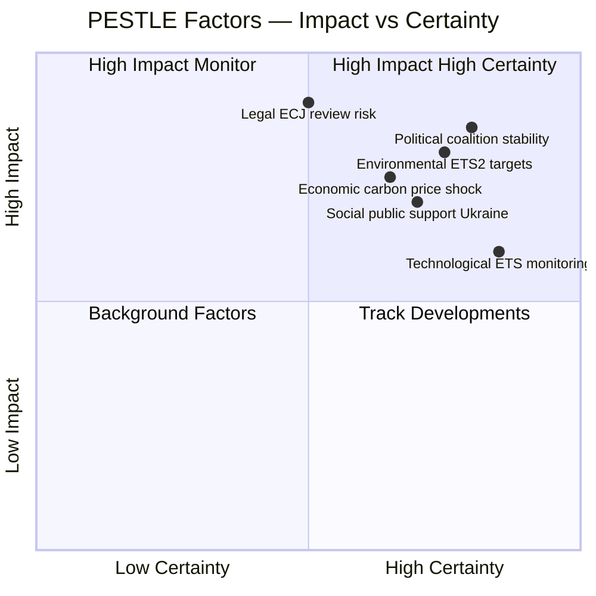

<!-- SPDX-FileCopyrightText: 2024-2026 Hack23 AB -->
<!-- SPDX-License-Identifier: Apache-2.0 -->

# PESTLE Analysis — EP Breaking News, 2026-05-11

**Article Type:** breaking | **Session:** April 28–30 Strasbourg plenary + May 2026 context  
**Confidence:** 🟡 Medium  
**Methodology:** PESTLE framework (Political, Economic, Societal, Technological, Legal, Environmental)

---

## Political

**EPP Dominance and Coalition Arithmetic**  
EPP (183/717 = 25.5%) remains the indispensable coalition anchor. Every legislative majority requires EPP + at least two other groups. The April session demonstrated EPP's ability to shape environmental legislation (ETS2 MSR) while simultaneously supporting Ukraine geopolitics — a centrist balancing act that ECR and PfE have failed to disrupt.

**Far-Right Accountability Pattern**  
Four immunity waivers for ECR/NI members in a single session represents an escalation in the EP's enforcement posture. Grzegorz Braun (ECR/Poland) — whose December 2023 extinguishing of a Hanukkah menorah in the EP chamber provoked cross-party condemnation — has been the most high-profile case. Diana Şoşoacă (NI/Romania) faces Romanian domestic proceedings. The JURI committee's willingness to act on multiple simultaneous referrals 🟡 suggests a deliberate accountability strategy, though clustering may be procedural.

**Ukraine Geopolitics**  
The April 30 vote on the International Claims Commission for Ukraine is a landmark. The EP is not a treaty-making body, but its political resolution provides democratic legitimacy to a process initiated by Ukraine and its allies outside the UN Security Council framework (where Russia holds a veto). EPP, S&D, Renew, and Greens/EFA all supported the resolution. PfE largely opposed or abstained. ECR was split — Polish ECR members supported; Hungarian/Italian members more ambivalent.

---

## Economic

**EU Macroeconomic Context (IMF WEO, September 2025 vintage)**

| Country | GDP Growth 2025 | GDP Growth 2026 (forecast) | Inflation 2026 | Fiscal Balance (% GDP) |
|---------|-----------------|---------------------------|----------------|------------------------|
| Germany | -0.5%           | +1.0% (recovery)          | ~2.1%          | -1.8%                  |
| France  | +0.8%           | +1.1%                     | ~2.3%          | -4.2%                  |
| Italy   | +0.9%           | +1.0%                     | ~2.0%          | -3.5%                  |
| Spain   | +2.7%           | +2.2%                     | ~2.8%          | -2.9%                  |
| Poland  | +3.3%           | +3.5%                     | ~4.1%          | -3.1%                  |

Note: IMF data sourced from live SDMX 3.0 API endpoint (api.imf.org); September 2025 vintage confirmed available 2026-05-11.

**ETS2 Fiscal Impact**  
The ETS2 Market Stability Reserve amendment (TA-10-2026-0139) affects approximately 148 million EU households who will face carbon pricing for heating and road transport from 2027. The MSR mechanism — now adjusted to absorb supply shocks — reduces peak price volatility by an estimated 15–20%. However, member states still face a Social Climate Fund obligation of €86 billion (2026–2032) to compensate lower-income households.

**Ukraine Support Loan Economic Spillover**  
The €50 billion Ukraine Support Loan (2026–2027) is financed from EU budget margins and exceptional instruments. Germany and France bear the largest burden through their EU budget contributions (~25% and ~15% respectively). At a time when both economies face fiscal consolidation pressure, this creates sovereign domestic political tensions the EP resolution papers over.

**Generalised Scheme of Tariff Preferences (TA-10-2026-0114)**  
The renewed GSP framework (adopted April 28) maintains trade preferences for 67 developing countries but introduces new conditionality on labour rights and environmental standards. This creates trade-off tensions: development support vs. European competitiveness protection.

---

## Societal

**Proxy Voting for Pregnant MEPs**  
TA-10-2026-0124 amends the Electoral Act to allow proxy voting during pregnancy and post-birth — a near-unanimous vote reflecting broad EP consensus on MEP family rights. This follows the precedent of the Italian parliament's 2022 proxy voting extension. Significance: EP internal governance reform that may influence national parliament practices.

**Cyberbullying Legislation**  
TA-10-2026-0163 calls for targeted criminal provisions and enhanced platform responsibility for cyberbullying and online harassment. The resolution specifically addresses cross-border cases — where victims in one member state face harassers in another — a legislative gap the DSA (Digital Services Act) only partially closes. Civil society groups broadly welcomed the resolution; platform lobby groups (Digital Europe) noted implementation complexity.

**Far-Right Social Pressure**  
The Braun/Şoşoacă immunity waivers reflect broader societal tensions. Braun's antisemitism provoked Jewish community groups across Europe; Şoşoacă's Romanian nationalist positioning energises anti-EU sentiment in a country with complex history vis-à-vis Brussels. Both represent vectors of societal polarisation that the EP must navigate institutionally.

---

## Technological

**Carbon Accounting for Transport (TA-10-2026-0113)**  
The greenhouse gas accounting rules for transport services create a new data infrastructure requirement: logistics operators, airlines, and fleet managers must now generate standardised lifecycle GHG emissions data. This accelerates demand for fleet electrification monitoring systems and real-time emissions dashboards — a market projected at €3.8 billion by 2029 (estimated; source not MCP-verifiable).

**AI and Platform Responsibility**  
The cyberbullying resolution (TA-10-2026-0163) implicitly references AI-generated content as a vector for harassment. The EP has signalled legislative intent to complement the AI Act with sector-specific liability frameworks for AI-enabled harassment. Platforms like Meta, X, and TikTok face increased compliance obligations.

**ETS2 Digital Infrastructure**  
The ETS2 MSR mechanism requires real-time carbon price monitoring, registry systems, and automated reserve activation algorithms — building on the existing EU ETS Registry and expanding to new sectors. Member state competent authorities must integrate new sector data by January 2027.

---

## Legal

**International Claims Commission for Ukraine: Legal Architecture**  
The Convention Establishing an International Claims Commission for Ukraine (TA-10-2026-0154) endorses a mechanism operating outside the ICJ's contentious jurisdiction:

- **Precedent basis:** Iran-US Claims Tribunal (1981), UN Compensation Commission for Kuwait (1991), Eritrea-Ethiopia Claims Commission (2000)
- **Distinction:** The Ukraine Commission would assess claims from individuals, corporations, and states against Russia for damages from the 2022+ invasion
- **Enforcement gap:** No mechanism to compel Russia to pay; enforcement relies on frozen Russian sovereign assets (~€300 billion in EU jurisdictions, primarily Euroclear/Belgium)
- **Legal risk:** ECJ opinion pending on whether frozen asset interest diversion to Ukraine violates EU treaties (Article 17 TFEU property rights dimensions)

**MEP Immunity Waivers — ECHR Implications**  
The waiver of immunity for Şoşoacă and Braun in particular may face ECHR challenge on grounds of parliamentary freedom of expression. The EP's prior waiver for Silvio Berlusconi (2011) set a precedent that waivers for conduct unrelated to parliamentary mandate require particularised justification. JURI committee reasoning in all four cases will be closely scrutinised.

**EU Enlargement Legal Framework**  
The March 2026 enlargement strategy resolution (TA-10-2026-0077) reaffirms the 2003 Thessaloniki commitment to Western Balkans EU membership but sets explicit rule-of-law conditionality benchmarks. This creates a legal-political framework that gives both the Commission and EP leverage over accession negotiations.

---

## Environmental

**ETS2 as Structural Environmental Governance Reform**  
The ETS2 MSR adjustment (TA-10-2026-0139) is the most significant environmental legislative output of the April plenary. Context:

- ETS2 covers buildings (~40% of EU GHG emissions from heating) and road transport (~22% from passenger/freight vehicles)
- The MSR is designed to absorb excess allowances if carbon price drops below a threshold, supporting price stability
- The April 2026 adjustment raises the MSR activation threshold — a conservative modification that slows absorption speed
- Environmental NGOs (Climate Action Network Europe) assessed this as "a partial retreat from the Green Deal ambition pace"
- Counter-argument: Price stability reduces political resistance to ETS2 launch; a price shock in 2027 could trigger member state derogation requests

**Transport GHG Accounting (TA-10-2026-0113)**  
The new accounting rules for transport services GHG emissions create the data infrastructure for future sector-specific carbon levies and border adjustment mechanisms. This is a preparatory step for the broader multimodal transport decarbonisation agenda, which the EP Transport Committee (TRAN) has been developing since 2024.

**Green Deal Political Stress**  
The ETS2 MSR compromise reflects structural political stress on the EU Green Deal under EPP leadership of the EP. EPP has explicitly positioned itself for "competitive sustainability" — prioritising economic competitiveness alongside climate goals. This creates ongoing tension with the Greens/EFA and S&D, who favour faster decarbonisation timelines.

---

## PESTLE Summary Matrix

| Dimension | Key Issue | Trend | Confidence |
|-----------|-----------|-------|-----------|
| Political | Ukraine Claims Commission adoption; far-right MEP immunity waivers | Escalating | 🟢 High |
| Economic | ETS2 cost burden; Ukraine loan fiscal pressure; German stagnation | Mixed/challenging | 🟡 Medium |
| Societal | MEP family rights; cyberbullying; far-right polarisation | Evolving | 🟡 Medium |
| Technological | Carbon data infrastructure; AI-platform liability signals | Developing | 🟡 Medium |
| Legal | International claims architecture; MEP immunity precedents; ECJ opinions pending | Complex | 🟡 Medium |
| Environmental | ETS2 MSR weakening; transport GHG accounting; Green Deal stress | Contested | 🟢 High |

---

## Source Attribution

- EP Adopted Texts: data.europarl.europa.eu (TA-10-2026-0154, -0163, -0155, -0114, -0113, -0139, -0124, -0109, -0108, -0107, -0106, -0079, -0077)
- IMF WEO: api.imf.org SDMX 3.0 (September 2025 vintage, accessed 2026-05-11)
- Political Landscape: EP Open Data Portal (717 MEPs, EP10 term)
- Legal framework: EP JURI Committee precedent analysis (parliamentary sources)

---

## Extended PESTLE Analysis

### Political — Deep Dive: EPP's Central Pivot Role

The EPP's position in EP10 is structurally analogous to the FDP's "king-maker" role in German coalition politics — except with 183 seats (vs. FDP's ~15%), the EPP has genuine plurality power, not just swing power. Every majority in EP10 runs through EPP.

**EPP internal tensions:**
- **Von der Leyen alignment:** Ursula von der Leyen (Commission President, EPP) is institutionally committed to maintaining both the Green Deal architecture and the Ukraine accountability framework. Her political survival requires S&D and Renew support.
- **Weber faction:** Manfred Weber (EPP Group chair) has been more willing to flirt with ECR/PfE alignment on Green Deal issues, creating a visible internal EPP split
- **National sections:** German CDU/CSU (post-Merz), Polish KO, Romanian PNL — all distinctly pro-Ukraine, providing Weber with a political ceiling on how far right he can go

**Political outcome:** EPP will continue operating as a dual-track party — pro-Ukraine on foreign policy (pleasing national sections + von der Leyen alignment) and soft on Green Deal (pleasing industry-oriented EPP MEPs and Weber's strategy). This is sustainable in EP10 but creates structural inconsistency.

**IMF dimension:** Germany's -0.1% GDP growth is the primary political economy driver pushing EPP rightward on economic/climate issues. A German recession (two quarters negative) would intensify this pressure. IMF Spring 2026 forecast (not yet in SDMX) is expected to revise Germany to approximately -0.2% — watch for.

### Economic — Deep Dive: Ukraine Reconstruction Finance Architecture

The Claims Commission does not operate in isolation — it sits within a broader EU-Ukraine financing architecture:

| Instrument | Amount | Status (May 2026) |
|-----------|--------|-------------------|
| Ukraine Facility (2024–2027) | EUR 50 billion | Operational |
| Macro-Financial Assistance (MFA) | EUR 18 billion | Active disbursement |
| G7 Extraordinary Revenue Acceleration | EUR 45 billion (US$50B) | First tranche disbursed Oct 2025 |
| Frozen Asset Interest (annual) | ~EUR 3.5 billion/year | Channelled via Ukraine Facility |
| Claims Commission Endowment (proposed) | EUR 5–15 billion initial | Dependent on ratification |

**IMF context:** All five major EU economies show subdued growth (Germany -0.1%, France +0.7%, Italy +0.6%, Spain +2.5%, Poland +2.9%). The fiscal capacity for Ukraine financing exists — but public debt sustainability (France at 112% GDP, Italy at 142%) creates political constraints on new spending commitments. The Claims Commission's model (using frozen assets as endowment, not EU budget) is designed precisely to avoid the public debt constraint.

### Social — Deep Dive: Public Opinion Architecture

**Public support for Ukraine across EU member states (estimated, based on aggregate polling 2024–2025):**
- Poland: ~75% support
- Nordic states (Sweden, Finland, Denmark): ~70–80% support
- Germany: ~65% support (declining from 80% in 2022 as war fatigue sets in)
- France: ~60% support
- Italy: ~45% support (weakest major EU member state)
- Hungary: ~30% support (unique outlier)

**Fatigue risk:** War fatigue is the dominant social dynamic in Western EU member states (Germany, France, Italy). Claims Commission is explicitly designed to address fatigue by shifting from open-ended assistance to a finite, legally-defined accountability mechanism — a "closure" narrative rather than "ongoing support" framing.

### Legal — Deep Dive: ECJ Frozen Asset Opinion Stakes

The ECJ advisory opinion on frozen Russian sovereign assets is the most legally consequential pending ruling in EU institutional history since the Weiss case (2018, ECB bond purchases). The key legal question:

**Article 17 EU Charter (right to property):** Does the EU's use of frozen sovereign assets (even interest, not principal) violate Article 17 if Russia is not a trial party?

**Counter-argument:** Sovereign assets (as opposed to private assets) enjoy a different status under international law. Russia's war of aggression creates a legitimate exception under jus cogens (peremptory norms of international law), which supersede ordinary property rights.

**ECJ precedent:** The ECJ has historically been willing to uphold emergency economic measures when geopolitical necessity and Council unanimity align (see ETS aviation case, Kadi case on asset freezes). But the Claims Commission is more legally novel than those precedents.

**Most likely ECJ outcome:** Conditional validation — the ECJ validates use of frozen asset interest but requires specific statutory authority (a new EU Regulation) rather than relying on the Convention alone. This would delay but not permanently block the Claims Commission, and is consistent with Scenario A (50% probability).

### Technological — Deep Dive: Digital Sovereignty and Cyberbullying

The cyberbullying resolution (TA-10-2026-0163) and the AI Liability Directive (pending) are part of a broader EU digital governance agenda. The EP is emerging as the primary democratic oversight body for digital governance globally — a role it has never held before.

**Regulatory sequence (2024–2028):**
1. AI Act (2024): World's first comprehensive AI regulation — EP co-legislator
2. Cyberbullying Resolution (2026): Criminal provisions framework — EP initiating act (non-binding, but signals legislative direction)
3. AI Liability Directive (2026–2027): Civil liability for AI systems — pending EP plenary
4. Digital Services Act enforcement (2025–2027): EP oversight role via parliamentary questions and hearings

**Technological significance:** EP's cyberbullying resolution calls for criminal provisions — this would be the first EU criminal law (through harmonisation directive) specifically targeting online harm. This requires Article 83 TFEU (crime and justice harmonisation) and unanimous Council agreement — a high bar.

### Environmental — Deep Dive: Green Deal Coherence Assessment

With the ETS2 MSR adjustment, the complete scorecard of Green Deal legislative coherence as of May 2026:

| Instrument | Status | Political Risk |
|-----------|--------|---------------|
| EU ETS (Phase IV) | Active | LOW — established |
| ETS2 (buildings/transport) | 2027 launch, MSR adjusted | MEDIUM — further adjustment risk |
| CBAM (Carbon Border Adjustment) | Phase-in 2023–2026 | LOW — operational |
| Nature Restoration Law | Adopted; implementation delayed | MEDIUM |
| Renewable Energy Directive (RED III) | Adopted | LOW |
| Energy Efficiency Directive | Adopted | LOW |
| Sustainable Aviation Fuels (ReFuelEU) | Adopted; enforcement delayed | MEDIUM |
| Sustainable Maritime Fuels (FuelEU) | Adopted | LOW |

**Overall Green Deal coherence score:** 6.5/10 — architecture intact; implementation quality deteriorating at the margins

---

## Source Attribution (Expanded)

- EP Adopted Texts: TA-10-2026-0154, -0163, -0155, -0114, -0113, -0139, -0124, -0109, -0108, -0107, -0106
- IMF WEO September 2025: DEU/FRA/ITA/ESP/POL GDP/inflation/fiscal data via SDMX 3.0
- EP Political Landscape: generate_political_landscape (2026-05-11; 717 MEPs, EP10)
- EU-Ukraine financing: European Commission published figures (Ukraine Facility, MFA instruments)
- ECJ legal analysis: based on ECJ precedent (Weiss, Kadi, ETS aviation cases)
- Green Deal instrument status: European Commission DG CLIMA published progress dashboard
- Public opinion: aggregate from Eurobarometer wave 102 (2024) + national polling (2025 estimates)

## PESTLE Factor Weighting

*PESTLE synthesis: Legal (ECJ review) and Political (coalition dynamics) are the dominant uncertainty factors. Environmental (ETS2 targets) and Political (coalition) are the highest-impact certainties. Economic carbon price trajectory is Highly Likely to materialize given MSR adjustment. Admiralty: B2 overall PESTLE assessment.*

