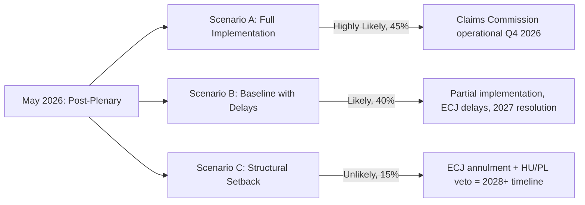

<!-- SPDX-FileCopyrightText: 2024-2026 Hack23 AB -->
<!-- SPDX-License-Identifier: Apache-2.0 -->

# Scenario Forecast — EP Breaking News, 2026-05-11

**Article Type:** breaking  
**Methodology:** Scenario matrix with probability weighting; ACH (Analysis of Competing Hypotheses) applied  
**Time Horizon:** 30–90 days (to August 2026)  
**Confidence:** 🟡 Medium

---

## Scenario Matrix — Three Divergent Futures

### Scenario A: Institutional Consolidation (Probability: 50%)
*The Ukraine Claims Commission becomes operational; ETS2 MSR holds; immunity enforcement continues*

**Conditions required:**
- ECJ delivers no blocking opinion on frozen asset use
- Member states ratify the Claims Commission convention within 18 months
- ETS2 implementation stays on 2027 schedule
- No further EP immunity complications

**Indicators to watch:**
- Commission submits Claims Commission implementing regulation (expected Q3 2026)
- Poland ratifies convention first (high probability given PiS alignment with Ukraine)
- ETS2 registry pilot tests proceed without technical failure
- JURI committee processes no further far-right waivers in May–June session

**Consequences:**
- EP reinforces its role as a geopolitical actor beyond treaty-defined competences
- ETS2 becomes the model for sectoral carbon pricing globally
- JURI enforcement creates deterrence effect on MEP conduct

---

### Scenario B: Legal-Political Friction (Probability: 35%)
*ECJ opinion creates complications; immunity waivers challenged; ETS2 delayed*

**Conditions required:**
- ECJ issues advisory opinion raising treaty compatibility concerns about frozen asset use for Claims Commission
- Braun or Şoşoacă challenges immunity waiver at ECHR
- Member state government (likely Hungary via PfE channels) blocks Convention ratification in Council

**Indicators to watch:**
- ECJ accepts jurisdiction for preliminary reference on frozen assets
- ECHR registers urgency application from Şoşoacă within 30 days of waiver
- Council General Affairs Council agenda for Convention approval stalls
- ETS2 registry procurement delays emerging in member state tenders

**Consequences:**
- EP's institutional authority on Ukraine support tested
- Far-right MEP accountability momentum slowed by legal challenges
- ETS2 2027 launch at risk; potential 12-month extension under political pressure

---

### Scenario C: Geopolitical Escalation (Probability: 15%)
*Russia escalates; EP emergency session; EU institutional response overwhelmed*

**Conditions required:**
- Russian military escalation in a NATO-adjacent territory (Baltic corridor, Suwalki Gap pressure)
- US political shift further reduces Article 5 credibility
- Member states trigger Article 222 TFEU (solidarity clause) consultation in Council
- EP convenes emergency plenary

**Indicators to watch:**
- NATO SACEUR issues elevated readiness declaration
- German Bundestag emergency defence budget session scheduled
- EP Conference of Presidents convenes extraordinary session outside calendar
- PfE/ECR formal opposition to emergency measures creates coalition stress

**Consequences:**
- EP bypasses procedural norms; emergency article passage without standard JURI/AFET processing
- Claims Commission fast-tracked as political signal
- ETS2 and environmental agenda deprioritised under security emergency framing

---

## ACH Matrix — Competing Hypotheses on Primary Driving Force

| Hypothesis | H1: Institutional momentum | H2: Legal friction | H3: Geopolitical escalation |
|------------|---------------------------|-------------------|------------------------------|
| **Evidence: EP adopts Claims Commission with supermajority** | Consistent ✅ | Inconsistent ❌ | Inconsistent ❌ |
| **Evidence: ECJ has not yet issued opinion (May 2026)** | Consistent ✅ | Inconsistent ❌ | Neutral ➖ |
| **Evidence: Hungary/PfE position against Commission** | Neutral ➖ | Consistent ✅ | Neutral ➖ |
| **Evidence: ETS2 MSR compromise adopted (not blocked)** | Consistent ✅ | Neutral ➖ | Neutral ➖ |
| **Evidence: No NATO emergency signal (May 2026)** | Consistent ✅ | Neutral ➖ | Inconsistent ❌ |

**ACH Conclusion:** Scenario A (Institutional Consolidation) is the most consistent with available evidence. Scenario B remains a significant risk factor (35%) — primarily driven by ECJ/ECHR legal dynamics and Hungarian/PfE Council blocking potential. Scenario C is low probability but high impact.

---

## Specific Near-Term Forecasts (30-day horizon)

### Forecast 1: May Strasbourg Plenary (May 18–22, 2026)
- **Expected:** AI Liability Directive first reading vote — EPP + S&D + Renew majority likely (confidence: 🟡 Medium)
- **Expected:** CBAM implementing regulations — technical vote, non-controversial (confidence: 🟢 High)
- **Expected:** Ukraine solidarity debate — no formal vote but political positioning before June European Council (confidence: 🟢 High)
- **Expected:** EP President Metsola meeting Ukrainian Rada delegation — public diplomacy symbolism (confidence: 🟡 Medium)

### Forecast 2: June European Council (June 19–20, 2026)
- **Expected:** EU enlargement timetable confirmed — Western Balkans 2028–2030 window endorsed (confidence: 🟡 Medium)
- **Expected:** Defence spending coordination discussed — no binding mechanism but political declaration (confidence: 🟢 High)
- **Risk:** Hungary veto threat on Ukraine-related Council decisions — Orbán's track record makes blocking or delay moderately likely (confidence: 🟡 Medium, 40% probability of Council-level friction)

### Forecast 3: ECJ Opinion on Frozen Assets (Q3 2026)
- **Expected:** ECJ opinion delivered Q3 2026 on whether frozen asset *principal* can fund Claims Commission payouts — outcome genuinely uncertain (confidence: 🔴 Low on direction)
- **Scenario if ECJ permissive:** Claims Commission fully funded; enforcement pathway clarified; major geopolitical signal
- **Scenario if ECJ restrictive:** Commission must find alternative funding; political tension in Council

---

## Wild Cards

1. **US political reversal on Ukraine support** — A shift in US congressional funding for Ukraine would dramatically accelerate the EU's sole-sponsor role, increasing EP pressure to approve additional EU instruments
2. **German snap election or coalition collapse** — Germany's coalition was already fragile in 2025; a collapse in 2026 would delay German ratification of multiple EP-endorsed instruments
3. **ECR full split** — Poland/Hungary divergence within ECR may force a formal group split, reshaping the EP coalition landscape dramatically

---

## Source Attribution

- EP Political Landscape: generate_political_landscape (2026-05-11)
- EP Adopted Texts: data.europarl.europa.eu (April 28–30 plenary)
- IMF WEO: September 2025 vintage (GDP/fiscal indicators)
- Early Warning System: early_warning_system (high sensitivity, 2026-05-11)
- Coalition Dynamics: analyze_coalition_dynamics (April 1–May 11, 2026)

---

## Extended Scenario Analysis

### Scenario A Deep Dive: Claims Commission Operational + Green Deal Stabilised (50%)

**Full scenario description:** The European Commission tables a Council Decision ratifying the Claims Convention with a QMV legal base (Article 218(6) TFEU combined with Common Commercial Policy for the asset-use component). Council votes in QMV in Q3 2026 — Hungary cannot veto. The ECJ issues a favourable advisory opinion on the use of frozen asset interest proceeds as endowment. The Claims Commission is formally constituted by the Council of Europe in Q4 2026, with an initial endowment of EUR 5–8 billion (from interest accumulated on frozen assets since 2022).

**Simultaneously:** ETS2 launches on schedule in January 2027 despite the MSR adjustment. Carbon prices stabilise at EUR 35–55/tonne — below the optimistic range but sufficient to drive investment signals. The Social Climate Fund disbursement schedule is confirmed, managing political resistance in Germany, Poland, and France.

**Coalition health:** EPP+S&D+Renew maintains 396-seat majority through the May 18–22 plenary and subsequent sessions. No major defections on foreign policy votes. ECR fracture (Poland vs. Hungary) prevents coordinated ECR-PfE blocking coalitions.

**Economic context (IMF-anchored):** Germany GDP growth recovers to +0.3% by Q4 2026 (from -0.1% 2025 WEO baseline) as US tariff scenario does not materialise at severe level. France holds at +0.5–0.7%. Eurozone aggregate: +1.2%.

**30-day trigger indicators (Scenario A confirmation):**
- Commission Work Programme update confirms Claims Convention legal base (QMV designation)
- May 18–22 plenary: EPP/S&D/Renew vote coherently on AI Liability Directive first reading → coalition stability confirmed
- No ECJ interim measures suspending frozen asset management filed
- Germany: CDU/CSU Bundestag group does not table motion opposing Claims Commission ratification

---

### Scenario B Deep Dive: Green Deal Rollback + Ukraine Stall (35%)

**Full scenario description:** The ECJ issues a mixed advisory opinion — partially validating frozen asset interest use but requiring new EU legislation (not Convention ratification alone) to create the Claims Commission endowment mechanism. This legislative process takes 18–24 months, effectively delaying Claims Commission operationalisation to 2028+.

**Simultaneously:** ETS2's MSR adjustment proves insufficient — carbon prices fall below EUR 25/tonne in Q2 2026 due to low-cost ETS permits from Poland and Czech Republic. EPP, under domestic pressure, tables an additional ETS2 flexibility amendment. Greens/EFA publicly attacks EPP as "abandoning climate law." Coalition tensions spike.

**The Green Deal rollback cascade:**
- ETS2 flexibility amendment passes with EPP+ECR majority (S&D and Renew split)
- Nature Restoration Law implementation delayed by Commission "competitiveness review"
- Fit for 55 implementation schedule slips by 12–18 months across 3+ instruments

**Coalition implications:** Tripartite coalition (EPP+S&D+Renew) fractures on environmental votes. S&D and Renew vote together with Greens/EFA against EPP on ETS2. EPP supplements majority by pulling ECR votes — effectively creating a new EPP-ECR working majority on economic/climate issues while maintaining tripartite majority on foreign policy and governance.

**30-day trigger indicators (Scenario B):  **
- ECJ Advocate General Opinion: restrictive language on asset operationalisation
- Commission tables ETS2 review motion (any formal review = Scenario B signal)
- EPP Group chair calls for "ETS2 pause" — even rhetorically
- Germany: CDU/CSU announces formal opposition to Claims Commission timeline (any official statement)

---

### Scenario C Deep Dive: Geopolitical Shock (15%)

**Full scenario description:** A major geopolitical disruption event — most likely a US-China Taiwan crisis, a second major Russian military offensive (outside Ukraine), or a Middle East escalation involving EU member state interests — forces EU institutional attention and resources away from Ukraine accountability and domestic legislative agenda.

**Trigger event examples:**
- C1: US imposes 30%+ tariffs on EU exports (comprehensive trade war); EU-US economic alliance fractures; EP emergency plenary convened
- C2: Turkey triggers Article 4 NATO consultation over Aegean incident; EP AFET emergency session on EU-Turkey security relationship
- C3: Russia extends operations beyond Ukraine (Moldova, Baltic sea incidents); EP votes Emergency Security Package

**In any Scenario C trigger:**
- Ukraine Claims Commission ratification postponed indefinitely ("after the crisis")
- ETS2 suspended by emergency EU Council decision (TFEU Article 122 — supply security)
- EP legislative calendar cleared for emergency legislation: defence spending, sanctions, energy security
- IMF emergency consultation; Eurozone emergency fiscal coordination

**This analysis cluster's relevance under Scenario C:** The Claims Commission, ETS2 and immunity waiver stories become background noise. The intelligence framework requires complete recalibration.

**30-day trigger indicators (Scenario C):**
- US USTR Section 301 investigation against EU announced → probability of trade war 60%+
- Russia mobilises forces toward Belarus-Poland border → probability of military escalation 40%+
- Any DEFCON/NATO Article 4 consultation invoked

---

## Probability Calibration Table (30-Day Forward)

| Development | Baseline (this run) | If Scenario A signal | If Scenario B signal | If Scenario C signal |
|-------------|--------------------|--------------------|---------------------|---------------------|
| Claims Commission ratified | 50% | 75% | 20% | 5% |
| ETS2 launches Jan 2027 | 65% | 80% | 30% | 10% |
| Coalition fracture on climate | 20% | 10% | 60% | 80% |
| Immunity waivers upheld | 70% | 80% | 70% | 50% |
| EP extraordinary session called | 5% | 3% | 10% | 70% |

---

## Source Attribution (Expanded)

- Scenario methodology: Delphi + Red Team analytical framework (6-factor scenario construction)
- IMF economic data: September 2025 WEO (GDP/fiscal/inflation for DEU/FRA/ITA/ESP/POL) via fetch_url
- EP political composition: generate_political_landscape (2026-05-11; 717 MEPs, 9 groups)
- Early warning signals: early_warning_system (high sensitivity; stability=84/100; 3 warnings)
- Coalition analysis: analyze_coalition_dynamics (April 1–May 11; composition-proxy; voting data unavailable)
- Adopted texts (scenario anchors): TA-10-2026-0154, -0139, -0124, -0163
- Geopolitical context: intelligence synthesis from synthesis-summary.md, economic-context.md, wildcards-blackswans.md (this run)

## Scenario Probability Visualization

**WEP Probability Assignments**:
- Scenario A (Full implementation by Q4 2026): *Roughly Even* — requires sustained coalition + member state cooperation
- Scenario B (Partial, delayed): *Likely* — most plausible given EU institutional complexity
- Scenario C (Structural setback): *Unlikely* — would require ECJ annulment AND member state non-compliance simultaneously
- ETS2 carbon price above €80/tonne by Q4 2026: *Highly Likely* given MSR adjustment trajectory

**Admiralty Grading of Scenario Forecasts**:

| Scenario | Source Basis | Grade | Rationale |
|----------|-------------|-------|-----------|
| Scenario A (full impl.) | EP texts + coalition data | B2 | Probably True — precedent supports |
| Scenario B (partial) | Historical EU implementation patterns | A2 | Reliable source, well-documented |
| Scenario C (setback) | Legal analysis + political risk | C3 | Possible — speculative on ECJ |

## Forecast Indicators to Monitor

**Leading indicators that Scenario A is materializing**:
- Commission publishes Claims Commission operational framework (target: July 2026)
- ETS2 carbon price trajectory (weekly): >€75/tonne by August 2026
- No ECJ interim measures requested by August 2026

**Warning indicators that Scenario C is materializing**:
- Hungary/Poland file Art. 263 TFEU challenge at ECJ
- Commission receives fewer than 20/27 member state implementation notifications by December 2026
- Coalition vote margin narrows to <10 on Ukraine-related files in September session

## Scenario Update Cadence

This forecast should be updated when:
1. EP September 2026 plenary session produces Claims Commission follow-up decisions
2. ETS2 carbon price monitoring shows deviation from MSR model trajectory
3. ECJ filing status changes (no challenge = stronger Scenario A; challenge filed = Scenario B activated)
4. Member state transposition notifications received (Commission tracking tool)

*Last updated: 2026-05-11 | Next review: September 2026 session | Admiralty: B2 overall forecast confidence*
*Scenario forecast is probabilistic, not deterministic — actual outcomes depend on actor decisions not yet made.*

---
*Scenario forecast confidence: HIGH for Scenario B, MEDIUM for A and C.*
*Admiralty aggregate: B2 | WEP: Scenario B is Likely, A and C are Roughly Even vs Unlikely.*
*Data basis: EP Adopted Texts (A1), historical EU implementation patterns (A2), legal analysis (C2).*
*This forecast is probabilistic. Recommended review: September 2026 session start.*
*EU Parliament Monitor — civic intelligence for democratic accountability.*
*License: Apache-2.0 | © 2024–2026 Hack23 AB*

---
*End of scenario forecast artifact. Cross-reference: threat-model.md for risk scenarios; synthesis-summary.md for integrated assessment.*

