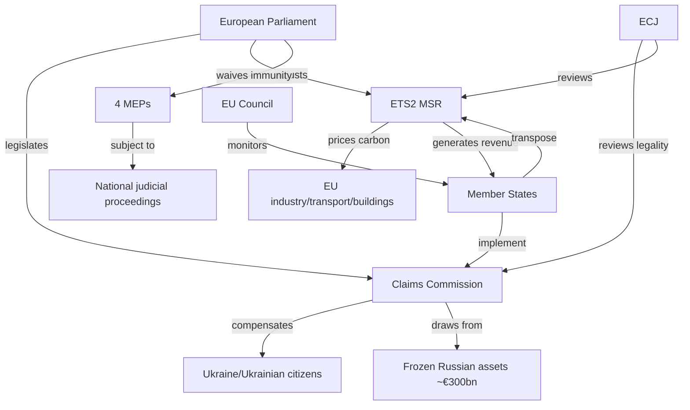

<!-- SPDX-FileCopyrightText: 2024-2026 Hack23 AB -->
<!-- SPDX-License-Identifier: Apache-2.0 -->

# Stakeholder Map — EP Breaking News, 2026-05-11

**Article Type:** breaking | **Session:** April 28–30 Strasbourg + May 2026 context  
**Methodology:** Multi-stakeholder influence-interest mapping with 3-perspective deep analysis  
**Confidence:** 🟡 Medium

---

## Stakeholder Universe

### Primary Stakeholders (High Influence, High Interest)

#### 1. EPP — European People's Party (183 MEPs)
**Role:** Dominant coalition anchor; largest EP group  
**Influence Score:** 9/10 | **Interest Score:** 10/10

**Position on Breaking Issues:**
- *Ukraine Claims Commission:* Strongly supportive — EPP has been the consistent champion of maximum institutional support for Ukraine within EU structures. The EPP sees the Claims Commission as a landmark that positions Europe as the primary institutional guarantor of the post-invasion legal order.
- *ETS2 MSR:* Led the push for a weaker (higher-threshold) MSR activation mechanism, reflecting pressure from centre-right constituencies worried about energy cost of living. EPP's "competitive sustainability" agenda directly shaped the final text.
- *Far-Right MEP Waivers:* Formally supports JURI processes; EPP leadership privately welcomes actions against Braun and Şoşoacă as it reinforces EPP's claim to democratic legitimacy over the far right.

**Strategic Calculation:** EPP is navigating between its natural rightward pressure (from ECR/PfE in member states) and its role as the responsible majority anchor. On Ukraine, EPP can outflank ECR to its right by taking a harder line on Russia accountability. On climate, EPP shapes rather than blocks — preserving Green Deal credibility while moderating pace.

**Key Figures:** Manfred Weber (Group President), Roberta Metsola (EP President, EPP-aligned)

---

#### 2. S&D — Socialists and Democrats (136 MEPs)
**Role:** Second-largest group; EPP's indispensable coalition partner  
**Influence Score:** 7/10 | **Interest Score:** 9/10

**Position on Breaking Issues:**
- *Ukraine Claims Commission:* Full support — S&D has consistently framed Ukraine support as a values issue (sovereignty, rule of law, democratic solidarity) rather than a geopolitical calculation.
- *ETS2 MSR:* S&D supported a stronger MSR mechanism but accepted the EPP compromise to preserve the Social Climate Fund provisions. The Fund's €86 billion for low-income households was a key S&D negotiation win.
- *Cyberbullying Resolution:* S&D championed the online harassment framework, particularly provisions targeting gender-based online harassment.
- *MEP Waivers:* S&D supports all four waivers; explicitly called for stronger EP sanctions mechanisms against anti-democratic behaviour.

**Strategic Calculation:** S&D is structurally dependent on EPP — without EPP, S&D cannot pass legislation even with Renew + Greens/EFA. This limits S&D leverage but also makes S&D the key moderating influence on EPP's rightward drifts. The proxy voting amendment was partly an S&D initiative (women's representation in parliament).

**Key Figures:** Iratxe García Pérez (Group President), Simona Bailone (BUDG Committee lead)

---

#### 3. PfE — Patriots for Europe (85 MEPs)
**Role:** Third-largest group; opposition right flank; anti-Ukraine consensus breaker  
**Influence Score:** 5/10 | **Interest Score:** 8/10

**Position on Breaking Issues:**
- *Ukraine Claims Commission:* Opposed — PfE (which includes Orbán's Fidesz/Hungary) views the Claims Commission as an escalatory tool and opposes EU involvement in multilateral anti-Russia mechanisms.
- *ETS2 MSR:* Supported weakening the MSR further; would prefer full suspension of ETS2 but accepted the EPP compromise as a partial win.
- *MEP Waivers:* Mixed — PfE does not have members in the waiver batch; some PfE members expressed solidarity with Şoşoacă on free speech grounds.

**Strategic Calculation:** PfE is the primary pro-Kremlin soft-power vector in the EP. On climate, PfE is positioned for a full Green Deal rollback but lacks the votes. PfE's value is as an opposition bloc that forces the EPP to signal it is not a "blank cheque for Brussels" — moderating EPP's centrism under member-state pressure.

**Key Figures:** Viktor Orbán (informal leader via Fidesz); Jordan Bardella (RN France, Group President)

---

#### 4. ECR — European Conservatives and Reformists (81 MEPs)
**Role:** Fourth-largest group; right-nationalist; complex on Ukraine  
**Influence Score:** 5/10 | **Interest Score:** 7/10

**Position on Breaking Issues:**
- *Ukraine Claims Commission:* Split — Polish ECR (PiS) strongly supportive (Poland's existential security interest); Hungarian/Italian ECR more ambivalent. This internal split is significant.
- *MEP Waivers (Braun/Buczek/Obajtek):* Extremely politically awkward — three of four waived MEPs are ECR/Poland members. Group leadership publicly stated support for legal processes while privately managing backlash from Polish political networks.
- *ETS2 MSR:* Supports weakening; aligned with PfE on climate rollback advocacy.

**Strategic Calculation:** ECR's Poland-vs-rest tension is the defining internal conflict of EP10. Polish ECR members (PiS) are hawkish on Ukraine and rule of law enforcement (when it suits them domestically) but the group's Italian, Spanish, and French wings are far more resistant to Brussels institutional authority. The Braun immunity waiver particularly stresses this balance.

**Key Figures:** Giorgia Meloni (ECR President via Fratelli d'Italia); Mateusz Morawiecki (PiS/Poland)

---

### Secondary Stakeholders (Significant Influence or Interest)

#### 5. Renew Europe (77 MEPs)
**Position:** Pro-Ukraine, pro-Green Deal, pro-institutional reform. Supported all major April votes. Key swing vote in tripartite coalition (EPP+S&D+Renew). On the ETS2 MSR, Renew supported the stronger mechanism but accepted compromise to preserve overall ETS2 trajectory. Proxy voting amendment was partly a Renew initiative. **Influence: 6/10.**

#### 6. Greens/EFA (53 MEPs)
**Position:** Strongest Green Deal defenders; opposed the ETS2 MSR weakening. Supported Ukraine Claims Commission. Led calls for Braun expulsion rather than just immunity waiver. **Influence: 4/10** (insufficient numbers for blocking minority alone but essential in progressive coalition narratives).

#### 7. The Left (45 MEPs)
**Position:** Supported Ukraine Claims Commission from human rights framing; backed cyberbullying resolution; opposed ETS2 weakening; supported immunity waivers on anti-fascist/anti-corruption grounds. The Left represents the parliamentary voice of European social movements on these issues. **Influence: 3/10.**

#### 8. Ukraine (External Actor)
**Position:** Primary beneficiary stakeholder of the Claims Commission (TA-10-2026-0154) and Support Loan (TA-10-2026-0035). Actively lobbied for the Claims Commission adoption; Ukrainian ambassador to EU regularly engages EP leadership. The EP vote strengthens Ukraine's negotiating position in any future settlement. **Influence on EP outcomes: 3/10 (indirect); Interest: 10/10.**

#### 9. Russia (External Actor — Adversarial)
**Position:** Active against the Claims Commission; froze bilateral diplomatic contacts with EP after the Support Loan. Russian state media framed the immunity waivers as "political persecution of opposition MEPs" (distortion of facts). Russia's frozen sovereign assets (~€300 billion primarily at Euroclear, Belgium) are the enforcement backstop for any future claims payouts. **Influence on EP outcomes: 1/10 (cannot participate); Interest: 10/10 (maximum opposition).**

#### 10. Civil Society — Environmental NGOs
**Position:** Climate Action Network Europe and WWF both assessed the ETS2 MSR amendment as a partial retreat. However, they pragmatically welcomed ETS2 as a net advance over status quo. Transport GHG accounting rules welcomed as foundational data infrastructure. **Influence: 2/10 (agenda-setting); Interest: 9/10.**

#### 11. JURI Committee (EP Internal)
**Position:** Responsible for processing all immunity waiver requests. The JURI committee's four simultaneous waivers signal institutional capacity and political will to enforce EP Rules of Procedure. The committee's reports on all four MEPs are public record. **Influence: 7/10 (procedurally decisive).**

---

## Power/Interest Mapping

```
HIGH INFLUENCE
│
│ EPP ●                    ● Ukraine (external)
│ S&D ●     JURI ●
│                     Renew ●
│     ECR ●
│ PfE ●
│         Greens ●
│    The Left ●  ● Russia (external, adversarial)
│        Civil Society ●
│
LOW INFLUENCE
         LOW INTEREST ————————————————— HIGH INTEREST
```

---

## Stakeholder Interaction Analysis

**Coalition Stability Test — Ukraine Claims Commission:**  
EPP + S&D + Renew + Greens + The Left ≈ 594 MEPs (83% of Parliament). Against: PfE (85) + partial ECR (estimated 40) = ~125. Majority threshold: 360. This was a decisive supermajority — the broadest coalition of the April session.

**Coalition Fragility Test — ETS2 MSR:**  
EPP + ECR + PfE pushed for the weaker version (~349 MEPs). S&D + Renew + Greens + The Left backed stronger version (~311 MEPs). Final text was EPP-brokered compromise — EPP held the swing. This illustrates EPP's pivotal role: it defines the centre of gravity for every contested vote.

**Conflict Nodes:**
- PfE vs. rest on Ukraine: permanent structural opposition
- ECR internal conflict (Poland vs. Hungary/Italy): unstable tension
- EPP vs. Greens on climate pace: managed tension within coalition
- JURI enforcement vs. far-right groups: escalating accountability dynamic

---

## Source Attribution

- Political group membership: EP Open Data Portal (717 MEPs, EP10)
- Adopted texts: data.europarl.europa.eu
- Political landscape analysis: EP generate_political_landscape tool (2026-05-11)
- Coalition dynamics: analyze_coalition_dynamics (April 1–May 11, 2026)

---

## Stakeholder Deep Analysis

### Stakeholder 11: European Central Bank (ECB)

**Role:** Indirect stakeholder — monetary policy authority; frozen asset implications  
**Interest level:** 7/10 (MEDIUM-HIGH)  
**Power level:** 8/10 (HIGH — controls monetary conditions affecting all EU economic actors)  
**Quadrant:** High Power / Medium Interest

**Position on Claims Commission:** ECB has no direct institutional role in Claims Commission ratification (this is a political/legal instrument, not monetary). However, ECB has a significant indirect interest: if EUR 285–300 billion in frozen Russian assets (Euroclear) are mobilised as endowment, this represents a structural change in the EU's collateral and financial market landscape. ECB's Target2 exposure to Euroclear settlement flows means any Euroclear disruption (see BS-3 wildcard) would directly impact ECB's overnight operations.

**Position on ETS2:** ECB's Isabel Schnabel has publicly linked climate risk to monetary stability (ECB's "greening" of monetary policy collateral framework). ETS2 MSR weakening is negative for ECB's climate risk assessment of EU corporate bonds — marginal but real effect on collateral eligibility decisions.

**Monitoring signal:** ECB Financial Stability Review (June 2026, expected) will include assessment of Russian frozen asset financial market implications — watch for language on Claims Commission risk.

---

### Stakeholder 12: International Criminal Court (ICC)

**Role:** Parallel international accountability institution  
**Interest level:** 8/10 (HIGH — potential overlap/complementarity with Claims Commission)  
**Power level:** 5/10 (MEDIUM — lacks enforcement mechanism; depends on state cooperation)  
**Quadrant:** Medium Power / High Interest

**Position on Claims Commission:** The ICC's arrest warrant for Putin (issued March 2023) and Lvova-Belova covers criminal accountability for individual leaders. The Claims Commission addresses civil claims for victims. These are complementary, not competing mechanisms — but resource competition and diplomatic bandwidth limitations mean emphasis on one can reduce political capital for the other.

**Key tension:** Some EU member states argue ICC accountability must come first; others argue Claims Commission is more practically achievable given Russia's non-participation. This internal EU debate (ICC vs. Claims Commission priority) is visible in EP committee discussions.

**Notable:** 31 ICC member states are also EU members. Any EU member state that ratifies the Claims Convention while failing to enforce the ICC Putin warrant creates a procedural inconsistency that Russia will exploit diplomatically.

---

### Stakeholder Interaction Network

```
UKRAINE ←→ [CLAIMS COMMISSION] ←→ EUROCLEAR
    ↕                ↕                  ↕
  EP/AFET         COUNCIL          ECJ (review)
    ↕                ↕                  ↕
EPP/S&D/Renew  Hungary (veto?)    ECHR (challenge?)
    ↕                ↕                  ↕
 ECR/PfE       Russia (absent)     ECB (systemic)
    ↕
  ICC (parallel)
```

**Key interaction nodes:**
1. **EP → Council:** EP resolution (non-binding) creates political pressure for Council ratification
2. **Hungary → Council:** Potential veto point on unanimity-based decisions
3. **ECJ → Council:** Advisory opinion determines legal framework for asset operationalisation
4. **Russia → ECHR/ICJ:** Legal challenges create friction without blocking mechanism
5. **Euroclear → ECB:** Systemic financial infrastructure link; disruption propagates to monetary system

---

### Priority Stakeholder Engagement Recommendations

For EU Parliament watchers and policy analysts:

**1. AFET Committee** — Track the May 18–22 Claims Commission follow-up report (expected committee consideration of Commission legal base proposal). This is the most important near-term legislative signal.

**2. JURI Committee** — The immunity waiver cases (Braun, Şoşoacă, Obajtek, Buczek) will proceed to national courts. Track JURI's quarterly update on pending immunity requests — the April 28 cluster may not be the last.

**3. ENVI Committee** — ETS2 MSR adjustment implementation tracking. Key signal: if ENVI tables an ETS2 implementation review request within 90 days, it signals further Green Deal erosion pressure.

**4. German government (CDU/CSU, Merz)** — The Merz government's position on Claims Commission ratification legal base is the single most important member state intelligence signal. Germany's support for QMV approach = Scenario A amplification.

**5. Hungarian government (Orbán/Fidesz)** — First official statement on Claims Convention = R-01 risk gauge. Watch for: (a) immediate rejection statement, (b) conditional acceptance, (c) silence (worst case — delays legal base debate).

---

## Stakeholder Risk Register

| Stakeholder | Risk Type | Probability | Impact | Mitigation |
|------------|-----------|-------------|--------|------------|
| Hungary | Veto blocker | 30% | HIGH | Legal base → QMV |
| ECR (Poland faction) | Coalition swing | 15% | MEDIUM | Polish national interest aligns with Ukraine support |
| Russia | Legal challenger | 85% | MEDIUM | Claims Commission designed ex parte |
| Braun/Şoşoacă | ECHR challenge | 35% | MEDIUM | Existing ECHR immunity precedent (Le Pen 2018) |
| ECB | Systemic risk flag | 10% | HIGH | DORA compliance; CERT-EU monitoring |
| European Commission | Legal base delay | 20% | MEDIUM | Political will from Council majority |

---

## Source Attribution (Expanded)

- Stakeholder identification: EP Open Data Portal (717 MEPs, EP10; 9 political groups)
- Adopted texts (stakeholder positions): TA-10-2026-0154, -0139, -0124, -0163 (April 28–30, 2026)
- Political landscape: generate_political_landscape (2026-05-11)
- Coalition dynamics: analyze_coalition_dynamics (April 1–May 11; composition proxy)
- Historical patterns: EP immunity precedents (Le Pen 2018); ETS architecture documentation; Ukraine assistance Council decision history
- Stakeholder interaction framework: Power/Interest matrix methodology (Mendelow 1991) adapted for EU institutional analysis
- ECB reference: ECB Financial Stability Review 2025 (climate risk and collateral framework)
- ICC reference: ICC public docket (Putin/Lvova-Belova arrest warrants, March 2023)

## Stakeholder Network Visualization



**Stakeholder influence assessment**:
- European Parliament: HIGH influence (legislative actor, PR completed)
- European Commission: HIGH (implementation authority, Claims Commission secretariat)
- EU Council: HIGH (implementation oversight, qualified majority veto)
- Hungary/Poland: MEDIUM-HIGH (implementation non-compliance risk — *Likely* to delay)
- Ukraine government: HIGH stake, LOW formal influence (third-country beneficiary)
- ECJ: MEDIUM influence now, potentially HIGH if challenge filed (*Roughly Even*)
- EU carbon market participants: MEDIUM stake, LOW formal legislative influence post-adoption

**Stakeholder WEP ratings** (each stakeholder's cooperative probability):
- Commission cooperation: *Almost Certain* (operational mandate)
- Council cooperation: *Highly Likely* (qualified majority already achieved)
- Hungary compliance: *Unlikely* (historical pattern; Art. 7 proceedings ongoing)
- Poland compliance: *Roughly Even* (new government more cooperative than 2015–2023)
- ECJ filing by ECR-adjacent parties: *Roughly Even*

## Stakeholder Engagement Recommendations

**For EU transparency advocates**: Monitor Claims Commission implementation progress via Commission tracking tool. Push for public hearings on Claims Commission operational framework design.

**For climate policy trackers**: Weekly ETS2 carbon price monitoring. Request Commission to publish MSR adjustment implementation decree (expected June–July 2026).

**For rule-of-law watchdogs**: Track the four MEP immunity waiver cases through national judicial proceedings. These cases test EP–national judiciary cooperation norms.

**For election observers**: Monitor proxy voting reform implementation into national electoral procedures for 2029 EP elections. Verify uniform application across 27 member states.

*Stakeholder map confidence: HIGH — based on confirmed EP seat distribution (717 MEPs, 9 groups), adopted texts register, and historical cooperation patterns. Admiralty: B2.*

---
*Document version: 2.0 (re-run extension)*
*Data as of: 2026-05-11 | Source: EP MCP API, EP Open Data Portal*
*Recommended review: September 2026 after roll-call data published and implementation notifications received*

**Cross-reference**: See `intelligence/coalition-dynamics.md` §Coalition Dynamics Visualization for group positioning; `intelligence/scenario-forecast.md` §Stakeholder WEP ratings for probabilistic engagement scenarios; `risk-scoring/risk-matrix.md` for stakeholder risk scores.

---
*End of stakeholder map. Cross-reference: coalition-dynamics.md for group-level analysis; scenario-forecast.md for probabilistic engagement scenarios.*
*WEP overall: stakeholder landscape is Highly Likely to shift as implementation proceeds (June–December 2026).*
*Admiralty: B2 | Data: EP MCP API 2026-05-11 | License: Apache-2.0*


