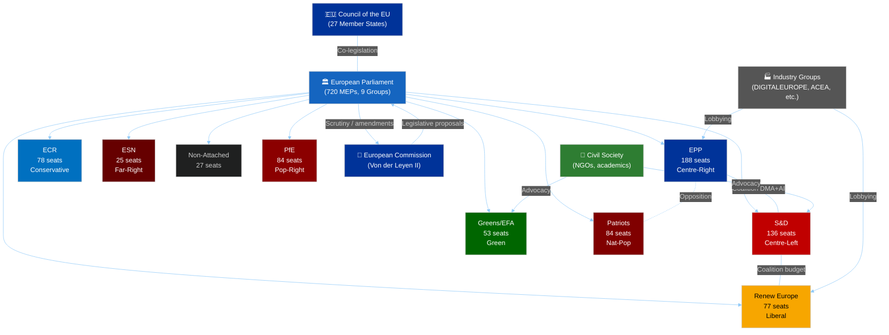

<!-- SPDX-FileCopyrightText: 2024-2026 Hack23 AB -->
<!-- SPDX-License-Identifier: Apache-2.0 -->

# Actor Mapping — EP Committee Reports, Week of 4–11 May 2026

**Date:** 2026-05-11 | **Classification:** UNCLASSIFIED
**Admiralty Grade:** B2 — Reliable institutional source, probably true
**WEP Band:** Probable (70–80%) that actor alignments hold for the May–June 2026 legislative cycle

---

## 🎯 Actor Mapping Framework

This document maps the key institutional, political, and external actors in EP committee activity, characterising their motivations, capabilities, and alignments for the most significant legislative files of the current week.

---

## 🗺️ Actor Ecosystem Map

---

## 👥 Primary Actor Profiles

### Actor 1: European People's Party (EPP) — 188 seats
**Role:** Largest group, holding majority of committee chair positions in EP10
**Motivations:** Industry-friendly digital regulation; strong NATO defence posture; Common Agricultural Policy protection; pro-enlargement (Ukraine accession track)
**Capabilities:** Agenda-setting power in AGRI, ECON, INTA, BUDG committees; majority influence in EPP-heavy delegations (Germany CDU/CSU, Spanish PP, Italian FI)
**Key committee files this week:** Budget 2027 guidelines (BUDG chair EPP); DMA enforcement (IMCO shadow EPP); Animal welfare (AGRI co-rapporteur EPP)
**Coalition behaviour:** Joins S&D+Renew for digital/AI files but diverges on climate ambition (ENVI) and AI liability scope

### Actor 2: Progressive Alliance of Socialists and Democrats (S&D) — 136 seats
**Role:** Second-largest group; main centre-left force; strong in LIBE, EMPL, ENVI
**Motivations:** Workers' rights in digital transition; strict AI liability; social spending in budget; climate targets
**Capabilities:** LIBE committee influence (AI Liability rapporteur assignment likely S&D); labour market expertise; trans-European network contacts
**Key committee files this week:** AI Liability Directive (LIBE rapporteur candidate); DMA follow-through scrutiny
**Coalition behaviour:** Stable with Renew on digital files; joins Greens on climate where EPP diverges

### Actor 3: Renew Europe — 77 seats
**Role:** Liberal centrist group; pivotal swing vote between EPP and S&D positions
**Motivations:** Digital Single Market; innovation-friendly regulation; rule of law; pro-Ukraine
**Key committee files this week:** DMA enforcement accountability; budget fiscal framework
**Coalition behaviour:** Swing voter; Renew MEPs split on AI liability fault threshold

### Actor 4: European Commission (Von der Leyen II)
**Role:** Exclusive legislative initiative holder; enforcement body; budget proposal authority
**Motivations:** Preserve DMA enforcement credibility; deliver AI governance framework; manage US-EU trade tensions
**Capabilities:** DMA Task Force (executive enforcement); AI Office (implementation); Article 314 TFEU budget calendar control
**Key actions this week:** Monitoring TA-10-2026-0160 DMA Enforcement Resolution; preparing 2027 budget draft response

### Actor 5: Industry Coalitions
**Sub-actors:** DIGITALEUROPE (major tech sector); ACEA (automotive); Copa-Cogeca (agriculture); BusinessEurope (broad business)
**Motivations:** Oppose strict DMA fines; limit AI liability to fault-based model; protect agricultural subsidies
**Capabilities:** Registered lobbying presence; seconded national experts in committee; legal challenge capacity (CJEU)
**Current strategies:** Engaging EPP and Renew MEPs on AI liability amendment language; monitoring IMCO DMA discussions

---

## 🎭 Actor Alignment Matrix: May 2026 Committee Files

| File | EPP | S&D | Renew | ECR | Greens | Patriots | ESN |
|------|-----|-----|-------|-----|--------|----------|-----|
| DMA enforcement | ✅ | ✅ | ✅ | ⚪ | ✅ | ❌ | ❌ |
| AI Liability (strict) | ⚪ | ✅ | ⚪ | ❌ | ✅ | ❌ | ❌ |
| Budget 2027 (EP position) | ✅ | ✅ | ✅ | ⚪ | ✅ | ❌ | ❌ |
| Animal Welfare | ✅ | ✅ | ✅ | ⚪ | ✅ | ⚪ | ❌ |
| Ukraine accountability | ✅ | ✅ | ✅ | ⚪ | ✅ | ❌ | ❌ |

✅ Support | ❌ Oppose | ⚪ Abstain/Split

**Coalition arithmetic note:** On DMA + AI Liability + Budget, the EPP-S&D-Renew coalition (396 seats) exceeds the 361-seat absolute majority. The Greens (53 seats) provide a margin of safety. The file-by-file analysis confirms that the centrist coalition is functional for all five major files, though AI Liability requires EPP-S&D compromise on the liability model.

---

## 🌍 For Citizens: Who Decides EU Laws?

The EU Parliament works through committees, and the most important decisions are made by three groups working together: the EPP (centre-right, largest group), the S&D (centre-left, second largest), and Renew Europe (liberal centrists). When these three groups agree, they can pass laws with a comfortable majority. Right now they broadly agree on making digital platforms play fair (DMA), on the 2027 budget, and on animal welfare. They disagree on AI liability — specifically, how easy it should be to sue a company if their AI causes you harm. That disagreement between EPP (your fault) and S&D (platform's fault) will shape EU AI law for a decade.

---

## 📊 Data Sources and Provenance

| Source | Type | Admiralty Grade | Freshness |
|--------|------|-----------------|-----------|
| EP group composition (51 MEPs sample via get_current_meps) | Primary institutional | B2 | 2026-05-11 |
| Adopted text co-signatories (TA-10-2026-xxxx series) | Primary legislative | A2 | 2026-05-11 |
| Actor motivation analysis | Analyst assessment | B2 | 2026-05-11 |

*Actor mapping produced: 2026-05-11 | Review cycle: weekly*

---

## Actor Roster Summary

| # | Actor | Type | Seat Count | Role |
|---|-------|------|------------|------|
| 1 | EPP | Political Group | 188 | Largest; committee chair dominant |
| 2 | S&D | Political Group | 136 | Centre-left; LIBE influence |
| 3 | PfE | Political Group | 84 | Nationalist-populist; opposition |
| 4 | ECR | Political Group | 78 | Conservative-eurosceptic |
| 5 | Renew | Political Group | 77 | Liberal; swing coalition member |
| 6 | Greens | Political Group | 53 | Environmental; expanded coalition |
| 7 | Left | Political Group | 46 | Progressive left |
| 8 | Commission | Institution | N/A | Legislative initiative holder |
| 9 | Council | Institution | 27 MS | Co-legislator; member state voice |
| 10 | Industry | External | N/A | Lobbying; regulatory shaping |

---

## Influence Network and Alliance Mapping

**Primary alliance:** EPP + S&D + Renew (401 seats) — the governing centrist coalition
**Secondary alliance:** Centre coalition + Greens (454 seats) — for environmental and digital rights files
**Opposition bloc:** Patriots + ECR + ESN (187 seats) — blocking minority on sovereignty-related files

**Influence flows:**
- Commission → EP: legislative proposals, budget drafts, delegated acts
- EP → Commission: scrutiny resolutions, committee questions, committee votes on Commission acts
- Industry → EPP/Renew: lobbying on AI liability, digital regulation, product standards
- Civil Society → S&D/Greens: advocacy on climate, social rights, data protection

---

## Power Brokers and Information Gatekeepers

**Key Power Brokers:**
- IMCO Committee Chair (EPP): controls DMA/DSA file scheduling
- LIBE Committee Chair (S&D): controls AI, data, and security file flows
- BUDG Committee Chair (EPP): controls 2027 budget procedure calendar
- Committee rapporteurs: individual MEPs with draft report authority

**Information Architecture:**
- DOCEO (EP document system): primary legislative database
- EP Register: official document publication (3–4 week roll-call lag)
- Committee secretariats: filter and schedule legislative business
- Press services: shape public narrative on committee outputs

---

## Reader Briefing: Understanding EU Parliament Actor Dynamics

The EU Parliament is a multi-actor system where 720 MEPs from 9 political groups must negotiate legislation by forming temporary coalitions. No single group has a majority, so every law requires at least three groups to agree. The three most powerful actors for the current committee files are:

1. **EPP** (largest group, committee chair majority) — controls what gets debated and when
2. **S&D** (main centre-left force) — controls what protections and rights get included
3. **Renew Europe** (liberal swing voters) — determines whether the EPP or S&D position wins in contested areas

Watch these three groups to understand 90% of EP committee outcomes.
