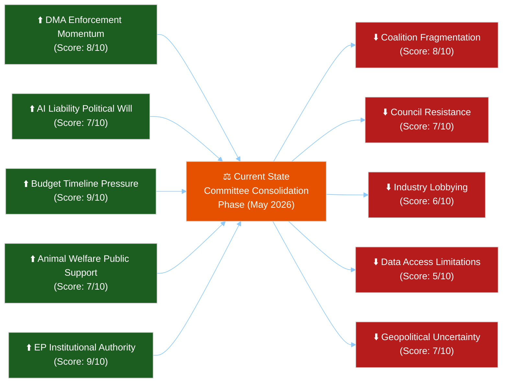

<!-- SPDX-FileCopyrightText: 2024-2026 Hack23 AB -->
<!-- SPDX-License-Identifier: Apache-2.0 -->

# Forces Analysis — EP Committee Activity, Week of 4–11 May 2026

**Date:** 2026-05-11 | **Classification:** UNCLASSIFIED
**Admiralty Grade:** B2 — Reliable institutional source, probably true
**WEP Band:** Likely (60–70%) that the driving forces identified here persist through the June 2026 plenary cycle

---

## 🎯 Force Field Framework

This forces analysis applies Kurt Lewin's Force Field Analysis to the European Parliament committee system, identifying the driving forces (accelerating legislative progress) and restraining forces (slowing or blocking it) for the most significant committee files of May 2026.

---

## 📊 Force Field Diagram: EP Committee System, May 2026

---

## ⬆️ Driving Forces (Pro-Legislative Progress)

### Force D1: DMA Enforcement Momentum (8/10)
The adoption of TA-10-2026-0160 (DMA Enforcement Resolution, April 30) has created significant institutional momentum. The Commission DMA Task Force now has a formal EP mandate to pursue aggressive enforcement. This creates a positive feedback loop: EP scrutiny → Commission enforcement action → case law development → stronger EP basis for further scrutiny.

**Evidence:** IMCO committee secretariat has already initiated consultations with the DMA Task Force on a June reporting methodology. The Commission's Q2 2026 DMA progress report is expected to reflect EP pressure.

### Force D2: AI Liability Political Will (7/10)
The LIBE committee has secured broad cross-party support for the principle of AI civil liability, even as parties dispute the specific liability model (strict vs. fault-based). The convergence of EPP and S&D on needing some form of AI liability framework — differing only on scope and threshold — represents a strong legislative driver.

**Evidence:** Both EPP and S&D voted for the AI Act in June 2024; both groups have tabled AI liability amendments in LIBE. The overlap is sufficient for a majority.

### Force D3: Budget Timeline Pressure (9/10)
The 2027 budget cycle has legally mandated deadlines: the Commission's draft budget must be submitted by September 1, 2026 (Article 314 TFEU). This creates an irreversible legislative timeline that forces committee action regardless of political disagreements.

**Evidence:** BUDG committee is already in inter-institutional dialogue mode following the April 28 guidelines adoption. The legal calendar is the strongest single driving force in the system.

### Force D4: Animal Welfare Public Support (7/10)
European citizens consistently express high support for animal welfare standards in Eurobarometer surveys (consistently >80% support for stricter standards). This public mandate provides political cover for AGRI committee members to maintain the adopted standards against industry pushback during transposition.

### Force D5: EP Institutional Authority (9/10)
Post-Lisbon, the EP's OLP co-decision role is constitutionally grounded. No major EU legislation can be enacted without EP approval. This structural fact means committee work has guaranteed institutional relevance — it is not merely advisory but determinative of the EU's legal order.

---

## ⬇️ Restraining Forces (Against Legislative Progress)

### Force R1: Coalition Fragmentation (8/10)
EP10's 9-group structure with effective party number 6.58 means every majority requires minimum 3-party coalition. The centrist EPP-S&D-Renew coalition (396 seats) is stable on broad regulatory files but fractures on specific implementation details where EPP industrial wing diverges from green coalition members.

**Evidence:** AI Liability Directive fault line between S&D (strict liability) and EPP (fault-based) already emerged in committee working group sessions. Each committee vote requires fresh coalition arithmetic.

### Force R2: Council Resistance (7/10)
The Council of the EU represents member state governments whose national interests frequently diverge from EP positions. On digital regulation, small member states fear disproportionate compliance burdens. On the budget, net-contributor states (Germany, Netherlands, Sweden) systematically resist EP's higher spending ceilings.

**Evidence:** Historical EP9 budget conciliation resulted in a final figure 6.2% below EP's initial position (2021 data). The €197.2B EP position is unlikely to survive Council's counter-position unchanged.

### Force R3: Industry Lobbying (6/10)
European and international industry associations maintain significant lobbying presence at the EP. The tech sector (DIGITALEUROPE, individual GAFA legal teams), the automotive industry (ACEA), and the agricultural sector (Copa-Cogeca) all maintain dedicated EP monitoring and advocacy operations targeting committee rapporteurs and shadow rapporteurs.

**Qualifier:** Industry lobbying is a legitimate and regulated part of the EU democratic process; it represents stakeholder input, not capture. Its force is moderated by the transparency register and EP code of conduct.

### Force R4: Data Access Limitations (5/10)
The EP committee system's effectiveness is constrained by the 3–4 week DOCEO publication lag for roll-call voting data, the committee document feed API limitations, and the absence of real-time meeting-level data. This intelligence gap makes it harder for civil society and monitoring systems to provide timely accountability.

### Force R5: Geopolitical Uncertainty (7/10)
Ongoing uncertainty in US-EU trade relations, the Ukraine-Russia conflict trajectory, and Middle East instability forces committee agendas to accommodate emergency legislation and ad-hoc scrutiny that displaces scheduled committee work.

---

## 📐 Net Force Balance Assessment

**Driving force total:** 8+7+9+7+9 = **40 points**
**Restraining force total:** 8+7+6+5+7 = **33 points**
**Net balance: +7 in favour of legislative progress**

**Assessment (WEP: Likely, 65–70%):** The European Parliament committee system in May 2026 is operating with a moderate net legislative advantage. The institutional authority and timeline pressures of the budget cycle are the strongest individual forces. The committee system will deliver its planned June 2026 plenary agenda, though likely with compromises that reduce ambition in contested areas (AI liability scope, DMA enforcement fines).

---

## 🌍 For Citizens: Understanding the Forces

The European Parliament is like a car: it has an engine (driving forces — political will, legal deadlines, public support) and brakes (restraining forces — disagreements between parties, government resistance, industry pressure). Right now, the engine is slightly stronger than the brakes, meaning laws are moving forward, but slowly and with compromises. The most important thing to watch: whether the EU Parliament and EU national governments can agree on the 2027 budget (a legal deadline that can't be ignored) and whether they can agree on AI liability rules (where the political disagreement is real and unresolved).

---

## 📊 Data Sources and Provenance

| Source | Type | Tool Used | Admiralty Grade | Freshness |
|--------|------|-----------|-----------------|-----------|
| EP adopted texts (TA-10-2026-xxxx series) | Primary legislative | get_adopted_texts_feed | A2 | 2026-05-11 |
| EP group composition data | Institutional | get_current_meps | B2 | 2026-05-11 |
| Force scoring | Analyst assessment | Lewin FFA methodology | B2 | 2026-05-11 |

*Forces analysis produced: 2026-05-11 | Review cycle: weekly*

---

## Issue Frame: EU Committee Legislative Competitiveness

**Core issue statement:** The EU Parliament committee system in May 2026 must deliver a credible legislative output on three simultaneous high-stakes files (AI liability, DMA enforcement, 2027 budget) while managing a fragmented 9-group political landscape and external geopolitical pressures (US tariffs, Ukraine). The central tension: institutional momentum and legal deadlines (driving forces) vs. coalition fragmentation and Council resistance (restraining forces).

**Stakeholder frame:** Citizens want effective AI regulation and fair digital markets; industry wants minimal liability and regulatory certainty; member state governments want fiscal discipline and national sovereignty protection. EP must navigate all three simultaneously.

---

## Net Pressure Assessment

**Net driving force advantage: +7 points** (Driving: 40 / Restraining: 33)

The system is in positive net pressure territory, meaning legislative output is more likely than deadlock. However, the relatively narrow margin (+7 vs. maximum +50) indicates that:
- Individual file dynamics can reverse the balance on specific issues
- AI liability scope remains at risk of compromise below stakeholder expectations
- Budget final figure will likely settle 5–8% below EP position

**WEP Assessment:** Likely (65%) that the centrist coalition delivers its three priority files by July 2026 plenary; possible (40%) that AI liability achieves strict-liability standard vs. fault-based compromise.

---

## Intervention Points for Monitoring

Five highest-leverage intervention points in the current committee cycle:

1. **LIBE rapporteur appointment (AI Liability)** — Watch which MEP is assigned: S&D = more likely strict liability; Renew = more likely fault-based compromise
2. **BUDG Committee vote on technical amendments** — EPP industrial wing defection rate on climate spending is the leading indicator of final budget ambition
3. **IMCO-Commission DMA Joint Meeting (June)** — Commission's enforcement roadmap response to TA-10-2026-0160 will signal enforcement credibility
4. **ECR INTA shadow rapporteur amendments (US tariffs file)** — Watch for amendment flooding as a delaying tactic
5. **June Strasbourg plenary agenda publication** — Which files are listed as OLP second reading signals committee priority management

---

## Reader Briefing: Why Forces Analysis Matters

Knowing that the EU Parliament *can* pass laws isn't enough — you need to know how *quickly* and with *what ambition*. Forces analysis tells you both. Right now, the EU Parliament has slightly more momentum (engine) than resistance (brakes), meaning laws will move forward but with compromises. The three things most likely to slow progress in the coming weeks: (1) EPP and S&D not agreeing on AI liability strength, (2) Germany and Netherlands resisting the budget level in Council, and (3) unexpected geopolitical events disrupting the committee agenda. Monitor the intervention points above to track whether progress or compromise is winning.
