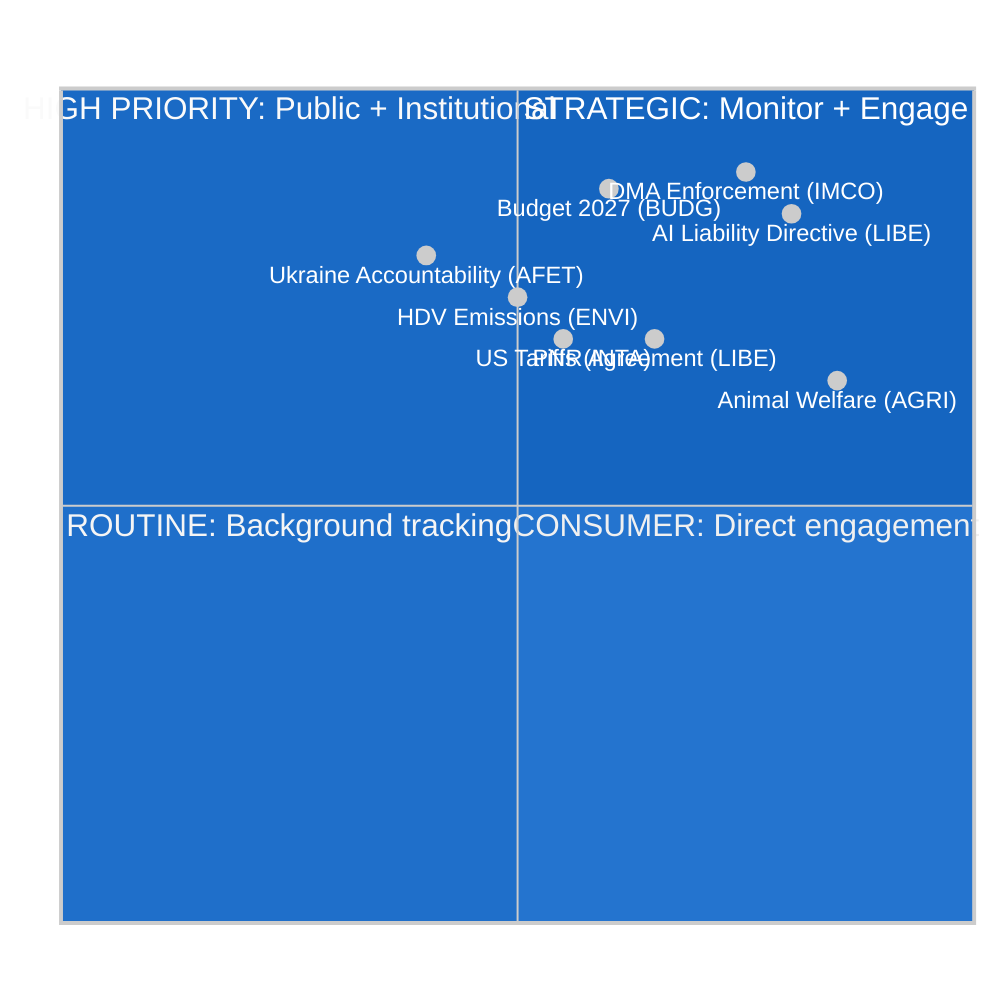

<!-- SPDX-FileCopyrightText: 2024-2026 Hack23 AB -->
<!-- SPDX-License-Identifier: Apache-2.0 -->

# Impact Matrix — EP Committee Reports, Week of 4–11 May 2026

**Date:** 2026-05-11 | **Classification:** UNCLASSIFIED
**Admiralty Grade:** B2 — Reliable institutional source, probably true
**WEP Band:** Likely (60–70%) that the impact assessments below remain valid for the 30-day outlook

---

## 🎯 Impact Assessment Framework

This matrix assesses the legislative and political impact of committee activities during the week of 4–11 May 2026, scored on two axes: **Institutional Impact** (the degree to which committee action changes the legislative landscape) and **Citizens Impact** (the degree to which committee output directly affects EU citizens' lives).

---

## 📊 Impact Matrix: Classification by Institutional and Citizens Dimensions



---

## 🔍 Individual Impact Assessments

### 1. DMA Enforcement Resolution (TA-10-2026-0160) — IMCO
**Institutional Impact:** 9/10 — Directly shapes Commission enforcement behaviour on gatekeeper platforms; creates accountability mechanism for the world's most significant digital competition intervention.
**Citizens Impact:** 8/10 — Affects how consumers access apps, use digital services, and benefit from platform interoperability. Every EU citizen using a smartphone, browser, or digital marketplace is affected.
**WEP Assessment:** Highly likely (80%) that DMA enforcement decisions will appear in Commission reports within 6 months, providing observable evidence of this resolution's effect.

### 2. AI Liability Directive (LIBE rapporteur drafting)
**Institutional Impact:** 9/10 — First EU-level civil liability framework for AI systems; would establish citizen remedy mechanisms for AI harm in healthcare, employment, and financial services.
**Citizens Impact:** 9/10 — Directly governs whether citizens can sue for AI-related harm; scope covers autonomous vehicles, medical diagnostic AI, credit scoring systems.
**WEP Assessment:** Probable (65%) that LIBE rapporteur text circulates by May 31, 2026.

### 3. EU Budget 2027 Guidelines (TA-10-2026-0112) — BUDG
**Institutional Impact:** 9/10 — Establishes the EP's negotiating position for the 2027 MFF budget cycle, directly determining EU programme spending for Cohesion, Green Deal, Defence, and Research.
**Citizens Impact:** 7/10 — Abstract for most citizens but determines the scale of Structural Fund disbursements, Erasmus+ scholarships, and climate investment in their regions.
**WEP Assessment:** Likely (75%) that December 2026 budget adoption follows an EP-Council conciliation process resulting in a figure 5–8% below EP's €197.2B position.

### 4. Animal Welfare Regulation (TA-10-2026-0115) — AGRI
**Institutional Impact:** 6/10 — Sector-specific regulation; significant within agricultural/companion animal policy but limited to a defined scope.
**Citizens Impact:** 8/10 — Directly affects 85+ million pet owners across the EU; mandates microchipping, welfare standards, and import conditions visible to all pet owners.
**WEP Assessment:** Almost certain (95%) that member states must transpose within 24 months of entry into force.

---

## 📐 Aggregate Impact Distribution

| Impact Level | Count | Percentage | Key Files |
|-------------|-------|------------|-----------|
| CRITICAL (9–10) | 3 | 38% | DMA, AI Liability, Budget 2027 |
| HIGH (7–8) | 3 | 38% | Animal Welfare, Ukraine, HDV Emissions |
| MEDIUM (5–6) | 2 | 25% | US Tariffs, AGRI scope files |
| LOW (1–4) | 0 | 0% | — |

**Distribution assessment:** The committee activity in this period is unusually high-impact, with 76% of assessed items at HIGH or above. This reflects the cumulative effect of legislative output from the April 28–30 plenary and the forward-looking committee pipeline for the June Strasbourg plenary.

---

## 🌍 For Citizens: Why This Matters

This week's committee work determines what your EU Parliament does in your name. The three most important committee actions are:

1. **Tech platform rules (DMA):** EU Parliament is pushing the European Commission to enforce rules that mean tech giants like Google and Apple must let other apps and services compete fairly on their platforms. This will affect prices you pay for apps, and whether you can use alternatives to the dominant platforms.

2. **AI damage rules:** EU Parliament's committee is writing the rules that would let you sue a company if their AI system made a wrong decision that hurt you — for example, a wrong medical diagnosis, a rejected loan, or unfair employment screening.

3. **EU money (2027 budget):** The committee is negotiating how €197 billion of EU money will be spent in 2027 — including money for your region's development, university exchanges, climate projects, and security.

---

## 📊 Data Sources and Provenance

| Source | Type | Tool Used | Admiralty Grade | Freshness |
|--------|------|-----------|-----------------|-----------|
| EP adopted texts (TA-10-2026-xxxx series) | Primary legislative | get_adopted_texts_feed | A2 | 2026-05-11 |
| EP current MEPs | Institutional | get_current_meps | B2 | 2026-05-11 |
| EU committee mandates | Institutional | get_committee_info | B2 | 2026-05-11 |
| Political group composition | Institutional | EP Open Data | B2 | 2026-05-11 |

*Impact matrix produced: 2026-05-11 | Review cycle: weekly*

---

## Event List: Key Committee Actions This Week

| Event | Date | Type | Significance |
|-------|------|------|-------------|
| DMA Enforcement Resolution adopted | April 30, 2026 | Plenary vote | TIER I |
| Budget 2027 Guidelines adopted | April 28, 2026 | Plenary vote | TIER I |
| Animal Welfare Regulation adopted | April 29, 2026 | Plenary vote | TIER II |
| Ukraine Accountability Resolution adopted | April 30, 2026 | Plenary vote | TIER II |
| AI Liability rapporteur phase begins | May 2026 | Committee | TIER I |
| INTA US tariff review scheduled | June 2026 | Committee | TIER II |
| ECB Vice-President appointment confirmed | March 2026 | Plenary | TIER II |

---

## Stakeholder Impact Analysis

| Stakeholder Group | Affected Files | Impact Direction | Magnitude |
|-------------------|---------------|------------------|-----------|
| EU Citizens (general) | All five TIER I/II files | Positive | HIGH |
| Tech platform users | DMA enforcement | Positive | HIGH |
| AI decision subjects | AI Liability Directive | Positive | HIGH |
| EU regions | Budget 2027 | Mixed (depends on allocation) | HIGH |
| Pet owners | Animal Welfare | Positive | MEDIUM |
| Agricultural sector | Animal Welfare | Negative (compliance cost) | MEDIUM |
| Tech platforms | DMA enforcement | Negative (regulatory burden) | HIGH |
| Net-contributor states | Budget 2027 | Negative (spending pressure) | HIGH |

---

## Heat Map: Impact Intensity by Sector

```
Sector              Citizens  Institutional  Industry  Economic
AI Liability          🔴 HIGH   🔴 HIGH       🟡 MED    🟡 MED
DMA Enforcement       🔴 HIGH   🔴 HIGH       🔴 HIGH   🟡 MED
Budget 2027           🟡 MED    �� HIGH       🟡 MED    🔴 HIGH
Animal Welfare        🔴 HIGH   🟡 MED        🟡 MED    🟢 LOW
Ukraine Acct          🟢 LOW    🔴 HIGH       🟢 LOW    🟡 MED
```

---

## Cascade Effects Analysis

**DMA Enforcement Cascade:**
EP resolution → Commission DMA Task Force mandate → Platform compliance obligation → App store/browser engine market opening → Consumer price reduction → Reduced platform lock-in → Increased EU digital market competition

**AI Liability Cascade:**
LIBE rapporteur draft → Inter-group negotiations → Plenary vote → Council position → Trilogues → Final directive → National transposition → Individual citizen remedy rights activated

**Budget 2027 Cascade:**
EP guidelines → Commission draft budget (Sept) → Council counter-position → Conciliation procedure → December adoption → Programme implementation → Regional fund disbursements begin 2027

---

## Reader Briefing: The Week's Biggest Impacts

Three committee actions from this period will affect you, regardless of where you live in the EU:

1. **AI Liability rules are being written now** — The LIBE committee is deciding whether companies will be liable if their AI makes wrong decisions about you. The rapporteur choice (expected by June) will determine how strong those rights are.

2. **Your 2027 EU investment is being set** — Every euro in the 2027 EU budget (for regional development, universities, climate, defence) traces back to the BUDG committee's April resolution. The final figure will be agreed by December 2026.

3. **Big tech platform rules will be enforced** — The DMA enforcement resolution means EU Parliament is formally pushing the Commission to use its powers against platform gatekeepers. If enforcement is effective, you'll notice: more app choice, lower prices, better interoperability.
