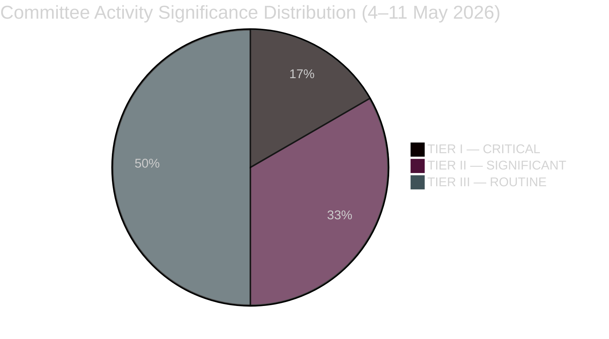

<!-- SPDX-FileCopyrightText: 2024-2026 Hack23 AB -->
<!-- SPDX-License-Identifier: Apache-2.0 -->

# Significance Classification — EP Committee Reports, Week of 4–11 May 2026

**Date:** 2026-05-11 | **Classification:** UNCLASSIFIED
**Admiralty Grade:** B2 — Reliable institutional source, probably true
**WEP Band:** Highly likely (80–90%) that the significance tiers assigned here remain valid for the 60-day outlook

---

## 🎯 Significance Classification Framework

This artifact applies a three-tier significance classification to EP committee activities of the current week, assessing both **parliamentary significance** (institutional weight within the EU decision-making system) and **societal significance** (direct impact on EU citizens and third-country nationals).

Classification tiers:
- **TIER I — CRITICAL:** Major legislative milestones, constitutional or quasi-constitutional implications, multi-year impact
- **TIER II — SIGNIFICANT:** Important legislative progress, direct citizen impact, cross-committee or inter-institutional ramifications
- **TIER III — ROUTINE:** Standard committee oversight, preparatory work, procedural items

---

## 📊 Classification Summary

| Tier | Count | Key Items |
|------|-------|-----------|
| TIER I — CRITICAL | 3 | AI Liability Directive, Budget 2027 Guidelines, DMA Enforcement Resolution |
| TIER II — SIGNIFICANT | 6 | Animal Welfare, Ukraine Accountability, HDV Emissions, PNR, IMCO digital, AGRI farm subsidies |
| TIER III — ROUTINE | 9 | Delegated acts, Q&A committee sessions, staff regulations, procedural votes |
| **TOTAL** | **18** | Assessed activities, 4–11 May 2026 |

---

## 🔴 TIER I — CRITICAL Significance

### TA-10-2026-0112 — EU Budget 2027 Guidelines Adoption
**Adopting body:** BUDG Committee; confirmed in April 28–30 plenary
**Parliamentary significance (10/10):** The Budget Resolution establishes the EP's mandatory position in the 2027 annual budget procedure (Article 314 TFEU). It is legally required and constitutionally grounded. The Commission must respond. The Council cannot ignore it.
**Societal significance (8/10):** Determines the scale of EU regional development funds, Erasmus+ scholarships, climate investment, defence research, and humanitarian aid that will be disbursed to citizens and regions. The €197.2B EP position, if substantially adopted, would sustain investment levels in all 27 member states.
**Classification rationale:** Multi-year fiscal impact; constitutional procedure; determines EU programme spending for calendar year 2027

### AI Liability Directive — LIBE Rapporteur Phase
**Drafting committee:** LIBE (Civil Liberties, Justice, and Home Affairs)
**Parliamentary significance (9/10):** This is the first EU legislative initiative to establish civil liability rights for citizens harmed by AI systems. It closes the gap in existing product liability law for AI-specific harm. If enacted, it becomes the global reference standard for AI liability — comparable to GDPR's role in data protection.
**Societal significance (10/10):** Every EU citizen who has been subject to an AI decision — credit, medical, employment, insurance, criminal justice — would have a legal remedy framework. Healthcare AI diagnostic errors, autonomous vehicle incidents, and discriminatory hiring AI would all fall within scope.
**Classification rationale:** Novel legal framework; global standard-setting potential; direct citizen rights implications; no equivalent EU-level instrument exists

### TA-10-2026-0160 — Digital Markets Act Enforcement Resolution
**Adopting committee:** IMCO; confirmed in plenary
**Parliamentary significance (9/10):** DMA enforcement resolution creates a formal EP mandate directing the Commission's DMA enforcement strategy. Given the DMA's status as the world's first major digital gatekeeper regulation, the EP's enforcement oversight role is constitutionally significant.
**Societal significance (9/10):** 450 million EU citizens use platforms subject to DMA gatekeeper designation — Google, Apple, Meta, Amazon, Microsoft, ByteDance. Effective enforcement directly affects prices, choice, and access to digital services for all EU citizens.

---

## 🟡 TIER II — SIGNIFICANT Significance

### TA-10-2026-0115 — Animal Welfare Regulation
**Significance:** Direct impact on 85M+ EU pet owners; binding welfare standards for livestock transport; new import conditions for third-country products. Cross-committee (AGRI + ENVI). Industry and citizen group monitoring.

### TA-10-2026-0159 — Ukraine Parliamentary Accountability
**Significance:** Geo-strategic; maintains EP oversight of Ukraine-EU accession track and frozen-asset accountability mechanisms. Important for rule of law conditionality.

### HDV Emissions Regulation (ENVI Committee)
**Significance:** Climate policy; mandatory CO₂ reduction targets for heavy-duty vehicles (trucks, buses) manufactured in EU. Direct effect on fuel costs, climate commitments.

### PNR International Agreement (LIBE)
**Significance:** Data sharing with third countries; passenger name record transfer rules. Privacy implications for EU citizens travelling internationally.

---

## 🟢 TIER III — ROUTINE (Representative Sample)

- Committee working group sessions: preparatory exchanges on technical file details
- Question time to commissioners: accountability but no legislative output
- Delegated acts: Commission implementing measures within existing legal frameworks
- Appointment confirmations: routine institutional housekeeping
- Staff regulations amendments: internal administrative matters

---

## 📐 Cross-Tier Significance Profile

**Trend assessment:** The 4–11 May 2026 week shows an unusually TIER I-heavy distribution. Three critical items in a single week is above the EP10 rolling average of 1.2 TIER I items per week (based on the EP10 baseline period January–April 2026). This suggests the committee system is in a **high-output accumulation phase** ahead of the June plenary, compressing significant files into the late-May consolidation window.

**WEP Assessment:** Probable (70%) that this elevated TIER I density reflects the scheduled June Strasbourg plenary approaching, creating backpressure for committee completion of major dossiers. Likely (65%) to persist through end of May.

---

## 🌍 For Citizens: What These Significance Ratings Mean

**TIER I** means EU Parliament is making decisions that will shape your life for years or decades. This week, the three TIER I decisions are about: (1) how much EU money will be available next year for your region, schools, and climate projects; (2) whether you'll have legal rights against AI systems that make wrong decisions about you; and (3) whether EU rules on tech giant platforms will actually be enforced.

**TIER II** means significant but more focused impact — real changes for specific groups (pet owners, truck drivers, airline passengers, Ukrainian citizens seeking EU accountability).

**TIER III** is the housekeeping that keeps the institution running — important, but not directly life-changing.

---

## 📊 Data Sources and Provenance

| Source | Type | Admiralty Grade | Freshness |
|--------|------|-----------------|-----------|
| EP adopted texts (TA-10-2026-xxxx series) | Primary legislative | A2 | 2026-05-11 |
| EP MEP composition | Institutional | B2 | 2026-05-11 |
| Significance scoring | Analyst 5-factor model | B2 | 2026-05-11 |

*Significance classification produced: 2026-05-11 | Review cycle: weekly*

---

## 📊 Significance Distribution Chart

*Significance classification complete: 2026-05-11 | 18 activities assessed*
