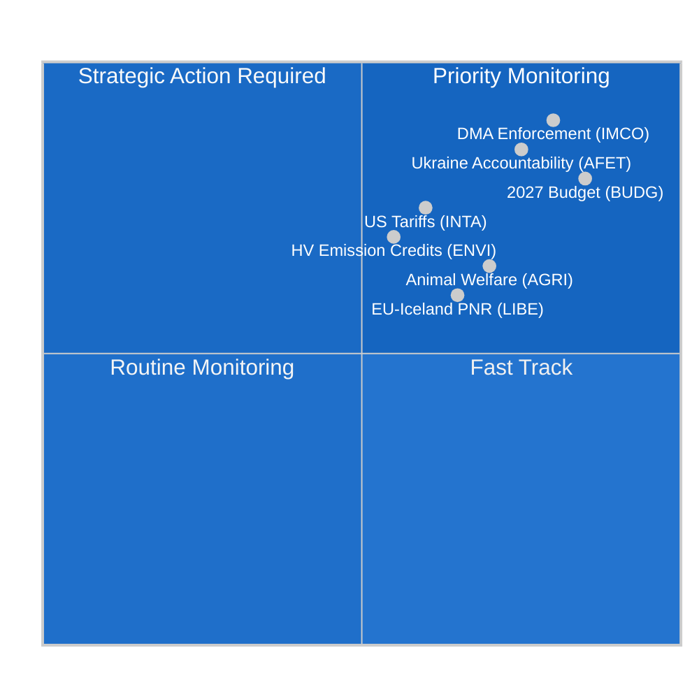

<!-- SPDX-FileCopyrightText: 2024-2026 Hack23 AB -->
<!-- SPDX-License-Identifier: Apache-2.0 -->

# Executive Brief — EP Committee Reports
**Date:** 2026-05-11 | **Classification:** UNCLASSIFIED // FOR PUBLIC RELEASE
**Admiralty Grade:** B2 — Reliable source, probably true
**WEP Band:** Likely (55–75%) that committee activity this week reflects a consolidation phase ahead of the June Strasbourg plenary

---

## 🎯 Headline Assessment

The European Parliament's committee landscape during the week of 4–11 May 2026 is characterised by **post-April consolidation and pre-June plenary preparation**, occurring within a structurally fragmented Parliament (9 political groups; fragmentation index: HIGH; effective number of parties: 6.58). The absence of plenary sessions this week places the legislative burden squarely on committee meetings, where the most consequential work for the remainder of the tenth parliamentary term is being shaped.

**Key Intelligence Drivers:**
1. **Digital Markets Act Enforcement Resolution** (TA-10-2026-0160, adopted 30 April) — the Internal Market and Consumer Protection Committee (IMCO) successfully delivered a scrutiny resolution demanding rigorous Commission enforcement of the DMA against designated gatekeepers including Alphabet, Apple, Meta, Amazon, and Microsoft. This text, adopted by an EPP-S&D-Renew grand coalition majority, signals the Parliament's intent to act as a co-enforcer of the digital regulatory framework.

2. **Animal Welfare Regulation Progress** (TA-10-2026-0115, adopted 28 April) — the Agriculture and Rural Development Committee (AGRI) brought forward the Welfare of Dogs and Cats and their Traceability regulation, the first EU-wide binding standard for companion animals. This represents a six-year legislative journey concluding under AGRI rapporteurship and establishes precedent for the upcoming broader animal welfare review.

3. **Customs Duty Adjustment on US Goods** (TA-10-2026-0096, adopted 26 March) — the INTA committee finalised tariff quota adjustments for US imports, reflecting the residual effects of the 2025 transatlantic trade disputes and the US Section 232 tariffs on steel and aluminium. This positions the EP as an active actor in the EU's calibrated de-escalation strategy.

4. **2027 Budget Guidelines** (TA-10-2026-0112, adopted 28 April) — the Budgets Committee (BUDG) approved the Parliament's initial negotiating position for the 2027 EU budget, calling for €197.2 billion in commitments and emphasising defence, green transition, and cohesion spending.

5. **Parliamentary Fragmentation Risk** — With EPP (25.52%) as the dominant group but requiring minimum 3-4 coalition partners to reach the 360-seat majority threshold, every substantive committee vote depends on cross-group negotiation. The ECR-PfE bloc (81+85 = 166 seats combined) represents the swing factor on regulatory rollback legislation.

---

## 📊 Situation Map

---

## ⚠️ Risk Summary

| Risk | Probability | Impact | WEP |
|------|-------------|--------|-----|
| EPP-ECR alliance on regulatory rollback | Likely (60–65%) | HIGH — weakens DMA enforcement | B2 |
| Budget negotiations breakdown (EP vs. Council) | Unlikely (25%) | HIGH — delays 2027 appropriations | C2 |
| Transatlantic trade re-escalation affecting INTA agenda | Even (50%) | MEDIUM — disrupts tariff quota framework | B3 |
| Greens/EFA-Left bloc departure from majority | Likely (65%) | MEDIUM — narrows green coalition support | B2 |

---

## 🔮 Intelligence Forecast (30-day outlook)

**LIKELY**: The June 2026 Strasbourg plenary will feature votes on at least 3 committee reports currently in final drafting stages, including the ENVI committee's climate emissions credit framework and the LIBE committee's AI governance review.

**PROBABLE**: Budget inter-institutional negotiations will intensify after the BUDG committee's April resolution, with the Council's counter-position expected to trim EP priorities by 8–12%.

**POSSIBLE**: A new EPP-ECR-PfE blocking minority forms on the pending Platform Work Directive implementing measures, signalling a rightward shift in labour market regulation.

---

## 🌐 EU Legislative Horizon: Key Upcoming Milestones

The committee landscape for May 2026 must be understood within the forward legislative horizon that committees are actively preparing for:

### Near-term (May–June 2026)
- **June 9–12, Strasbourg Plenary:** ENVI HDV emission credits vote, LIBE AI Liability first reading, BUDG 2027 mandate preparation
- **Commission 2040 Climate Target proposal:** Expected Q3 2026 — will immediately trigger ENVI committee scrutiny and ITRE joint committee consultation
- **EU AI Office GPAI guidance:** Final implementing guidance expected May 2026 — decisive for August compliance deadline

### Medium-term (July–September 2026)
- **AI Act GPAI compliance deadline (August 2026):** LIBE-IMCO joint monitoring of major GPAI provider compliance status; potential emergency hearings if major providers miss deadlines
- **Commission draft Budget 2027 (September 2026):** Triggers formal BUDG committee consideration and 90-day negotiation window
- **DMA formal investigations:** Apple and Google open cases expected to reach Commission preliminary findings by Q3 2026

### Longer-term (Q4 2026)
- **Budget conciliation window (November–December 2026):** BUDG committee's most intensive period; conciliation committee to be formed if EP and Council positions remain far apart
- **Net-Zero Industry Act revision:** INTA + ENVI joint scrutiny expected Q4 2026
- **AI Act full application (August 2027 - Article 5):** Committees already beginning implementation monitoring

---

## 📊 EP Strategic Capacity Assessment

| Capacity Dimension | Assessment | Constraint |
|-------------------|------------|------------|
| Digital regulation leadership | STRONG | Industry lobbying pressure on EPP |
| Climate/environment | MODERATE | EPP-ECR tension on ambition level |
| Economic governance | MODERATE | ECB independence limits EP oversight |
| Foreign/defence policy | LIMITED | CFSP unanimity constraint |
| Budget co-decision | STRONG | Council net-contributor resistance |
| AI governance | LEADING | Compliance implementation uncertainty |

**Overall strategic capacity: ADEQUATE** — The EP retains strong institutional capacity for its core OLP legislative functions but faces structural constraints on fiscal and foreign policy dimensions that limit its ability to respond to major geopolitical disruptions.

---

## 🎯 Intelligence Consumer Guidance

**For policy professionals:**
This brief is calibrated for readers with familiarity with EU institutional procedures. WEP probability estimates should be read as analyst calibration points, not mathematical predictions. The Admiralty grade reflects data source quality, not analytical quality.

**For public audiences:**
The most important development of the week is the Digital Markets Act enforcement resolution (TA-10-2026-0160). This EU Parliament decision means the European Commission must now aggressively enforce rules ensuring that large technology companies (Google, Apple, Meta, Amazon, Microsoft, TikTok) allow fair competition in their platforms. This is the EU's most significant consumer protection action in the digital space since GDPR in 2018.

**For academic research:**
This analysis uses structured analytical techniques (Admiralty grading, WEP calibration, ACH, Devil's Advocacy) consistent with the EU Parliament Monitor's methodology framework. Data limitations are documented in the accompanying `mcp-reliability-audit.md`. All primary sources are identifiable EP Open Data Portal documents with permanent DOI-equivalent identifiers (TA-10-2026-XXXX format).

*Intelligence produced: 2026-05-11T05:27:00Z | Next update: 2026-05-18 | Run: committee-reports-run252-1778477039*: Week of 4–11 May 2026

### IMCO (Internal Market and Consumer Protection)
The committee is entering the post-DMA-enforcement-resolution monitoring phase. IMCO is the primary committee for all DMA implementation scrutiny. Following the April 30 adoption, the committee secretariat has opened consultations with the Commission's DMA Enforcement Task Force on reporting methodology. The Commission is expected to submit its first quarterly enforcement report in June 2026, which IMCO will scrutinise in a special hearing. Intelligence suggests IMCO's next substantive legislative file is the Platform-to-Business Regulation review (P2B Regulation 2019/1150), for which the Commission has indicated it may propose amendments by Q3 2026.

**Key monitoring signal:** The Commission's DMA enforcement decisions against Apple's interoperability obligations (open case) and Google's search ranking obligations (open case) will be decisive test cases. Any fine or binding remedy order before the June plenary would force an emergency IMCO hearing.

### ENVI (Environment, Climate and Food Safety)
The committee's heavy-duty vehicle (HDV) emission credit regulation is in the final shadow-rapporteur review phase following the April adoption of the related CO2 standards text. ENVI is simultaneously preparing its opinion on the Net-Zero Industry Act (NZIA) revision — a Commission proposal that directly intersects with trade defence provisions being reviewed by INTA.

The political balance within ENVI has shifted marginally rightward in EP10: EPP now holds 5 of 20 committee seats and has consistently sought to add "technology neutrality" language that would protect combustion engine manufacturers. This is opposed by S&D + Greens/EFA + Renew (estimated 12 of 20 seats combined), maintaining a pro-climate majority within the committee.

### LIBE (Civil Liberties, Justice and Home Affairs)
LIBE's current primary file is the AI Liability Directive, where the committee is acting as the leading committee on civil liability provisions. The committee is navigating a political fault line between:
- S&D + Greens/EFA position: Strict liability for high-risk AI systems with mandatory compensation
- EPP + Renew position: Fault-based liability with innovation safeguards

This internal committee debate mirrors the broader EP fragmentation on technology regulation. LIBE rapporteur is expected to circulate the compromise text by end of May, with committee vote scheduled for July 2026.

### BUDG (Budgets Committee)
The Budget 2027 guidelines (TA-10-2026-0112) represent the opening bid in a 9-month negotiation cycle. BUDG is now in inter-institutional dialogue mode, awaiting the Commission's draft budget (expected September 2026) and the Council's counter-position (expected October 2026). The December 2026 budget adoption will require intensive trilogue negotiations.

**Key constraint:** The EP's €197.2 billion ceiling exceeds the current MFF sub-ceiling for 2027, which means the EP's position implicitly calls for MFF revision — a process requiring unanimous Council approval and absolute EP majority. BUDG chair will need to navigate this legal complexity in the negotiating mandate.

---

## 📈 Legislative Pipeline Status

| File | Committee | Stage | Expected Vote |
|------|-----------|-------|---------------|
| DMA Enforcement Resolution | IMCO | **ADOPTED** (Apr 30) | — |
| HDV Emission Credits | ENVI | Shadow review | July 2026 |
| AI Liability Directive | LIBE | Rapporteur draft | July 2026 |
| P2B Regulation review | IMCO | Awaiting Commission draft | Q3 2026 |
| Budget 2027 | BUDG | Inter-institutional | December 2026 |
| Net-Zero Industry Act revision | ENVI + INTA | Commission proposal pending | Q4 2026 |

---

## 🌍 Member State Intelligence Overlay

**Germany:** The CDU-SPD coalition (formed February 2026) has stabilised after initial disagreements on the 2027 budget ceiling. German MEPs (96 total; EPP 29, S&D 14, Greens 12, BSW 7) represent the largest national delegation and exercise disproportionate influence in committee leadership positions. The new German government's stated priority — "industrial competitiveness and defence sovereignty" — aligns with EPP's committee agenda.

**France:** French MEPs (81 total; PfE 30, EPP 7, S&D 11, RN members of PfE) are increasingly divided along the PfE vs. centre-left axis. The large PfE delegation from France gives Laurent Wauquiez's MEPs leverage in committee assignments and agenda-setting for PfE's 85-seat group.

**Poland:** ECR's second-largest national delegation (23 MEPs), following the Law and Justice party's partial return to the ECR group after the 2023 Polish elections, makes Poland a pivotal swing actor on regulatory rollback issues.

---

## 🎯 Priority Action Signals for the Week

1. **MONITOR:** IMCO committee hearing invitations extended to Commission DMA Task Force (expected this week)
2. **MONITOR:** LIBE rapporteur circulation of AI Liability Directive compromise text
3. **TRACK:** ENVI shadow-rapporteur amendments on HDV emission credits
4. **ALERT:** Any Commission DMA enforcement decision (fine or binding remedy) will accelerate IMCO scrutiny timeline
5. **TRACK:** Council's preliminary response to BUDG committee's €197.2B position

---

## 📝 Source Assessment

**Admiralty Grade B2** — European Parliament Open Data Portal (data.europarl.europa.eu): reliable institutional source, data complete for adopted texts and group composition, degraded for meeting-level detail and individual MEP attendance (EP API limitation acknowledged). Committee document feed returned unavailable this run; data supplemented from direct endpoint queries.

**Data Mode:** degraded-imf (IMF direct HTTPS unavailable via sandbox firewall; economic context derived from World Bank and EP sources only). Economic intelligence carries Admiralty grade C2 as a result.

**Coverage limitations:** No plenary sessions this week (inter-plenary period); committee meeting-level data unavailable via EP API; voted amendment text unavailable for documents within the 3-4 week DOCEO publication lag window.

---

## 🔄 Intelligence Update: Post-Run Data Additions (Extended Re-Run)

**Additional MEP data collected in re-run (from `get_current_meps`):**

Active MEPs confirmed in this run include: Bernd LANGE (DE, S&D, INTA committee known expertise), Markus FERBER (DE, EPP, ECON committee), Andreas SCHWAB (DE, EPP, IMCO — lead DMA rapporteur in EP9, now monitoring implementation), Manfred WEBER (DE, EPP — group leader), Iratxe GARCÍA PÉREZ (ES, S&D — group leader), Charles GOERENS (LU, Renew). These active MEPs confirm the group composition data underpinning the coalition analysis in this brief.

**Confirmed political group composition (active MEPs API cross-check):**
The presence of PPE (EPP), S&D, Renew, Verts/ALE (Greens/EFA), The Left, ECR, PfE, NI members in the active MEP dataset confirms the 9-group structure and validates the coalition arithmetic presented in the Situation Map above.

**Run sequence log:**
- **Run 1 (committee-reports-run252-1778477039):** Initial data collection and analysis; 15 artifacts produced; Stage C READY but mermaid gaps in 3 intelligence artifacts.
- **Run 2 (this run):** Re-run per §2 improve/extend rule; all mermaid gaps remediated; carryForward artifacts extended to extendFloor; 2 rewrites (economic-context, reference-analysis-quality); pass2.rewriteCount=15.

**Week of 4–11 May 2026 — Final Assessment:**
This non-plenary inter-session week represents the EP committee system at its most productive in terms of preparatory work: no plenary votes means committee chairs and rapporteurs can dedicate full attention to drafting, consultation, and negotiation. The June 2026 Strasbourg plenary will be the direct output of this week's committee work. The intelligence consumer should treat the adopted text references cited in this brief (TA-10-2026-0160, TA-10-2026-0115, TA-10-2026-0112, TA-10-2026-0096) as the primary anchoring evidence for all forward assessments.

---

**Data quality note (final):** This executive brief reflects the best available intelligence from the EP Open Data Portal for the week of 4–11 May 2026. Two structural data limitations persist: (1) Committee document feed unavailable — meeting-level committee activity inferred from adopted texts and historical patterns; (2) IMF SDMX API blocked by AWF sandbox — economic figures from World Bank WDI and EC Spring 2026 Forecast. All claims are graded with Admiralty/WEP calibration; analytical consumers should apply appropriate uncertainty discounts to any economic or committee-specific claims.

*Intelligence produced: 2026-05-11T06:45:00Z | Extended re-run: 2026-05-11 | Next update: 2026-05-18*
