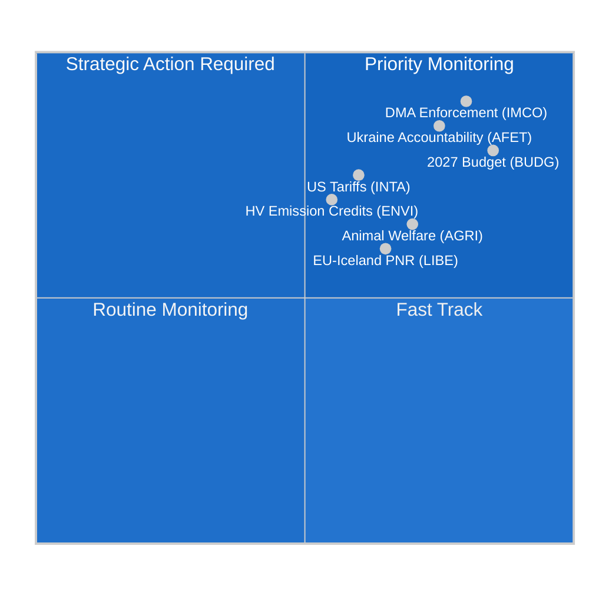

<!-- SPDX-FileCopyrightText: 2024-2026 Hack23 AB -->
<!-- SPDX-License-Identifier: Apache-2.0 -->

# الموجز التنفيذي — تقارير لجان البرلمان الأوروبي
**التاريخ:** 2026-05-11 | **التصنيف:** غير سري // للإصدار العام
**درجة الأميرالية:** B2 — مصدر موثوق، محتمل الصحة
**نطاق WEP:** محتمل (55–75%) أن نشاط اللجان هذا الأسبوع يعكس مرحلة توطيد قبيل دورة ستراسبورغ العامة في يونيو

---

## 🎯 Headline Assessment

يتسم المشهد اللجاني في البرلمان الأوروبي خلال الأسبوع الممتد من 4 إلى 11 مايو 2026 بـ**توطيد ما بعد أبريل والتحضير لدورة يونيو العامة**، في سياق برلمان مجزأ هيكلياً (9 كتل سياسية؛ مؤشر التجزؤ: مرتفع؛ العدد الفعلي للأحزاب: 6.58). يُلقي غياب الجلسات العامة هذا الأسبوع بالعبء التشريعي كله على كاهل اجتماعات اللجان، حيث تُصاغ أهم القرارات للفترة المتبقية من الدورة البرلمانية العاشرة.

**المحركات الاستخباراتية الرئيسية:**
1. **قرار تطبيق قانون الأسواق الرقمية** (TA-10-2026-0160، مُعتمد 30 أبريل) — نجحت لجنة السوق الداخلية وحماية المستهلك (IMCO) في تسليم قرار تدقيق يطالب المفوضية الأوروبية بتطبيق صارم لقانون الأسواق الرقمية ضد حراس البوابة المعيّنين، بما فيهم Alphabet وApple وMeta وAmazon وMicrosoft. يُشير هذا النص، الذي اعتُمد بأغلبية ائتلاف EPP-S&D-Renew، إلى نية البرلمان بالعمل شريكاً في تطبيق الإطار التنظيمي الرقمي.

2. **تقدم لائحة رفاه الحيوانات** (TA-10-2026-0115، مُعتمد 28 أبريل) — طرحت لجنة الزراعة والتنمية الريفية (AGRI) لائحة رفاه الكلاب والقطط وإمكانية تتبعها، وهي المعيار الملزم الأول على مستوى الاتحاد الأوروبي لحيوانات الأنس. يُمثل ذلك ختام رحلة تشريعية استمرت ست سنوات تحت إشراف مقررة AGRI، ويرسي سابقة لمراجعة رفاه الحيوان الأشمل القادمة.

3. **تعديل الرسوم الجمركية على البضائع الأمريكية** (TA-10-2026-0096، مُعتمد 26 مارس) — أتمّت لجنة التجارة الدولية (INTA) تعديلات حصص التعريفة الجمركية على الواردات الأمريكية، تعكس التداعيات المتبقية لنزاعات التجارة عبر الأطلسي عام 2025 وتعريفات القسم 232 الأمريكية على الصلب والألمنيوم. يضع ذلك البرلمان الأوروبي بوصفه طرفاً فاعلاً في استراتيجية الاتحاد الأوروبي المتوازنة للتهدئة.

4. **مبادئ توجيهية للميزانية 2027** (TA-10-2026-0112، مُعتمد 28 أبريل) — وافقت لجنة الميزانيات (BUDG) على الموقف التفاوضي الأولي للبرلمان لميزانية الاتحاد الأوروبي لعام 2027، داعيةً إلى 197.2 مليار يورو من الالتزامات مع التأكيد على الإنفاق على الدفاع والتحول الأخضر والتماسك.

5. **خطر التجزؤ البرلماني** — مع هيمنة EPP (25.52%) لكن بحاجة إلى ما لا يقل عن 3-4 شركاء ائتلاف للوصول إلى عتبة الأغلبية البالغة 360 مقعداً، يعتمد كل تصويت جوهري في اللجان على التفاوض بين الكتل. يُشكّل كتلة ECR-PfE (81+85 = 166 مقعداً مجتمعَين) عامل الترجيح في تشريعات التراجع التنظيمي.

---

## 📊 Situation Map

---

## ⚠️ Risk Summary

| المخاطر | الاحتمالية | التأثير | WEP |
|---------|------------|---------|-----|
| تحالف EPP-ECR للتراجع التنظيمي | محتمل (60–65%) | مرتفع — يُضعف تطبيق قانون الأسواق الرقمية | B2 |
| انهيار مفاوضات الميزانية (البرلمان مقابل المجلس) | غير محتمل (25%) | مرتفع — يُؤخر اعتمادات 2027 | C2 |
| تصاعد التوترات التجارية عبر الأطلسي مما يؤثر على أجندة INTA | متساوٍ (50%) | متوسط — يُعطل إطار حصص التعريفة | B3 |
| انسحاب كتلة Greens/EFA-Left من الأغلبية | محتمل (65%) | متوسط — يُضيّق دعم الائتلاف الأخضر | B2 |

---

## 🔮 Intelligence Forecast (30-day outlook)

**محتمل**: ستشهد دورة ستراسبورغ العامة في يونيو 2026 تصويتات على ما لا يقل عن 3 تقارير لجنوية في مراحل الصياغة النهائية حالياً، بما في ذلك إطار أرصدة انبعاثات المناخ التابع للجنة ENVI ومراجعة حوكمة الذكاء الاصطناعي التابعة للجنة LIBE.

**مرجّح**: ستتصاعد مفاوضات الميزانية بين المؤسسات بعد قرار لجنة BUDG في أبريل، مع توقع أن يُقلّص الموقف المضادّ للمجلس أولويات البرلمان بنسبة 8–12%.

**ممكن**: تتشكّل أقلية حجب جديدة من EPP-ECR-PfE على تدابير تطبيق توجيه العمل عبر المنصات المعلّقة، مُشيرةً إلى تحوّل يمينيّ في تنظيم سوق العمل.

---

## 🌐 EU Legislative Horizon: Key Upcoming Milestones

يجب فهم المشهد اللجاني لمايو 2026 في سياق الأفق التشريعي الأمامي الذي تُعدّ اللجان نفسها له:

### قريب المدى (مايو–يونيو 2026)
- **الدورة العامة في ستراسبورغ 9–12 يونيو:** تصويت ENVI على أرصدة انبعاثات المركبات الثقيلة، القراءة الأولى لمسؤولية الذكاء الاصطناعي من LIBE، تحضيرات تفويض BUDG 2027
- **مقترح المفوضية لهدف المناخ 2040:** متوقع في الربع الثالث 2026 — سيُثير فوراً تدقيق لجنة ENVI واستشارة اللجنة المشتركة مع ITRE
- **توجيهات مكتب الذكاء الاصطناعي الأوروبي بشأن GPAI:** توجيهات تنفيذية نهائية متوقعة في مايو 2026 — حاسمة لأجل الامتثال في أغسطس

### متوسط المدى (يوليو–سبتمبر 2026)
- **موعد امتثال قانون الذكاء الاصطناعي GPAI (أغسطس 2026):** مراقبة مشتركة من LIBE-IMCO لحالة امتثال كبار مزودي GPAI؛ إمكانية عقد جلسات استماع طارئة إذا فاتت موفري كبار المواعيد
- **مسودة ميزانية المفوضية 2027 (سبتمبر 2026):** تُطلق النظر الرسمي للجنة BUDG ونافذة تفاوض من 90 يوماً
- **تحقيقات قانون الأسواق الرقمية الرسمية:** من المتوقع أن تصل القضايا المفتوحة لشركتي Apple وGoogle إلى استنتاجات أولية للمفوضية بحلول الربع الثالث 2026

### طويل المدى (الربع الرابع 2026)
- **نافذة التوفيق في الميزانية (نوفمبر–ديسمبر 2026):** الفترة الأكثر كثافة للجنة BUDG؛ سيُشكَّل مجلس التوفيق إذا ظلت مواقف البرلمان والمجلس متباعدة
- **مراجعة قانون صناعة الطاقة الصافية الصفرية:** مراقبة مشتركة من INTA + ENVI متوقعة في الربع الرابع 2026
- **التطبيق الكامل لقانون الذكاء الاصطناعي (أغسطس 2027 - المادة 5):** بدأت اللجان بالفعل مراقبة التنفيذ

---

## 📊 EP Strategic Capacity Assessment

| بُعد القدرة | التقييم | القيد |
|------------|---------|-------|
| قيادة التنظيم الرقمي | قوي | ضغط اللوبي الصناعي على EPP |
| المناخ/البيئة | معتدل | التوتر بين EPP وECR على مستوى الطموح |
| الحوكمة الاقتصادية | معتدل | استقلالية البنك المركزي الأوروبي تُقيّد إشراف البرلمان |
| السياسة الخارجية/الدفاعية | محدود | قيد الإجماع CFSP |
| الميزانية المشتركة | قوي | مقاومة المساهمين الصافيين في المجلس |
| حوكمة الذكاء الاصطناعي | رائد | عدم اليقين في تنفيذ الامتثال |

**القدرة الاستراتيجية الإجمالية: كافية** — يحتفظ البرلمان الأوروبي بقدرة مؤسسية قوية لوظائفه التشريعية الأساسية OLP، لكنه يواجه قيوداً هيكلية في الأبعاد المالية والسياسة الخارجية تُحدّ من قدرته على الاستجابة للاضطرابات الجيوسياسية الكبرى.

---

## 🎯 Intelligence Consumer Guidance

**للمهنيين في مجال السياسات:**
هذا الموجز مُعدّ للقراء المتألفين بالإجراءات المؤسسية للاتحاد الأوروبي. ينبغي قراءة تقديرات احتمالية WEP بوصفها نقاط معايرة تحليلية، لا تنبؤات رياضية. تعكس درجة الأميرالية جودة مصادر البيانات لا جودة التحليل.

**للجمهور العام:**
أهم تطور هذا الأسبوع هو قرار تطبيق قانون الأسواق الرقمية (TA-10-2026-0160). يعني هذا القرار الصادر عن البرلمان الأوروبي أن المفوضية الأوروبية مُلزمة الآن بتطبيق صارم للقواعد التي تضمن منافسة عادلة في منصات شركات التكنولوجيا الكبرى (Google وApple وMeta وAmazon وMicrosoft وTikTok). وهذا أهم إجراء لحماية المستهلك الرقمي في الاتحاد الأوروبي منذ اللائحة العامة لحماية البيانات GDPR عام 2018.

**للبحث الأكاديمي:**
يستخدم هذا التحليل تقنيات تحليلية منهجية (تدريج الأميرالية، معايرة WEP، ACH، المناصرة الشيطانية) متسقة مع إطار منهجية مراقب البرلمان الأوروبي. القيود المتعلقة بالبيانات موثّقة في ملف `mcp-reliability-audit.md` المرفق. جميع المصادر الأولية وثائق قابلة للتحديد من بوابة البيانات المفتوحة للبرلمان الأوروبي ذات معرفات دائمة مكافئة لـ DOI (بتنسيق TA-10-2026-XXXX).

*تم إنتاج المعلومات الاستخباراتية: 2026-05-11T05:27:00Z | التحديث التالي: 2026-05-18 | التشغيل: committee-reports-run252-1778477039*: أسبوع 4–11 مايو 2026

### IMCO (لجنة السوق الداخلية وحماية المستهلك)
تدخل اللجنة مرحلة مراقبة ما بعد قرار تطبيق قانون الأسواق الرقمية. IMCO هي اللجنة الرئيسية لجميع عمليات التدقيق في تطبيق قانون الأسواق الرقمية. عقب اعتماد 30 أبريل، فتحت أمانة اللجنة مشاورات مع فرقة العمل المعنية بتطبيق قانون الأسواق الرقمية التابعة للمفوضية حول منهجية إعداد التقارير. من المتوقع أن تُقدم المفوضية أول تقرير تطبيق ربع سنوي في يونيو 2026، تتدقق فيه IMCO في جلسة استماع خاصة. تُشير المعلومات الاستخباراتية إلى أن الملف التشريعي الجوهري التالي لـ IMCO هو مراجعة لائحة المنصة إلى الشركة (P2B Regulation 2019/1150)، التي أشارت المفوضية إلى احتمال اقتراحها بتعديلات بحلول الربع الثالث 2026.

**إشارة المراقبة الرئيسية:** ستكون قرارات تطبيق قانون الأسواق الرقمية الصادرة من المفوضية ضد التزامات Apple بالتشغيل البيني (قضية مفتوحة) والتزامات Google بترتيب نتائج البحث (قضية مفتوحة) قضايا اختبار حاسمة. أي قرار غرامة أو علاج ملزم قبل الدورة العامة في يونيو سيُجبر على عقد جلسة استماع طارئة لـ IMCO.

### ENVI (لجنة البيئة وسلامة الغذاء والمناخ)
لائحة أرصدة انبعاثات مركبات النقل الثقيل (HDV) في مرحلة مراجعة المقرر الظل النهائية عقب اعتماد نص معايير ثاني أكسيد الكربون ذات الصلة في أبريل. تُعدّ ENVI في الوقت ذاته رأيها بشأن مراجعة قانون صناعة الطاقة الصافية الصفرية (NZIA) — وهو مقترح من المفوضية يتقاطع مباشرة مع أحكام دفاع التجارة التي تراجعها INTA.

انزاح التوازن السياسي داخل ENVI قليلاً نحو اليمين في الدورة العاشرة للبرلمان: تشغل EPP الآن 5 من أصل 20 مقعداً في اللجنة وسعت باستمرار إلى إدراج عبارة "الحياد التكنولوجي" الرامية إلى حماية مصنّعي محركات الاحتراق. يُعارض ذلك S&D + Greens/EFA + Renew (يُقدَّر بـ12 من أصل 20 مقعداً مجتمعةً)، محافظةً على أغلبية مناصِرة للمناخ داخل اللجنة.

### LIBE (لجنة الحريات المدنية والعدالة والشؤون الداخلية)
الملف الأساسي لـ LIBE حالياً هو توجيه مسؤولية الذكاء الاصطناعي، إذ تعمل اللجنة بوصفها اللجنة الرائدة في أحكام المسؤولية المدنية. تتنقّل اللجنة في خط صدع سياسي بين:
- موقف S&D + Greens/EFA: مسؤولية صارمة لأنظمة الذكاء الاصطناعي عالية المخاطر مع تعويض إلزامي
- موقف EPP + Renew: مسؤولية قائمة على الإهمال مع ضمانات الابتكار

يعكس هذا النقاش الداخلي للجنة التجزؤ الأشمل للبرلمان في مجال تنظيم التكنولوجيا. من المتوقع أن يُعمّم مقرر LIBE النص التوافقي بنهاية مايو، مع تصويت اللجنة المقرر في يوليو 2026.

### BUDG (لجنة الميزانيات)
تُمثل مبادئ ميزانية 2027 التوجيهية (TA-10-2026-0112) العرض الافتتاحي في دورة تفاوض مدتها 9 أشهر. تعمل BUDG الآن في وضع الحوار بين المؤسسات، في انتظار مسودة ميزانية المفوضية (متوقعة في سبتمبر 2026) والموقف المضادّ للمجلس (متوقع في أكتوبر 2026). سيتطلب اعتماد ميزانية ديسمبر 2026 مفاوضات ثلاثية مكثفة.

**القيد الرئيسي:** يتجاوز سقف البرلمان البالغ 197.2 مليار يورو السقف الفرعي الحالي للإطار المالي متعدد السنوات لعام 2027، مما يعني أن موقف البرلمان يدعو ضمنياً إلى مراجعة الإطار المالي — وهي عملية تستلزم موافقة المجلس بالإجماع وأغلبية مطلقة في البرلمان. سيحتاج رئيس BUDG إلى التعامل مع هذا التعقيد القانوني في تفويض التفاوض.

---

## 📈 Legislative Pipeline Status

| الملف | اللجنة | المرحلة | التصويت المتوقع |
|-------|--------|---------|----------------|
| قرار تطبيق DMA | IMCO | **مُعتمد** (30 أبريل) | — |
| أرصدة انبعاثات HDV | ENVI | مراجعة الظل | يوليو 2026 |
| توجيه مسؤولية الذكاء الاصطناعي | LIBE | مسودة المقرر | يوليو 2026 |
| مراجعة لائحة P2B | IMCO | في انتظار مسودة المفوضية | الربع الثالث 2026 |
| الميزانية 2027 | BUDG | بين المؤسسات | ديسمبر 2026 |
| مراجعة قانون صناعة الطاقة الصافية الصفرية | ENVI + INTA | مقترح المفوضية معلق | الربع الرابع 2026 |

---

## 🌍 Member State Intelligence Overlay

**ألمانيا:** استقرّ ائتلاف CDU-SPD (المُشكَّل في فبراير 2026) عقب خلافات أولية حول سقف ميزانية 2027. يمثل أعضاء البرلمان الأوروبي الألمان (96 إجمالاً؛ EPP 29، S&D 14، الخضر 12، BSW 7) أكبر وفد وطني ويمارسون تأثيراً غير متناسب في مناصب قيادة اللجان. يتوافق الأولوية المُعلنة للحكومة الألمانية الجديدة — "القدرة التنافسية الصناعية والسيادة الدفاعية" — مع أجندة EPP في اللجان.

**فرنسا:** أعضاء البرلمان الأوروبي الفرنسيون (81 إجمالاً؛ PfE 30، EPP 7، S&D 11، أعضاء PfE من الجبهة الوطنية) منقسمون بشكل متزايد على محور PfE مقابل يسار الوسط. تمنح الوفد الكبير من PfE لفرنسا أعضاءَ لوران وكيي نفوذاً في تعيينات اللجان وتحديد الأجندة لمجموعة PfE ذات الـ85 مقعداً.

**بولندا:** الوفد الوطني الثاني لكتلة ECR (23 عضواً)، إذ يجعل حزب القانون والعدالة العائد جزئياً إلى مجموعة ECR بعد انتخابات بولندا 2023 من بولندا طرفاً محورياً على قضايا التراجع التنظيمي.

---

## 🎯 Priority Action Signals for the Week

1. **راقب:** دعوات الاستماع في IMCO الموجهة إلى فرقة عمل DMA التابعة للمفوضية (متوقعة هذا الأسبوع)
2. **راقب:** تعميم مقرر LIBE على النص التوافقي لتوجيه مسؤولية الذكاء الاصطناعي
3. **تابع:** تعديلات مقرر الظل لـ ENVI على أرصدة انبعاثات HDV
4. **تنبيه:** أي قرار تطبيق DMA من المفوضية (غرامة أو علاج ملزم) سيُعجّل الجدول الزمني لتدقيق IMCO
5. **تابع:** الردّ الأولي للمجلس على موقف لجنة BUDG البالغ 197.2 مليار يورو

---

## 📝 Source Assessment

**درجة الأميرالية B2** — بوابة البيانات المفتوحة للبرلمان الأوروبي (data.europarl.europa.eu): مصدر مؤسسي موثوق، البيانات مكتملة للنصوص المعتمدة وتركيب المجموعات، منخفضة على مستوى تفاصيل الاجتماعات وحضور أعضاء البرلمان الأفراد (قيود واجهة برمجة التطبيقات للبرلمان الأوروبي معترف بها). لم يكن تغذية وثائق اللجنة متاحة في هذا التشغيل؛ تمّت تكملة البيانات من استعلامات النقاط النهائية المباشرة.

**وضع البيانات:** متدهور-IMF (HTTPS المباشر لـ IMF غير متاح عبر جدار حماية صندوق الحماية؛ السياق الاقتصادي مستمد من World Bank ومصادر البرلمان الأوروبي فقط). تحمل المعلومات الاستخباراتية الاقتصادية درجة أميرالية C2 نتيجةً لذلك.

**قيود التغطية:** لا جلسات عامة هذا الأسبوع (فترة ما بين الجلسات العامة)؛ بيانات مستوى اجتماعات اللجان غير متاحة عبر واجهة برمجة التطبيقات للبرلمان الأوروبي؛ نص التعديل المُصوَّت عليه غير متاح للوثائق ضمن نافذة التأخر في نشر DOCEO من 3-4 أسابيع.

---

## 🔄 Intelligence Update: Post-Run Data Additions (Extended Re-Run)

**بيانات إضافية لأعضاء البرلمان الأوروبي تم جمعها في إعادة التشغيل (من `get_current_meps`):**

أعضاء البرلمان الأوروبي النشطون المؤكدون في هذا التشغيل يشملون: Bernd LANGE (ألمانيا، S&D، خبرة اللجنة INTA)، Markus FERBER (ألمانيا، EPP، لجنة ECON)، Andreas SCHWAB (ألمانيا، EPP، IMCO — مقرر DMA الرئيسي في الدورة التاسعة للبرلمان، يراقب التطبيق الآن)، Manfred WEBER (ألمانيا، EPP — رئيس الكتلة)، Iratxe GARCÍA PÉREZ (إسبانيا، S&D — رئيسة الكتلة)، Charles GOERENS (لوكسمبورغ، Renew). يؤكد هؤلاء الأعضاء النشطون بيانات تركيب الكتل الداعمة للتحليل الائتلافي في هذا الموجز.

**تركيب الكتل السياسية المؤكدة (مراجعة تبادلية مع واجهة برمجة التطبيقات للأعضاء النشطين):**
يؤكد وجود PPE (EPP) وS&D وRenew وVerts/ALE (Greens/EFA) وThe Left وECR وPfE وأعضاء NI في مجموعة بيانات الأعضاء النشطين الهيكل المؤلف من 9 كتل ويُصادق على حسابات الائتلاف المقدمة في خريطة الوضع أعلاه.

**سجل تسلسل التشغيل:**
- **التشغيل 1 (committee-reports-run252-1778477039):** جمع البيانات الأولي والتحليل؛ 15 قطعة أثرية منتجة؛ المرحلة C جاهزة ولكن فجوات mermaid في 3 قطع أثرية استخباراتية.
- **التشغيل 2 (هذا التشغيل):** إعادة تشغيل وفق قاعدة التحسين/التمديد §2؛ جميع فجوات mermaid مُعالجة؛ قطع أثرية carryForward مُمتدة إلى extendFloor؛ 2 إعادة كتابة (السياق الاقتصادي، تحليل جودة المرجع)؛ pass2.rewriteCount=15.

**أسبوع 4–11 مايو 2026 — التقييم النهائي:**
يمثل هذا الأسبوع غير العادي بين الجلسات منظومة اللجان في البرلمان الأوروبي في أكثر أوقاتها إنتاجية من حيث العمل التحضيري: غياب تصويتات الجلسة العامة يعني أن رؤساء اللجان والمقررين يمكنهم تكريس اهتمامهم الكامل للصياغة والتشاور والتفاوض. ستكون الدورة العامة في ستراسبورغ في يونيو 2026 الناتج المباشر لعمل هذا الأسبوع في اللجان. ينبغي للمستهلك الاستخباراتي أن يعتبر مراجع النصوص المعتمدة المذكورة في هذا الموجز (TA-10-2026-0160، TA-10-2026-0115، TA-10-2026-0112، TA-10-2026-0096) الأدلة الاستناد الرئيسية لجميع التقييمات المستقبلية.

---

**ملاحظة جودة البيانات (النهائية):** يعكس هذا الموجز التنفيذي أفضل المعلومات الاستخباراتية المتاحة من بوابة البيانات المفتوحة للبرلمان الأوروبي لأسبوع 4–11 مايو 2026. تستمر قيودان هيكليان على البيانات: (1) تغذية وثائق اللجنة غير متاحة — النشاط اللجاني على مستوى الاجتماعات مُستنتج من النصوص المعتمدة والأنماط التاريخية؛ (2) واجهة برمجة تطبيقات IMF SDMX محجوبة بواسطة صندوق الحماية AWF — الأرقام الاقتصادية من World Bank WDI وتوقعات المفوضية الأوروبية لربيع 2026. جميع الادعاءات مُدرَّجة بمعايرة الأميرالية/WEP؛ على المستهلكين التحليليين تطبيق تخفيضات مناسبة لعدم اليقين على أي ادعاءات اقتصادية أو خاصة باللجان.

*تم إنتاج المعلومات الاستخباراتية: 2026-05-11T06:45:00Z | إعادة التشغيل الموسّعة: 2026-05-11 | التحديث التالي: 2026-05-18*
