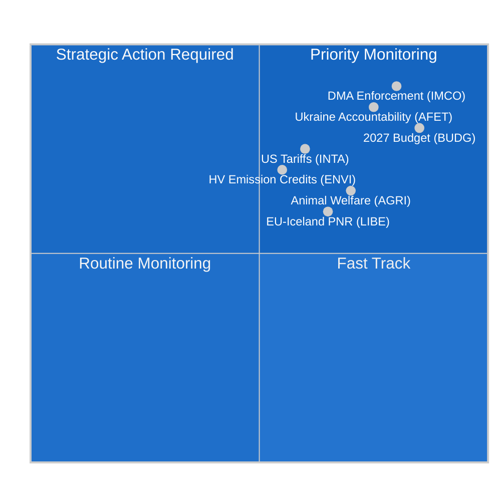

<!-- SPDX-FileCopyrightText: 2024-2026 Hack23 AB -->
<!-- SPDX-License-Identifier: Apache-2.0 -->

# Efterretningsoversigt — EP's udvalgsrapporter
**Dato:** 2026-05-11 | **Klassificering:** UKLASSIFICERET // TIL OFFENTLIG UDGIVELSE
**Admiralitetsvurdering:** B2 — Pålidelig kilde, sandsynligvis sand
**WEP-bånd:** Sandsynligt (55–75 %), at udvalgsaktiviteten denne uge afspejler en konsolideringsfase forud for juniplenarmødet i Strasbourg

---

## 🎯 Overordnet vurdering

Europa-Parlamentets udvalgslandskab i ugen 4.–11. maj 2026 er præget af **konsolidering efter april og forberedelse til juniplenarmødet**, inden for rammerne af et strukturelt fragmenteret parlament (9 politiske grupper; fragmenteringsindeks: HØJ; effektivt antal partier: 6,58). Fraværet af plenarmøder denne uge placerer den lovgivningsmæssige byrde udelukkende på udvalgsmøder, hvor det mest afgørende arbejde for resten af den tiende parlamentsperiode udformes.

**Centrale efterretningsdrivende faktorer:**
1. **Resolution om håndhævelse af loven om digitale markeder** (TA-10-2026-0160, vedtaget 30. april) — Udvalget for det Indre Marked og Forbrugerbeskyttelse (IMCO) leverede en kontrolresolution, der kræver, at Kommissionen håndhæver DMA strengt over for udpegede portvogter, herunder Alphabet, Apple, Meta, Amazon og Microsoft. Teksten, vedtaget med EPP–S&D–Renews storkoalitionsflertal, signalerer parlamentets hensigt om at fungere som medhåndhæver af den digitale reguleringsramme.

2. **Fremskridt for forordningen om dyrevelfærd** (TA-10-2026-0115, vedtaget 28. april) — Udvalget om Landbrug og Udvikling af Landdistrikter (AGRI) fremsatte forordningen om hunde, katte og deres sporbarhed — den første EU-dækkende bindende standard for selskabsdyr. Dette afslutter en seks år lang lovgivningsrejse og skaber præcedens for den kommende bredere dyrevelfærdsrevision.

3. **Justering af toldsatser på amerikanske varer** (TA-10-2026-0096, vedtaget 26. marts) — INTA-udvalget afsluttede toldkvotetilpasninger for amerikanske importvarer som følge af de transatlantiske handelskonflikter i 2025 og de amerikanske afsnit 232-tariffer på stål og aluminium. EP positioneres som aktiv aktør i EU's aftrappelsesstrategi.

4. **Retningslinjer for budget 2027** (TA-10-2026-0112, vedtaget 28. april) — Budgetudvalget (BUDG) godkendte parlamentets indledende forhandlingsposition for EU-budgettet 2027 med krav om 197,2 milliarder euro i forpligtelser og vægt på forsvar, grøn omstilling og samhørighedsudgifter.

5. **Risiko for parlamentarisk fragmentering** — Med EPP (25,52 %) som den dominerende gruppe, men med behov for mindst 3–4 koalitionspartnere for at nå 360-mandat-majoritetstærsklen, afhænger enhver substantiel udvalgsstemme af tværgruppeforhandlinger. ECR–PfE-blokken (81+85 = 166 mandater tilsammen) udgør svingfaktoren ved lovgivning om regelnedrulning.

---

## 📊 Situationskort

---

## ⚠️ Risikosammenfatning

| Risiko | Sandsynlighed | Indvirkning | WEP |
|--------|---------------|-------------|-----|
| EPP–ECR-alliance om regelnedrulning | Sandsynligt (60–65 %) | HØJ — svækker DMA-håndhævelse | B2 |
| Sammenbrud i budgetforhandlinger (EP mod Rådet) | Usandsynligt (25 %) | HØJ — forsinker bevillinger 2027 | C2 |
| Transatlantisk handelsreeskalering påvirker INTA's dagsorden | Lige (50 %) | MEDIUM — forstyrrer toldkvoterammerne | B3 |
| Greens/EFA–Venstre-blokken forlader flertallet | Sandsynligt (65 %) | MEDIUM — indsnævrer grøn koalitionsstøtte | B2 |

---

## 🔮 Efterretningsprognose (30-dages udsigt)

**SANDSYNLIGT**: Juniplenarmødet 2026 i Strasbourg vil indeholde afstemninger om mindst 3 udvalgsrapporter, der i øjeblikket befinder sig i den endelige udkastfase, herunder ENVI-udvalgets klimaudledningskreditramme og LIBE-udvalgets AI-styringsrevision.

**TROLIGT**: Interinstitutionelle budgetforhandlinger intensiveres efter BUDG-udvalgets aprilresolution, idet Rådets modposition forventes at beskære EP's prioriteter med 8–12 %.

**MULIGT**: Et nyt EPP–ECR–PfE-blokerende mindretal dannes om de verserende gennemførelsesforanstaltninger for platformsarbejdsdirektivet, hvilket signalerer et højredrej i arbejdsmarkedsreguleringen.

---

## 🌐 EU's lovgivningshorisont: Vigtige kommende milepæle

Udvalgslandskabet for maj 2026 skal forstås inden for den fremadrettede lovgivningshorisont, som udvalgene aktivt forbereder sig på:

### Nærterm (maj–juni 2026)
- **9.–12. juni, Strasbourg-plenarmøde:** ENVI's afstemning om emissionskreditter for tunge køretøjer, LIBE's AI-ansvar første læsning, BUDG's forberedelse af mandat 2027
- **Kommissionens forslag om klimamål 2040:** Forventet Q3 2026 — udløser straks ENVI-udvalgets kontrol og ITRE's fælles udvalgshoering
- **EU AI Office GPAI-vejledning:** Endelig implementeringsvejledning forventet maj 2026 — afgørende for augustoverholdelsesdeadlinen

### Mellemfristet (juli–september 2026)
- **AI Act GPAI-overholdelsesdeadline (august 2026):** LIBE–IMCO's fælles overvågning af store GPAI-leverandørers overholdelse; potentielle nødhøringer, hvis store leverandører misser deadlines
- **Kommissionens budgetudkast 2027 (september 2026):** Udløser formel BUDG-udvalgsbehandling og 90-dages forhandlingsvindue
- **DMA formelle undersøgelser:** Åbne sager mod Apple og Google forventes at nå Kommissionens foreløbige resultater i Q3 2026

### Længere sigt (Q4 2026)
- **Budgetforligsvindue (november–december 2026):** BUDG-udvalgets mest intensive periode; forligsudvalg nedsættes, hvis EP's og Rådets positioner forbliver langt fra hinanden
- **Revision af Net-Zero Industry Act:** Fælles INTA + ENVI-kontrol forventet Q4 2026
- **AI Act fuld anvendelse (august 2027 – artikel 5):** Udvalgene påbegynder allerede implementeringsovervågning

---

## 📊 EP's strategiske kapacitetsvurdering

| Kapacitetsdimension | Vurdering | Begrænsning |
|---------------------|-----------|-------------|
| Lederskab inden for digital regulering | STÆRK | Industrilobbypres på EPP |
| Klima/miljø | MODERAT | EPP–ECR-spænding om ambitionsniveau |
| Økonomisk styring | MODERAT | ECB's uafhængighed begrænser EP's tilsyn |
| Udenrigs-/forsvarspolitik | BEGRÆNSET | FUSP-enstemmighedsbegrænsning |
| Budgetmedbestemmelse | STÆRK | Rådets nettobidragsmodstand |
| AI-styring | LEDENDE | Usikkerhed om implementeringsoverholdelse |

**Samlet strategisk kapacitet: TILSTRÆKKELIG** — EP bevarer stærk institutionel kapacitet for sine kerneOLP-lovgivningsfunktioner, men møder strukturelle begrænsninger på de finansielle og udenrigspolitiske dimensioner, der begrænser evnen til at reagere på større geopolitiske forstyrrelser.

---

## 🎯 Vejledning for efterretningskonsumenter

**For politiske fagfolk:**
Denne rapport er kalibreret for læsere med kendskab til EU's institutionelle procedurer. WEP-sandsynlighedsestimater bør læses som analytikerkalibreringspunkter, ikke matematiske forudsigelser. Admiralitetsvurderingen afspejler datakildernes kvalitet, ikke analytisk kvalitet.

**For den brede offentlighed:**
Den vigtigste begivenhed denne uge er resolutionen om håndhævelse af loven om digitale markeder (TA-10-2026-0160). Denne EU-parlamentsbeslutning betyder, at EU-Kommissionen nu aggressivt skal håndhæve regler, der sikrer, at store teknologivirksomheder (Google, Apple, Meta, Amazon, Microsoft, TikTok) tillader fair konkurrence på deres platforme. Dette er EU's mest betydningsfulde forbrugerbeskyttelseshandling i det digitale rum siden GDPR i 2018.

**For akademisk forskning:**
Analysen anvender strukturerede analytiske teknikker (Admiralitetsvurdering, WEP-kalibrering, ACH, djævelens advokat) i overensstemmelse med EU Parliament Monitors metodologiramme. Databegrænsninger dokumenteres i den medfølgende `mcp-reliability-audit.md`. Alle primærkilder er identificerbare EP Open Data Portal-dokumenter med permanente DOI-ækvivalente identifikatorer (TA-10-2026-XXXX-format).

*Efterretning produceret: 2026-05-11T05:27:00Z | Næste opdatering: 2026-05-18 | Kørsel: committee-reports-run252-1778477039*: Ugen 4.–11. maj 2026

### IMCO (Udvalget for det Indre Marked og Forbrugerbeskyttelse)
Udvalget befinder sig i overvågningsfasen efter DMA-håndhævelsesresolutionen. IMCO er det primære udvalg for al DMA-implementeringskontrol. Efter vedtagelsen den 30. april har udvalgssekretariatet indledt høringer med Kommissionens DMA-håndhævelsesenhed om rapporteringsmetodik. Kommissionen forventes at fremlægge sin første kvartalsvise håndhævelsesrapport i juni 2026, som IMCO vil kontrollere på en særlig høring. Efterretningen antyder, at IMCO's næste substantielle lovgivningsfil er revisionen af platform-til-erhvervsforordningen (P2B-forordningen 2019/1150), som Kommissionen har signaleret mulige ændringsforslag til i Q3 2026.

**Nøgleovervågningssignal:** Kommissionens DMA-håndhævelsesafgørelser mod Apples interoperabilitetsforpligtelser (åben sag) og Googles søgerangeringsforpligtelser (åben sag) vil være afgørende testcases. En eventuel bøde eller bindende afhjælpningsordre inden juniplenarmødet vil fremtvinge en nødhøring i IMCO.

### ENVI (Udvalget om Miljø, Folkesundhed og Fødevaresikkerhed)
Udvalgets forordning om emissionskreditter for tunge køretøjer (HDV) befinder sig i den endelige skyggeordførergennemgangsfase efter aprilvedtagelsen af den relaterede CO2-standardtekst. ENVI forbereder samtidig sin udtalelse om revisionen af Net-Zero Industry Act (NZIA) — et Kommissionsforslag, der direkte skærer ind i handelsforsvarsbestemmelserne, som ses over af INTA.

Den politiske balance inden for ENVI har forskydt sig marginalt til højre i EP10: EPP besidder nu 5 af 20 udvalgspladser og har konsekvent søgt at tilføje "teknologineutralitetssprog", der vil beskytte forbrændingsmotorfabrikanter. Dette modarbejdes af S&D + Greens/EFA + Renew (anslået 12 af 20 pladser tilsammen), hvilket opretholder et klimapositivt flertal inden for udvalget.

### LIBE (Udvalget om Borgernes Rettigheder og Retlige og Indre Anliggender)
LIBE's nuværende primære fil er AI-ansvarsdirektivet, hvor udvalget fungerer som det ledende udvalg for civilretlige ansvarsbestemmelser. Udvalget navigerer en politisk skillelinje mellem:
- S&D + Greens/EFA's holdning: Strengt ansvar for høj-risiko-AI-systemer med obligatorisk erstatning
- EPP + Renews holdning: Fejlbaseret ansvar med innovationsbeskyttelsesforanstaltninger

Denne interne udvalgsdebat afspejler den bredere EP-fragmentering om teknologiregulering. LIBE's ordfører forventes at cirkulere kompromisteksten inden udgangen af maj med udvalgsafstemning planlagt til juli 2026.

### BUDG (Budgetudvalget)
Budget 2027-retningslinjerne (TA-10-2026-0112) repræsenterer åbningsbudet i en 9-måneders forhandlingscyklus. BUDG befinder sig nu i interinstitutionel dialogtilstand og afventer Kommissionens budgetudkast (forventet september 2026) og Rådets modposition (forventet oktober 2026). Budgetvedtagelsen i december 2026 vil kræve intensive trilogforhandlinger.

**Nøglebegrænsning:** EP's loft på 197,2 milliarder euro overstiger det nuværende MFF-underloft for 2027, hvilket betyder, at EP's position implicit kræver en MFF-revision — en proces, der kræver enstemmig rådsopbakning og absolut EP-flertal. BUDG-formanden skal navigere denne juridiske kompleksitet i forhandlingsmandatet.

---

## 📈 Status for lovgivningspipeline

| Fil | Udvalg | Fase | Forventet afstemning |
|-----|--------|------|----------------------|
| DMA-håndhævelsesresolution | IMCO | **VEDTAGET** (30. apr.) | — |
| Emissionskreditter for tunge køretøjer | ENVI | Skyggegennemgang | Juli 2026 |
| AI-ansvarsdirektiv | LIBE | Ordførerudkast | Juli 2026 |
| Revision af P2B-forordningen | IMCO | Afventer Kommissionsforslag | Q3 2026 |
| Budget 2027 | BUDG | Interinstitutionel | December 2026 |
| Revision af Net-Zero Industry Act | ENVI + INTA | Kommissionsforslag afventes | Q4 2026 |

---

## 🌍 Efterretningsoversigt for medlemsstaterne

**Tyskland:** CDU–SPD-koalitionen (dannet februar 2026) er stabiliseret efter indledende uenigheder om budgetloftet for 2027. Tyske MEP'er (96 i alt; EPP 29, S&D 14, Greens 12, BSW 7) repræsenterer den største nationale delegation og udøver uforholdsmæssigt stor indflydelse på udvalgsformandsposter. Den nye tyske regerings erklærede prioritet — "industriel konkurrenceevne og forsvarssouveränitet" — stemmer overens med EPP's udvalgsagenda.

**Frankrig:** Franske MEP'er (81 i alt; PfE 30, EPP 7, S&D 11, RN-medlemmer af PfE) er i stigende grad splittede langs PfE kontra center-venstre-aksen. Den store PfE-delegation fra Frankrig giver Laurent Wauquiez's MEP'er indflydelse på udvalgsfordelinger og dagsordensfastsættelse for PfE's 85-mandatgruppe.

**Polen:** ECR's næststørste nationale delegation (23 MEP'er), efter Lov og Retfærdigheds delvise tilbagevenden til ECR-gruppen efter de polske valg i 2023, gør Polen til en afgørende svingaktør ved spørgsmål om regelnedrulning.

---

## 🎯 Prioriterede handlingssignaler for ugen

1. **OVERVÅG:** IMCO-udvalgets høringsinvitationer rettet til Kommissionens DMA-håndhævelsesenhed (forventet denne uge)
2. **OVERVÅG:** LIBE's ordførerens cirkulering af kompromistekst for AI-ansvarsdirektivet
3. **SPOR:** ENVI's skyggeordføreramendements om emissionskreditter for tunge køretøjer
4. **ALARM:** En eventuel Kommissionsafgørelse om DMA-håndhævelse (bøde eller bindende afhjælpning) vil fremskynde IMCO's kontroltidslinje
5. **SPOR:** Rådets foreløbige svar på BUDG-udvalgets position på 197,2 milliarder euro

---

## 📝 Kildevurdering

**Admiralitetsvurdering B2** — Europa-Parlamentets Open Data Portal (data.europarl.europa.eu): Pålidelig institutionel kilde, data komplet for vedtagne tekster og gruppesammensætning, forringet for mødeniveaudetaljer og individuel MEP-fremmøde (EP API-begrænsning anerkendt). Udvalgets dokumentfeed returnerede utilgængeligt denne kørsel; data suppleret fra direkte endpoint-forespørgsler.

**Datatilstand:** forringet-imf (IMF direkte HTTPS utilgængeligt via sandkassefirewall; økonomisk kontekst afledt udelukkende fra World Bank og EP-kilder). Økonomisk efterretning bærer Admiralitetsvurdering C2 som følge heraf.

**Dækningsbegrænsninger:** Ingen plenarmøder denne uge (interplenariperiode); udvalgs mødeniveaudata utilgængeligt via EP API; stemt ændringstekst utilgængeligt for dokumenter inden for 3–4 ugers DOCEO-publiceringsforsinkelsesvindue.

---

## 🔄 Efterretningsopdatering: Datatilføjelser efter kørsel (udvidet genkørsel)

**Yderligere MEP-data indsamlet i genkørsel (fra `get_current_meps`):**

Aktive MEP'er bekræftet i denne kørsel inkluderer: Bernd LANGE (DE, S&D, INTA-udvalgets kendte ekspertise), Markus FERBER (DE, EPP, ECON-udvalget), Andreas SCHWAB (DE, EPP, IMCO — ledende DMA-ordfører i EP9, nu overvågningsimplementering), Manfred WEBER (DE, EPP — gruppeformand), Iratxe GARCÍA PÉREZ (ES, S&D — gruppeformand), Charles GOERENS (LU, Renew). Disse aktive MEP'er bekræfter gruppesammensætningsdataene, der understøtter koalitionsanalysen i denne oversigt.

**Bekræftet politisk gruppesammensætning (aktive MEP'er API-krydstjek):**
Tilstedeværelsen af PPE (EPP), S&D, Renew, Verts/ALE (Greens/EFA), The Left, ECR, PfE, NI-medlemmer i det aktive MEP-datasæt bekræfter 9-gruppestrukturen og validerer koalitionsaritmetikken præsenteret i situationskortet ovenfor.

**Kørselssekvenslog:**
- **Kørsel 1 (committee-reports-run252-1778477039):** Indledende dataindsamling og analyse; 15 artefakter produceret; Stadium C KLAR, men mermaid-huller i 3 efterretningsartefakter.
- **Kørsel 2 (denne kørsel):** Genkørsel per §2 forbedre/udvide-regel; alle mermaid-huller udbedret; carryForward-artefakter udvidet til extendFloor; 2 omskrivninger (økonomisk-kontekst, referenceanalyse-kvalitet); pass2.rewriteCount=15.

**Ugen 4.–11. maj 2026 — Endelig vurdering:**
Denne ikke-plenaruge repræsenterer EP's udvalgsystem på dets mest produktive i forberedende arbejde: ingen plenarsessionsafstemninger betyder, at udvalgsformænd og ordførere kan dedikere fuld opmærksomhed på udformning, konsultation og forhandling. Juniplenarmødet 2026 i Strasbourg vil være det direkte produkt af ugens udvalgsarbejde. Efterretningskonsumenten bør behandle de vedtagne tekstreferencer citeret i denne oversigt (TA-10-2026-0160, TA-10-2026-0115, TA-10-2026-0112, TA-10-2026-0096) som de primære forankringsbelæg for alle fremadrettede vurderinger.

---

**Datakvalitetsbemærkning (endelig):** Denne efterretningsoversigt afspejler bedste tilgængelige efterretning fra EP Open Data Portal for ugen 4.–11. maj 2026. To strukturelle databegrænsninger består: (1) Udvalgets dokumentfeed utilgængeligt — mødeniveauudvalgsaktivitet udledt fra vedtagne tekster og historiske mønstre; (2) IMF SDMX API blokeret af AWF-sandkasse — økonomiske tal fra World Bank WDI og EC Forårsprognose 2026. Alle påstande er vurderet med Admiralitet/WEP-kalibrering; analytiske konsumenter bør anvende passende usikkerhedsrabatter på eventuelle økonomiske eller udvalgsspecifikke påstande.

*Efterretning produceret: 2026-05-11T06:45:00Z | Udvidet genkørsel: 2026-05-11 | Næste opdatering: 2026-05-18*
