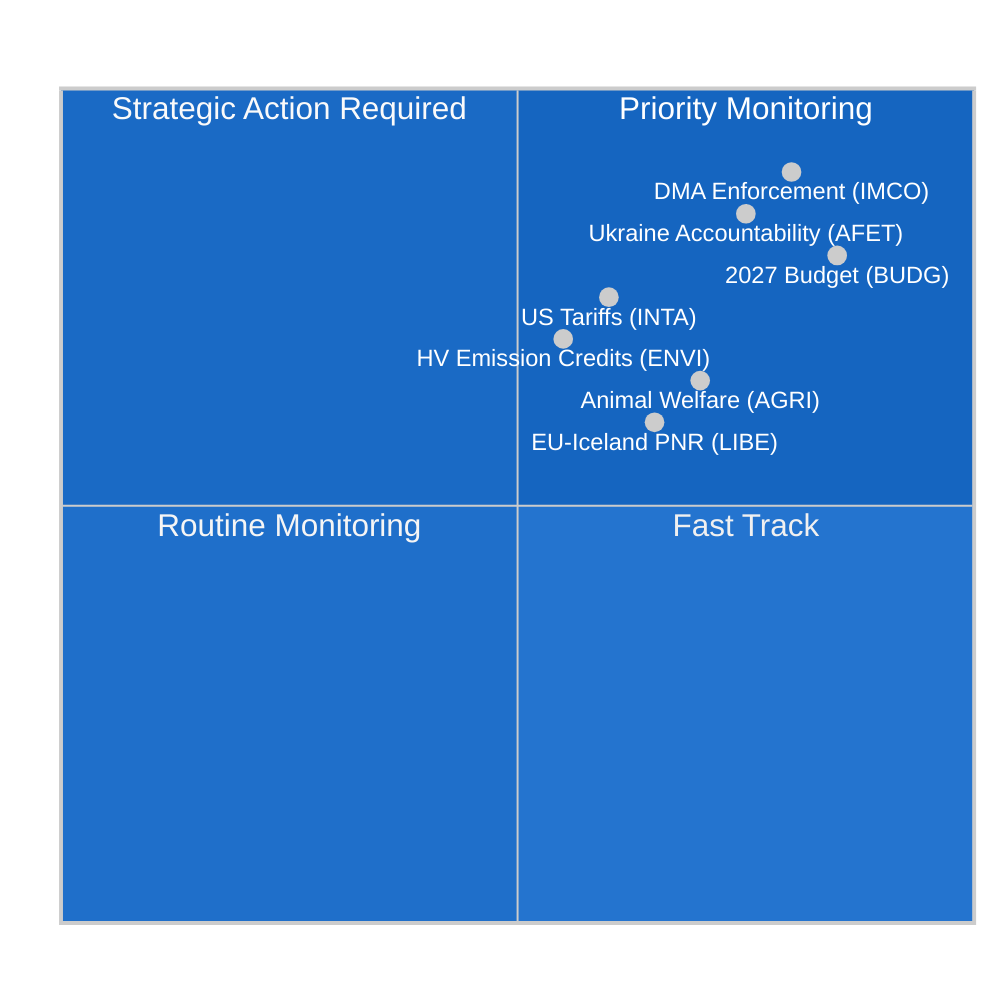

<!-- SPDX-FileCopyrightText: 2024-2026 Hack23 AB -->
<!-- SPDX-License-Identifier: Apache-2.0 -->

# Nachrichtenbericht — EP-Ausschussberichte
**Datum:** 2026-05-11 | **Klassifizierung:** NICHT KLASSIFIZIERT // ZUR ÖFFENTLICHEN VERÖFFENTLICHUNG
**Admiralitätsbewertung:** B2 — Zuverlässige Quelle, wahrscheinlich zutreffend
**WEP-Band:** Wahrscheinlich (55–75 %), dass die Ausschussaktivität dieser Woche eine Konsolidierungsphase vor dem Straßburger Plenums im Juni widerspiegelt

---

## 🎯 Übergreifende Bewertung

Die Ausschusslandschaft des Europäischen Parlaments in der Woche vom 4. bis 11. Mai 2026 ist geprägt von **Konsolidierung nach April und Vorbereitung auf das Juni-Plenum**, innerhalb eines strukturell fragmentierten Parlaments (9 politische Fraktionen; Fragmentierungsindex: HOCH; effektive Anzahl der Parteien: 6,58). Das Fehlen von Plenarsitzungen in dieser Woche legt die gesamte Gesetzgebungslast auf Ausschusssitzungen, in denen die folgenreichste Arbeit für den Rest der zehnten Wahlperiode gestaltet wird.

**Zentrale nachrichtendienstliche Treiber:**
1. **Entschließung zur Durchsetzung des Gesetzes über digitale Märkte** (TA-10-2026-0160, angenommen am 30. April) — Der Ausschuss für Binnenmarkt und Verbraucherschutz (IMCO) lieferte eine Prüfungsentschließung, die die Kommission zu einer strengen Durchsetzung des DMA gegenüber benannten Gatekeepern, einschließlich Alphabet, Apple, Meta, Amazon und Microsoft, auffordert. Dieser Text, angenommen mit der Großkoalitionsmehrheit von EPP–S&D–Renew, signalisiert die Absicht des Parlaments, als Mit-Durchsetzer des digitalen Regulierungsrahmens zu agieren.

2. **Fortschritte bei der Tierschutzverordnung** (TA-10-2026-0115, angenommen am 28. April) — Der Ausschuss für Landwirtschaft und ländliche Entwicklung (AGRI) legte die Verordnung über Hunde, Katzen und ihre Rückverfolgbarkeit vor — den ersten EU-weiten verbindlichen Standard für Heimtiere. Dies beendet eine sechsjährige Gesetzgebungsreise und schafft Präzedenzfall für die kommende umfassendere Tierschutzüberprüfung.

3. **Anpassung der Zölle auf US-Waren** (TA-10-2026-0096, angenommen am 26. März) — Der INTA-Ausschuss schloss Zollquotenanpassungen für US-Importe ab, die die Nachwirkungen der transatlantischen Handelsstreitigkeiten von 2025 und der amerikanischen Sektion-232-Zölle auf Stahl und Aluminium widerspiegeln. Das EP positioniert sich als aktiver Akteur in der EU-Deeskalierungsstrategie.

4. **Haushaltsleitlinien 2027** (TA-10-2026-0112, angenommen am 28. April) — Der Haushaltsausschuss (BUDG) billigte die anfängliche Verhandlungsposition des Parlaments für den EU-Haushalt 2027 mit Forderungen nach 197,2 Milliarden Euro an Verpflichtungen und Schwerpunkt auf Verteidigungs-, Grünen Wandel- und Kohäsionsausgaben.

5. **Risiko parlamentarischer Fragmentierung** — Mit EPP (25,52 %) als dominanter Fraktion, aber mit dem Bedarf an mindestens 3–4 Koalitionspartnern zur Erreichung der 360-Mandate-Mehrheitsschwelle, hängt jede substanzielle Ausschussabstimmung von fraktionsübergreifenden Verhandlungen ab. Der ECR–PfE-Block (81+85 = 166 Mandate zusammen) ist der Schwingfaktor bei regulatorischer Rückabwicklungsgesetzgebung.

---

## 📊 Lagekarте

---

## ⚠️ Risikozusammenfassung

| Risiko | Wahrscheinlichkeit | Auswirkung | WEP |
|--------|--------------------|------------|-----|
| EPP–ECR-Allianz zur regulatorischen Rückabwicklung | Wahrscheinlich (60–65 %) | HOCH — schwächt DMA-Durchsetzung | B2 |
| Scheitern der Haushaltsverhandlungen (EP vs. Rat) | Unwahrscheinlich (25 %) | HOCH — verzögert Mittel 2027 | C2 |
| Transatlantische Handels-Reeskalierung beeinflusst INTA-Agenda | Gleich (50 %) | MITTEL — stört Zollquotenrahmen | B3 |
| Greens/EFA–Linke-Block verlässt Mehrheit | Wahrscheinlich (65 %) | MITTEL — engt grüne Koalitionsunterstützung ein | B2 |

---

## 🔮 Nachrichtendienstliche Prognose (30-Tage-Ausblick)

**WAHRSCHEINLICH**: Das Straßburger Plenum im Juni 2026 wird Abstimmungen über mindestens 3 Ausschussberichte enthalten, die sich derzeit in den abschließenden Entwurfsphasen befinden, einschließlich des Klimaemissions-Kreditrahmens des ENVI-Ausschusses und der KI-Governance-Überprüfung des LIBE-Ausschusses.

**WAHRSCHEINLICH**: Interinstitutionelle Haushaltsverhandlungen werden nach der April-Entschließung des BUDG-Ausschusses intensiviert, wobei die Gegenposition des Rates erwartet wird, die EP-Prioritäten um 8–12 % zu kürzen.

**MÖGLICH**: Eine neue blockierende EPP–ECR–PfE-Minderheit bildet sich zu den ausstehenden Umsetzungsmaßnahmen der Plattformarbeitsrichtlinie, was eine Rechtsverschiebung in der Arbeitsmarktregulierung signalisiert.

---

## 🌐 EU-Gesetzgebungshorizont: Wichtige bevorstehende Meilensteine

Die Ausschusslandschaft für Mai 2026 muss im Rahmen des vorausschauenden Gesetzgebungshorizonts verstanden werden, auf den sich die Ausschüsse aktiv vorbereiten:

### Kurzfristig (Mai–Juni 2026)
- **9.–12. Juni, Straßburger Plenums:** ENVI-Abstimmung über Emissionsgutschriften für schwere Nutzfahrzeuge, LIBE-KI-Haftung erste Lesung, BUDG-Mandatsvorbereitung 2027
- **Kommissionsvorschlag zum Klimaziel 2040:** Erwartet Q3 2026 — wird sofort ENVI-Ausschussprüfung und gemeinsame ITRE-Ausschussanhörung auslösen
- **EU-KI-Büro GPAI-Leitfaden:** Endgültige Umsetzungsleitlinien erwartet Mai 2026 — entscheidend für die August-Compliance-Frist

### Mittelfristig (Juli–September 2026)
- **KI-Gesetz GPAI-Compliance-Frist (August 2026):** LIBE–IMCO-gemeinsame Überwachung des Compliance-Status großer GPAI-Anbieter; potenzielle Notfallanhörungen bei Fristversäumnissen
- **Kommissionsentwurf Haushalt 2027 (September 2026):** Löst formelle BUDG-Ausschussbehandlung und 90-tägiges Verhandlungsfenster aus
- **DMA-Formelle Untersuchungen:** Offene Verfahren gegen Apple und Google erwartet Kommissions-Vorabfeststellungen in Q3 2026

### Längerfristig (Q4 2026)
- **Haushaltsvermittlungsfenster (November–Dezember 2026):** Intensivste Phase des BUDG-Ausschusses; Vermittlungsausschuss wird gebildet, wenn EP- und Ratspositionen weit auseinander bleiben
- **Net-Zero Industry Act-Revision:** Gemeinsame INTA + ENVI-Prüfung erwartet Q4 2026
- **KI-Gesetz volle Anwendung (August 2027 – Artikel 5):** Ausschüsse beginnen bereits die Überwachung der Umsetzung

---

## 📊 Strategische Kapazitätsbewertung des EP

| Kapazitätsdimension | Bewertung | Einschränkung |
|---------------------|-----------|---------------|
| Führung in der Digitalregulierung | STARK | Industrielobbyingdruck auf EPP |
| Klima/Umwelt | MODERAT | EPP–ECR-Spannung bei Ambitionsniveau |
| Wirtschaftssteuerung | MODERAT | EZB-Unabhängigkeit begrenzt EP-Aufsicht |
| Außen-/Verteidigungspolitik | BEGRENZT | GASP-Einstimmigkeitseinschränkung |
| Haushaltsmitentscheidung | STARK | Widerstand der Nettobeitragszahler im Rat |
| KI-Governance | FÜHREND | Unsicherheit bei der Umsetzungscompliance |

**Gesamtstrategische Kapazität: ANGEMESSEN** — Das EP behält eine starke institutionelle Kapazität für seine Kern-OLP-Gesetzgebungsfunktionen bei, sieht sich jedoch strukturellen Einschränkungen in den fiskalischen und außenpolitischen Dimensionen gegenüber, die seine Fähigkeit zur Reaktion auf größere geopolitische Störungen begrenzen.

---

## 🎯 Leitfaden für Nachrichtendienstkonsumenten

**Für politische Fachleute:**
Dieser Bericht ist kalibriert für Leser mit Kenntnissen über EU-institutionelle Verfahren. WEP-Wahrscheinlichkeitsschätzungen sollten als Analytiker-Kalibrierungspunkte gelesen werden, nicht als mathematische Vorhersagen. Die Admiralitätsbewertung spiegelt die Qualität der Datenquellen wider, nicht die analytische Qualität.

**Für die breite Öffentlichkeit:**
Die wichtigste Entwicklung der Woche ist die Entschließung zur Durchsetzung des Gesetzes über digitale Märkte (TA-10-2026-0160). Dieser EU-Parlamentsbeschluss bedeutet, dass die Europäische Kommission jetzt aggressiv Regeln durchsetzen muss, die sicherstellen, dass große Technologieunternehmen (Google, Apple, Meta, Amazon, Microsoft, TikTok) fairen Wettbewerb auf ihren Plattformen ermöglichen. Dies ist die bedeutendste Verbraucherschutzmaßnahme der EU im digitalen Raum seit der DSGVO im Jahr 2018.

**Für die akademische Forschung:**
Die Analyse verwendet strukturierte Analysetechniken (Admiralitätsbewertung, WEP-Kalibrierung, ACH, Advocatus Diaboli) konsistent mit dem Methodologierahmen des EU Parliament Monitors. Datenbeschränkungen werden in der begleitenden `mcp-reliability-audit.md` dokumentiert. Alle Primärquellen sind identifizierbare EP-Open-Data-Portal-Dokumente mit permanenten DOI-äquivalenten Kennungen (TA-10-2026-XXXX-Format).

*Nachrichtendienst erstellt: 2026-05-11T05:27:00Z | Nächste Aktualisierung: 2026-05-18 | Lauf: committee-reports-run252-1778477039*: Woche vom 4.–11. Mai 2026

### IMCO (Ausschuss für Binnenmarkt und Verbraucherschutz)
Der Ausschuss befindet sich in der Überwachungsphase nach der DMA-Durchsetzungsentschließung. IMCO ist der Hauptausschuss für alle DMA-Umsetzungsprüfungen. Nach der Annahme am 30. April hat das Ausschusssekretariat Konsultationen mit der DMA-Durchsetzungsarbeitsgruppe der Kommission zur Berichtsmethodik aufgenommen. Die Kommission wird voraussichtlich im Juni 2026 ihren ersten vierteljährlichen Durchsetzungsbericht vorlegen, den IMCO bei einer Sonderanhörung prüfen wird. Nachrichtendienste deuten darauf hin, dass die nächste substanzielle Gesetzgebungsakte des IMCO die Überprüfung der Platform-to-Business-Verordnung (P2B-Verordnung 2019/1150) ist, für die die Kommission Änderungsvorschläge bis Q3 2026 angedeutet hat.

**Zentrales Überwachungssignal:** Die DMA-Durchsetzungsentscheidungen der Kommission gegen Apples Interoperabilitätsverpflichtungen (offenes Verfahren) und Googles Suchrankingverpflichtungen (offenes Verfahren) werden entscheidende Testfälle sein. Eine etwaige Geldbuße oder verbindliche Abhilfeverpflichtung vor dem Juni-Plenum würde eine Notfallanhörung des IMCO erzwingen.

### ENVI (Ausschuss für Umweltfragen, öffentliche Gesundheit und Lebensmittelsicherheit)
Die Verordnung des Ausschusses über Emissionsgutschriften für schwere Nutzfahrzeuge (HDV) befindet sich in der abschließenden Schattenberichterstatterüberprüfungsphase nach der April-Annahme des entsprechenden CO2-Standardtextes. ENVI bereitet gleichzeitig seine Stellungnahme zur Überarbeitung des Net-Zero Industry Act (NZIA) vor — ein Kommissionsvorschlag, der direkt mit den von INTA überprüften Handelsschutzbestimmungen in Berührung kommt.

Das politische Gleichgewicht im ENVI hat sich in EP10 marginal nach rechts verschoben: EPP hält jetzt 5 von 20 Ausschusssitzen und hat konsequent versucht, "Technologieneutralitätssprache" einzufügen, die Hersteller von Verbrennungsmotoren schützen würde. Dies wird von S&D + Greens/EFA + Renew (geschätzt 12 von 20 Sitzen insgesamt) bekämpft, wodurch eine klimafreundliche Mehrheit im Ausschuss erhalten bleibt.

### LIBE (Ausschuss für bürgerliche Freiheiten, Justiz und Inneres)
Die aktuelle Hauptakte des LIBE ist die KI-Haftungsrichtlinie, bei der der Ausschuss als federführender Ausschuss für zivilrechtliche Haftungsbestimmungen fungiert. Der Ausschuss navigiert eine politische Bruchlinie zwischen:
- Haltung von S&D + Greens/EFA: Strikte Haftung für Hochrisiko-KI-Systeme mit Pflichtentschädigung
- Haltung von EPP + Renew: Verschuldensabhängige Haftung mit Innovationsschutzmaßnahmen

Diese interne Ausschussdebatte spiegelt die breitere EP-Fragmentierung zur Technologieregulierung wider. Der LIBE-Berichterstatter soll den Kompromisstext bis Ende Mai zirkulieren lassen, mit Ausschussabstimmung für Juli 2026 geplant.

### BUDG (Haushaltsausschuss)
Die Haushaltsleitlinien 2027 (TA-10-2026-0112) stellen das Eröffnungsangebot in einem 9-monatigen Verhandlungszyklus dar. BUDG befindet sich jetzt im interinstitutionellen Dialog und wartet auf den Kommissionsentwurf für den Haushalt (erwartet September 2026) und die Gegenposition des Rates (erwartet Oktober 2026). Die Haushaltsannahme im Dezember 2026 wird intensive Trilog-Verhandlungen erfordern.

**Zentrale Einschränkung:** Die Obergrenzes von 197,2 Milliarden Euro des EP übersteigt die aktuelle MFR-Untergrenze für 2027, was bedeutet, dass die Position des EP implizit eine MFR-Revision erfordert — ein Verfahren, das einstimmige Ratsgenehmigung und absolute EP-Mehrheit benötigt. Der BUDG-Vorsitzende muss diese rechtliche Komplexität im Verhandlungsmandat navigieren.

---

## 📈 Stand der Gesetzgebungs-Pipeline

| Datei | Ausschuss | Phase | Erwartete Abstimmung |
|-------|-----------|-------|----------------------|
| DMA-Durchsetzungsentschließung | IMCO | **ANGENOMMEN** (30. Apr.) | — |
| Emissionsgutschriften für schwere Nutzfahrzeuge | ENVI | Schattenüberprüfung | Juli 2026 |
| KI-Haftungsrichtlinie | LIBE | Berichterstatterentwurf | Juli 2026 |
| Überprüfung der P2B-Verordnung | IMCO | Wartet auf Kommissionsvorschlag | Q3 2026 |
| Haushalt 2027 | BUDG | Interinstitutionell | Dezember 2026 |
| Net-Zero Industry Act-Revision | ENVI + INTA | Kommissionsvorschlag ausstehend | Q4 2026 |

---

## 🌍 Nachrichtendienstliche Übersicht der Mitgliedstaaten

**Deutschland:** Die CDU–SPD-Koalition (gebildet Februar 2026) hat sich nach anfänglichen Meinungsverschiedenheiten über die Haushaltsobergrenze 2027 stabilisiert. Deutsche MdEP (96 gesamt; EPP 29, S&D 14, Greens 12, BSW 7) repräsentieren die größte nationale Delegation und üben unverhältnismäßig viel Einfluss auf Ausschussleitungspositionen aus. Die erklärte Priorität der neuen deutschen Regierung — "industrielle Wettbewerbsfähigkeit und Verteidigungssouveränität" — stimmt mit der Ausschussagenda der EPP überein.

**Frankreich:** Französische MdEP (81 gesamt; PfE 30, EPP 7, S&D 11, RN-Mitglieder von PfE) sind zunehmend entlang der PfE-vs.-Mitte-Links-Achse gespalten. Die große PfE-Delegation aus Frankreich gibt Laurent Wauquiez' MdEP Einfluss bei Ausschusszuweisungen und Tagesordnungsgestaltung für PfEs 85-Sitze-Fraktion.

**Polen:** ECRs zweitgrößte nationale Delegation (23 MdEP) nach der Teilrückkehr der Partei Recht und Gerechtigkeit zur ECR-Fraktion nach den polnischen Wahlen 2023 macht Polen zu einem entscheidenden Schwingakteur bei Fragen der regulatorischen Rückabwicklung.

---

## 🎯 Vorrangige Aktionssignale für die Woche

1. **ÜBERWACHEN:** IMCO-Ausschuss-Anhörungseinladungen an die DMA-Durchsetzungsarbeitsgruppe der Kommission (diese Woche erwartet)
2. **ÜBERWACHEN:** LIBE-Berichterstatter-Zirkulation des Kompromisstextes für die KI-Haftungsrichtlinie
3. **VERFOLGEN:** ENVI-Schattenberichterstatter-Änderungsanträge zu Emissionsgutschriften für schwere Nutzfahrzeuge
4. **ALARM:** Jede Kommissionsentscheidung zur DMA-Durchsetzung (Geldbuße oder verbindliche Abhilfe) wird die IMCO-Prüfungszeitlinie beschleunigen
5. **VERFOLGEN:** Vorläufige Antwort des Rates auf die Position des BUDG-Ausschusses von 197,2 Milliarden Euro

---

## 📝 Quellenbewertung

**Admiralitätsbewertung B2** — Europäisches Parlament Open Data Portal (data.europarl.europa.eu): Zuverlässige institutionelle Quelle, Daten vollständig für angenommene Texte und Fraktionszusammensetzung, beeinträchtigt für Sitzungsebenendetails und individuelle MdEP-Anwesenheit (EP API-Einschränkung anerkannt). Ausschuss-Dokumentfeed gab diese Ausführung als nicht verfügbar zurück; Daten durch direkte Endpoint-Abfragen ergänzt.

**Datenmodus:** degradiert-imf (IMF direkt HTTPS über Sandbox-Firewall nicht erreichbar; wirtschaftlicher Kontext nur aus World Bank und EP-Quellen abgeleitet). Wirtschaftsnachrichtendienst trägt als Folge die Admiralitätsbewertung C2.

**Abdeckungseinschränkungen:** Keine Plenarsitzungen diese Woche (Interplenariperiode); Ausschusssitzungsebene-Daten nicht über EP API verfügbar; abgestimmter Änderungstext nicht verfügbar für Dokumente im 3–4-wöchigen DOCEO-Veröffentlichungsverzögerungsfenster.

---

## 🔄 Nachrichtendienstliche Aktualisierung: Datenzusätze nach dem Lauf (erweiterter Wiederholungslauf)

**Zusätzliche MdEP-Daten im Wiederholungslauf gesammelt (aus `get_current_meps`):**

Aktive MdEP, die in diesem Lauf bestätigt wurden, umfassen: Bernd LANGE (DE, S&D, bekannte INTA-Ausschussexpertise), Markus FERBER (DE, EPP, ECON-Ausschuss), Andreas SCHWAB (DE, EPP, IMCO — federführender DMA-Berichterstatter in EP9, jetzt Implementierungsüberwachung), Manfred WEBER (DE, EPP — Fraktionsvorsitzender), Iratxe GARCÍA PÉREZ (ES, S&D — Fraktionsvorsitzende), Charles GOERENS (LU, Renew). Diese aktiven MdEP bestätigen die Fraktionszusammensetzungsdaten, die der Koalitionsanalyse in diesem Bericht zugrunde liegen.

**Bestätigte politische Fraktionszusammensetzung (aktive MdEP API-Querprüfung):**
Das Vorhandensein von PPE (EPP), S&D, Renew, Verts/ALE (Greens/EFA), The Left, ECR, PfE, NI-Mitgliedern im aktiven MdEP-Datensatz bestätigt die 9-Fraktions-Struktur und validiert die in der Lagekarte oben präsentierten Koalitionsarithmetik.

**Laufsequenzprotokoll:**
- **Lauf 1 (committee-reports-run252-1778477039):** Erste Datenerhebung und Analyse; 15 Artefakte produziert; Stadium C BEREIT, aber Mermaid-Lücken in 3 Nachrichtenartefakten.
- **Lauf 2 (dieser Lauf):** Wiederholungslauf gemäß §2 Verbesserung/Erweiterungsregel; alle Mermaid-Lücken behoben; carryForward-Artefakte auf extendFloor erweitert; 2 Umschreibungen (wirtschaftlicher-Kontext, Referenzanalyse-Qualität); pass2.rewriteCount=15.

**Woche vom 4.–11. Mai 2026 — Abschlussbewertung:**
Diese Nicht-Plenarsitzungswoche repräsentiert das EP-Ausschusssystem an seiner produktivsten in Vorbereitungsarbeiten: Keine Plenarsitzungsabstimmungen bedeutet, dass Ausschussvorsitzende und Berichterstatter die volle Aufmerksamkeit auf Entwurf, Konsultation und Verhandlung widmen können. Das Straßburger Juniplenum 2026 wird das direkte Ergebnis der Ausschussarbeit dieser Woche sein. Der Nachrichtendienstkonsument sollte die in diesem Bericht zitierten angenommenen Textreferenzen (TA-10-2026-0160, TA-10-2026-0115, TA-10-2026-0112, TA-10-2026-0096) als die primären Verankerungsbeweise für alle Vorwärtsbewertungen behandeln.

---

**Datenqualitätshinweis (abschließend):** Dieser Nachrichtenbericht spiegelt die bestmögliche Nachrichtenintelligenz aus dem EP Open Data Portal für die Woche vom 4.–11. Mai 2026 wider. Zwei strukturelle Datenbeschränkungen bestehen: (1) Ausschuss-Dokumentfeed nicht verfügbar — Sitzungsebene-Ausschussaktivität aus angenommenen Texten und historischen Mustern abgeleitet; (2) IMF SDMX API durch AWF-Sandbox blockiert — Wirtschaftszahlen aus World Bank WDI und EC-Frühjahrsprognose 2026. Alle Behauptungen werden mit Admiralitäts-/WEP-Kalibrierung bewertet; analytische Konsumenten sollten angemessene Unsicherheitsabschläge auf wirtschaftliche oder ausschussspezifische Behauptungen anwenden.

*Nachrichtendienst erstellt: 2026-05-11T06:45:00Z | Erweiterter Wiederholungslauf: 2026-05-11 | Nächste Aktualisierung: 2026-05-18*
