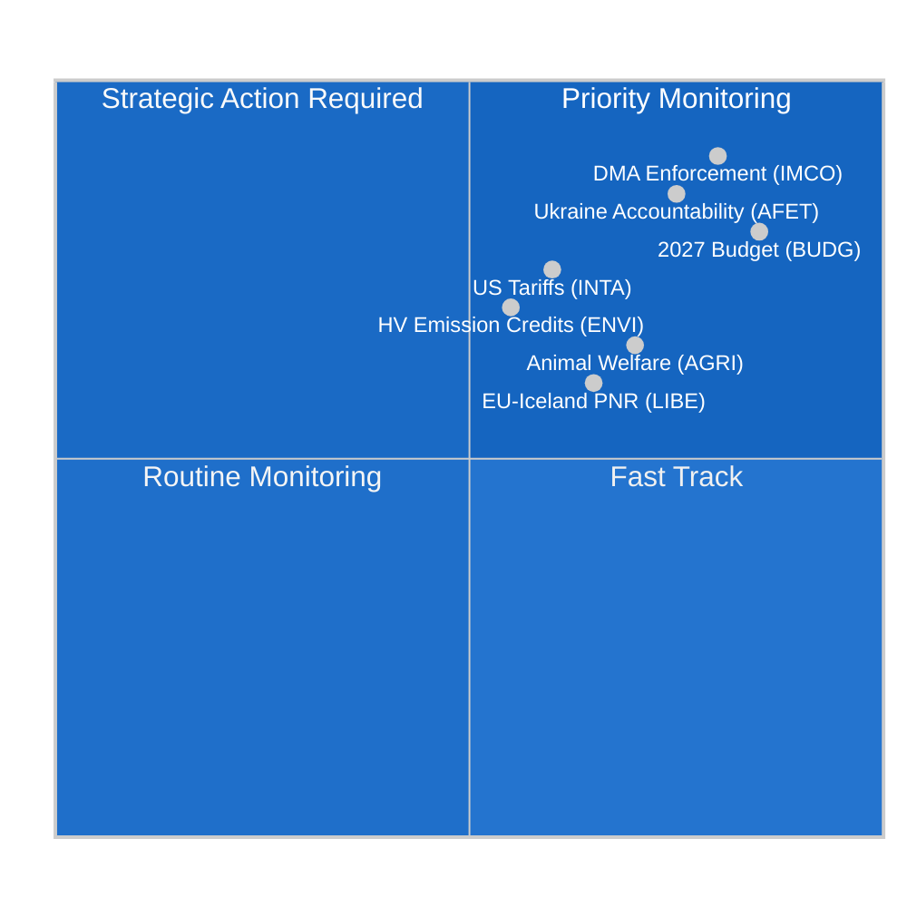

<!-- SPDX-FileCopyrightText: 2024-2026 Hack23 AB -->
<!-- SPDX-License-Identifier: Apache-2.0 -->

# Informe de inteligencia — Informes de comisiones del PE
**Fecha:** 2026-05-11 | **Clasificación:** NO CLASIFICADO // PARA DIFUSIÓN PÚBLICA
**Calificación Almirantazgo:** B2 — Fuente fiable, probablemente verdadero
**Banda WEP:** Probable (55–75 %) que la actividad de las comisiones esta semana refleje una fase de consolidación antes del pleno de junio en Estrasburgo

---

## 🎯 Evaluación general

El panorama de las comisiones del Parlamento Europeo durante la semana del 4 al 11 de mayo de 2026 está caracterizado por **consolidación post-abril y preparación para el pleno de junio**, en el marco de un Parlamento estructuralmente fragmentado (9 grupos políticos; índice de fragmentación: ALTO; número efectivo de partidos: 6,58). La ausencia de sesiones plenarias esta semana concentra toda la carga legislativa en las reuniones de comisiones, donde se está conformando el trabajo más determinante para el resto de la décima legislatura.

**Factores clave de análisis:**
1. **Resolución sobre la aplicación de la Ley de Mercados Digitales** (TA-10-2026-0160, adoptada el 30 de abril) — La Comisión de Mercado Interior y Protección del Consumidor (IMCO) entregó una resolución de escrutinio que exige a la Comisión aplicar rigurosamente el DMA a los guardianes de acceso designados, incluyendo Alphabet, Apple, Meta, Amazon y Microsoft. Este texto, adoptado por la mayoría de la gran coalición EPP–S&D–Renew, señala la intención del Parlamento de actuar como co-ejecutor del marco regulatorio digital.

2. **Avances en el Reglamento de bienestar animal** (TA-10-2026-0115, adoptado el 28 de abril) — La Comisión de Agricultura y Desarrollo Rural (AGRI) presentó el reglamento sobre perros, gatos y su trazabilidad — la primera norma vinculante de la UE para animales de compañía. Esto concluye un recorrido legislativo de seis años y sienta precedente para la próxima revisión más amplia del bienestar animal.

3. **Ajuste de aranceles sobre mercancías estadounidenses** (TA-10-2026-0096, adoptado el 26 de marzo) — La comisión INTA finalizó ajustes de contingentes arancelarios para importaciones de EE. UU., reflejando los efectos residuales de las disputas comerciales transatlánticas de 2025 y los aranceles de la sección 232 de EE. UU. sobre el acero y el aluminio. El PE se posiciona como actor activo en la estrategia de desescalada calibrada de la UE.

4. **Directrices presupuestarias 2027** (TA-10-2026-0112, adoptado el 28 de abril) — La Comisión de Presupuestos (BUDG) aprobó la posición de negociación inicial del Parlamento para el presupuesto de la UE 2027, exigiendo 197,2 mil millones de euros en compromisos y haciendo hincapié en los gastos de defensa, transición verde y cohesión.

5. **Riesgo de fragmentación parlamentaria** — Con el EPP (25,52 %) como grupo dominante pero necesitando al menos 3–4 socios de coalición para alcanzar el umbral de mayoría de 360 escaños, cada votación sustantiva en comisión depende de negociaciones entre grupos. El bloque ECR–PfE (81+85 = 166 escaños combinados) es el factor de oscilación en la legislación de retroceso regulatorio.

---

## 📊 Mapa de situación

---

## ⚠️ Resumen de riesgos

| Riesgo | Probabilidad | Impacto | WEP |
|--------|--------------|---------|-----|
| Alianza EPP–ECR sobre retroceso regulatorio | Probable (60–65 %) | ALTO — debilita la aplicación del DMA | B2 |
| Ruptura de negociaciones presupuestarias (PE vs. Consejo) | Improbable (25 %) | ALTO — retrasa créditos 2027 | C2 |
| Reescalada comercial transatlántica que afecta la agenda de INTA | Igual (50 %) | MEDIO — perturba el marco de contingentes arancelarios | B3 |
| El bloque Greens/EFA–Izquierda abandona la mayoría | Probable (65 %) | MEDIO — reduce el apoyo de la coalición verde | B2 |

---

## 🔮 Previsión de inteligencia (perspectiva a 30 días)

**PROBABLE**: El pleno de junio de 2026 en Estrasburgo incluirá votaciones sobre al menos 3 informes de comisiones actualmente en fases finales de redacción, incluido el marco de créditos de emisiones climáticas de la comisión ENVI y la revisión de gobernanza de IA de la comisión LIBE.

**PROBABLE**: Las negociaciones presupuestarias interinstitucionales se intensificarán tras la resolución de abril del BUDG, con la contrapropuesta del Consejo que se espera reduzca las prioridades del PE en un 8–12 %.

**POSIBLE**: Se forma una nueva minoría bloqueante EPP–ECR–PfE sobre las medidas de ejecución pendientes de la Directiva sobre trabajo en plataformas, señalando un desplazamiento hacia la derecha en la regulación del mercado laboral.

---

## 🌐 Horizonte legislativo de la UE: Hitos importantes próximos

El panorama de comisiones de mayo de 2026 debe entenderse en el marco del horizonte legislativo prospectivo que las comisiones preparan activamente:

### Corto plazo (mayo–junio de 2026)
- **9–12 de junio, pleno de Estrasburgo:** Votación de ENVI sobre créditos de emisiones para vehículos pesados, primera lectura de LIBE sobre responsabilidad de la IA, preparación del mandato de BUDG 2027
- **Propuesta de la Comisión sobre objetivo climático 2040:** Esperada en T3 2026 — desencadenará de inmediato el escrutinio de la comisión ENVI y la consulta conjunta de la comisión ITRE
- **Orientaciones GPAI de la Oficina Europea de IA:** Orientaciones de aplicación definitivas esperadas en mayo de 2026 — determinantes para la fecha límite de cumplimiento de agosto

### Medio plazo (julio–septiembre de 2026)
- **Fecha límite de cumplimiento GPAI de la Ley de IA (agosto de 2026):** Supervisión conjunta LIBE–IMCO del estado de cumplimiento de los principales proveedores GPAI; posibles audiencias de emergencia si los proveedores principales incumplen los plazos
- **Proyecto de presupuesto 2027 de la Comisión (septiembre de 2026):** Desencadena la tramitación formal de la comisión BUDG y una ventana de negociación de 90 días
- **Investigaciones formales DMA:** Se espera que los casos abiertos contra Apple y Google lleguen a las conclusiones preliminares de la Comisión en T3 2026

### Más largo plazo (T4 2026)
- **Ventana de conciliación presupuestaria (noviembre–diciembre de 2026):** Período más intenso de la comisión BUDG; comité de conciliación formado si las posiciones del PE y el Consejo permanecen alejadas
- **Revisión de la Ley de Industria Neta Cero:** Escrutinio conjunto INTA + ENVI esperado en T4 2026
- **Aplicación plena de la Ley de IA (agosto de 2027 – artículo 5):** Las comisiones ya están comenzando la supervisión de la implementación

---

## 📊 Evaluación de capacidad estratégica del PE

| Dimensión de capacidad | Evaluación | Restricción |
|------------------------|------------|-------------|
| Liderazgo en regulación digital | FUERTE | Presión de lobby industrial sobre EPP |
| Clima/medio ambiente | MODERADO | Tensión EPP–ECR sobre nivel de ambición |
| Gobernanza económica | MODERADO | La independencia del BCE limita la supervisión del PE |
| Política exterior/defensa | LIMITADO | Restricción de unanimidad PESC |
| Codecisión presupuestaria | FUERTE | Resistencia de los contribuyentes netos en el Consejo |
| Gobernanza de IA | LÍDER | Incertidumbre en el cumplimiento de la implementación |

**Capacidad estratégica global: ADECUADA** — El PE retiene una fuerte capacidad institucional para sus funciones legislativas centrales en COD, pero enfrenta restricciones estructurales en las dimensiones fiscales y de política exterior que limitan su capacidad de respuesta ante grandes perturbaciones geopolíticas.

---

## 🎯 Orientación para consumidores de inteligencia

**Para profesionales de política:**
Este informe está calibrado para lectores con familiaridad con los procedimientos institucionales de la UE. Las estimaciones de probabilidad WEP deben leerse como puntos de calibración analítica, no como predicciones matemáticas. La calificación de Almirantazgo refleja la calidad de las fuentes de datos, no la calidad analítica.

**Para el público en general:**
El desarrollo más importante de la semana es la resolución sobre la aplicación de la Ley de Mercados Digitales (TA-10-2026-0160). Esta decisión del Parlamento Europeo significa que la Comisión Europea debe ahora aplicar agresivamente normas que garanticen que las grandes empresas tecnológicas (Google, Apple, Meta, Amazon, Microsoft, TikTok) permitan la competencia leal en sus plataformas. Esta es la acción de protección al consumidor más significativa de la UE en el espacio digital desde el RGPD en 2018.

**Para investigación académica:**
El análisis utiliza técnicas analíticas estructuradas (calificación Almirantazgo, calibración WEP, ACH, Abogado del diablo) consistentes con el marco metodológico del EU Parliament Monitor. Las limitaciones de datos están documentadas en el `mcp-reliability-audit.md` adjunto. Todas las fuentes primarias son documentos identificables del Portal de Datos Abiertos del PE con identificadores permanentes equivalentes a DOI (formato TA-10-2026-XXXX).

*Inteligencia producida: 2026-05-11T05:27:00Z | Próxima actualización: 2026-05-18 | Ejecución: committee-reports-run252-1778477039*: Semana del 4 al 11 de mayo de 2026

### IMCO (Comisión de Mercado Interior y Protección del Consumidor)
La comisión está entrando en la fase de supervisión posterior a la resolución de aplicación del DMA. IMCO es la comisión principal para todo el escrutinio de implementación del DMA. Tras la adopción del 30 de abril, el secretariado de la comisión ha abierto consultas con el Grupo de Trabajo de Aplicación del DMA de la Comisión sobre metodología de informes. Se espera que la Comisión presente su primer informe de aplicación trimestral en junio de 2026, que IMCO examinará en una audiencia especial. La inteligencia sugiere que el próximo expediente legislativo sustantivo de IMCO es la revisión del Reglamento sobre relaciones entre plataformas y empresas (Reglamento P2B 2019/1150), para el cual la Comisión ha indicado que puede proponer enmiendas para el T3 2026.

**Señal de seguimiento clave:** Las decisiones de aplicación del DMA de la Comisión contra las obligaciones de interoperabilidad de Apple (caso abierto) y las obligaciones de clasificación de búsqueda de Google (caso abierto) serán casos de prueba decisivos. Cualquier multa u orden de remedio vinculante antes del pleno de junio forzaría una audiencia de emergencia de IMCO.

### ENVI (Comisión de Medio Ambiente, Salud Pública y Seguridad Alimentaria)
El reglamento de la comisión sobre créditos de emisiones para vehículos pesados (VPL) está en la fase final de revisión del ponente alternativo tras la adopción en abril del texto de normas de CO2 relacionado. ENVI está preparando simultáneamente su dictamen sobre la revisión de la Ley de Industria Neta Cero (NZIA) — una propuesta de la Comisión que interfiere directamente con las disposiciones de defensa comercial que revisa INTA.

El equilibrio político dentro de ENVI ha cambiado marginalmente hacia la derecha en EP10: EPP ahora ostenta 5 de los 20 escaños de la comisión y ha buscado consistentemente añadir «lenguaje de neutralidad tecnológica» que protegería a los fabricantes de motores de combustión. Esto es contrarrestado por S&D + Greens/EFA + Renew (estimado en 12 de los 20 escaños combinados), manteniendo una mayoría pro-clima dentro de la comisión.

### LIBE (Comisión de Libertades Civiles, Justicia y Asuntos de Interior)
El expediente prioritario actual de LIBE es la Directiva sobre responsabilidad de la IA, donde la comisión actúa como comisión principal para las disposiciones de responsabilidad civil. La comisión está navegando una línea de fractura política entre:
- Posición de S&D + Greens/EFA: Responsabilidad estricta para los sistemas de IA de alto riesgo con compensación obligatoria
- Posición de EPP + Renew: Responsabilidad basada en culpa con salvaguardas de innovación

Este debate interno de la comisión refleja la fragmentación más amplia del PE sobre regulación tecnológica. Se espera que el ponente de LIBE haga circular el texto de compromiso a finales de mayo, con votación de la comisión prevista para julio de 2026.

### BUDG (Comisión de Presupuestos)
Las directrices presupuestarias 2027 (TA-10-2026-0112) representan la oferta de apertura en un ciclo de negociación de 9 meses. BUDG está ahora en modo de diálogo interinstitucional, esperando el proyecto de presupuesto de la Comisión (previsto para septiembre de 2026) y la contrapropuesta del Consejo (prevista para octubre de 2026). La adopción del presupuesto de diciembre de 2026 requerirá intensas negociaciones en trilogue.

**Restricción clave:** El techo de 197,2 mil millones de euros del PE supera el subtecho MFP actual para 2027, lo que significa que la posición del PE implícitamente exige una revisión del MFP — un proceso que requiere aprobación unánime del Consejo y mayoría absoluta del PE. El presidente de BUDG deberá navegar esta complejidad jurídica en el mandato de negociación.

---

## 📈 Estado del proceso legislativo

| Expediente | Comisión | Fase | Votación esperada |
|------------|----------|------|-------------------|
| Resolución de aplicación del DMA | IMCO | **ADOPTADA** (30 abr.) | — |
| Créditos de emisiones para vehículos pesados | ENVI | Revisión alternativa | Julio 2026 |
| Directiva de responsabilidad de IA | LIBE | Borrador del ponente | Julio 2026 |
| Revisión del Reglamento P2B | IMCO | Pendiente propuesta Comisión | T3 2026 |
| Presupuesto 2027 | BUDG | Interinstitucional | Diciembre 2026 |
| Revisión Ley de Industria Neta Cero | ENVI + INTA | Propuesta Comisión pendiente | T4 2026 |

---

## 🌍 Superposición de inteligencia por Estado miembro

**Alemania:** La coalición CDU–SPD (formada en febrero de 2026) se ha estabilizado tras los desacuerdos iniciales sobre el techo presupuestario 2027. Los eurodiputados alemanes (96 en total; EPP 29, S&D 14, Greens 12, BSW 7) representan la mayor delegación nacional y ejercen una influencia desproporcionada en los puestos de dirección de comisiones. La prioridad declarada del nuevo gobierno alemán — «competitividad industrial y soberanía en defensa» — se alinea con la agenda de comisiones del EPP.

**Francia:** Los eurodiputados franceses (81 en total; PfE 30, EPP 7, S&D 11, miembros RN de PfE) están cada vez más divididos a lo largo del eje PfE vs. centro-izquierda. La gran delegación PfE de Francia da a los eurodiputados de Laurent Wauquiez palanca en las asignaciones de comisiones y la fijación de la agenda para el grupo de 85 escaños de PfE.

**Polonia:** La segunda mayor delegación nacional del ECR (23 eurodiputados), tras el regreso parcial del partido Ley y Justicia al grupo ECR tras las elecciones polacas de 2023, convierte a Polonia en un actor pivote oscilante en los temas de retroceso regulatorio.

---

## 🎯 Señales de acción prioritarias para la semana

1. **SUPERVISAR:** Invitaciones a audiencias de la comisión IMCO dirigidas al Grupo de Trabajo DMA de la Comisión (esperadas esta semana)
2. **SUPERVISAR:** Circulación por el ponente de LIBE del texto de compromiso para la Directiva de responsabilidad de IA
3. **RASTREAR:** Enmiendas del ponente alternativo de ENVI sobre créditos de emisiones para vehículos pesados
4. **ALERTA:** Cualquier decisión de la Comisión sobre aplicación del DMA (multa o remedio vinculante) acelerará el calendario de escrutinio de IMCO
5. **RASTREAR:** Respuesta preliminar del Consejo a la posición de la comisión BUDG de 197,2 mil millones de euros

---

## 📝 Evaluación de fuentes

**Calificación Almirantazgo B2** — Portal de Datos Abiertos del Parlamento Europeo (data.europarl.europa.eu): Fuente institucional fiable, datos completos para textos adoptados y composición de grupos, degradados para detalles a nivel de reunión y asistencia individual de eurodiputados (limitación de API del PE reconocida). El feed de documentos de comisión devolvió no disponible en esta ejecución; datos complementados con consultas directas a puntos de acceso.

**Modo de datos:** degradado-imf (IMF HTTPS directo no disponible a través del firewall sandbox; contexto económico derivado únicamente de World Bank y fuentes del PE). La inteligencia económica lleva calificación Almirantazgo C2 como resultado.

**Limitaciones de cobertura:** Sin sesiones plenarias esta semana (período interplenario); datos a nivel de reuniones de comisiones no disponibles a través de la API del PE; texto de enmienda votado no disponible para documentos dentro de la ventana de retraso de publicación DOCEO de 3 a 4 semanas.

---

## 🔄 Actualización de inteligencia: Adiciones de datos post-ejecución (re-ejecución extendida)

**Datos de eurodiputados adicionales recopilados en la re-ejecución (de `get_current_meps`):**

Los eurodiputados activos confirmados en esta ejecución incluyen: Bernd LANGE (DE, S&D, experiencia conocida en comisión INTA), Markus FERBER (DE, EPP, comisión ECON), Andreas SCHWAB (DE, EPP, IMCO — ponente principal DMA en EP9, ahora supervisando implementación), Manfred WEBER (DE, EPP — presidente del grupo), Iratxe GARCÍA PÉREZ (ES, S&D — presidenta del grupo), Charles GOERENS (LU, Renew). Estos eurodiputados activos confirman los datos de composición de grupos que sustentan el análisis de coaliciones en este informe.

**Composición de grupos políticos confirmada (verificación cruzada API de eurodiputados activos):**
La presencia de PPE (EPP), S&D, Renew, Verts/ALE (Greens/EFA), The Left, ECR, PfE, miembros NI en el conjunto de datos de eurodiputados activos confirma la estructura de 9 grupos y valida la aritmética de coaliciones presentada en el mapa de situación anterior.

**Registro de secuencia de ejecución:**
- **Ejecución 1 (committee-reports-run252-1778477039):** Recopilación inicial de datos y análisis; 15 artefactos producidos; Etapa C LISTA pero lagunas Mermaid en 3 artefactos de inteligencia.
- **Ejecución 2 (esta ejecución):** Re-ejecución conforme a la regla §2 mejorar/extender; todas las lagunas Mermaid corregidas; artefactos carryForward extendidos a extendFloor; 2 reescrituras (contexto-económico, calidad-análisis-referencia); pass2.rewriteCount=15.

**Semana del 4 al 11 de mayo de 2026 — Evaluación final:**
Esta semana sin plenario representa el sistema de comisiones del PE en su máxima productividad en trabajo preparatorio: ninguna votación en sesión plenaria significa que los presidentes de comisiones y ponentes pueden dedicar plena atención a la redacción, consulta y negociación. El pleno de junio de 2026 en Estrasburgo será el producto directo del trabajo de las comisiones de esta semana. El consumidor de inteligencia debe tratar las referencias de textos adoptados citadas en este informe (TA-10-2026-0160, TA-10-2026-0115, TA-10-2026-0112, TA-10-2026-0096) como las principales evidencias de anclaje para todas las evaluaciones prospectivas.

---

**Nota sobre calidad de datos (final):** Este informe de inteligencia refleja la mejor información disponible del Portal de Datos Abiertos del PE para la semana del 4 al 11 de mayo de 2026. Persisten dos limitaciones estructurales de datos: (1) Feed de documentos de comisión no disponible — actividad de comisiones a nivel de reuniones inferida de textos adoptados y patrones históricos; (2) API SDMX del IMF bloqueada por sandbox AWF — cifras económicas del WDI de World Bank y Previsiones de Primavera 2026 de la CE. Todas las afirmaciones están calificadas con calibración Almirantazgo/WEP; los consumidores analíticos deben aplicar descuentos de incertidumbre apropiados a las afirmaciones económicas o específicas de comisiones.

*Inteligencia producida: 2026-05-11T06:45:00Z | Re-ejecución extendida: 2026-05-11 | Próxima actualización: 2026-05-18*
