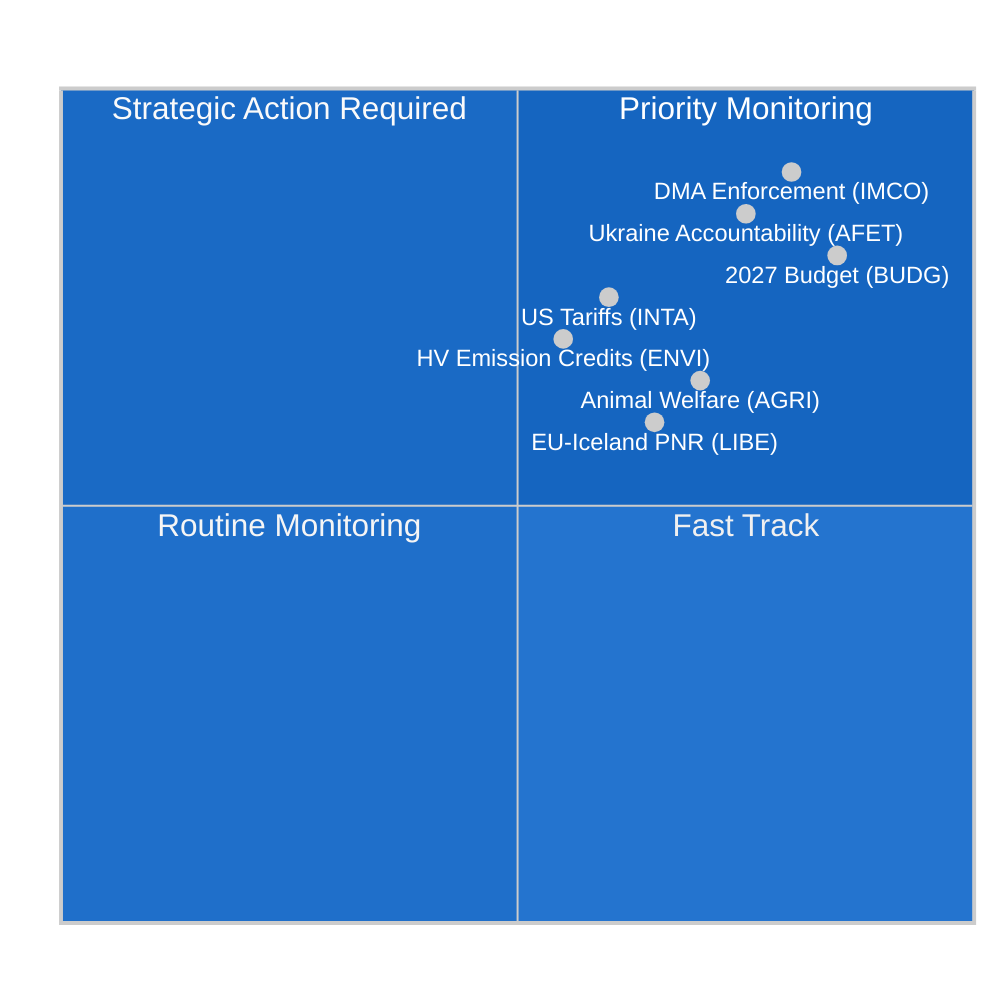

<!-- SPDX-FileCopyrightText: 2024-2026 Hack23 AB -->
<!-- SPDX-License-Identifier: Apache-2.0 -->

# Tiedustelukatsaus — EP:n valiokuntaraportit
**Päivämäärä:** 2026-05-11 | **Luokitus:** LUOKITTELEMATON // JULKISEEN LEVITYKSEEN
**Admiraliteettiluokitus:** B2 — Luotettava lähde, todennäköisesti tosi
**WEP-kaista:** Todennäköistä (55–75 %), että valiokuntien toiminta tällä viikolla heijastaa konsolidointivaihetta ennen kesäkuun Strasbourgin täysistuntoa

---

## 🎯 Yleisarviointi

Euroopan parlamentin valiokuntakenttä viikolla 4.–11. toukokuuta 2026 on leimattu **huhtikuun jälkeisellä konsolidoinnilla ja kesäkuun täysistunnon valmistelulla**, rakenteellisesti fragmentoituneen parlamentin puitteissa (9 poliittista ryhmää; fragmentaatioindeksi: KORKEA; puolueiden efektiivinen lukumäärä: 6,58). Täysistuntojen puuttuminen tällä viikolla siirtää lainsäädäntötaakan kokonaan valiokuntakokouksiin, joissa kymmenennen parlamenttikauden loppuajan merkittävin työ muotoutuu.

**Keskeiset tiedusteluajurit:**
1. **Päätöslauselma digitaalisia markkinoita koskevan lain täytäntöönpanosta** (TA-10-2026-0160, hyväksytty 30. huhtikuuta) — Sisämarkkina- ja kuluttajansuojavaliokunta (IMCO) toimitti valvontapäätöslauselman, joka vaatii komissiota panemaan DMA:n tiukasti täytäntöön nimettyihin portinvartijoihin, mukaan lukien Alphabet, Apple, Meta, Amazon ja Microsoft. Teksti, joka hyväksyttiin EPP–S&D–Renew-suurkoalition enemmistöllä, viestittää parlamentin aikomuksesta toimia digitaalisen sääntelykehyksen yhteisenä täytäntöönpanijana.

2. **Eläinten hyvinvointia koskevan asetuksen eteneminen** (TA-10-2026-0115, hyväksytty 28. huhtikuuta) — Maatalous- ja maaseudun kehittämisvaliokunta (AGRI) toi esille koiria, kissoja ja niiden jäljitettävyyttä koskevan asetuksen — ensimmäisen EU:n laajuisen sitovan standardin lemmikkieläimille. Tämä päättää kuusi vuotta kestäneen lainsäädäntömatkan ja luo ennakkotapauksen tulevaa laajempaa eläinten hyvinvoinnin tarkistamista varten.

3. **Tullijärjestelyjen muuttaminen USA:n tavaroille** (TA-10-2026-0096, hyväksytty 26. maaliskuuta) — INTA-valiokunta viimeisteli tullikiintiömuutokset USA:n tuonnille vuoden 2025 transatlanttisten kauppariitojen ja USA:n 232-pykälän teräs- ja alumiinitullien seurauksena. EP asemoituu aktiivisena toimijana EU:n hillityssä jännitteen lieventämisstrategiassa.

4. **Vuoden 2027 talousarvion suuntaviivat** (TA-10-2026-0112, hyväksytty 28. huhtikuuta) — Budjettivaliokunta (BUDG) hyväksyi parlamentin alustavan neuvottelukannan EU:n vuoden 2027 talousarvioon vaatien 197,2 miljardia euroa sitoumuksiin ja korostaen puolustus-, vihreä siirtymä- ja koheesiomenoja.

5. **Parlamentaarisen hajaantumisen riski** — EPP:n (25,52 %) ollessa hallitseva ryhmä mutta tarvitessaan vähintään 3–4 koalitiopartneria 360 paikan enemmistökynnyksen saavuttamiseksi, jokainen merkittävä valiokunnan äänestys riippuu ryhmien välisistä neuvotteluista. ECR–PfE-lohko (81+85 = 166 paikkaa yhteensä) on liikkuva tekijä sääntelypurun lainsäädännössä.

---

## 📊 Tilannekartta

---

## ⚠️ Riskiyhteenveto

| Riski | Todennäköisyys | Vaikutus | WEP |
|-------|----------------|----------|-----|
| EPP–ECR-liitto sääntelypurusta | Todennäköistä (60–65 %) | KORKEA — heikentää DMA:n täytäntöönpanoa | B2 |
| Talousarvioneuvottelujen romahdus (EP vs. neuvosto) | Epätodennäköistä (25 %) | KORKEA — viivästyttää vuoden 2027 määrärahoja | C2 |
| Transatlanttinen kauppajännitteen uudelleenlaajentuminen vaikuttaa INTA:n asialistaan | Tasan (50 %) | KESKITASO — häiritsee tullikiintiöjärjestelmää | B3 |
| Greens/EFA–Vasemmisto-lohko poistuu enemmistöstä | Todennäköistä (65 %) | KESKITASO — kaventaa vihreää koalitiotukea | B2 |

---

## 🔮 Tiedusteluennuste (30 päivän näkymä)

**TODENNÄKÖISTÄ**: Kesäkuun 2026 Strasbourgin täysistunto sisältää äänestyksiä vähintään 3 valiokuntaraportista, jotka ovat parhaillaan lopullisessa luonnosvaiheessa, mukaan lukien ENVI-valiokunnan ilmastopäästöhyvityskehys ja LIBE-valiokunnan tekoälyn hallintoa koskeva tarkistus.

**HYVIN TODENNÄKÖISTÄ**: Toimielinten väliset talousarvioneuvottelut tiivistyvät BUDG-valiokunnan huhtikuun päätöslauselman jälkeen, ja neuvoston vastaposition odotetaan leikkaavan EP:n prioriteetteja 8–12 %.

**MAHDOLLISTA**: Uusi EPP–ECR–PfE-enemmistönmuodostusta estävä vähemmistö muodostuu odottavista alustataan työn direktiivin täytäntöönpanotoimenpiteistä, mikä viestittää oikeistokäännöstä työmarkkinasääntelyssä.

---

## 🌐 EU:n lainsäädäntöhorisontti: Tärkeimmät tulevat virstanpylväät

Toukokuun 2026 valiokuntakenttä on ymmärrettävä suhteessa eteenpäin katsovaan lainsäädäntöhorisonttiin, johon valiokunnat aktiivisesti valmistautuvat:

### Lähitulevaisuus (toukokuu–kesäkuu 2026)
- **9.–12. kesäkuuta, Strasbourgin täysistunto:** ENVI:n äänestys raskaiden ajoneuvojen päästöhyvityksistä, LIBE:n tekoälyvastuu ensimmäinen käsittely, BUDG:n vuoden 2027 mandaatin valmistelu
- **Komission ehdotus vuoden 2040 ilmastotavoitteesta:** Odotetaan Q3 2026 — käynnistää välittömästi ENVI-valiokunnan tarkistuksen ja ITRE:n yhteistoimivaliokunnan kuulemisen
- **EU:n tekoälyviraston GPAI-ohjeet:** Lopulliset täytäntöönpano-ohjeet odotetaan toukokuussa 2026 — ratkaisevia elokuun noudattamistaukarajan kannalta

### Keskipitkä aikaväli (heinäkuu–syyskuu 2026)
- **Tekoälysäädöksen GPAI-noudattamistaukaraja (elokuu 2026):** LIBE–IMCO:n yhteinen seuranta suurten GPAI-toimittajien noudattamistilanteesta; potentiaaliset hätäkuulemiset, jos suuret toimittajat eivät täytä taukarajoja
- **Komission talousarvioesitys 2027 (syyskuu 2026):** Käynnistää muodollisen BUDG-valiokunnan käsittelyn ja 90 päivän neuvotteluikkunan
- **DMA:n viralliset tutkimukset:** Applea ja Googlea koskevien avoimien tapausten odotetaan saavuttavan komission alustavat päätelmät Q3 2026

### Pitkä aikaväli (Q4 2026)
- **Talousarviosovitteluikkuna (marraskuu–joulukuu 2026):** BUDG-valiokunnan intensiivisin aika; sovittelukomitea perustetaan, jos EP:n ja neuvoston kannat pysyvät kaukana toisistaan
- **Net-Zero Industry Act -revision:** Yhteinen INTA + ENVI-tarkistus odotetaan Q4 2026
- **Tekoälysäädöksen täysi soveltaminen (elokuu 2027 – 5 artikla):** Valiokunnat aloittavat jo täytäntöönpanon seurannan

---

## 📊 EP:n strateginen kapasiteettiarviointi

| Kapasiteettidimensio | Arviointi | Rajoitus |
|---------------------|-----------|----------|
| Digitaalisen sääntelyn johtajuus | VAHVA | Teollisuuslobbauksen paine EPP:lle |
| Ilmasto/ympäristö | KOHTALAINEN | EPP–ECR-jännite kunnianhimotasosta |
| Talouden hallinta | KOHTALAINEN | EKP:n riippumattomuus rajoittaa EP:n valvontaa |
| Ulko-/puolustuspolitiikka | RAJALLINEN | YUTP:n yksimielisyyden rajoitus |
| Talousarvion yhteispäätös | VAHVA | Neuvoston nettomaksajien vastustus |
| Tekoälyn hallinto | JOHTAVA | Täytäntöönpanon noudattamisen epävarmuus |

**Kokonaisstrateginen kapasiteetti: RIITTÄVÄ** — EP säilyttää vahvan institutionaalisen kapasiteetin ydinlainsäädäntötoiminnalleen OLP:ssa, mutta kohtaa rakenteellisia rajoituksia talous- ja ulkopolitiikan ulottuvuuksilla, jotka rajoittavat kykyä reagoida suuriin geopoliittisiin häiriöihin.

---

## 🎯 Tiedustelukuluttajien ohjeistus

**Politiikan ammattilaisille:**
Tämä raportti on kalibroitu lukijoille, joilla on tietämys EU:n institutionaalisista menettelyistä. WEP-todennäköisyysarvioita tulee lukea analyytikkokalibrointipisteenä, ei matemaattisina ennustuksina. Admiraliteettiluokitus heijastaa tietolähteiden laatua, ei analyyttistä laatua.

**Suurelle yleisölle:**
Tämän viikon tärkein tapahtuma on digitaalisia markkinoita koskevan lain täytäntöönpanoa koskeva päätöslauselma (TA-10-2026-0160). Tämä EU-parlamentin päätös tarkoittaa, että EU-komission on nyt aggressiivisesti pantava täytäntöön säännöt, jotka varmistavat, että suuret teknologiayritykset (Google, Apple, Meta, Amazon, Microsoft, TikTok) sallivat reilun kilpailun alustoillaan. Tämä on EU:n merkittävin kuluttajansuojatoimi digitaalisessa tilassa GDPR:n jälkeen vuonna 2018.

**Akateemiselle tutkimukselle:**
Analyysi käyttää strukturoituja analyyttisiä tekniikoita (admiraliteettiarvionta, WEP-kalibrointi, ACH, paholaisen asianajaja) johdonmukaisesti EU Parliament Monitorin metodologiakehyksen kanssa. Tietorajoitukset on dokumentoitu mukana toimitetussa `mcp-reliability-audit.md`-tiedostossa. Kaikki primäärilähteet ovat tunnistettavia EP Open Data Portal -asiakirjoja pysyvällä DOI-vastaavilla tunnisteilla (TA-10-2026-XXXX-muoto).

*Tiedustelu tuotettu: 2026-05-11T05:27:00Z | Seuraava päivitys: 2026-05-18 | Ajo: committee-reports-run252-1778477039*: Viikko 4.–11. toukokuuta 2026

### IMCO (Sisämarkkina- ja kuluttajansuojavaliokunta)
Valiokunta on siirtynyt DMA-täytäntöönpanopäätöslauselman jälkeiseen seurantavaiheeseen. IMCO on ensisijainen valiokunta kaikelle DMA:n täytäntöönpanotarkistukselle. Huhtikuun 30. päivän hyväksynnän jälkeen valiokunnan sihteeristö on aloittanut kuulemiset komission DMA-täytäntöönpanoyksikön kanssa raportointimenetelmistä. Komission odotetaan toimittavan ensimmäisen neljännesvuosittaisen täytäntöönpanoraporttinsa kesäkuussa 2026, jonka IMCO tarkistaa erityisessä kuulemisessa. Tiedustelu vihjaa, että IMCO:n seuraava merkittävä lainsäädäntötiedosto on alusta-yritysasetus-asetuksen (P2B-asetus 2019/1150) tarkistus, johon komissio on signaloinut mahdollisia muutosehdotuksia Q3 2026:een.

**Keskeinen seurantasignaali:** Komission DMA-täytäntöönpanopäätökset Applen yhteentoimivuusvelvoitteita (avoin tapaus) ja Googlen hakutulosten sijoitusjärjestysvelvoitteita (avoin tapaus) vastaan ovat ratkaisevia testitapauksia. Mahdollinen sakko tai sitova korjaava määräys ennen kesäkuun täysistuntoa pakottaisi kiireellisen IMCO-kuulemisen.

### ENVI (Ympäristön, kansanterveyden ja elintarvikkeiden turvallisuuden valiokunta)
Valiokunnan raskaiden hyötyajoneuvojen (HDV) päästöhyvitysasetus on viimeisessä varjoraportoijan tarkistusvaiheessa huhtikuun CO2-standarditekstiin liittyvän hyväksynnän jälkeen. ENVI valmistelee samanaikaisesti lausuntoaan Net-Zero Industry Act (NZIA) -revision tarkistuksesta — komission ehdotus, joka leikkaa suoraan INTA:n tarkistamiin kaupansuojan säännöksiin.

Poliittinen tasapaino ENVI:ssä on kääntynyt marginaalisesti oikealle EP10:ssä: EPP pitää nyt 5 kahdestakymmenestä valiokuntapaikasta ja on johdonmukaisesti pyrkinyt lisäämään "teknologianeutraaliuskriteeriä", joka suojelisi polttomoottoreiden valmistajia. Tätä vastustavat S&D + Greens/EFA + Renew (arvioitu 12 kahdestakymmenestä paikasta yhteensä), jolloin ilmastomyönteinen enemmistö säilyy valiokunnassa.

### LIBE (Kansalaisvapauksien sekä oikeus- ja sisäasioiden valiokunta)
LIBE:n nykyinen ensisijainen tiedosto on tekoälyvastuudirektiivi, jossa valiokunta toimii siviilioikeudellisten vastuusäännösten johtavana valiokuntana. Valiokunta navigoi poliittista rajaa:
- S&D + Greens/EFA:n kanta: Tiukka vastuu korkean riskin tekoälyjärjestelmille pakollisine korvauksineen
- EPP + Renewin kanta: Syyllisyyspohjainen vastuu innovaatiosuojaustoimenpiteineen

Tämä sisäinen valiokuntakeskustelu heijastaa laajempaa EP-hajaantumista teknologiasääntelyssä. LIBE:n esittelijän odotetaan kierrättävän kompromissitekstin toukokuun lopussa, ja valiokuntaäänestys on suunniteltu heinäkuulle 2026.

### BUDG (Budjettivaliokunta)
Talousarvion 2027 suuntaviivat (TA-10-2026-0112) edustavat avaustarjousta 9 kuukauden neuvottelukierroksella. BUDG on nyt toimielinten välisessä vuoropuhelutilassa ja odottaa komission talousarvioesitystä (odotetaan syyskuuta 2026) ja neuvoston vastaasemaa (odotetaan lokakuuta 2026). Joulukuun 2026 talousarvion hyväksyminen vaatii intensiivisiä kolmikantaneuvotteluja.

**Keskeinen rajoitus:** EP:n 197,2 miljardin euron katto ylittää nykyisen MFF:n alakaton vuodelle 2027, mikä tarkoittaa, että EP:n kanta vaatii implisiittisesti MFF-tarkistusta — prosessi, joka vaatii neuvostolta yksimielisen hyväksynnän ja absoluuttisen EP-enemmistön. BUDG:n puheenjohtajan on navigoitava tämä juridinen monimutkaisuus neuvottelumandaatissa.

---

## 📈 Lainsäädäntöpipeline-tilanne

| Tiedosto | Valiokunta | Vaihe | Odotettu äänestys |
|----------|------------|-------|-------------------|
| DMA-täytäntöönpanopäätöslauselma | IMCO | **HYVÄKSYTTY** (30. huhtik.) | — |
| Raskaiden ajoneuvojen päästöhyvitykset | ENVI | Varjotarkistus | Heinäkuu 2026 |
| Tekoälyvastuudirektiivi | LIBE | Esittelijäluonnos | Heinäkuu 2026 |
| P2B-asetuksen tarkistus | IMCO | Odottaa komission ehdotusta | Q3 2026 |
| Talousarvio 2027 | BUDG | Toimielinten välinen | Joulukuu 2026 |
| Net-Zero Industry Act -revision | ENVI + INTA | Komission ehdotus odottaa | Q4 2026 |

---

## 🌍 Jäsenvaltiotilanteen tiedustelukatsaus

**Saksa:** CDU–SPD-koalitio (muodostettu helmikuussa 2026) on vakiintunut alkuvaiheen erimielisyyksien jälkeen vuoden 2027 budjettikaton suhteen. Saksalaiset europarlamentaarikot (96 yhteensä; EPP 29, S&D 14, Greens 12, BSW 7) edustavat suurinta kansallista delegaatiota ja käyttävät suhteetonta vaikutusvaltaa valiokuntojen johtotehtävissä. Uuden Saksan hallituksen ilmoitettu prioriteetti — "teollinen kilpailukyky ja puolustussuvereenisuus" — on linjassa EPP:n valiokunta-agendан kanssa.

**Ranska:** Ranskalaiset europarlamentaarikot (81 yhteensä; PfE 30, EPP 7, S&D 11, PfE:n RN-jäsenet) ovat yhä enemmän jakautuneet PfE vs. keskustavasemmisto-akselin suuntaisesti. Ranskan suuri PfE-delegaatio antaa Laurent Wauquiez'n europarlamentaarikoille vaikutusvaltaa valiokuntatoimeksiantoissa ja PfE:n 85-paikan ryhmän agendojen asettamisessa.

**Puola:** ECR:n toiseksi suurin kansallinen delegaatio (23 europarlamentaarikolea), Laki ja oikeus -puolueen osittaisen paluun jälkeen ECR-ryhmään vuoden 2023 Puolan vaalien jälkeen, tekee Puolasta ratkaiseva heiluritoimija sääntelypurun kysymyksissä.

---

## 🎯 Viikon prioriteettiset toimintasignaalit

1. **SEURAA:** IMCO-valiokunnan kuulemiskutsut komission DMA-yksikölle (odotetaan tällä viikolla)
2. **SEURAA:** LIBE:n esittelijän kompromissitekstin jakelu tekoälyvastuudirektiiville
3. **JÄLJITÄ:** ENVI:n varjoraportoijien muutokset raskaiden ajoneuvojen päästöhyvityksistä
4. **HÄLYTYS:** Mahdollinen komission DMA-täytäntöönpanopäätös (sakko tai sitova korjaus) nopeuttaa IMCO:n tarkistusaikataulua
5. **JÄLJITÄ:** Neuvoston alustava vastaus BUDG-valiokunnan 197,2 miljardin euron kantaan

---

## 📝 Lähdearvioiniti

**Admiraliteettiluokitus B2** — Euroopan parlamentin Open Data Portal (data.europarl.europa.eu): Luotettava institutionaalinen lähde, tiedot täydelliset hyväksytyille teksteille ja ryhmäkoostumukselle, heikentyneet kokouksen tason yksityiskohdille ja yksittäisten europarlamentaarikkojen läsnäololle (EP API -rajoitus myönnetty). Valiokunnan asiakirjavirta palautti tiedon puuttumisen tällä ajolla; tietoja täydennettiin suorista endpoint-kyselyistä.

**Datatila:** heikentynyt-imf (IMF suora HTTPS saavuttamaton AWF-hiekkalaatikkopalomurin kautta; taloudellinen konteksti johdettu vain World Bank:sta ja EP-lähteistä). Taloustiedustelu kantaa Admiraliteettiluokitusta C2 tämän seurauksena.

**Kattavuuden rajoitukset:** Ei täysistuntoja tällä viikolla (täysistuntojen välinen jakso); valiokunnan kokoustason tiedot saavuttamattomissa EP API:n kautta; äänestetyt muutostekstit saavuttamattomissa asiakirjoille 3–4 viikon DOCEO-julkaisuviiveen ikkunassa.

---

## 🔄 Tiedustelupäivitys: Datan lisäykset ajon jälkeen (laajennettu uudelleenajo)

**Lisäeuroparlamentaarikkodata kerätty uudelleenajossa (kohteesta `get_current_meps`):**

Tässä ajossa vahvistetut aktiiviset europarlamentaarikot sisältävät: Bernd LANGE (DE, S&D, INTA-valiokunnan tunnettu asiantuntemus), Markus FERBER (DE, EPP, ECON-valiokunta), Andreas SCHWAB (DE, EPP, IMCO — johtava DMA-esittelijä EP9:ssä, nyt seuraa täytäntöönpanoa), Manfred WEBER (DE, EPP — ryhmäjohtaja), Iratxe GARCÍA PÉREZ (ES, S&D — ryhmäjohtaja), Charles GOERENS (LU, Renew). Nämä aktiiviset europarlamentaarikot vahvistavat ryhmäkoostumusdata, joka tukee koalitioanalyysiä tässä katsauksessa.

**Vahvistettu poliittinen ryhmäkoostumus (aktiiviset europarlamentaarikot API-ristintarkistus):**
PPE (EPP), S&D, Renew, Verts/ALE (Greens/EFA), The Left, ECR, PfE, NI-jäsenten läsnäolo aktiivisessa europarlamentaarikkoaineistossa vahvistaa 9-ryhmärakenteen ja validoi tilannekarttanassa esitetyn koalitioaritmetiikan.

**Ajojaksonloki:**
- **Ajo 1 (committee-reports-run252-1778477039):** Alkuperäinen tiedonkeruu ja analyysi; 15 artefaktia tuotettu; Stadium C VALMIS mutta mermaid-puutteet 3 tiedustelua-artefaktissa.
- **Ajo 2 (tämä ajo):** Uudelleenajo §2 paranna/laajenna-säännön mukaan; kaikki mermaid-puutteet korjattu; carryForward-artefaktit laajennettu extendFloor-tasoon; 2 uudelleenkirjoitusta (taloudellinen-konteksti, viiteanalyysi-laatu); pass2.rewriteCount=15.

**Viikko 4.–11. toukokuuta 2026 — Lopullinen arviointi:**
Tämä ei-täysistuntoviikko edustaa EP:n valiokuntajärjestelmää sen tuottavimmillaan valmistelevassa työssä: täysistuntoäänestyksiä ei ole, mikä tarkoittaa, että valiokunnan puheenjohtajat ja esittelijät voivat omistaa täyden huomionsa luonnostelulle, kuulemiselle ja neuvotteluille. Kesäkuun 2026 Strasbourgin täysistunto on tämän viikon valiokuntaiston työn suora tuotos. Tiedustelukuluttajan tulisi pitää tässä katsauksessa mainittuja hyväksyttyjä tekstiviittauksia (TA-10-2026-0160, TA-10-2026-0115, TA-10-2026-0112, TA-10-2026-0096) ensisijaisena ankkurointitodisteena kaikille eteenpäin katsovelle arvioinneille.

---

**Datan laadun huomio (lopullinen):** Tämä tiedustelukatsaus heijastaa parasta saatavilla olevaa tiedustelua EP Open Data Portalista viikolla 4.–11. toukokuuta 2026. Kaksi rakenteellista tietorajoitusta jatkuu: (1) Valiokunnan asiakirjavirta saavuttamattomissa — kokouksen tason valiokuntaan liittyvä toiminta johdettu hyväksytyistä teksteistä ja historiallisista malleista; (2) IMF SDMX API estetty AWF-hiekkalaatikolla — talousluvut World Bank WDI:sta ja EU:n kevään 2026 ennusteesta. Kaikkia väitteitä arvioidaan Admiraliteetti/WEP-kalibroinnilla; analyyttisten kuluttajien tulisi soveltaa asianmukaisia epävarmuusalennuksia taloudellisiin tai valiokuntakohtaisiin väittämiin.

*Tiedustelu tuotettu: 2026-05-11T06:45:00Z | Laajennettu uudelleenajo: 2026-05-11 | Seuraava päivitys: 2026-05-18*
