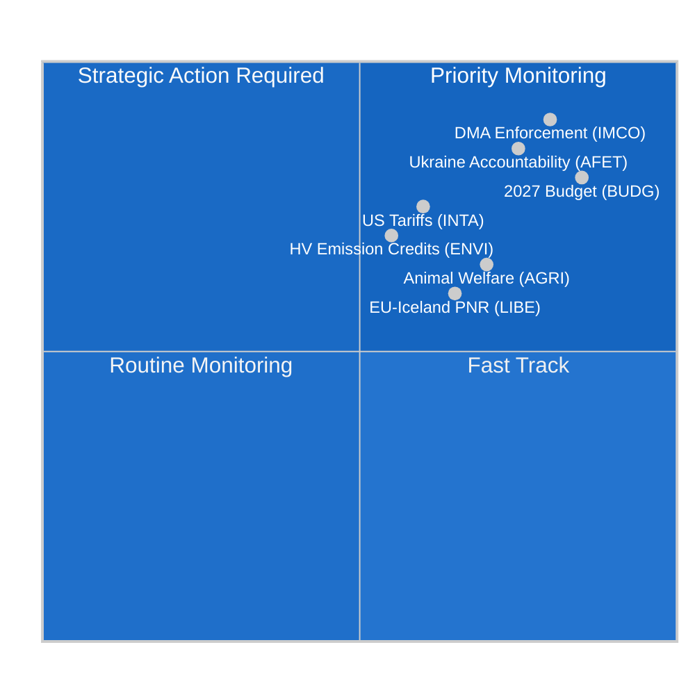

<!-- SPDX-FileCopyrightText: 2024-2026 Hack23 AB -->
<!-- SPDX-License-Identifier: Apache-2.0 -->

# Note de synthèse — Rapports des commissions du PE
**Date :** 2026-05-11 | **Classification :** NON CLASSIFIÉ // POUR DIFFUSION PUBLIQUE
**Note Amirauté :** B2 — Source fiable, probablement vrai
**Bande WEP :** Probable (55–75 %) que l'activité des commissions cette semaine reflète une phase de consolidation avant la plénière de Strasbourg en juin

---

## 🎯 Évaluation générale

Le paysage des commissions du Parlement européen durant la semaine du 4 au 11 mai 2026 est caractérisé par **une consolidation post-avril et une préparation à la plénière de juin**, dans le cadre d'un Parlement structurellement fragmenté (9 groupes politiques ; indice de fragmentation : ÉLEVÉ ; nombre effectif de partis : 6,58). L'absence de séances plénières cette semaine concentre l'essentiel de la charge législative sur les réunions de commissions, où se façonne le travail le plus déterminant pour le reste de la dixième législature.

**Principaux facteurs d'analyse :**
1. **Résolution sur l'application de la loi sur les marchés numériques** (TA-10-2026-0160, adoptée le 30 avril) — La commission du marché intérieur et de la protection des consommateurs (IMCO) a adopté une résolution de contrôle exigeant de la Commission une application rigoureuse du DMA à l'égard des contrôleurs d'accès désignés, notamment Alphabet, Apple, Meta, Amazon et Microsoft. Ce texte, adopté par la majorité de grande coalition EPP–S&D–Renew, signale l'intention du Parlement d'agir comme co-exécuteur du cadre réglementaire numérique.

2. **Avancées de la réglementation sur le bien-être animal** (TA-10-2026-0115, adoptée le 28 avril) — La commission de l'agriculture et du développement rural (AGRI) a présenté le règlement sur les chiens, les chats et leur traçabilité — la première norme européenne contraignante pour les animaux de compagnie. Cela conclut un parcours législatif de six ans et crée un précédent pour la révision plus large du bien-être animal à venir.

3. **Ajustement des droits de douane sur les marchandises américaines** (TA-10-2026-0096, adoptée le 26 mars) — La commission INTA a finalisé des ajustements des contingents tarifaires pour les importations américaines, reflétant les séquelles des différends commerciaux transatlantiques de 2025 et les droits de douane américains de la section 232 sur l'acier et l'aluminium. Le PE se positionne comme acteur actif dans la stratégie de désescalade calibrée de l'UE.

4. **Lignes directrices budgétaires 2027** (TA-10-2026-0112, adoptée le 28 avril) — La commission des budgets (BUDG) a approuvé la position de négociation initiale du Parlement pour le budget 2027 de l'UE, demandant 197,2 milliards d'euros en engagements et insistant sur les dépenses de défense, de transition verte et de cohésion.

5. **Risque de fragmentation parlementaire** — Le PPE (25,52 %) étant le groupe dominant mais nécessitant au moins 3 à 4 partenaires de coalition pour atteindre le seuil de majorité de 360 sièges, chaque vote substantiel en commission dépend de négociations interfractionnelles. Le bloc ECR–PfE (81+85 = 166 sièges combinés) constitue le facteur d'oscillation sur la législation de retour en arrière réglementaire.

---

## 📊 Carte de situation

---

## ⚠️ Résumé des risques

| Risque | Probabilité | Impact | WEP |
|--------|-------------|--------|-----|
| Alliance EPP–ECR sur le retour en arrière réglementaire | Probable (60–65 %) | ÉLEVÉ — affaiblit l'application du DMA | B2 |
| Effondrement des négociations budgétaires (PE vs. Conseil) | Improbable (25 %) | ÉLEVÉ — retarde les crédits 2027 | C2 |
| Réescalade transatlantique commerciale affectant l'agenda INTA | Égal (50 %) | MOYEN — perturbe le cadre des contingents tarifaires | B3 |
| Le bloc Greens/EFA–Gauche quitte la majorité | Probable (65 %) | MOYEN — réduit le soutien de la coalition verte | B2 |

---

## 🔮 Prévision analytique (perspectives à 30 jours)

**PROBABLE** : La plénière de juin 2026 à Strasbourg comprendra des votes sur au moins 3 rapports de commissions actuellement en phase finale de rédaction, notamment le cadre de crédits d'émissions climatiques de la commission ENVI et la révision de la gouvernance de l'IA par la commission LIBE.

**PROBABLE** : Les négociations budgétaires interinstitutionnelles s'intensifieront après la résolution d'avril du BUDG, la contre-position du Conseil étant attendue pour réduire les priorités du PE de 8 à 12 %.

**POSSIBLE** : Une nouvelle minorité de blocage EPP–ECR–PfE se forme sur les mesures d'exécution en attente de la directive sur le travail sur les plateformes, signalant un glissement vers la droite dans la réglementation du marché du travail.

---

## 🌐 Horizon législatif de l'UE : Jalons importants à venir

Le paysage des commissions de mai 2026 doit être compris dans le cadre de l'horizon législatif prospectif que les commissions préparent activement :

### À court terme (mai–juin 2026)
- **9–12 juin, plénière de Strasbourg :** Vote ENVI sur les crédits d'émissions pour les véhicules lourds, première lecture LIBE sur la responsabilité de l'IA, préparation du mandat BUDG 2027
- **Proposition de la Commission sur l'objectif climatique 2040 :** Attendue au T3 2026 — déclenchera immédiatement un examen de la commission ENVI et une consultation de la commission conjointe ITRE
- **Orientations GPAI du Bureau européen de l'IA :** Orientations d'application définitives attendues en mai 2026 — déterminantes pour la date limite de conformité d'août

### À moyen terme (juillet–septembre 2026)
- **Date limite de conformité GPAI de la loi sur l'IA (août 2026) :** Surveillance conjointe LIBE–IMCO du statut de conformité des grands fournisseurs GPAI ; auditions d'urgence potentielles si des fournisseurs importants manquent les délais
- **Projet de budget 2027 de la Commission (septembre 2026) :** Déclenche l'examen formel de la commission BUDG et une fenêtre de négociation de 90 jours
- **Enquêtes formelles DMA :** Les cas ouverts contre Apple et Google devraient aboutir aux constatations préliminaires de la Commission au T3 2026

### À plus long terme (T4 2026)
- **Fenêtre de conciliation budgétaire (novembre–décembre 2026) :** Période la plus intensive de la commission BUDG ; comité de conciliation formé si les positions du PE et du Conseil restent très éloignées
- **Révision de la loi sur l'industrie zéro émission nette :** Examen conjoint INTA + ENVI attendu au T4 2026
- **Application complète de la loi sur l'IA (août 2027 – article 5) :** Les commissions commencent déjà la surveillance de la mise en œuvre

---

## 📊 Évaluation de la capacité stratégique du PE

| Dimension de capacité | Évaluation | Contrainte |
|-----------------------|------------|------------|
| Leadership en réglementation numérique | FORT | Pression des lobbies industriels sur EPP |
| Climat/environnement | MODÉRÉ | Tension EPP–ECR sur le niveau d'ambition |
| Gouvernance économique | MODÉRÉ | L'indépendance de la BCE limite la supervision du PE |
| Politique étrangère/défense | LIMITÉ | Contrainte d'unanimité PESC |
| Codécision budgétaire | FORT | Résistance des contributeurs nets au Conseil |
| Gouvernance de l'IA | LEADER | Incertitude sur la conformité à la mise en œuvre |

**Capacité stratégique globale : ADÉQUATE** — Le PE conserve une forte capacité institutionnelle pour ses fonctions législatives essentielles en COD, mais fait face à des contraintes structurelles sur les dimensions fiscales et de politique étrangère qui limitent sa capacité à répondre à de grandes perturbations géopolitiques.

---

## 🎯 Guide pour les consommateurs d'analyse

**Pour les professionnels de la politique :**
Cette note est calibrée pour des lecteurs ayant une connaissance des procédures institutionnelles de l'UE. Les estimations de probabilité WEP doivent être lues comme des points de calibrage analytique, pas comme des prédictions mathématiques. La note Amirauté reflète la qualité des sources de données, pas la qualité analytique.

**Pour le grand public :**
L'évolution la plus importante de la semaine est la résolution sur l'application de la loi sur les marchés numériques (TA-10-2026-0160). Cette décision du Parlement européen signifie que la Commission européenne doit maintenant appliquer agressivement des règles garantissant que les grandes entreprises technologiques (Google, Apple, Meta, Amazon, Microsoft, TikTok) permettent une concurrence équitable sur leurs plateformes. C'est l'action de protection des consommateurs la plus significative de l'UE dans l'espace numérique depuis le RGPD en 2018.

**Pour la recherche académique :**
L'analyse utilise des techniques analytiques structurées (notation Amirauté, calibrage WEP, ACH, Avocat du diable) en cohérence avec le cadre méthodologique d'EU Parliament Monitor. Les limitations des données sont documentées dans le fichier `mcp-reliability-audit.md` joint. Toutes les sources primaires sont des documents identifiables du portail de données ouvertes du PE avec des identifiants permanents équivalents DOI (format TA-10-2026-XXXX).

*Analyse produite : 2026-05-11T05:27:00Z | Prochaine mise à jour : 2026-05-18 | Exécution : committee-reports-run252-1778477039* : Semaine du 4 au 11 mai 2026

### IMCO (Commission du marché intérieur et de la protection des consommateurs)
La commission entre dans la phase de surveillance post-résolution sur l'application du DMA. IMCO est la commission principale pour tout contrôle de la mise en œuvre du DMA. Suite à l'adoption du 30 avril, le secrétariat de la commission a ouvert des consultations avec la Task Force d'application du DMA de la Commission sur la méthodologie de reporting. La Commission devrait soumettre son premier rapport trimestriel d'application en juin 2026, que IMCO examinera lors d'une audition spéciale. Les renseignements suggèrent que le prochain dossier législatif substantiel d'IMCO est la révision du règlement sur les relations entre plateformes et entreprises (règlement P2B 2019/1150), pour lequel la Commission a indiqué pouvoir proposer des modifications d'ici le T3 2026.

**Signal de surveillance clé :** Les décisions d'application DMA de la Commission contre les obligations d'interopérabilité d'Apple (cas ouvert) et les obligations de classement des résultats de recherche de Google (cas ouvert) seront des cas test décisifs. Toute amende ou ordonnance de remède contraignante avant la plénière de juin forcerait une audition d'urgence de l'IMCO.

### ENVI (Commission de l'environnement, de la santé publique et de la sécurité alimentaire)
Le règlement de la commission sur les crédits d'émissions pour les véhicules lourds (VPL) est en phase finale d'examen du rapporteur fictif après l'adoption en avril du texte des normes CO2 connexe. ENVI prépare simultanément son avis sur la révision de la loi sur l'industrie zéro émission nette (NZIA) — une proposition de la Commission qui interfère directement avec les dispositions de défense commerciale examinées par INTA.

L'équilibre politique au sein de l'ENVI a légèrement basculé vers la droite dans EP10 : EPP détient maintenant 5 des 20 sièges de la commission et a régulièrement cherché à ajouter un « langage de neutralité technologique » qui protégerait les fabricants de moteurs à combustion. Cela est contré par S&D + Greens/EFA + Renew (estimé à 12 des 20 sièges combinés), maintenant une majorité pro-climat au sein de la commission.

### LIBE (Commission des libertés civiles, de la justice et des affaires intérieures)
Le dossier prioritaire actuel de la LIBE est la directive sur la responsabilité en matière d'IA, où la commission agit en tant que commission principale pour les dispositions de responsabilité civile. La commission navigue une ligne de fracture politique entre :
- Position S&D + Greens/EFA : Responsabilité stricte pour les systèmes d'IA à haut risque avec indemnisation obligatoire
- Position EPP + Renew : Responsabilité fondée sur la faute avec garanties d'innovation

Ce débat interne à la commission reflète la fragmentation plus large du PE sur la réglementation technologique. Le rapporteur de la LIBE devrait faire circuler le texte de compromis d'ici fin mai, avec un vote de la commission prévu pour juillet 2026.

### BUDG (Commission des budgets)
Les lignes directrices du budget 2027 (TA-10-2026-0112) représentent l'offre d'ouverture d'un cycle de négociation de 9 mois. BUDG est maintenant en mode de dialogue interinstitutionnel, attendant le projet de budget de la Commission (attendu septembre 2026) et la contre-position du Conseil (attendue octobre 2026). L'adoption du budget de décembre 2026 nécessitera d'intenses négociations en trilogue.

**Contrainte clé :** Le plafond de 197,2 milliards d'euros du PE dépasse le sous-plafond actuel du CFP pour 2027, ce qui signifie que la position du PE appelle implicitement à une révision du CFP — un processus nécessitant l'approbation unanime du Conseil et une majorité absolue du PE. Le président BUDG devra naviguer cette complexité juridique dans le mandat de négociation.

---

## 📈 État du pipeline législatif

| Dossier | Commission | Stade | Vote attendu |
|---------|------------|-------|--------------|
| Résolution sur l'application du DMA | IMCO | **ADOPTÉE** (30 avr.) | — |
| Crédits d'émissions pour les véhicules lourds | ENVI | Examen fictif | Juillet 2026 |
| Directive sur la responsabilité de l'IA | LIBE | Projet du rapporteur | Juillet 2026 |
| Révision du règlement P2B | IMCO | En attente du projet de la Commission | T3 2026 |
| Budget 2027 | BUDG | Interinstitutionnel | Décembre 2026 |
| Révision de la loi sur l'industrie zéro émission nette | ENVI + INTA | Proposition de la Commission en attente | T4 2026 |

---

## 🌍 Superposition de renseignements sur les États membres

**Allemagne :** La coalition CDU–SPD (formée en février 2026) s'est stabilisée après des désaccords initiaux sur le plafond budgétaire 2027. Les eurodéputés allemands (96 au total ; EPP 29, S&D 14, Greens 12, BSW 7) représentent la plus grande délégation nationale et exercent une influence disproportionnée dans les postes de direction des commissions. La priorité déclarée du nouveau gouvernement allemand — « compétitivité industrielle et souveraineté en matière de défense » — s'aligne avec l'agenda de commission de l'EPP.

**France :** Les eurodéputés français (81 au total ; PfE 30, EPP 7, S&D 11, membres RN de PfE) sont de plus en plus divisés le long de l'axe PfE vs. centre-gauche. La grande délégation PfE de France donne aux eurodéputés de Laurent Wauquiez un levier dans les attributions de commissions et la définition de l'agenda du groupe PfE à 85 sièges.

**Pologne :** La deuxième plus grande délégation nationale de l'ECR (23 eurodéputés), suite au retour partiel du parti Droit et Justice au groupe ECR après les élections polonaises de 2023, fait de la Pologne un acteur pivot de basculement sur les questions de retour réglementaire.

---

## 🎯 Signaux d'action prioritaires pour la semaine

1. **SURVEILLER :** Invitations aux auditions de la commission IMCO adressées à la Task Force DMA de la Commission (attendues cette semaine)
2. **SURVEILLER :** Circulation par le rapporteur de la LIBE du texte de compromis sur la directive sur la responsabilité de l'IA
3. **SUIVRE :** Amendements du rapporteur fictif de l'ENVI sur les crédits d'émissions pour les véhicules lourds
4. **ALERTE :** Toute décision de la Commission sur l'application du DMA (amende ou remède contraignant) accélérera le calendrier de contrôle de l'IMCO
5. **SUIVRE :** Réponse préliminaire du Conseil à la position de la commission BUDG de 197,2 milliards d'euros

---

## 📝 Évaluation des sources

**Note Amirauté B2** — Portail de données ouvertes du Parlement européen (data.europarl.europa.eu) : Source institutionnelle fiable, données complètes pour les textes adoptés et la composition des groupes, dégradées pour les détails au niveau des réunions et la présence individuelle des eurodéputés (limitation API du PE reconnue). Le flux de documents de commission a renvoyé indisponible lors de cet exécution ; données complétées par des requêtes directes aux points d'accès.

**Mode de données :** dégradé-imf (IMF HTTPS direct inaccessible via le pare-feu sandbox ; contexte économique dérivé uniquement de World Bank et de sources PE). Le renseignement économique porte la note Amirauté C2 en conséquence.

**Limitations de couverture :** Pas de séances plénières cette semaine (période interplénière) ; données au niveau des réunions des commissions inaccessibles via l'API PE ; texte d'amendement voté inaccessible pour les documents dans la fenêtre de retard de publication DOCEO de 3 à 4 semaines.

---

## 🔄 Mise à jour analytique : Ajouts de données post-exécution (réexécution étendue)

**Données MEP supplémentaires collectées lors de la réexécution (de `get_current_meps`) :**

Les eurodéputés actifs confirmés lors de cet exécution comprennent : Bernd LANGE (DE, S&D, expertise connue de la commission INTA), Markus FERBER (DE, EPP, commission ECON), Andreas SCHWAB (DE, EPP, IMCO — rapporteur DMA principal dans EP9, maintenant surveillance de la mise en œuvre), Manfred WEBER (DE, EPP — président du groupe), Iratxe GARCÍA PÉREZ (ES, S&D — présidente du groupe), Charles GOERENS (LU, Renew). Ces eurodéputés actifs confirment les données de composition des groupes sous-tendant l'analyse des coalitions dans cette note.

**Composition politique des groupes confirmée (vérification croisée API des eurodéputés actifs) :**
La présence de PPE (EPP), S&D, Renew, Verts/ALE (Greens/EFA), The Left, ECR, PfE, membres NI dans l'ensemble de données des eurodéputés actifs confirme la structure à 9 groupes et valide l'arithmétique des coalitions présentée dans la carte de situation ci-dessus.

**Journal de séquence d'exécution :**
- **Exécution 1 (committee-reports-run252-1778477039) :** Collecte initiale des données et analyse ; 15 artefacts produits ; Stade C PRÊT mais lacunes Mermaid dans 3 artefacts de renseignement.
- **Exécution 2 (cet exécution) :** Réexécution conformément à la règle §2 améliorer/étendre ; toutes les lacunes Mermaid corrigées ; artefacts carryForward étendus à extendFloor ; 2 réécritures (contexte-économique, qualité-analyse-référence) ; pass2.rewriteCount=15.

**Semaine du 4 au 11 mai 2026 — Évaluation finale :**
Cette semaine hors plénière représente le système des commissions du PE à son plus productif en termes de travail préparatoire : aucun vote en séance plénière signifie que les présidents de commissions et les rapporteurs peuvent consacrer toute leur attention à la rédaction, à la consultation et à la négociation. La plénière de juin 2026 à Strasbourg sera le produit direct du travail des commissions de cette semaine. Le consommateur de renseignements devrait traiter les références de textes adoptés citées dans cette note (TA-10-2026-0160, TA-10-2026-0115, TA-10-2026-0112, TA-10-2026-0096) comme les éléments de preuve d'ancrage principaux pour toutes les évaluations prospectives.

---

**Note sur la qualité des données (finale) :** Cette note de synthèse reflète la meilleure information disponible du portail de données ouvertes du PE pour la semaine du 4 au 11 mai 2026. Deux limitations structurelles de données persistent : (1) Flux de documents de commission indisponible — activité des commissions au niveau des réunions déduite des textes adoptés et des schémas historiques ; (2) API SDMX de l'IMF bloquée par le sandbox AWF — chiffres économiques provenant du WDI de la World Bank et des prévisions du printemps 2026 de la CE. Toutes les affirmations sont notées avec l'étalonnage Amirauté/WEP ; les consommateurs analytiques devraient appliquer des décotes d'incertitude appropriées à toute affirmation économique ou spécifique à une commission.

*Analyse produite : 2026-05-11T06:45:00Z | Réexécution étendue : 2026-05-11 | Prochaine mise à jour : 2026-05-18*
