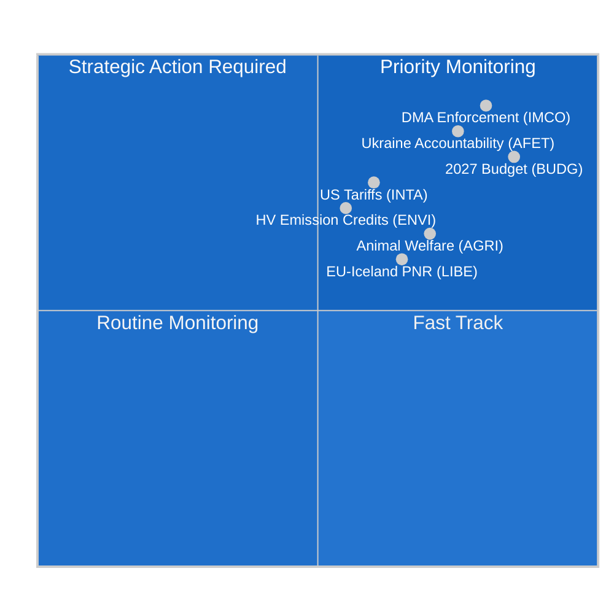

<!-- SPDX-FileCopyrightText: 2024-2026 Hack23 AB -->
<!-- SPDX-License-Identifier: Apache-2.0 -->

# תדריך מנהלים — דוחות ועדות הפרלמנט האירופי
**תאריך:** 2026-05-11 | **סיווג:** לא מסווג // לפרסום ציבורי
**דרגת אדמירליות:** B2 — מקור אמין, כנראה נכון
**רצועת WEP:** סביר (55–75%) שפעילות הוועדות השבוע משקפת שלב איחוד לקראת המושב המלאה של שטרסבורג ביוני

---

## 🎯 Headline Assessment

נוף הוועדות של הפרלמנט האירופי בשבוע 4–11 במאי 2026 מאופיין ב**גיבוש לאחר אפריל והכנה למושב המלאה של יוני**, המתרחש בתוך פרלמנט מפוצל מבנית (9 קבוצות פוליטיות; מדד פיצול: גבוה; מספר מפלגות אפקטיבי: 6.58). היעדר מושבי מליאה השבוע מטיל את הנטל החקיקתי כולו על ישיבות הוועדות, שם מעוצבת העבודה המשמעותית ביותר ליתרת הכהונה הפרלמנטרית העשירית.

**גורמי מודיעין מרכזיים:**
1. **החלטת אכיפת חוק שוק הדיגיטל** (TA-10-2026-0160, אושרה 30 באפריל) — ועדת השוק הפנימי והגנת הצרכן (IMCO) העבירה בהצלחה החלטת בדיקה הדורשת אכיפה קפדנית מהנציבות האירופית של DMA כנגד שומרי הסף המיועדים, כולל Alphabet, Apple, Meta, Amazon ו-Microsoft. טקסט זה, שאושר ברוב קואליציית EPP-S&D-Renew, מסמן את כוונת הפרלמנט לפעול כשותף-אוכף של המסגרת הרגולטורית הדיגיטלית.

2. **התקדמות תקנת רווחת בעלי חיים** (TA-10-2026-0115, אושרה 28 באפריל) — ועדת החקלאות ופיתוח הכפר (AGRI) קידמה את תקנת רווחת כלבים וחתולים ועקיבותם, התקן המחייב הראשון ברחבי האיחוד האירופי עבור בעלי חיים מחמד. זה מייצג מסע חקיקתי בן שש שנים שמסתיים תחת דיווח AGRI ומקים תקדים לסקירת רווחת החיות הרחבה הקרובה.

3. **התאמת מכס על סחורות אמריקאיות** (TA-10-2026-0096, אושרה 26 במרץ) — ועדת INTA סיימה התאמות מכסת תעריפים לייבוא אמריקאי, המשקפות את ההשפעות השיוריות של סכסוכי הסחר הטרנס-אטלנטיים של 2025 ותעריפי סעיף 232 האמריקאיים על פלדה ואלומיניום. זה ממצב את הפרלמנט האירופי כשחקן פעיל באסטרטגיית הפחתת ה-Escalation המאוזנת של האיחוד.

4. **קווי מנחה לתקציב 2027** (TA-10-2026-0112, אושרה 28 באפריל) — ועדת התקציבים (BUDG) אישרה את עמדת המשא ומתן הראשונית של הפרלמנט לתקציב האיחוד האירופי לשנת 2027, קוראת ל-197.2 מיליארד יורו בהתחייבויות ומדגישה הגנה, מעבר ירוק והוצאות לגיבוש.

5. **סיכון פיצול פרלמנטרי** — עם EPP (25.52%) כקבוצה הדומיננטית אך הזקוקה ל-3-4 שותפי קואליציה לפחות כדי להגיע לסף הרוב של 360 מושבים, כל הצבעה מהותית בוועדה תלויה במשא ומתן בין-קבוצתי. בלוק ECR-PfE (81+85 = 166 מושבים משולבים) מייצג את גורם ה-Swing בחקיקת הפחתת רגולציה.

---

## 📊 Situation Map

---

## ⚠️ Risk Summary

| סיכון | סבירות | השפעה | WEP |
|-------|--------|-------|-----|
| ברית EPP-ECR על הפחתת רגולציה | סביר (60–65%) | גבוה — מחליש אכיפת DMA | B2 |
| קריסת משא ומתן תקציב (פרלמנט מול מועצה) | לא סביר (25%) | גבוה — מעכב הקצאות 2027 | C2 |
| Re-escalation סחר טרנס-אטלנטי המשפיע על סדר יום INTA | שווה (50%) | בינוני — מפריע למסגרת מכסת תעריפים | B3 |
| עזיבת בלוק Greens/EFA-Left מהרוב | סביר (65%) | בינוני — מצמצם תמיכת קואליציה ירוקה | B2 |

---

## 🔮 Intelligence Forecast (30-day outlook)

**סביר**: מושב המליאה של שטרסבורג ביוני 2026 יכלול הצבעות על לפחות 3 דוחות ועדה השלבים הסופיים של ניסוח כרגע, כולל מסגרת זיכויי פליטות האקלים של ועדת ENVI וסקירת ממשל AI של ועדת LIBE.

**מוחלט**: מו"מ תקציב בין-מוסדי יתגבר לאחר החלטת ועדת BUDG באפריל, כאשר העמדה הנגדית של המועצה צפויה לקצץ עדיפויות הפרלמנט ב-8–12%.

**אפשרי**: מיעוט חסימה חדש של EPP-ECR-PfE מתגבש על אמצעי יישום תוספת עבודה פלטפורמה ממתינה, המאותת על מעבר ימינה בוויסות שוק העבודה.

---

## 🌐 EU Legislative Horizon: Key Upcoming Milestones

יש להבין את נוף הוועדות לחודש מאי 2026 בתוך האופק החקיקתי קדימה שוועדות מכינות עצמן לו:

### קצר טווח (מאי–יוני 2026)
- **מושב מליאה שטרסבורג 9–12 ביוני:** הצבעת ENVI על זיכויי פליטות כלי רכב כבדים, קריאה ראשונה של LIBE AI Liability, הכנות מנדט BUDG 2027
- **הצעת נציבות על יעד אקלים 2040:** צפויה ברבע שלישי 2026 — תפעיל מיד בדיקת ועדת ENVI והתייעצות ועדה משותפת ITRE
- **הנחיית GPAI משרד AI האירופי:** הנחיה יישומית סופית צפויה במאי 2026 — מכרעת לדדליין ציות באוגוסט

### טווח בינוני (יולי–ספטמבר 2026)
- **דדליין ציות GPAI של חוק AI (אוגוסט 2026):** ניטור משותף LIBE-IMCO של מצב ציות ספקי GPAI גדולים; שימועי חירום פוטנציאליים אם ספקים גדולים יפספסו דדליינים
- **טיוטת תקציב נציבות 2027 (ספטמבר 2026):** מפעילה שיקול פורמלי של ועדת BUDG וחלון משא ומתן של 90 יום
- **חקירות DMA רשמיות:** קייסים פתוחים של Apple ו-Google צפויים להגיע לממצאים ראשוניים של הנציבות עד הרבע שלישי 2026

### ארוך טווח (רבע רביעי 2026)
- **חלון פיוס תקציב (נובמבר–דצמבר 2026):** התקופה האינטנסיבית ביותר של ועדת BUDG; ועדת פיוס תוקם אם עמדות הפרלמנט והמועצה יישארו רחוקות
- **תיקון חוק תעשיית Net-Zero:** ביקורת משותפת INTA + ENVI צפויה ברבע רביעי 2026
- **יישום מלא של חוק AI (אוגוסט 2027 - סעיף 5):** ועדות כבר מתחילות ניטור יישום

---

## 📊 EP Strategic Capacity Assessment

| ממד יכולת | הערכה | מגבלה |
|------------|-------|-------|
| מנהיגות רגולציה דיגיטלית | חזק | לחץ לובי תעשייתי על EPP |
| אקלים/סביבה | בינוני | מתח EPP-ECR על רמת שאיפה |
| ממשל כלכלי | בינוני | עצמאות ECB מגבילה פיקוח פרלמנטרי |
| מדיניות חוץ/הגנה | מוגבל | מגבלת פה אחד CFSP |
| שותפות תקציב | חזק | עמידת תורמים נטו במועצה |
| ממשל AI | מוביל | אי-ודאות יישום ציות |

**יכולת אסטרטגית כוללת: נאותה** — הפרלמנט האירופי שומר על יכולת מוסדית חזקה לפונקציות חקיקת OLP הליבה שלו אך עומד בפני מגבלות מבניות על ממדי מדיניות פיסקלית ומדיניות חוץ המגבילות את יכולתו להגיב לשיבושים גיאופוליטיים גדולים.

---

## 🎯 Intelligence Consumer Guidance

**עבור אנשי מקצוע בתחום מדיניות:**
תדריך זה מכוון לקוראים בעלי היכרות עם הנהלים המוסדיים של האיחוד האירופי. יש לקרוא הערכות ההסתברות WEP כנקודות כיול של אנליסט, לא כתחזיות מתמטיות. דרגת האדמירליות משקפת את איכות מקור הנתונים, לא את איכות הניתוח.

**לקהלים ציבוריים:**
ההתפתחות החשובה ביותר של השבוע היא החלטת אכיפת חוק שוק הדיגיטל (TA-10-2026-0160). החלטה זו של הפרלמנט האירופי אומרת שהנציבות האירופית חייבת כעת לאכוף באגרסיביות כללים המבטיחים תחרות הוגנת בפלטפורמות חברות הטכנולוגיה הגדולות (Google, Apple, Meta, Amazon, Microsoft, TikTok). זוהי פעולת הגנת הצרכן הדיגיטלי החשובה ביותר של האיחוד האירופי מאז GDPR ב-2018.

**למחקר אקדמי:**
ניתוח זה משתמש בטכניקות ניתוח מובנות (דרוג אדמירליות, כיול WEP, ACH, סנגוריה שטנית) המתאימות למסגרת מתודולוגיה של מוניטור הפרלמנט האירופי. מגבלות הנתונים מתועדות ב-`mcp-reliability-audit.md` המצורף. כל המקורות הראשוניים הם מסמכי פורטל נתונים פתוח זיהויים של הפרלמנט האירופי עם מזהים קבועים המקבילים ל-DOI (בפורמט TA-10-2026-XXXX).

*מודיעין הופק: 2026-05-11T05:27:00Z | עדכון הבא: 2026-05-18 | ריצה: committee-reports-run252-1778477039*: שבוע 4–11 במאי 2026

### IMCO (ועדת השוק הפנימי והגנת הצרכן)
הוועדה נכנסת לשלב ניטור לאחר-החלטת-אכיפת-DMA. IMCO היא הוועדה הראשית לכל בדיקת יישום DMA. בעקבות אישור 30 באפריל, פתח מזכירות הוועדה בהתייעצויות עם צוות המשימה לאכיפת DMA של הנציבות על מתודולוגיית הדיווח. הנציבות צפויה להגיש את דוח האכיפה הרבעוני הראשון שלה ביוני 2026, שאותו IMCO תבחון בשימוע מיוחד. מודיעין מצביע על כך שהתיק החקיקתי המהותי הבא של IMCO הוא סקירת תקנת פלטפורמה לעסקים (P2B Regulation 2019/1150), שלגביה הנציבות ציינה שהיא עשויה להציע תיקונים עד הרבע שלישי 2026.

**אות ניטור מרכזי:** החלטות אכיפת DMA של הנציבות כנגד חובות פעולת-הדדית של Apple (מקרה פתוח) וחובות דירוג החיפוש של Google (מקרה פתוח) יהיו מקרי מבחן מכריעים. כל החלטת קנס או צו תרופה מחייב לפני מושב המליאה ביוני יאלץ שימוע חירום של IMCO.

### ENVI (ועדת הסביבה, בטיחות מזון ובטיחות אקלים)
תקנת זיכויי פליטות כלי הרכב הכבדים (HDV) של הוועדה נמצאת בשלב הסקירה הסופי של הצלית-הצל לאחר אישור טקסט תקני ה-CO2 הקשור באפריל. ENVI מכינה בו-זמנית את חוות דעתה על תיקון חוק תעשיית Net-Zero (NZIA) — הצעת נציבות המתחברת ישירות עם הוראות הגנת סחר הנסקרות על ידי INTA.

האיזון הפוליטי בתוך ENVI נטה מעט ימינה ב-EP10: EPP מחזיקה כעת ב-5 מתוך 20 מושבי ועדה ובאופן עקבי ביקשה להוסיף שפה של "ניטרליות טכנולוגית" שתגן על יצרני מנועי בעירה. זאת מתנגדת לה S&D + Greens/EFA + Renew (מוערך ב-12 מתוך 20 מושבים משולבים), שומרת על רוב פרו-אקלים בתוך הוועדה.

### LIBE (ועדת חירויות אזרחיות, צדק וענייני פנים)
התיק הראשי הנוכחי של LIBE הוא תוספת אחריות AI, שבה הוועדה פועלת כוועדה המובילה על הוראות אחריות אזרחית. הוועדה מנווטת קו שבר פוליטי בין:
- עמדת S&D + Greens/EFA: אחריות קפדנית למערכות AI בסיכון גבוה עם פיצוי חובה
- עמדת EPP + Renew: אחריות מבוססת-רשלנות עם בטחונות חדשנות

ויכוח ועדה פנימי זה משקף את הפיצול הרחב יותר של הפרלמנט על ויסות טכנולוגיה. הדוחן של LIBE צפוי להפיץ את הטקסט הפשרני עד סוף מאי, כאשר הצבעת הוועדה מתוכננת ליולי 2026.

### BUDG (ועדת התקציבים)
קווי המנחה לתקציב 2027 (TA-10-2026-0112) מייצגים את ההצעה הפותחת במחזור משא ומתן של 9 חודשים. BUDG נמצאת כעת במצב דיאלוג בין-מוסדי, ממתינה לטיוטת תקציב הנציבות (צפויה בספטמבר 2026) ולעמדה הנגדית של המועצה (צפויה באוקטובר 2026). אישור תקציב דצמבר 2026 ידרוש משא ומתן טרילוג אינטנסיבי.

**מגבלה מרכזית:** תקרת 197.2 מיליארד יורו של הפרלמנט חורגת מתת-התקרה הנוכחית של MFF לשנת 2027, כלומר עמדת הפרלמנט קוראת באופן מרומז לתיקון MFF — תהליך הדורש אישור פה אחד של המועצה ורוב מוחלט של הפרלמנט. יו"ר BUDG יצטרך לנווט את המורכבות המשפטית הזו במנדט המשא ומתן.

---

## 📈 Legislative Pipeline Status

| תיק | ועדה | שלב | הצבעה צפויה |
|-----|------|-----|------------|
| החלטת אכיפת DMA | IMCO | **אושר** (30 באפריל) | — |
| זיכויי פליטות HDV | ENVI | סקירת צל | יולי 2026 |
| תוספת אחריות AI | LIBE | טיוטת מדווח | יולי 2026 |
| סקירת תקנת P2B | IMCO | ממתין לטיוטת נציבות | רבע שלישי 2026 |
| תקציב 2027 | BUDG | בין-מוסדי | דצמבר 2026 |
| תיקון חוק תעשיית Net-Zero | ENVI + INTA | הצעת נציבות ממתינה | רבע רביעי 2026 |

---

## 🌍 Member State Intelligence Overlay

**גרמניה:** קואליציית CDU-SPD (שנוצרה בפברואר 2026) התייצבה לאחר מחלוקות ראשוניות על תקרת תקציב 2027. חברי הפרלמנט האירופי הגרמניים (96 סה"כ; EPP 29, S&D 14, Greens 12, BSW 7) מייצגים את המשלחת הלאומית הגדולה ביותר ומפעילים השפעה לא-פרופורציונלית בתפקידי מנהיגות ועדה. עדיפות הממשלה הגרמנית החדשה — "תחרותיות תעשייתית וריבונות הגנה" — מתאימה לסדר יום IMCO של EPP.

**צרפת:** חברי הפרלמנט האירופי הצרפתיים (81 סה"כ; PfE 30, EPP 7, S&D 11, חברי RN של PfE) מחולקים יותר ויותר לאורך ציר PfE מול שמאל-מרכז. המשלחת הגדולה של PfE מצרפת נותנת לחברי הפרלמנט של לורן וקייה מינוף בהסמכות ועדה וקביעת סדר יום לקבוצת PfE בעלת 85 מושבים.

**פולין:** המשלחת הלאומית השנייה בגודלה של ECR (23 חברים), בעקבות חזרתה החלקית של מפלגת חוק וצדק לקבוצת ECR לאחר הבחירות הפולניות של 2023, הופכת את פולין לשחקן Swing ציר בסוגיות הפחתת רגולציה.

---

## 🎯 Priority Action Signals for the Week

1. **נטר:** הזמנות שימוע ועדת IMCO לצוות המשימה DMA של הנציבות (צפוי השבוע)
2. **נטר:** הפצת מדווח LIBE של טקסט פשרת תוספת אחריות AI
3. **עקוב:** תיקוני מדווח-הצל של ENVI על זיכויי פליטות HDV
4. **התראה:** כל החלטת אכיפת DMA של הנציבות (קנס או צו מחייב) תאיץ את לוח הזמנים של בדיקת IMCO
5. **עקוב:** תגובה ראשונית של המועצה לעמדת ועדת BUDG בסך 197.2 מיליארד יורו

---

## 📝 Source Assessment

**דרגת אדמירליות B2** — פורטל הנתונים הפתוח של הפרלמנט האירופי (data.europarl.europa.eu): מקור מוסדי אמין, נתונים מלאים לטקסטים מאומצים וקומפוזיציית קבוצות, ירוד לפרטי ישיבות ונוכחות חברי פרלמנט אינדיבידואלים (מגבלת API של הפרלמנט האירופי מוכרת). עדכון מסמך ועדה החזיר לא זמין בריצה זו; נתונים הושלמו משאילתות נקודת קצה ישירות.

**מצב נתונים:** מוגבל-IMF (IMF HTTPS ישיר לא זמין דרך חומת אש Sandbox; הקשר כלכלי נגזר ממקורות World Bank ופרלמנט אירופי בלבד). מודיעין כלכלי נושא דרגת אדמירליות C2 כתוצאה מכך.

**מגבלות כיסוי:** אין מושבי מליאה השבוע (תקופה בין-מליאה); נתוני ישיבות ועדה ברמת ישיבה לא זמינים דרך API פרלמנטרי; טקסט תיקון שהוצבע עליו לא זמין למסמכים בחלון פיגור הפרסום של DOCEO של 3-4 שבועות.

---

## 🔄 Intelligence Update: Post-Run Data Additions (Extended Re-Run)

**נתוני חברי פרלמנט נוספים שנאספו בריצה מחדש (מ-`get_current_meps`):**

חברי פרלמנט פעילים שאושרו בריצה זו כוללים: Bernd LANGE (DE, S&D, מומחיות ועדת INTA ידועה), Markus FERBER (DE, EPP, ועדת ECON), Andreas SCHWAB (DE, EPP, IMCO — מדווח DMA ראשי ב-EP9, כעת מנטר יישום), Manfred WEBER (DE, EPP — ראש קבוצה), Iratxe GARCÍA PÉREZ (ES, S&D — ראש קבוצה), Charles GOERENS (LU, Renew). חברי פרלמנט פעילים אלה מאשרים את נתוני הרכב הקבוצה שבסיס ניתוח הקואליציה בתדריך זה.

**הרכב קבוצה פוליטית מאושר (הצלבה עם API חברים פעילים):**
נוכחות PPE (EPP), S&D, Renew, Verts/ALE (Greens/EFA), The Left, ECR, PfE, חברי NI בנתוני חברי פרלמנט פעילים מאשרת את מבנה 9 הקבוצות ומאמתת את חשבון הקואליציה שהוצג במפת המצב לעיל.

**יומן רצף ריצה:**
- **ריצה 1 (committee-reports-run252-1778477039):** איסוף נתונים ראשוני וניתוח; 15 Artifacts הופקו; שלב C מוכן אך פערי mermaid ב-3 Artifacts מודיעיניים.
- **ריצה 2 (ריצה זו):** ריצה מחדש לפי כלל שיפור/הרחבה §2; כל פערי mermaid תוקנו; Artifacts של carryForward הורחבו ל-extendFloor; 2 שכתובים (הקשר כלכלי, ניתוח-איכות-הפניה); pass2.rewriteCount=15.

**שבוע 4–11 במאי 2026 — הערכה סופית:**
שבוע בין-מושבי לא-רגיל זה מייצג את מערכת הוועדות של הפרלמנט האירופי בשיאה מבחינת עבודה הכנה: אין הצבעות מליאה אומרת שיושבי-ראש ועדות ומדווחים יכולים להקדיש תשומת לב מלאה לניסוח, התייעצות ומשא ומתן. מושב המליאה של שטרסבורג ביוני 2026 יהיה התפוקה הישירה של עבודת הוועדות השבוע. צרכן המודיעין צריך להתייחס להפניות לטקסט המאומץ שצוינו בתדריך זה (TA-10-2026-0160, TA-10-2026-0115, TA-10-2026-0112, TA-10-2026-0096) כעדות העיגון הראשית לכל ההערכות הקדימה.

---

**הערת איכות נתונים (סופית):** תדריך מנהלים זה משקף את המודיעין הזמין הטוב ביותר מפורטל הנתונים הפתוח של הפרלמנט האירופי לשבוע 4–11 במאי 2026. שתי מגבלות נתונים מבניות נמשכות: (1) עדכון מסמך ועדה לא זמין — פעילות ועדה ברמת ישיבה מוסקת מטקסטים מאומצים ודפוסים היסטוריים; (2) API IMF SDMX חסום על ידי Sandbox AWF — נתונים כלכליים מ-World Bank WDI ותחזית אביב 2026 של הנציבות האירופית. כל הטענות מדורגות בכיול אדמירליות/WEP; צרכנים אנליטיים צריכים להחיל הנחות אי-ודאות מתאימות על כל טענה כלכלית או ספציפית-לוועדה.

*מודיעין הופק: 2026-05-11T06:45:00Z | ריצה מחדש מורחבת: 2026-05-11 | עדכון הבא: 2026-05-18*
