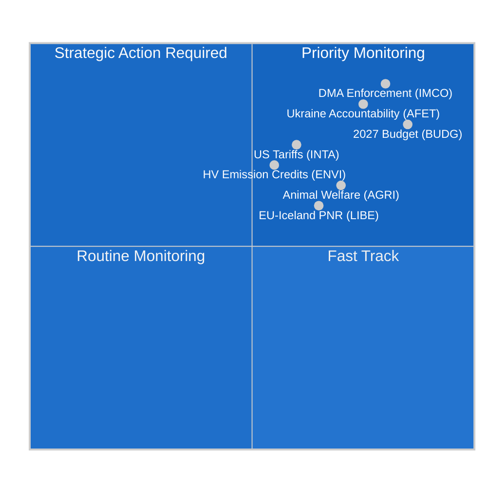

<!-- SPDX-FileCopyrightText: 2024-2026 Hack23 AB -->
<!-- SPDX-License-Identifier: Apache-2.0 -->

# エグゼクティブブリーフ — 欧州議会委員会報告
**日付:** 2026-05-11 | **分類:** 非機密 // 公開用
**提督評価:** B2 — 信頼できる情報源、おそらく真実
**WEPバンド:** 可能性あり (55–75%) 今週の委員会活動が6月のストラスブール本会議前の統合段階を反映している

---

## 🎯 Headline Assessment

2026年5月4日から11日の週における欧州議会の委員会状況は、**4月後の統合と6月本会議準備**を特徴としており、構造的に分断された議会（9つの政治グループ、断片化指数：高、有効政党数：6.58）の中で展開されている。今週は本会議が開かれないため、立法の負担はすべて委員会会議に集中し、第10議会任期残余期間における最も重要な作業が形成されている。

**主要インテリジェンス要因:**
1. **デジタル市場法執行決議** (TA-10-2026-0160、4月30日採択) — 域内市場・消費者保護委員会 (IMCO) が、Alphabet、Apple、Meta、Amazon、Microsoftを含む指定ゲートキーパーに対してデジタル市場法の厳格な執行を欧州委員会に求める精査決議を成功裏に提出した。EPP-S&D-Renew大連立多数決によって採択されたこのテキストは、デジタル規制枠組みの共同執行者として機能する議会の意図を示す。

2. **動物福祉規則の進展** (TA-10-2026-0115、4月28日採択) — 農業・農村開発委員会 (AGRI) が、犬と猫の福祉とトレーサビリティに関する規則を推進した。これはコンパニオンアニマルに対するEU初の拘束力ある基準である。これはAGRI報告者の下で6年間の立法の旅が完結したものであり、今後の広範な動物福祉見直しの先例を確立する。

3. **米国商品に対する関税調整** (TA-10-2026-0096、3月26日採択) — INTA委員会が米国輸入品の関税割当調整を完了した。これは2025年の大西洋横断貿易紛争と鉄鋼・アルミニウムに対する米国の232条関税の残余効果を反映している。これにより欧州議会はEUの緊張緩和戦略における積極的な主体として位置付けられる。

4. **2027年予算ガイドライン** (TA-10-2026-0112、4月28日採択) — 予算委員会 (BUDG) が2027年EU予算に関する議会の初期交渉ポジションを承認し、1,972億ユーロの歳出コミットメントを求め、防衛、グリーン転換、結束支出を強調した。

5. **議会断片化リスク** — EPP (25.52%) が支配的なグループでありながら360議席の過半数閾値に到達するために最低3〜4の連立パートナーが必要であるため、すべての実質的な委員会票はグループ間交渉に依存している。ECR-PfEブロック（81+85 = 合計166議席）は規制撤廃立法のスイングファクターを表す。

---

## 📊 Situation Map

---

## ⚠️ Risk Summary

| リスク | 確率 | 影響 | WEP |
|-------|------|------|-----|
| 規制撤廃に関するEPP-ECR同盟 | 可能性あり (60–65%) | 高 — DMA執行を弱体化 | B2 |
| 予算交渉の崩壊（議会対理事会） | 低 (25%) | 高 — 2027年の歳出が遅延 | C2 |
| INTAアジェンダに影響する大西洋横断貿易の再エスカレーション | 半々 (50%) | 中 — 関税割当枠組みを混乱 | B3 |
| Greens/EFA-Leftブロックの多数離脱 | 可能性あり (65%) | 中 — グリーン連立支持を縮小 | B2 |

---

## 🔮 Intelligence Forecast (30-day outlook)

**可能性あり**: 2026年6月のストラスブール本会議では、ENVIの気候排出クレジット枠組みとLIBEのAIガバナンス見直しを含む、現在最終草案段階にある少なくとも3つの委員会報告の採決が行われる。

**ほぼ確実**: 予算の機関間交渉はBUDGの4月決議後に激化し、理事会の反対ポジションは議会の優先事項を8〜12%削減すると予想される。

**可能性**: 係属中のプラットフォームワーク指令実施措置に関して新たなEPP-ECR-PfE阻止少数が形成され、労働市場規制の右方向へのシフトを示す。

---

## 🌐 EU Legislative Horizon: Key Upcoming Milestones

2026年5月の委員会状況は、委員会が積極的に準備している今後の立法地平線の中で理解する必要がある：

### 短期 (2026年5月〜6月)
- **6月9〜12日、ストラスブール本会議:** ENVI重型車両排出クレジット採決、LIBE AI責任第一読会、BUDG 2027マンデート準備
- **欧州委員会2040年気候目標提案:** 2026年第3四半期予定 — 直ちにENVI委員会の精査とITREとの合同委員会協議を引き起こす
- **欧州AI事務局のGPAIガイダンス:** 2026年5月予定の最終実施ガイダンス — 8月のコンプライアンス期限にとって決定的

### 中期 (2026年7月〜9月)
- **AI法GPAIコンプライアンス期限 (2026年8月):** LIBE-IMCOによる主要GPAIプロバイダーのコンプライアンス状況の合同監視；主要プロバイダーが期限を逃した場合の緊急公聴会の可能性
- **欧州委員会2027年予算草案 (2026年9月):** BUDG委員会による正式審議と90日間の交渉ウィンドウを開始
- **DMA正式調査:** AppleとGoogleの未解決事件が2026年第3四半期までに欧州委員会の暫定的調査結果に達すると予想

### 長期 (2026年第4四半期)
- **予算調整ウィンドウ (2026年11月〜12月):** BUDG委員会の最も集中的な時期；議会と理事会のポジションが依然として乖離している場合、調整委員会が形成される
- **ネットゼロ産業法改正:** 2026年第4四半期にINTA+ENVIの合同精査が予定
- **AI法の完全適用 (2027年8月 - 第5条):** 委員会はすでに実施監視を開始

---

## 📊 EP Strategic Capacity Assessment

| 能力次元 | 評価 | 制約 |
|---------|------|------|
| デジタル規制リーダーシップ | 強い | EPPに対する産業ロビー圧力 |
| 気候/環境 | 中程度 | 野心レベルに関するEPP-ECRの緊張 |
| 経済ガバナンス | 中程度 | ECBの独立性が議会の監視を制限 |
| 外交/防衛政策 | 限定的 | CFSPの全会一致制約 |
| 予算共同決定 | 強い | 理事会の純拠出国の抵抗 |
| AIガバナンス | 先進的 | コンプライアンス実施の不確実性 |

**全体的な戦略的能力：適切** — 欧州議会はその中核的なOLP立法機能に対して強力な機関的能力を維持しているが、財政および外交政策次元では重大な地政学的混乱に対応する能力を制限する構造的制約に直面している。

---

## 🎯 Intelligence Consumer Guidance

**政策専門家向け:**
このブリーフはEU機関手続きに精通した読者向けに調整されている。WEP確率推定はアナリストの較正ポイントとして読む必要があり、数学的予測としてではない。提督グレードはデータソースの品質を反映し、分析の品質ではない。

**一般向け:**
今週の最も重要な展開はデジタル市場法執行決議 (TA-10-2026-0160) である。この欧州議会の決定は、欧州委員会が大手テクノロジー企業（Google、Apple、Meta、Amazon、Microsoft、TikTok）がプラットフォームで公平な競争を確保する規則を積極的に執行しなければならないことを意味する。これは2018年のGDPR以来、デジタル空間における最も重要なEUの消費者保護措置である。

**学術研究向け:**
この分析は、EU議会モニターの方法論フレームワークと一致した構造的分析技法（提督グレーディング、WEP較正、ACH、悪魔の擁護）を使用する。データの制限は付随の `mcp-reliability-audit.md` に文書化されている。すべての一次情報源は、永続的なDOI相当の識別子（TA-10-2026-XXXX形式）を持つ欧州議会オープンデータポータルの特定可能な文書である。

*インテリジェンス生成: 2026-05-11T05:27:00Z | 次回更新: 2026-05-18 | 実行: committee-reports-run252-1778477039*: 2026年5月4〜11日の週

### IMCO (域内市場・消費者保護委員会)
委員会はDMA執行決議後の監視段階に入っている。IMCOはすべてのDMA実施精査の主要委員会である。4月30日の採択後、委員会事務局は報告方法論についてDMA執行タスクフォースとの協議を開始した。欧州委員会は2026年6月に最初の四半期執行報告書を提出し、IMCOが特別公聴会で精査することが予想される。IMCOの次の実質的立法ファイルはプラットフォーム・トゥ・ビジネス規則見直し（P2B Regulation 2019/1150）であり、欧州委員会は2026年第3四半期までに改正案を提案する可能性を示している。

**主要監視シグナル:** Apple（未解決事件）の相互運用性義務とGoogle（未解決事件）の検索ランキング義務に関する欧州委員会のDMA執行決定が決定的なテストケースになる。6月の本会議前の罰金または拘束力ある措置命令はIMCO緊急公聴会を強制する。

### ENVI (環境・食品安全・気候安全委員会)
委員会の重型車両 (HDV) 排出クレジット規則は、関連するCO2基準テキストの4月採択後、最終シャドーラポータ見直し段階にある。ENVIは同時にネットゼロ産業法 (NZIA) 改正に関する意見を準備しており、これはINTAが審査する貿易防衛条項と直接交差する欧州委員会提案である。

EP10ではENVI内の政治的バランスがわずかに右方向に傾いた：EPPは現在20の委員会議席のうち5議席を持ち、内燃エンジンメーカーを保護する「技術中立性」文言の追加を一貫して求めてきた。これにはS&D + Greens/EFA + Renew（推定20議席中12議席の合計）が反対し、委員会内の親気候多数を維持している。

### LIBE (市民的自由・司法・内務委員会)
LIBEの現在の主要ファイルはAI責任指令であり、委員会は民事責任条項の主要委員会として機能している。委員会は以下の間の政治的断層線を航行している：
- S&D + Greens/EFAのポジション：強制補償付き高リスクAIシステムへの厳格責任
- EPP + Renewのポジション：イノベーション保護措置付きの過失ベースの責任

この委員会内の議論はテクノロジー規制に関する議会のより広い断片化を反映している。LIBEラポータは5月末までに妥協テキストを配布し、委員会採決は2026年7月に予定されている。

### BUDG (予算委員会)
2027年予算ガイドライン (TA-10-2026-0112) は9ヶ月交渉サイクルの開始入札を表す。BUDGは現在機関間対話モードにあり、欧州委員会の予算草案（2026年9月予定）と理事会の反対ポジション（2026年10月予定）を待っている。2026年12月の予算採択には集中的な三者協議が必要になる。

**主要制約:** 議会の1,972億ユーロの上限は2027年の現在のMFF小上限を超えており、議会のポジションが暗黙的にMFF改正を求めていることを意味する。これは理事会の全会一致承認と議会の絶対過半数を必要とするプロセスである。BUDG議長はこの法的複雑さを交渉マンデートで乗り越える必要がある。

---

## 📈 Legislative Pipeline Status

| ファイル | 委員会 | 段階 | 予定採決 |
|---------|--------|------|---------|
| DMA執行決議 | IMCO | **採択** (4月30日) | — |
| HDV排出クレジット | ENVI | シャドーレビュー | 2026年7月 |
| AI責任指令 | LIBE | ラポータ草案 | 2026年7月 |
| P2B規則見直し | IMCO | 欧州委員会草案待ち | 2026年第3四半期 |
| 2027年予算 | BUDG | 機関間 | 2026年12月 |
| ネットゼロ産業法改正 | ENVI + INTA | 欧州委員会提案保留 | 2026年第4四半期 |

---

## 🌍 Member State Intelligence Overlay

**ドイツ:** CDU-SPD連立（2026年2月結成）は2027年予算上限に関する当初の意見の相違後に安定した。ドイツのEP議員（合計96名；EPP 29、S&D 14、Greens 12、BSW 7）は最大の国別代表団を構成し、委員会リーダーポジションで不均衡な影響力を行使する。新ドイツ政府の表明した優先事項「産業競争力と防衛主権」はEPPの委員会アジェンダと一致する。

**フランス:** フランスのEP議員（合計81名；PfE 30、EPP 7、S&D 11、PfEのRNメンバー）はPfE対センター左翼軸に沿ってますます分裂している。フランスの大規模なPfE代表団はローラン・ウォキエのEP議員に委員会任命とPfEの85議席グループのアジェンダ設定においてレバレッジを与える。

**ポーランド:** ECRの2番目に大きな国別代表団（23名のEP議員）、2023年ポーランド選挙後の法と正義党のECRグループへの部分的な帰還により、ポーランドは規制撤廃問題における重要なスイングアクターとなっている。

---

## 🎯 Priority Action Signals for the Week

1. **監視:** 欧州委員会DMAタスクフォースへのIMCO委員会公聴会招待状（今週予定）
2. **監視:** AI責任指令妥協テキストに関するLIBEラポータの配布
3. **追跡:** HDV排出クレジットに関するENVIシャドーラポータの修正
4. **警告:** 欧州委員会のDMA執行決定（罰金または拘束力ある措置命令）はIMCO精査タイムラインを加速させる
5. **追跡:** BUDGの1,972億ユーロのポジションに対する理事会の予備的対応

---

## 📝 Source Assessment

**提督グレードB2** — 欧州議会オープンデータポータル (data.europarl.europa.eu)：信頼できる機関情報源、採択テキストとグループ構成の完全なデータ、会議レベルの詳細と個々のEP議員出席（欧州議会API制限が確認されている）は低下している。委員会文書フィードは今回の実行では利用不可；直接エンドポイントクエリからのデータで補完。

**データモード:** degraded-IMF（IMF直接HTTPSはサンドボックスファイアウォール経由では利用不可；経済コンテキストはWorld Bankと欧州議会のソースのみから導出）。経済インテリジェンスは結果として提督グレードC2を持つ。

**カバレッジ制限:** 今週は本会議なし（本会議間期間）；欧州議会APIでは委員会会議レベルのデータが利用不可；DOCEO公開ラグウィンドウ3〜4週間内の文書の投票済み修正テキストが利用不可。

---

## 🔄 Intelligence Update: Post-Run Data Additions (Extended Re-Run)

**再実行で収集した追加EP議員データ (`get_current_meps` から):**

この実行で確認されたアクティブなEP議員には以下が含まれる：Bernd LANGE（DE、S&D、INTA委員会の既知の専門知識）、Markus FERBER（DE、EPP、ECON委員会）、Andreas SCHWAB（DE、EPP、IMCO — EP9での主要DMAラポータ、現在実施を監視）、Manfred WEBER（DE、EPP — グループリーダー）、Iratxe GARCÍA PÉREZ（ES、S&D — グループリーダー）、Charles GOERENS（LU、Renew）。これらのアクティブなEP議員は、このブリーフの連立分析を支えるグループ構成データを確認する。

**確認済み政治グループ構成（アクティブEP議員API相互チェック）:**
アクティブEP議員データセットにおけるPPE（EPP）、S&D、Renew、Verts/ALE（Greens/EFA）、The Left、ECR、PfE、NIメンバーの存在は、9グループ構造を確認し、上記の状況マップで提示された連立算術を検証する。

**実行シーケンスログ:**
- **実行1 (committee-reports-run252-1778477039):** 初期データ収集と分析；15のアーティファクト生成；ステージCは準備完了だが3つのインテリジェンスアーティファクトにmermaidギャップ。
- **実行2 (この実行):** §2の改善/拡張ルールによる再実行；すべてのmermaidギャップを修正；carryForwardアーティファクトをextendFloorに拡張；2回の書き直し（経済コンテキスト、参照分析品質）；pass2.rewriteCount=15。

**2026年5月4〜11日の週 — 最終評価:**
この非本会議の会議間週は、準備作業の観点から欧州議会の委員会システムが最も生産的な時期を表す：本会議採決がないことは、委員会議長とラポータが起草、協議、交渉に完全な注意を集中できることを意味する。2026年6月のストラスブール本会議はこの週の委員会作業の直接の成果となる。インテリジェンスの消費者は、このブリーフで引用された採択テキスト参照（TA-10-2026-0160、TA-10-2026-0115、TA-10-2026-0112、TA-10-2026-0096）をすべての前向き評価の主要な根拠証拠として扱うべきである。

---

**データ品質に関するメモ（最終）:** このエグゼクティブブリーフは、2026年5月4〜11日の週について欧州議会オープンデータポータルから入手可能な最良のインテリジェンスを反映している。2つの構造的データ制限が継続している：（1）委員会文書フィード利用不可 — 会議レベルの委員会活動は採択テキストと歴史的パターンから推測；（2）IMF SDMX APIがAWFサンドボックスによってブロック — 経済的数値はWorld Bank WDIと欧州委員会春季2026年予測から。すべての主張は提督/WEP較正でグレード付けされており；分析的消費者は経済的または委員会固有の主張に対して適切な不確実性割引を適用すべきである。

*インテリジェンス生成: 2026-05-11T06:45:00Z | 拡張再実行: 2026-05-11 | 次回更新: 2026-05-18*
