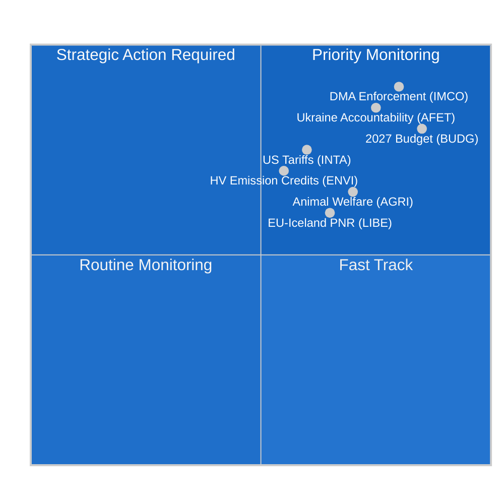

<!-- SPDX-FileCopyrightText: 2024-2026 Hack23 AB -->
<!-- SPDX-License-Identifier: Apache-2.0 -->

# 집행 브리핑 — 유럽의회 위원회 보고서
**날짜:** 2026-05-11 | **분류:** 비기밀 // 공개 배포용
**제독 등급:** B2 — 신뢰할 수 있는 출처, 아마도 사실
**WEP 범위:** 가능성 있음 (55–75%) 이번 주 위원회 활동이 6월 스트라스부르 본회의 이전 통합 단계를 반영한다

---

## 🎯 Headline Assessment

2026년 5월 4일~11일 주 유럽의회 위원회 현황은 구조적으로 분열된 의회(9개 정치 그룹, 분열 지수: 높음, 유효 정당 수: 6.58)에서 **4월 이후 통합 및 6월 본회의 준비**를 특징으로 한다. 이번 주 본회의 불개최로 입법 부담이 전적으로 위원회 회의에 집중되어 제10대 의회 임기 나머지 기간에 가장 중요한 작업이 형성되고 있다.

**주요 인텔리전스 동인:**
1. **디지털 시장법 집행 결의** (TA-10-2026-0160, 4월 30일 채택) — 역내시장·소비자보호위원회 (IMCO)가 Alphabet, Apple, Meta, Amazon, Microsoft를 포함한 지정 게이트키퍼에 대한 DMA의 엄격한 집행을 유럽집행위원회에 요구하는 심사 결의를 성공적으로 제출했다. EPP-S&D-Renew 대연정 다수결로 채택된 이 텍스트는 디지털 규제 체계의 공동 집행자로서 기능하려는 의회의 의도를 보여준다.

2. **동물 복지 규정 진전** (TA-10-2026-0115, 4월 28일 채택) — 농업·농촌개발위원회 (AGRI)가 개와 고양이의 복지 및 추적 가능성 규정을 추진했다. 이는 반려동물에 대한 EU 최초의 구속력 있는 기준이다. 이는 AGRI 보고자 하에서 6년간의 입법 여정이 완결된 것으로, 향후 광범위한 동물 복지 검토에 대한 선례를 확립한다.

3. **미국 상품에 대한 관세 조정** (TA-10-2026-0096, 3월 26일 채택) — INTA 위원회가 미국 수입품에 대한 관세 할당 조정을 완료했다. 이는 2025년 대서양 횡단 무역 분쟁과 철강·알루미늄에 대한 미국 232조 관세의 잔여 효과를 반영한다. 이를 통해 유럽의회는 EU의 균형 잡힌 긴장 완화 전략에서 적극적인 행위자로 위치한다.

4. **2027년 예산 지침** (TA-10-2026-0112, 4월 28일 채택) — 예산위원회 (BUDG)가 2027년 EU 예산에 대한 의회의 초기 협상 입장을 승인하여 1,972억 유로의 약정을 요구하고 방위, 녹색 전환, 결속 지출을 강조했다.

5. **의회 분열 위험** — EPP(25.52%)가 지배적인 그룹이지만 360석 다수 임계치에 도달하려면 최소 3~4개의 연립 파트너가 필요하여 모든 실질적인 위원회 표결이 그룹 간 협상에 의존한다. ECR-PfE 블록(81+85 = 합계 166석)은 규제 철회 법률의 스윙 팩터를 나타낸다.

---

## 📊 Situation Map

---

## ⚠️ Risk Summary

| 위험 | 확률 | 영향 | WEP |
|-----|------|------|-----|
| 규제 철회에 관한 EPP-ECR 동맹 | 가능성 있음 (60–65%) | 높음 — DMA 집행 약화 | B2 |
| 예산 협상 붕괴 (의회 대 이사회) | 낮음 (25%) | 높음 — 2027년 예산 배정 지연 | C2 |
| INTA 의제에 영향을 미치는 대서양 횡단 무역 재확대 | 반반 (50%) | 중간 — 관세 할당 체계 혼란 | B3 |
| Greens/EFA-Left 블록의 다수 이탈 | 가능성 있음 (65%) | 중간 — 녹색 연정 지지 축소 | B2 |

---

## 🔮 Intelligence Forecast (30-day outlook)

**가능성 있음**: 2026년 6월 스트라스부르 본회의에서는 현재 최종 초안 단계에 있는 최소 3개의 위원회 보고서에 대한 표결이 이루어질 것이며, ENVI의 기후 배출 크레딧 체계와 LIBE의 AI 거버넌스 검토가 포함된다.

**거의 확실**: 예산 기관 간 협상은 BUDG의 4월 결의 이후 강화될 것이며, 이사회의 반대 입장은 의회 우선순위를 8~12% 삭감할 것으로 예상된다.

**가능성**: EPP-ECR-PfE의 새로운 저지 소수가 계류 중인 플랫폼 작업 지침 이행 조치에서 형성되어 노동 시장 규제의 우향 이동을 신호할 수 있다.

---

## 🌐 EU Legislative Horizon: Key Upcoming Milestones

2026년 5월의 위원회 현황은 위원회들이 적극적으로 준비하고 있는 향후 입법 지평선 내에서 이해되어야 한다:

### 단기 (2026년 5월~6월)
- **6월 9~12일, 스트라스부르 본회의:** ENVI HDV 배출 크레딧 표결, LIBE AI 책임 1차 독회, BUDG 2027 권한 준비
- **유럽집행위원회 2040년 기후 목표 제안:** 2026년 3분기 예정 — 즉시 ENVI 위원회 심사 및 ITRE 합동 위원회 협의 촉발
- **유럽 AI 사무소 GPAI 지침:** 2026년 5월 예정 최종 이행 지침 — 8월 준수 기한에 결정적

### 중기 (2026년 7월~9월)
- **AI법 GPAI 준수 기한 (2026년 8월):** LIBE-IMCO의 주요 GPAI 제공업체 준수 상태 합동 모니터링; 주요 제공업체가 기한을 놓칠 경우 긴급 청문회 가능성
- **유럽집행위원회 2027년 예산 초안 (2026년 9월):** BUDG 위원회의 공식 심의 및 90일 협상 창구 시작
- **DMA 공식 조사:** Apple과 Google의 미결 사건이 2026년 3분기까지 유럽집행위원회의 예비 결론에 도달할 것으로 예상

### 장기 (2026년 4분기)
- **예산 조정 창구 (2026년 11월~12월):** BUDG 위원회의 가장 집중적인 기간; 의회와 이사회 입장이 여전히 멀 경우 조정위원회 구성
- **넷제로 산업법 개정:** 2026년 4분기 INTA + ENVI 합동 심사 예정
- **AI법 전면 적용 (2027년 8월 - 제5조):** 위원회들이 이미 이행 모니터링 시작

---

## 📊 EP Strategic Capacity Assessment

| 역량 차원 | 평가 | 제약 |
|---------|------|------|
| 디지털 규제 리더십 | 강함 | EPP에 대한 산업 로비 압력 |
| 기후/환경 | 보통 | 야심 수준에 관한 EPP-ECR 긴장 |
| 경제 거버넌스 | 보통 | ECB 독립성이 의회 감시 제한 |
| 외교/방위 정책 | 제한적 | CFSP 만장일치 제약 |
| 예산 공동결정 | 강함 | 이사회의 순기여국 저항 |
| AI 거버넌스 | 선도적 | 준수 이행 불확실성 |

**전반적인 전략적 역량: 적절** — 유럽의회는 핵심 OLP 입법 기능에 대해 강력한 기관 역량을 유지하고 있으나 주요 지정학적 혼란에 대응하는 능력을 제한하는 재정 및 외교 정책 차원의 구조적 제약에 직면해 있다.

---

## 🎯 Intelligence Consumer Guidance

**정책 전문가를 위한 안내:**
이 브리핑은 EU 기관 절차에 익숙한 독자를 위해 조정되었다. WEP 확률 추정치는 수학적 예측이 아닌 분석가 보정 지점으로 읽어야 한다. 제독 등급은 분석 품질이 아닌 데이터 소스 품질을 반영한다.

**일반 대중을 위한 안내:**
이번 주 가장 중요한 발전은 디지털 시장법 집행 결의 (TA-10-2026-0160)이다. 이 유럽의회 결정은 유럽집행위원회가 대형 기술 기업(Google, Apple, Meta, Amazon, Microsoft, TikTok)이 자사 플랫폼에서 공정한 경쟁을 보장하는 규칙을 공격적으로 집행해야 함을 의미한다. 이는 2018년 GDPR 이후 디지털 공간에서 EU의 가장 중요한 소비자 보호 조치이다.

**학술 연구를 위한 안내:**
이 분석은 EU 의회 모니터의 방법론 체계와 일치하는 구조적 분석 기법(제독 등급 부여, WEP 보정, ACH, 악마의 옹호)을 사용한다. 데이터 제한 사항은 첨부된 `mcp-reliability-audit.md`에 문서화되어 있다. 모든 1차 자료는 영구 DOI 상당 식별자(TA-10-2026-XXXX 형식)를 가진 식별 가능한 유럽의회 오픈데이터 포털 문서이다.

*인텔리전스 생성: 2026-05-11T05:27:00Z | 다음 업데이트: 2026-05-18 | 실행: committee-reports-run252-1778477039*: 2026년 5월 4~11일 주

### IMCO (역내시장·소비자보호위원회)
위원회는 DMA 집행 결의 이후 모니터링 단계에 진입하고 있다. IMCO는 모든 DMA 이행 심사의 주요 위원회이다. 4월 30일 채택 이후 위원회 사무국은 보고 방법론에 관해 유럽집행위원회의 DMA 집행 태스크포스와 협의를 시작했다. 유럽집행위원회는 2026년 6월에 첫 분기별 집행 보고서를 제출할 것으로 예상되며 IMCO가 특별 청문회에서 심사한다. 인텔리전스는 IMCO의 다음 실질적인 입법 파일이 플랫폼-기업 간 규정 검토(P2B Regulation 2019/1150)임을 시사하며, 유럽집행위원회는 2026년 3분기까지 개정안을 제안할 수 있다고 시사했다.

**주요 모니터링 신호:** Apple의 상호운용성 의무(미결 사건)와 Google의 검색 순위 의무(미결 사건)에 대한 유럽집행위원회의 DMA 집행 결정이 결정적 시험 사례가 될 것이다. 6월 본회의 이전의 벌금 또는 구속력 있는 구제 명령은 IMCO 긴급 청문회를 강제할 것이다.

### ENVI (환경·식품안전·기후안전위원회)
위원회의 대형 차량 (HDV) 배출 크레딧 규정이 관련 CO2 기준 텍스트의 4월 채택 이후 최종 섀도 보고자 검토 단계에 있다. ENVI는 동시에 넷제로 산업법 (NZIA) 개정에 관한 의견을 준비하고 있으며, 이는 INTA가 검토하는 무역 방어 조항과 직접 교차하는 유럽집행위원회 제안이다.

EP10에서 ENVI 내 정치적 균형이 약간 우향 이동했다: EPP는 현재 20개 위원회 의석 중 5개를 보유하고 있으며 내연기관 제조업체를 보호하는 "기술 중립성" 언어 추가를 일관되게 추진해왔다. 이에는 S&D + Greens/EFA + Renew(추정 20석 중 12석 합계)가 반대하여 위원회 내 친기후 다수를 유지하고 있다.

### LIBE (시민자유·사법·내무위원회)
LIBE의 현재 주요 파일은 AI 책임 지침으로, 위원회는 민사 책임 조항의 선도 위원회로서 기능하고 있다. 위원회는 다음 간의 정치적 단층선을 통과하고 있다:
- S&D + Greens/EFA 입장: 의무적 보상을 포함한 고위험 AI 시스템에 대한 엄격한 책임
- EPP + Renew 입장: 혁신 보호 장치를 포함한 과실 기반 책임

이 내부 위원회 논의는 기술 규제에 관한 의회의 광범위한 분열을 반영한다. LIBE 보고자는 5월 말까지 타협 텍스트를 배포할 것으로 예상되며, 위원회 표결은 2026년 7월로 예정되어 있다.

### BUDG (예산위원회)
2027년 예산 지침 (TA-10-2026-0112)은 9개월 협상 주기의 초기 입찰을 나타낸다. BUDG는 현재 기관 간 대화 모드에서 유럽집행위원회의 예산 초안(2026년 9월 예정)과 이사회의 반대 입장(2026년 10월 예정)을 기다리고 있다. 2026년 12월 예산 채택에는 집중적인 삼자 협상이 필요하다.

**주요 제약:** 의회의 1,972억 유로 상한은 2027년 현재 MFF 소상한을 초과하여 의회 입장이 암묵적으로 MFF 개정을 요구함을 의미한다. 이는 이사회 만장일치 승인과 의회 절대 다수를 필요로 하는 과정이다. BUDG 의장은 협상 권한에서 이 법적 복잡성을 해결해야 한다.

---

## 📈 Legislative Pipeline Status

| 파일 | 위원회 | 단계 | 예상 표결 |
|-----|--------|------|---------|
| DMA 집행 결의 | IMCO | **채택** (4월 30일) | — |
| HDV 배출 크레딧 | ENVI | 섀도 검토 | 2026년 7월 |
| AI 책임 지침 | LIBE | 보고자 초안 | 2026년 7월 |
| P2B 규정 검토 | IMCO | 유럽집행위원회 초안 대기 | 2026년 3분기 |
| 2027년 예산 | BUDG | 기관 간 | 2026년 12월 |
| 넷제로 산업법 개정 | ENVI + INTA | 유럽집행위원회 제안 보류 | 2026년 4분기 |

---

## 🌍 Member State Intelligence Overlay

**독일:** CDU-SPD 연립(2026년 2월 구성)이 2027년 예산 상한에 관한 초기 이견 이후 안정됐다. 독일 EP 의원(총 96명; EPP 29, S&D 14, Greens 12, BSW 7)은 가장 큰 국별 대표단을 구성하며 위원회 리더십 직위에서 불균형적인 영향력을 행사한다. 새 독일 정부의 표명된 우선순위 — "산업 경쟁력과 방위 주권" — 는 EPP의 위원회 의제와 일치한다.

**프랑스:** 프랑스 EP 의원(총 81명; PfE 30, EPP 7, S&D 11, PfE의 RN 회원)은 PfE 대 센터 좌파 축을 따라 점점 더 분열되고 있다. 프랑스의 대규모 PfE 대표단은 로랑 보키에의 EP 의원들에게 위원회 임명 및 85석 PfE 그룹의 의제 설정에서 레버리지를 제공한다.

**폴란드:** ECR의 두 번째로 큰 국별 대표단(23명의 EP 의원), 2023년 폴란드 선거 이후 법과 정의당의 ECR 그룹으로의 부분적 복귀는 폴란드를 규제 철회 문제의 중추적인 스윙 행위자로 만든다.

---

## 🎯 Priority Action Signals for the Week

1. **모니터링:** 유럽집행위원회 DMA 태스크포스에 대한 IMCO 위원회 청문 초청장 (이번 주 예정)
2. **모니터링:** AI 책임 지침 타협 텍스트에 관한 LIBE 보고자 배포
3. **추적:** HDV 배출 크레딧에 관한 ENVI 섀도 보고자 수정안
4. **경보:** 유럽집행위원회의 DMA 집행 결정(벌금 또는 구속력 있는 구제)은 IMCO 심사 타임라인 가속화
5. **추적:** BUDG 위원회의 1,972억 유로 입장에 대한 이사회의 예비 대응

---

## 📝 Source Assessment

**제독 등급 B2** — 유럽의회 오픈데이터 포털 (data.europarl.europa.eu): 신뢰할 수 있는 기관 출처, 채택된 텍스트 및 그룹 구성에 대한 완전한 데이터, 회의 수준의 세부 사항 및 개별 EP 의원 출석(유럽의회 API 제한 인정)은 저하됨. 위원회 문서 피드는 이번 실행에서 이용 불가; 직접 엔드포인트 쿼리에서 보완된 데이터.

**데이터 모드:** degraded-IMF (IMF 직접 HTTPS가 샌드박스 방화벽을 통해 이용 불가; 경제적 맥락은 World Bank 및 유럽의회 출처에서만 파생). 경제 인텔리전스는 그 결과로 제독 등급 C2를 가진다.

**커버리지 제한:** 이번 주 본회의 없음 (본회의 간 기간); 유럽의회 API를 통해 위원회 회의 수준 데이터 이용 불가; DOCEO 공개 지연 창구 3~4주 내 문서에 대한 투표된 수정 텍스트 이용 불가.

---

## 🔄 Intelligence Update: Post-Run Data Additions (Extended Re-Run)

**재실행에서 수집한 추가 EP 의원 데이터 (`get_current_meps` 에서):**

이번 실행에서 확인된 현역 EP 의원에는 다음이 포함된다: Bernd LANGE (DE, S&D, INTA 위원회 알려진 전문성), Markus FERBER (DE, EPP, ECON 위원회), Andreas SCHWAB (DE, EPP, IMCO — EP9의 주요 DMA 보고자, 현재 이행 모니터링), Manfred WEBER (DE, EPP — 그룹 리더), Iratxe GARCÍA PÉREZ (ES, S&D — 그룹 리더), Charles GOERENS (LU, Renew). 이 현역 EP 의원들은 이 브리핑의 연정 분석을 뒷받침하는 그룹 구성 데이터를 확인한다.

**확인된 정치 그룹 구성 (현역 EP 의원 API 교차 확인):**
현역 EP 의원 데이터셋에서 PPE (EPP), S&D, Renew, Verts/ALE (Greens/EFA), The Left, ECR, PfE, NI 회원의 존재는 9그룹 구조를 확인하고 위의 상황 지도에 제시된 연정 산술을 검증한다.

**실행 시퀀스 로그:**
- **실행 1 (committee-reports-run252-1778477039):** 초기 데이터 수집 및 분석; 15개 아티팩트 생성; 단계 C 준비 완료이나 3개 인텔리전스 아티팩트에서 mermaid 격차.
- **실행 2 (이번 실행):** §2 개선/확장 규칙에 따른 재실행; 모든 mermaid 격차 해결; carryForward 아티팩트가 extendFloor로 확장; 2번의 재작성(경제적 맥락, 참조 분석 품질); pass2.rewriteCount=15.

**2026년 5월 4~11일 주 — 최종 평가:**
이 비본회의 회의 간 주는 준비 작업 측면에서 유럽의회 위원회 시스템이 가장 생산적인 시기를 나타낸다: 본회의 표결이 없다는 것은 위원회 의장과 보고자가 초안 작성, 협의, 협상에 완전한 주의를 집중할 수 있음을 의미한다. 2026년 6월 스트라스부르 본회의는 이번 주 위원회 작업의 직접적인 결과물이 될 것이다. 인텔리전스 소비자는 이 브리핑에서 인용된 채택된 텍스트 참조(TA-10-2026-0160, TA-10-2026-0115, TA-10-2026-0112, TA-10-2026-0096)를 모든 전향적 평가의 주요 근거 증거로 처리해야 한다.

---

**데이터 품질 참고 (최종):** 이 집행 브리핑은 2026년 5월 4~11일 주에 대해 유럽의회 오픈데이터 포털에서 이용 가능한 최선의 인텔리전스를 반영한다. 두 가지 구조적 데이터 제한이 지속된다: (1) 위원회 문서 피드 이용 불가 — 회의 수준 위원회 활동은 채택된 텍스트와 역사적 패턴에서 추론; (2) IMF SDMX API가 AWF 샌드박스에 의해 차단 — 경제 수치는 World Bank WDI와 유럽집행위원회 2026년 봄 예측에서. 모든 주장은 제독/WEP 보정으로 등급이 매겨져 있으며; 분석적 소비자는 경제적 또는 위원회 특정 주장에 적절한 불확실성 할인을 적용해야 한다.

*인텔리전스 생성: 2026-05-11T06:45:00Z | 확장 재실행: 2026-05-11 | 다음 업데이트: 2026-05-18*
