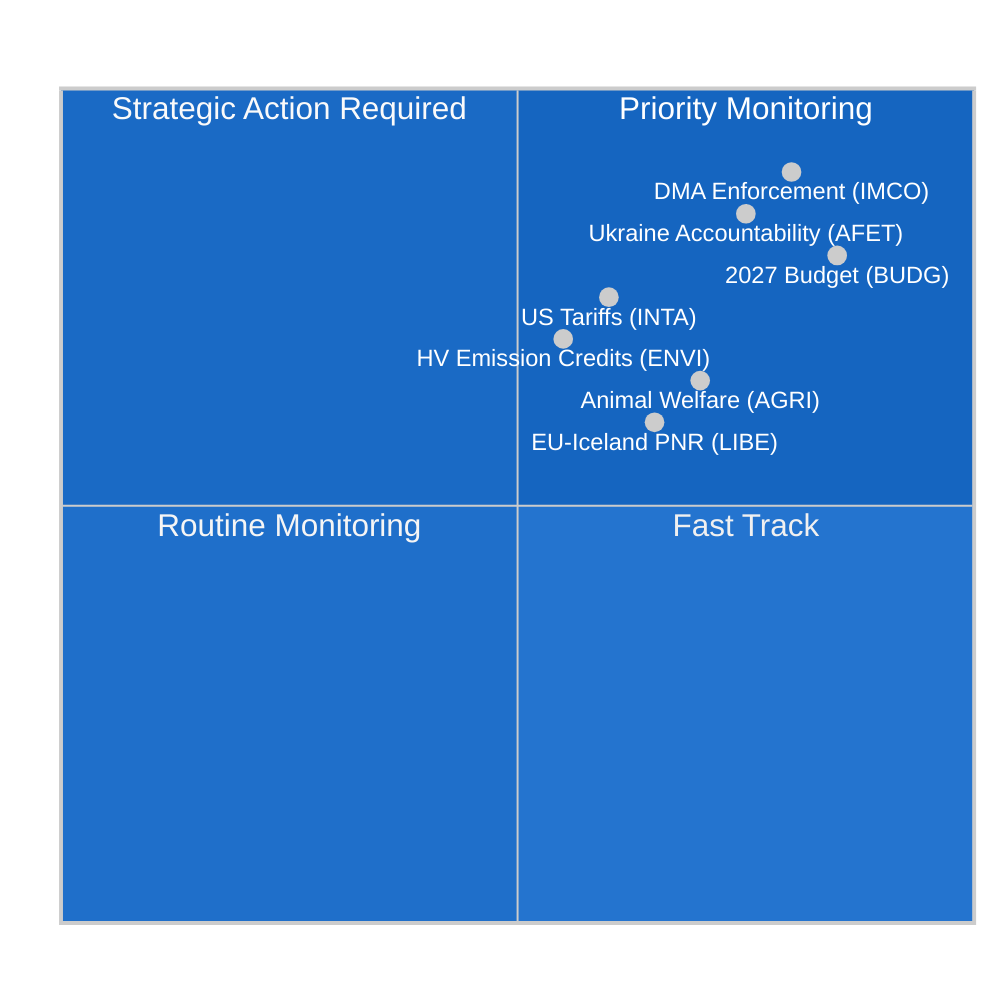

<!-- SPDX-FileCopyrightText: 2024-2026 Hack23 AB -->
<!-- SPDX-License-Identifier: Apache-2.0 -->

# Inlichtingenoverzicht — EP-commissierapporten
**Datum:** 2026-05-11 | **Classificatie:** NIET-GECLASSIFICEERD // VOOR OPENBARE VERSPREIDING
**Admiraliteitsbeoordeling:** B2 — Betrouwbare bron, waarschijnlijk juist
**WEP-band:** Waarschijnlijk (55–75 %) dat de commissieactiviteit deze week een consolidatiefase weerspiegelt vóór de plenaire vergadering van juni in Straatsburg

---

## 🎯 Algemene beoordeling

Het commissielandschap van het Europees Parlement in de week van 4 tot 11 mei 2026 wordt gekenmerkt door **consolidatie na april en voorbereiding op de plenaire vergadering van juni**, binnen een structureel gefragmenteerd Parlement (9 politieke fracties; fragmentatie-index: HOOG; effectief aantal partijen: 6,58). Het ontbreken van plenaire vergaderingen deze week legt de gehele wetgevende last bij commissievergaderingen, waar het meest bepalende werk voor de rest van de tiende zittingsperiode wordt gevormd.

**Centrale inlichtingendrijvers:**
1. **Resolutie over de handhaving van de wet op digitale markten** (TA-10-2026-0160, aangenomen op 30 april) — De commissie Interne Markt en Consumentenbescherming (IMCO) leverde een toezichtsresolutie die de Commissie verplicht de DMA strikt te handhaven tegenover aangewezen poortwachters, waaronder Alphabet, Apple, Meta, Amazon en Microsoft. Deze tekst, aangenomen met de grote coalitie-meerderheid EPP–S&D–Renew, geeft aan dat het Parlement wil optreden als mede-handhaver van het digitale regelgevingskader.

2. **Vooruitgang Verordening dierenwelzijn** (TA-10-2026-0115, aangenomen op 28 april) — De commissie Landbouw en Plattelandsontwikkeling (AGRI) bracht de verordening over honden, katten en hun traceerbaarheid naar voren — de eerste EU-brede bindende norm voor gezelschapsdieren. Dit sluit een wetgevingsreis van zes jaar af en schept precedent voor de komende bredere herziening van dierenwelzijn.

3. **Aanpassing van douanerechten op Amerikaanse goederen** (TA-10-2026-0096, aangenomen op 26 maart) — De INTA-commissie finaliseerde tariefquotumwijzigingen voor invoer uit de VS, als gevolg van de transatlantische handelsgeschillen van 2025 en de Amerikaanse sectie-232-heffingen op staal en aluminium. Het EP positioneert zich als actieve speler in de gecalibreerde de-escalatiestrategie van de EU.

4. **Begrotingsrichtsnoeren 2027** (TA-10-2026-0112, aangenomen op 28 april) — De Begrotingscommissie (BUDG) keurde de initiële onderhandelingspositie van het Parlement voor de EU-begroting 2027 goed, met een eis van 197,2 miljard euro aan vastleggingen en nadruk op defensie-, groene transitie- en cohesie-uitgaven.

5. **Risico op parlementaire fragmentatie** — Met EPP (25,52 %) als dominante fractie maar met behoefte aan minimaal 3–4 coalitiepartners om de drempel van 360 zetels te bereiken, hangt elke substantiële commissiestemming af van interfractieonderhandelingen. Het ECR–PfE-blok (81+85 = 166 zetels gecombineerd) vormt de schommelende factor bij regulatoire terugdraaiwetgeving.

---

## 📊 Situatiekaart

---

## ⚠️ Risicosamenvatting

| Risico | Waarschijnlijkheid | Impact | WEP |
|--------|--------------------|--------|-----|
| EPP–ECR-alliantie over regulatoire terugdraaiing | Waarschijnlijk (60–65 %) | HOOG — verzwakt DMA-handhaving | B2 |
| Ineenstorting begrotingsonderhandelingen (EP vs. Raad) | Onwaarschijnlijk (25 %) | HOOG — vertraagt kredieten 2027 | C2 |
| Transatlantische handels-re-escalatie beïnvloedt INTA-agenda | Gelijk (50 %) | MEDIUM — verstoort tariefquotumkader | B3 |
| Greens/EFA–Links-blok verlaat meerderheid | Waarschijnlijk (65 %) | MEDIUM — verkleint groene coalitiesteun | B2 |

---

## 🔮 Inlichtingenprognose (30-dagenvooruitzicht)

**WAARSCHIJNLIJK**: De plenaire vergadering van juni 2026 in Straatsburg zal stemmen bevatten over minstens 3 commissierapporten die momenteel in de eindfase van opstelling zijn, waaronder het klimaatemissiekredietkader van de ENVI-commissie en de AI-beheersrevisie van de LIBE-commissie.

**WAARSCHIJNLIJK**: Interinstitutionele begrotingsonderhandelingen worden geïntensiveerd na de aprilresolutie van BUDG, waarbij de tegenpositie van de Raad naar verwachting de prioriteiten van het EP met 8–12 % zal verlagen.

**MOGELIJK**: Een nieuwe blokkerende minderheid EPP–ECR–PfE vormt zich rond de hangende uitvoeringsmaatregelen voor de Platformwerkenrichtlijn, wat een rechtse verschuiving in arbeidsmarktregulering signaleert.

---

## 🌐 EU-wetgevingshorizon: Belangrijke aankomende mijlpalen

Het commissielandschap voor mei 2026 moet worden begrepen in het kader van de vooruitblikkende wetgevingshorizon waarvoor de commissies zich actief voorbereiden:

### Korte termijn (mei–juni 2026)
- **9–12 juni, plenaire vergadering Straatsburg:** ENVI-stemming over emissiekredieten voor zware voertuigen, LIBE AI-aansprakelijkheid eerste lezing, BUDG-mandaatvoorbereiding 2027
- **Commissievoorstel over klimaatdoelstelling 2040:** Verwacht T3 2026 — zal onmiddellijk ENVI-commissietoezicht en gezamenlijke ITRE-commissieconsultatie activeren
- **EU AI Office GPAI-richtsnoeren:** Definitieve implementatierichtsnoeren verwacht mei 2026 — bepalend voor de nalevingsdeadline van augustus

### Middellange termijn (juli–september 2026)
- **AI Act GPAI-nalevingsdeadline (augustus 2026):** Gezamenlijk LIBE–IMCO-toezicht op de nalevingsstatus van grote GPAI-aanbieders; potentiële noodhearings als grote aanbieders deadlines missen
- **Commissieontwerp begroting 2027 (september 2026):** Activeert formele BUDG-commissiebehandeling en 90-daags onderhandelingsvenster
- **DMA formele onderzoeken:** Openstaande zaken tegen Apple en Google verwacht de voorlopige bevindingen van de Commissie te bereiken in T3 2026

### Langere termijn (T4 2026)
- **Begrotingsbemiddelingsvenster (november–december 2026):** Meest intensieve periode van de BUDG-commissie; bemiddelingscomité gevormd als EP- en Raadsposities ver uit elkaar blijven
- **Revisie Net-Zero Industry Act:** Gezamenlijk INTA + ENVI-toezicht verwacht T4 2026
- **AI Act volledige toepassing (augustus 2027 – artikel 5):** Commissies beginnen al met implementatietoezicht

---

## 📊 Strategische capaciteitsbeoordeling EP

| Capaciteitsdimensie | Beoordeling | Beperking |
|---------------------|-------------|-----------|
| Leiderschap in digitale regulering | STERK | Industrielobbydruk op EPP |
| Klimaat/milieu | MATIG | EPP–ECR-spanning over ambitieniveau |
| Economisch bestuur | MATIG | ECB-onafhankelijkheid beperkt EP-toezicht |
| Buitenlands-/defensiebeleid | BEPERKT | GBVB-unanimiteitsbeperking |
| Begrotingsmedebeslissing | STERK | Weerstand van nettobijdragers in de Raad |
| AI-bestuur | TOONAANGEVEND | Onzekerheid over implementatienaleving |

**Algehele strategische capaciteit: ADEQUAAT** — Het EP behoudt een sterke institutionele capaciteit voor zijn kern-OLP-wetgevingsfuncties, maar krijgt te maken met structurele beperkingen op de fiscale en buitenlandse beleidsdimensies die zijn vermogen om op grote geopolitieke verstoringen te reageren beperken.

---

## 🎯 Leidraad voor inlichtingenconsumenten

**Voor beleidsprofessionals:**
Dit overzicht is gekalibreerd voor lezers met bekendheid met EU-institutionele procedures. WEP-waarschijnlijkheidsschattingen moeten worden gelezen als analytische kalibreringspunten, niet als wiskundige voorspellingen. De Admiraliteitsbeoordeling weerspiegelt de kwaliteit van de gegevensbronnen, niet de analytische kwaliteit.

**Voor het brede publiek:**
De belangrijkste ontwikkeling van de week is de resolutie over de handhaving van de wet op digitale markten (TA-10-2026-0160). Dit besluit van het Europees Parlement betekent dat de Europese Commissie nu agressief regels moet handhaven die ervoor zorgen dat grote technologiebedrijven (Google, Apple, Meta, Amazon, Microsoft, TikTok) eerlijke concurrentie op hun platforms toelaten. Dit is de meest significante consumentenbeschermingsactie van de EU in de digitale ruimte sinds de AVG in 2018.

**Voor academisch onderzoek:**
De analyse maakt gebruik van gestructureerde analytische technieken (Admiraliteitsbeoordeling, WEP-kalibrering, ACH, Advocatus Diaboli) consistent met het methodologiekader van EU Parliament Monitor. Gegevensbeperkingen zijn gedocumenteerd in de bijgevoegde `mcp-reliability-audit.md`. Alle primaire bronnen zijn identificeerbare documenten van het EP Open Data Portal met permanente DOI-equivalente identificatoren (TA-10-2026-XXXX-formaat).

*Inlichtingen geproduceerd: 2026-05-11T05:27:00Z | Volgende update: 2026-05-18 | Uitvoering: committee-reports-run252-1778477039*: Week van 4–11 mei 2026

### IMCO (Commissie interne markt en consumentenbescherming)
De commissie treedt de toezichtsfase in na de DMA-handhavingsresolutie. IMCO is de primaire commissie voor al het DMA-implementatietoezicht. Na de aanneming op 30 april heeft het commissiesecretariaat overleg geopend met de DMA-handhavingstaakgroep van de Commissie over rapportagemethodologie. De Commissie zal naar verwachting in juni 2026 haar eerste driemaandelijkse handhavingsrapport indienen, dat IMCO in een speciale hoorzitting zal controleren. Inlichtingen suggereren dat het volgende substantiële wetgevingsdossier van IMCO de herziening van de Platform-naar-Bedrijfsverordening (P2B-verordening 2019/1150) is, waarvoor de Commissie heeft aangegeven mogelijk in T3 2026 wijzigingen voor te stellen.

**Belangrijk monitoringssignaal:** De DMA-handhavingsbeslissingen van de Commissie tegen de interoperabiliteitsverplichtingen van Apple (openstaande zaak) en de zoekrangschikkingsverplichtingen van Google (openstaande zaak) zullen beslissende testgevallen zijn. Een eventuele boete of bindende herstelverplichting vóór de plenaire vergadering van juni zou een noodhoorzitting van IMCO afdwingen.

### ENVI (Commissie milieu, volksgezondheid en voedselveiligheid)
De verordening van de commissie over emissiekredieten voor zware voertuigen (HVV) bevindt zich in de eindrevisefase van de schaduwrapporteur na de aanneming in april van de verwante CO2-normentekst. ENVI bereidt tegelijkertijd zijn advies voor over de herziening van de Net-Zero Industry Act (NZIA) — een Commissievoorstel dat rechtstreeks ingrijpt op de handelsdefensiebepalingen die door INTA worden herzien.

Het politieke evenwicht binnen ENVI heeft in EP10 marginaal naar rechts verschoven: EPP bezet nu 5 van de 20 commissiezetels en heeft consequent geprobeerd "technologieneutraliteitstaal" toe te voegen die verbrandingsmotorfabrikanten zou beschermen. Dit wordt tegengewerkt door S&D + Greens/EFA + Renew (geschat 12 van de 20 zetels gecombineerd), waardoor een pro-klimaat meerderheid binnen de commissie behouden blijft.

### LIBE (Commissie burgerlijke vrijheden, justitie en binnenlandse zaken)
Het huidige primaire dossier van LIBE is de AI-aansprakelijkheidsrichtlijn, waarbij de commissie optreedt als leidende commissie voor civielrechtelijke aansprakelijkheidsbepalingen. De commissie navigeert een politieke breuklijn tussen:
- Standpunt S&D + Greens/EFA: Strikte aansprakelijkheid voor hoog-risico AI-systemen met verplichte vergoeding
- Standpunt EPP + Renew: Op schuld gebaseerde aansprakelijkheid met innovatiegaranties

Dit interne commissiedebat weerspiegelt de bredere EP-fragmentatie over technologieregulering. De LIBE-rapporteur zal naar verwachting de compromistekst eind mei rondsturen, met een commissiestemming gepland voor juli 2026.

### BUDG (Begrotingscommissie)
De begrotingsrichtsnoeren 2027 (TA-10-2026-0112) vertegenwoordigen de openingsinzet in een onderhandelingscyclus van 9 maanden. BUDG bevindt zich nu in interinstitutionele dialoogmodus, wachtend op het ontwerp van de Commissiebegroting (verwacht september 2026) en de tegenpositie van de Raad (verwacht oktober 2026). De begrotingsaanneming van december 2026 zal intensieve trilogonderhandelingen vereisen.

**Belangrijke beperking:** Het plafond van 197,2 miljard euro van het EP overschrijdt het huidige MFK-subplafond voor 2027, wat betekent dat de positie van het EP impliciet een MFK-herziening vereist — een proces dat unanime Raadsgoedkeuring en absolute EP-meerderheid vereist. De BUDG-voorzitter zal deze juridische complexiteit in het onderhandelingsmandaat moeten navigeren.

---

## 📈 Status wetgevingspijplijn

| Dossier | Commissie | Fase | Verwachte stemming |
|---------|-----------|------|--------------------|
| DMA-handhavingsresolutie | IMCO | **AANGENOMEN** (30 apr.) | — |
| Emissiekredieten zware voertuigen | ENVI | Schaduwrevisie | Juli 2026 |
| AI-aansprakelijkheidsrichtlijn | LIBE | Rapporteurontwerp | Juli 2026 |
| Herziening P2B-verordening | IMCO | Wacht op Commissievoorstel | T3 2026 |
| Begroting 2027 | BUDG | Interinstitutioneel | December 2026 |
| Herziening Net-Zero Industry Act | ENVI + INTA | Commissievoorstel in afwachting | T4 2026 |

---

## 🌍 Inlichtingenoverlay lidstaten

**Duitsland:** De CDU–SPD-coalitie (gevormd februari 2026) is gestabiliseerd na aanvankelijke meningsverschillen over het begrotingsplafond 2027. Duitse EP-leden (96 totaal; EPP 29, S&D 14, Greens 12, BSW 7) vertegenwoordigen de grootste nationale delegatie en oefenen onevenredig veel invloed uit in commissieleiderposities. De verklaarde prioriteit van de nieuwe Duitse regering — "industrieel concurrentievermogen en defensiesouvereiniteit" — is in lijn met de commissieagenda van EPP.

**Frankrijk:** Franse EP-leden (81 totaal; PfE 30, EPP 7, S&D 11, RN-leden van PfE) zijn steeds meer verdeeld langs de PfE vs. centrum-links-as. De grote PfE-delegatie uit Frankrijk geeft de EP-leden van Laurent Wauquiez invloed bij commissietoewijzingen en agendabepaling voor de 85-zetels-fractie van PfE.

**Polen:** De op één na grootste nationale delegatie van ECR (23 EP-leden), na de gedeeltelijke terugkeer van Recht en Rechtvaardigheid naar de ECR-fractie na de Poolse verkiezingen van 2023, maakt Polen tot een cruciale slingerpartij op regulatoire terugdraaivragen.

---

## 🎯 Prioritaire actiesignalen voor de week

1. **MONITOREN:** IMCO-commissie-hoorzittingsuitnodigingen gericht aan de DMA-handhavingstaakgroep van de Commissie (verwacht deze week)
2. **MONITOREN:** LIBE-rapporteur verspreiding van compromistekst voor de AI-aansprakelijkheidsrichtlijn
3. **BIJHOUDEN:** ENVI-schaduwrapporteur-amendementen over emissiekredieten voor zware voertuigen
4. **ALARM:** Enig Commissiebesluit over DMA-handhaving (boete of bindende herstelplicht) zal IMCO-toezichtstijdlijn versnellen
5. **BIJHOUDEN:** Voorlopige respons van de Raad op de positie van de BUDG-commissie van 197,2 miljard euro

---

## 📝 Bronbeoordeling

**Admiraliteitsbeoordeling B2** — Europees Parlement Open Data Portal (data.europarl.europa.eu): Betrouwbare institutionele bron, gegevens compleet voor aangenomen teksten en fractieopstelling, aangetast voor vergaderingsdetails en individuele EP-aanwezigheid (EP API-beperking erkend). Commissiedocumentfeed retourneerde niet beschikbaar bij deze uitvoering; gegevens aangevuld via directe endpoint-queries.

**Gegevensmodus:** gedegradeerd-imf (IMF directe HTTPS niet beschikbaar via sandbox-firewall; economische context uitsluitend afgeleid van World Bank en EP-bronnen). Economische inlichtingen dragen als gevolg Admiraliteitsbeoordeling C2.

**Dekkingsbeperkingen:** Geen plenaire vergaderingen deze week (interplenaire periode); commissievergaderingsgegevens niet beschikbaar via EP API; stemde amendementstext niet beschikbaar voor documenten binnen het 3–4 weken DOCEO-publicatievertraging venster.

---

## 🔄 Inlichtingenupdate: Gegevenstoevoegingen na uitvoering (uitgebreide heruitvoering)

**Aanvullende EP-gegevens verzameld bij heruitvoering (uit `get_current_meps`):**

Actieve EP-leden bevestigd in deze uitvoering omvatten: Bernd LANGE (DE, S&D, bekende INTA-commissieexpertise), Markus FERBER (DE, EPP, ECON-commissie), Andreas SCHWAB (DE, EPP, IMCO — leidende DMA-rapporteur in EP9, nu implementatietoezicht), Manfred WEBER (DE, EPP — fractieleider), Iratxe GARCÍA PÉREZ (ES, S&D — fractieleider), Charles GOERENS (LU, Renew). Deze actieve EP-leden bevestigen de fractieopstellingsgegevens die de coalitieanalyse in dit overzicht onderbouwen.

**Bevestigde politieke fractieopstelling (actieve EP-leden API-kruiscontrole):**
De aanwezigheid van PPE (EPP), S&D, Renew, Verts/ALE (Greens/EFA), The Left, ECR, PfE, NI-leden in het actieve EP-gegevensset bevestigt de 9-fractiestructuur en valideert de coalitiearitmetiek gepresenteerd in de situatiekaart hierboven.

**Uitvoeringssequentielog:**
- **Uitvoering 1 (committee-reports-run252-1778477039):** Initiële gegevensverzameling en analyse; 15 artefacten geproduceerd; Stadium C GEREED maar Mermaid-lacunes in 3 inlichtingenartefacten.
- **Uitvoering 2 (deze uitvoering):** Heruitvoering per §2 verbeteren/uitbreiden-regel; alle Mermaid-lacunes verholpen; carryForward-artefacten uitgebreid naar extendFloor; 2 herschrijvingen (economische-context, referentie-analyse-kwaliteit); pass2.rewriteCount=15.

**Week van 4–11 mei 2026 — Eindbeoordeling:**
Deze niet-plenaire week vertegenwoordigt het EP-commissiesysteem op zijn productiefst in voorbereidend werk: geen plenaire vergaderingsstemmingen betekent dat commissievoorzitters en rapporteurs volledige aandacht kunnen besteden aan opstelling, consultatie en onderhandeling. De plenaire vergadering van juni 2026 in Straatsburg zal het directe product zijn van het commissiewerk van deze week. De inlichtingenconsument dient de in dit overzicht geciteerde aangenomen tekstreferenties (TA-10-2026-0160, TA-10-2026-0115, TA-10-2026-0112, TA-10-2026-0096) te behandelen als de primaire ankerende bewijsstukken voor alle voorwaartse beoordelingen.

---

**Datakwaliteitsnota (definitief):** Dit inlichtingenoverzicht weerspiegelt de beste beschikbare informatie van het EP Open Data Portal voor de week van 4–11 mei 2026. Twee structurele gegevensbeperkingen bestaan nog: (1) Commissiedocumentfeed niet beschikbaar — commissieactiviteit op vergaderingsniveau afgeleid uit aangenomen teksten en historische patronen; (2) IMF SDMX API geblokkeerd door AWF-sandbox — economische cijfers uit World Bank WDI en EC-Lenteverwachtingen 2026. Alle beweringen worden beoordeeld met Admiraliteits-/WEP-kalibrering; analytische consumenten dienen passende onzekerheidskorting toe te passen op eventuele economische of commissiespecifieke beweringen.

*Inlichtingen geproduceerd: 2026-05-11T06:45:00Z | Uitgebreide heruitvoering: 2026-05-11 | Volgende update: 2026-05-18*
