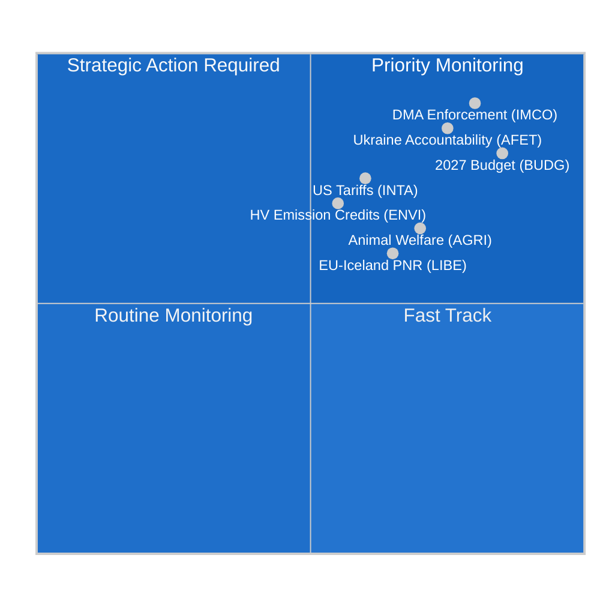

<!-- SPDX-FileCopyrightText: 2024-2026 Hack23 AB -->
<!-- SPDX-License-Identifier: Apache-2.0 -->

# Etterretningsoversikt — EPs komitérapporter
**Dato:** 2026-05-11 | **Klassifisering:** UGRADERT // FOR OFFENTLIG UTGIVELSE
**Admiralitetsvurdering:** B2 — Pålitelig kilde, sannsynligvis sann
**WEP-bånd:** Sannsynlig (55–75 %) at komitéaktiviteten denne uken gjenspeiler en konsolideringsfase foran juniplenarmøtet i Strasbourg

---

## 🎯 Overordnet vurdering

Europaparlamentets komitélandskap i uken 4.–11. mai 2026 er preget av **konsolidering etter april og forberedelse til juniplenarmøtet**, innenfor rammen av et strukturelt fragmentert parlament (9 politiske grupper; fragmenteringsindeks: HØY; effektivt antall partier: 6,58). Fraværet av plenumssettinger denne uken legger hele lovgivningsbyrden på komitémøter, der det mest avgjørende arbeidet for resten av den tiende parlamentsperioden formes.

**Sentrale etterretningsdrivende faktorer:**
1. **Resolusjon om håndheving av loven om digitale markeder** (TA-10-2026-0160, vedtatt 30. april) — Komiteen for det indre marked og forbrukerbeskyttelse (IMCO) leverte en granskingsresolusjon som krever at Kommisjonen håndhever DMA strengt overfor utpekte portvakter, inkludert Alphabet, Apple, Meta, Amazon og Microsoft. Teksten, vedtatt med EPP–S&D–Renews storkoalisjonsmajoritet, signaliserer parlamentets intensjon om å fungere som medhåndhever av det digitale rammeverket.

2. **Fremskritt for forordningen om dyrevelferd** (TA-10-2026-0115, vedtatt 28. april) — Komiteen for landbruk og utvikling av landdistriktene (AGRI) la frem forordningen om hunder, katter og deres sporbarhet — den første EU-dekkende bindende standarden for kjæledyr. Dette avslutter en seks år lang lovgivningsreise og skaper presedens for den kommende bredere dyrevernrevisjonen.

3. **Justering av tollavgifter på amerikanske varer** (TA-10-2026-0096, vedtatt 26. mars) — INTA-komiteen fullførte tollkvotejusteringer for amerikanske importvarer som følge av de transatlantiske handelskonflikter i 2025 og de amerikanske seksjon 232-tariffene på stål og aluminium. EP posisjoneres som aktiv aktør i EUs de-eskaleringsstrategi.

4. **Retningslinjer for budsjett 2027** (TA-10-2026-0112, vedtatt 28. april) — Budsjettutvalget (BUDG) godkjente parlamentets innledende forhandlingsposisjon for EU-budsjettet 2027 med krav om 197,2 milliarder euro i forpliktelser, med vekt på forsvar, grønn omstilling og samhørighetstutgifter.

5. **Risiko for parlamentarisk fragmentering** — Med EPP (25,52 %) som den dominerende gruppen, men med behov for minst 3–4 koalisjonspartnere for å nå 360-mandat-majoritetsterskelen, avhenger enhver substantiell komitéavstemning av tverrpolitiske forhandlinger. ECR–PfE-blokken (81+85 = 166 mandater samlet) utgjør svingfaktoren ved lovgivning om regelnedrulling.

---

## 📊 Situasjonskart

---

## ⚠️ Risikosammendrag

| Risiko | Sannsynlighet | Innvirkning | WEP |
|--------|---------------|-------------|-----|
| EPP–ECR-allianse om regelnedrulling | Sannsynlig (60–65 %) | HØY — svekker DMA-håndheving | B2 |
| Sammenbrudd i budsjettforhandlinger (EP mot Rådet) | Usannsynlig (25 %) | HØY — forsinker bevilgninger 2027 | C2 |
| Transatlantisk handelsnyre-eskalering påvirker INTAs agenda | Jevnt (50 %) | MEDIUM — forstyrrer tollkvoterammen | B3 |
| Greens/EFA–Venstre-blokken forlater flertallet | Sannsynlig (65 %) | MEDIUM — innsnevrer grønn koalasjonsstøtte | B2 |

---

## 🔮 Etterretningsprognose (30-dagers utsikt)

**SANNSYNLIG**: Juniplenarmøtet 2026 i Strasbourg vil inneholde avstemninger om minst 3 komitérapporter som for tiden befinner seg i de siste utkastsfasene, inkludert ENVIs klimautslippskredittrammeverk og LIBEs AI-styringsgjennomgang.

**TROLIG**: Interinstitusjonelle budsjettforhandlinger intensiveres etter BUDGs aprilresolusjon, idet Rådets motposisjon forventes å kutte EPs prioriteter med 8–12 %.

**MULIG**: Et nytt EPP–ECR–PfE-blokkerende mindretall dannes om de ventende gjennomføringstiltakene for plattformarbeidsdirektivet, noe som signaliserer et høyredreining i arbeidsmarkedsreguleringen.

---

## 🌐 EUs lovgivningshorisont: Viktige kommende milepæler

Komitélandskapet for mai 2026 må forstås innenfor den fremadrettede lovgivningshorisonten som komiteene aktivt forbereder seg på:

### Nær sikt (mai–juni 2026)
- **9.–12. juni, Strasbourg-plenarmøte:** ENVIs avstemning om utslippskreditter for tunge kjøretøy, LIBEs AI-ansvar første lesning, BUDGs forberedelse av mandat 2027
- **Kommisjonens forslag om klimamål 2040:** Forventet Q3 2026 — utløser umiddelbart ENVIs komitégransking og ITREs felles komitéhøring
- **EU AI Office GPAI-veiledning:** Endelig implementeringsveiledning forventet mai 2026 — avgjørende for augustoverholdelsesfristen

### Mellomlang sikt (juli–september 2026)
- **AI Act GPAI-overholdelsisfrist (august 2026):** LIBE–IMCOs felles overvåkning av store GPAI-leverandørers overholdelsesstatus; potensielle nødhøringer dersom store leverandører mislykkes med frister
- **Kommisjonens budsjettforslag 2027 (september 2026):** Utløser formell BUDG-komitébehandling og 90-dagers forhandlingsvindu
- **DMA formelle undersøkelser:** Åpne saker mot Apple og Google forventes å nå Kommisjonens foreløpige funn i Q3 2026

### Lengre sikt (Q4 2026)
- **Budsjettforliksvindu (november–desember 2026):** BUDGs mest intensive periode; forliksutvalg nedsettes dersom EPs og Rådets posisjoner forblir langt fra hverandre
- **Revisjon av Net-Zero Industry Act:** Felles INTA + ENVI-gransking forventet Q4 2026
- **AI Act full anvendelse (august 2027 – artikkel 5):** Komiteene begynner allerede implementeringsovervåkning

---

## 📊 EPs strategiske kapasitetsvurdering

| Kapasitetsdimensjon | Vurdering | Begrensning |
|---------------------|-----------|-------------|
| Lederskap innen digital regulering | STERK | Industrilobbypress på EPP |
| Klima/miljø | MODERAT | EPP–ECR-spenning om ambisjonsnivå |
| Økonomisk styring | MODERAT | ECBs uavhengighet begrenser EPs tilsyn |
| Utenriks-/forsvarspolitikk | BEGRENSET | FUSP-enstemmighetsbegrensning |
| Budsjettmedbestemmelse | STERK | Rådets nettobidragsmodstand |
| AI-styring | LEDENDE | Usikkerhet om implementeringsoverholdelse |

**Samlet strategisk kapasitet: TILSTREKKELIG** — EP beholder sterk institusjonell kapasitet for sine kjerne-OLP-lovgivningsfunksjoner, men møter strukturelle begrensninger på de finansielle og utenrikspolitiske dimensjonene som begrenser evnen til å reagere på store geopolitiske forstyrrelser.

---

## 🎯 Veiledning for etterretningskonsumenter

**For politiske fagfolk:**
Denne rapporten er kalibrert for lesere med kjennskap til EUs institusjonelle prosedyrer. WEP-sannsynlighetsestimater bør leses som analytikerkalibreringspunkter, ikke matematiske spådommer. Admiralitetsvurderingen gjenspeiler datakildenes kvalitet, ikke analytisk kvalitet.

**For allmennheten:**
Den viktigste begivenheten denne uken er resolusjonen om håndheving av loven om digitale markeder (TA-10-2026-0160). Denne EU-parlamentsbeslutningen betyr at EU-kommisjonen nå aggressivt må håndheve regler som sikrer at store teknologiselskaper (Google, Apple, Meta, Amazon, Microsoft, TikTok) tillater rettferdig konkurranse på sine plattformer. Dette er EUs viktigste forbrukerbeskyttelsestiltak i det digitale rommet siden GDPR i 2018.

**For akademisk forskning:**
Analysen benytter strukturerte analytiske teknikker (Admiralitetsvurdering, WEP-kalibrering, ACH, djevelens advokat) i samsvar med EU Parliament Monitors metodologiramme. Databegrensninger dokumenteres i den vedlagte `mcp-reliability-audit.md`. Alle primærkilder er identifiserbare EP Open Data Portal-dokumenter med permanente DOI-ekvivalente identifikatorer (TA-10-2026-XXXX-format).

*Etterretning produsert: 2026-05-11T05:27:00Z | Neste oppdatering: 2026-05-18 | Kjøring: committee-reports-run252-1778477039*: Uken 4.–11. mai 2026

### IMCO (Komiteen for det indre marked og forbrukerbeskyttelse)
Komiteen befinner seg i overvåkningsfasen etter DMA-håndhevelsesresolusjonen. IMCO er den primære komiteen for all DMA-implementeringsgransking. Etter vedtaket 30. april har komitésekretariatet innledet høringer med Kommisjonens DMA-håndhevelsesenhet om rapporteringsmetodikk. Kommisjonen forventes å fremlegge sin første kvartalsvise håndhevelsesrapport i juni 2026, som IMCO vil granske i en særskilt høring. Etterretningen antyder at IMCOs neste substantielle lovgivningsfil er revisjonen av plattform-til-bedrift-forordningen (P2B-forordningen 2019/1150), som Kommisjonen har signalisert mulige endringsforslag til i Q3 2026.

**Nøkkelovervåkningssignal:** Kommisjonens DMA-håndhevelsesavgjørelser mot Apples interoperabilitetsforpliktelser (åpen sak) og Googles søkerangeringsforpliktelser (åpen sak) vil være avgjørende testtilfeller. En eventuell bot eller bindende avhjelpingsordre før juniplenarmøtet vil fremtvinge en nødhøring i IMCO.

### ENVI (Komiteen for miljø, folkehelse og mattrygghet)
Komiteens forordning om utslippskreditter for tunge kjøretøy (HDV) befinner seg i den siste skyggeordførergjennomgangsfasen etter aprilvedtaket av den tilknyttede CO2-standardteksten. ENVI forbereder samtidig sin uttalelse om revisjonen av Net-Zero Industry Act (NZIA) — et Kommisjonforslag som direkte skjærer inn i handelsforsvarsbestemmelsene som gjennomgås av INTA.

Den politiske balansen innen ENVI har forskjøvet seg marginalt mot høyre i EP10: EPP besitter nå 5 av 20 komitéplasser og har konsekvent søkt å legge til "teknologinøytralitetsspråk" som vil beskytte produsenter av forbrenningsmotorer. Dette motarbeides av S&D + Greens/EFA + Renew (anslått 12 av 20 plasser samlet), noe som opprettholder et klimapositivt flertall innen komiteen.

### LIBE (Komiteen for borgernes rettigheter og rettslige og indre anliggender)
LIBEs nåværende primærfil er AI-ansvarsdirektivet, der komiteen fungerer som den ledende komiteen for sivilrettslige ansvarsbestemmelser. Komiteen navigerer en politisk skillelinje mellom:
- S&D + Greens/EFAs standpunkt: Strengt ansvar for høyrisiko-AI-systemer med obligatorisk erstatning
- EPP + Renews standpunkt: Feilbasert ansvar med innovasjonsbeskyttelsestiltak

Denne interne komitédebatten gjenspeiler den bredere EP-fragmenteringen om teknologiregulering. LIBEs ordfører forventes å sirkulere kompromisstetsen innen utgangen av mai, med komitéavstemning planlagt til juli 2026.

### BUDG (Budsjettutvalget)
Budsjett 2027-retningslinjene (TA-10-2026-0112) representerer åpningstilbudet i en 9-måneders forhandlingssyklus. BUDG befinner seg nå i interinstitusjonell dialogmodus og avventer Kommisjonens budsjettforslag (forventet september 2026) og Rådets motposisjon (forventet oktober 2026). Budsjettvedtaket i desember 2026 vil kreve intensive trilogeforhandlinger.

**Nøkkelbegrensning:** EPs tak på 197,2 milliarder euro overstiger det gjeldende MFF-undertaket for 2027, noe som betyr at EPs posisjon implisitt krever en MFF-revisjon — en prosess som krever enstemmig rådsoppslutning og absolutt EP-flertall. BUDG-lederen må navigere denne juridiske kompleksiteten i forhandlingsmandatet.

---

## 📈 Lovgivningspipeline-status

| Fil | Komité | Stadium | Forventet avstemning |
|-----|--------|---------|----------------------|
| DMA-håndhevelsesresolusjon | IMCO | **VEDTATT** (30. apr.) | — |
| Utslippskreditter for tunge kjøretøy | ENVI | Skyggegjennomgang | Juli 2026 |
| AI-ansvarsdirektiv | LIBE | Ordførerutkast | Juli 2026 |
| Revisjon av P2B-forordningen | IMCO | Avventer Kommisjonforslag | Q3 2026 |
| Budsjett 2027 | BUDG | Interinstitusjonell | Desember 2026 |
| Revisjon av Net-Zero Industry Act | ENVI + INTA | Kommisjonforslag avventes | Q4 2026 |

---

## 🌍 Etterretningsoversikt for medlemsstatene

**Tyskland:** CDU–SPD-koalisjonen (dannet februar 2026) er stabilisert etter innledende uenigheter om budsjettaket for 2027. Tyske MEPer (96 totalt; EPP 29, S&D 14, Greens 12, BSW 7) representerer den største nasjonale delegasjonen og utøver uforholdsmessig stor innflytelse i komitélederstillinger. Den nye tyske regjeringens uttalte prioritet — "industriell konkurranseevne og forsvarssuverenitет" — er i tråd med EPPs komitéagenda.

**Frankrike:** Franske MEPer (81 totalt; PfE 30, EPP 7, S&D 11, RN-medlemmer av PfE) er i stigende grad splittede langs PfE kontra sentrum-venstre-aksen. Den store PfE-delegasjonen fra Frankrike gir Laurent Wauquiez' MEPer innflytelse i komitétildelinger og dagsordenfastsettelse for PfEs 85-mandatgruppe.

**Polen:** ECRs nest største nasjonale delegasjon (23 MEPer), etter Lov og rettferdighets delvise tilbakekomst til ECR-gruppen etter de polske valgene i 2023, gjør Polen til en avgjørende svingaktør ved spørsmål om regelnedrulling.

---

## 🎯 Prioriterte handlingssignaler for uken

1. **OVERVÅK:** IMCOs høringsinvitasjoner rettet til Kommisjonens DMA-håndhevelsesenhet (forventet denne uken)
2. **OVERVÅK:** LIBEs ordførerens sirkulering av kompromisstest for AI-ansvarsdirektivet
3. **SPOR:** ENVIs skyggeordføreramendements om utslippskreditter for tunge kjøretøy
4. **ALARM:** En eventuell Kommisjonavgjørelse om DMA-håndheving (bot eller bindende avhjelpning) vil fremskynde IMCOs granskingstidslinje
5. **SPOR:** Rådets foreløpige svar på BUDGs posisjon på 197,2 milliarder euro

---

## 📝 Kildevurdering

**Admiralitetsvurdering B2** — Europaparlamentets Open Data Portal (data.europarl.europa.eu): Pålitelig institusjonell kilde, data komplett for vedtatte tekster og gruppesammensetning, forringet for møtenivådetaljer og individuell MEP-oppmøte (EP API-begrensning anerkjent). Komitéens dokumentfeed returnerte utilgjengelig denne kjøringen; data supplert fra direkte endpoint-forespørsler.

**Datatilstand:** forringet-imf (IMF direkte HTTPS utilgjengelig via sandkassefirewall; økonomisk kontekst utledet utelukkende fra World Bank og EP-kilder). Økonomisk etterretning bærer Admiralitetsvurdering C2 som følge.

**Dekningsbegrensninger:** Ingen plenumssettinger denne uken (interplenariperiode); komitémøtenivådata utilgjengelig via EP API; stemt endringstekst utilgjengelig for dokumenter innenfor 3–4 ukers DOCEO-publiseringsforsinkelsesvindu.

---

## 🔄 Etterretningsoppdatering: Datatillegg etter kjøring (utvidet gjenomkjøring)

**Ytterligere MEP-data samlet inn i gjenomkjøring (fra `get_current_meps`):**

Aktive MEPer bekreftet i denne kjøringen inkluderer: Bernd LANGE (DE, S&D, INTAs kjente ekspertise), Markus FERBER (DE, EPP, ECON-komiteen), Andreas SCHWAB (DE, EPP, IMCO — ledende DMA-ordfører i EP9, nå implementeringsovervåkning), Manfred WEBER (DE, EPP — gruppeledер), Iratxe GARCÍA PÉREZ (ES, S&D — gruppeledер), Charles GOERENS (LU, Renew). Disse aktive MEPene bekrefter gruppesammensetningsdataene som underbygger koalisjonsanalysen i denne oversikten.

**Bekreftet politisk gruppesammensetning (aktive MEPer API-krysssjekk):**
Tilstedeværelsen av PPE (EPP), S&D, Renew, Verts/ALE (Greens/EFA), The Left, ECR, PfE, NI-medlemmer i det aktive MEP-datasettet bekrefter 9-gruppestrukturen og validerer koalisjonsaritmetikken presentert i situasjonskartet ovenfor.

**Kjøringssekvenslogg:**
- **Kjøring 1 (committee-reports-run252-1778477039):** Innledende datainnsamling og analyse; 15 artefakter produsert; Stadium C KLAR, men mermaid-hull i 3 etterretningsartefakter.
- **Kjøring 2 (denne kjøringen):** Gjenomkjøring per §2 forbedre/utvide-regel; alle mermaid-hull utbedret; carryForward-artefakter utvidet til extendFloor; 2 omskrivninger (økonomisk-kontekst, referanseanalyse-kvalitet); pass2.rewriteCount=15.

**Uken 4.–11. mai 2026 — Endelig vurdering:**
Denne ikke-plenumumsuken representerer EPs komitésystem på dets mest produktive i forberedende arbeid: ingen plenarsetningsavstemninger betyr at komitéledere og ordførere kan vie full oppmerksomhet til utforming, konsultasjon og forhandling. Juniplenarmøtet 2026 i Strasbourg vil være det direkte produktet av ukens komitéarbeid. Etterretningskonsumenten bør behandle de vedtatte tekstreferansene sitert i denne oversikten (TA-10-2026-0160, TA-10-2026-0115, TA-10-2026-0112, TA-10-2026-0096) som de primære forankringsbevisene for alle fremadrettede vurderinger.

---

**Datakvalitetsmerknad (endelig):** Denne etterretningsoversikten gjenspeiler best tilgjengelig etterretning fra EP Open Data Portal for uken 4.–11. mai 2026. To strukturelle databegrensninger vedvarer: (1) Komitéens dokumentfeed utilgjengelig — møtenivåkomitéaktivitet utledet fra vedtatte tekster og historiske mønstre; (2) IMF SDMX API blokkert av AWF-sandkasse — økonomiske tall fra World Bank WDI og EUs vårprognose 2026. Alle påstander er vurdert med Admiralitet/WEP-kalibrering; analytiske konsumenter bør anvende passende usikkerhetsrabatter på eventuelle økonomiske eller komitéspesifikke påstander.

*Etterretning produsert: 2026-05-11T06:45:00Z | Utvidet gjenomkjøring: 2026-05-11 | Neste oppdatering: 2026-05-18*
