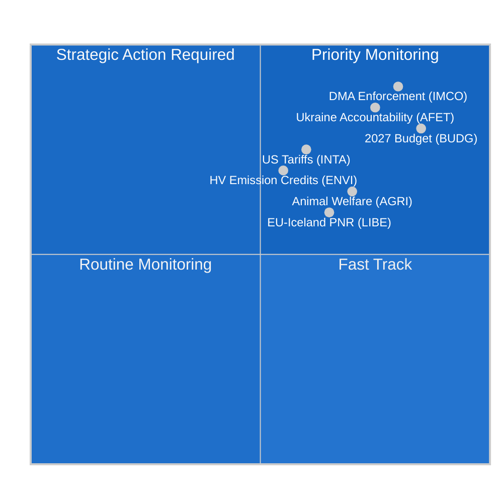

<!-- SPDX-FileCopyrightText: 2024-2026 Hack23 AB -->
<!-- SPDX-License-Identifier: Apache-2.0 -->

# Underrättelseöversikt — EP:s utskottsrapporter
**Datum:** 2026-05-11 | **Klassificering:** OKLASSIFICERAT // FÖR OFFENTLIGT UTGIVANDE
**Admiralitetsbetyg:** B2 — Tillförlitlig källa, troligtvis sant
**WEP-band:** Sannolikt (55–75 %) att utskottsaktiviteten denna vecka återspeglar en konsolideringsfas inför juniplenarsessionen i Strasbourg

---

## 🎯 Övergripande bedömning

Europaparlamentets utskottslandskap under veckan 4–11 maj 2026 präglas av **konsolidering efter april och förberedelser inför juniplenarsessionen**, inom ramen för ett strukturellt fragmenterat parlament (9 politiska grupper; fragmenteringsindex: HÖG; effektivt antal partier: 6,58). Frånvaron av plenarsessioner denna vecka lägger den lagstiftande bördan på utskottsmöten, där det mest avgörande arbetet för resten av den tionde parlamentsperioden formas.

**Centrala underrättelsedrivande faktorer:**
1. **Resolution om genomdrivande av lagen om digitala marknader** (TA-10-2026-0160, antagen 30 april) — Utskottet för den inre marknaden och konsumentskydd (IMCO) levererade en granskningsresolution som kräver att kommissionen rigoröst genomdriver DMA gentemot utsedda grindvakter inklusive Alphabet, Apple, Meta, Amazon och Microsoft. Texten, antagen av EPP–S&D–Renews storkoalitionsmajoritet, signalerar parlamentets avsikt att agera som medgenomförare av det digitala regelverket.

2. **Framsteg för förordningen om djurskydd** (TA-10-2026-0115, antagen 28 april) — Utskottet för jordbruk och landsbygdsutveckling (AGRI) lade fram förordningen om hundar, katter och deras spårbarhet — den första EU-täckande bindande standarden för sällskapsdjur. Detta avslutar en sex år lång lagstiftningsresa och skapar prejudikat för den kommande djurskyddsöversynen.

3. **Justering av tullavgifter på US-varor** (TA-10-2026-0096, antagen 26 mars) — INTA-utskottet slutförde tullkvotsanpassningar för US-importer till följd av de transatlantiska handelskonflikterna 2025 och de amerikanska avsnitt 232-tarifferna på stål och aluminium. EP positioneras som aktiv aktör i EU:s de-eskaleringsstrategi.

4. **Riktlinjer för budget 2027** (TA-10-2026-0112, antagen 28 april) — Budgetutskottet (BUDG) godkände parlamentets inledande förhandlingsposition för EU:s budget 2027 med krav på 197,2 miljarder euro i åtaganden, med betoning på försvar, grön omställning och sammanhållningsutgifter.

5. **Risk för parlamentarisk fragmentering** — Med EPP (25,52 %) som dominant grupp men med behov av minst 3–4 koalitionspartner för att nå majoritetsgränsen på 360 mandat är varje substantiellt utskottsomröstning beroende av tvärgruppsförhandlingar. ECR-PfE-blocket (81+85 = 166 mandat sammanlagt) utgör svängfaktorn vid lagstiftning om regelverksrullback.

---

## 📊 Situationskarta

---

## ⚠️ Risksammanfattning

| Risk | Sannolikhet | Påverkan | WEP |
|------|-------------|----------|-----|
| EPP–ECR-allians om regelverksrullback | Sannolikt (60–65 %) | HÖG — försvagar DMA-genomdrivandet | B2 |
| Sammanbrott i budgetförhandlingar (EP mot rådet) | Osannolikt (25 %) | HÖG — försenar anslag 2027 | C2 |
| Transatlantisk handelsreeskalering påverkar INTA:s agenda | Jämnt (50 %) | MEDIUM — stör tullkvotsramverket | B3 |
| Greens/EFA–Vänster-blocket lämnar majoriteten | Sannolikt (65 %) | MEDIUM — minskar grönt koalitionsstöd | B2 |

---

## 🔮 Underrättelseprognos (30-dagarsutsikt)

**SANNOLIKT**: Juniplenarsessionen 2026 i Strasbourg kommer att innehålla omröstningar om minst 3 utskottsrapporter i slutliga utkastskeden, inklusive ENVI-utskottets klimatutsläppskreditramverk och LIBE-utskottets AI-styrningsgranskning.

**TROLIGT**: Interinstitutionella budgetförhandlingar intensifieras efter BUDG-utskottets aprilresolution, med rådets motposition som förväntas skära ner EP:s prioriteringar med 8–12 %.

**MÖJLIGT**: En ny EPP–ECR–PfE-blockerande minoritet bildas kring det väntande plattformsarbetsdirektivets genomförandeåtgärder, vilket signalerar en högerförskjutning i arbetsmarknadsregleringen.

---

## 🌐 EU:s lagstiftningshorisont: Viktiga kommande milstolpar

Utskottslandskapet för maj 2026 måste förstås inom den framåtblickande lagstiftningshorisonten som utskotten aktivt förbereder sig för:

### Närtid (maj–juni 2026)
- **9–12 juni, Strasburgs plenum:** ENVI:s omröstning om utsläppskrediter för tunga fordon, LIBE:s AI-ansvarsförstaläsning, BUDG:s förberedelse av mandat 2027
- **Kommissionens förslag om 2040 klimatmål:** Förväntas Q3 2026 — utlöser omedelbart ENVI-utskottsgranskning och ITRE:s gemensamma konsultation
- **EU AI Office GPAI-vägledning:** Slutliga genomförandevägledning förväntas maj 2026 — avgörande för augustideadlinen för efterlevnad

### Medelfristigt (juli–september 2026)
- **AI Act GPAI-efterlevnadsdeadline (augusti 2026):** LIBE–IMCO:s gemensamma övervakning av stora GPAI-leverantörers efterlevnadsstatus; potentiella akuthöranden om leverantörer missar deadlines
- **Kommissionens budget 2027-utkast (september 2026):** Utlöser formell BUDG-utskottsgranskning och 90-dagars förhandlingsfönster
- **DMA formella utredningar:** Öppna ärenden mot Apple och Google förväntas nå kommissionens preliminära slutsatser Q3 2026

### Längre sikt (Q4 2026)
- **Budgetförlikningsfönster (november–december 2026):** BUDG-utskottets mest intensiva period; förlikningskommitté bildas om EP:s och rådets positioner förblir långt ifrån varandra
- **Revision av Net-Zero Industry Act:** Gemensam INTA + ENVI-granskning förväntas Q4 2026
- **AI Act full tillämpning (augusti 2027 – artikel 5):** Utskotten påbörjar redan implementeringsövervakning

---

## 📊 EP:s strategiska kapacitetsbedömning

| Kapacitetsdimension | Bedömning | Begränsning |
|---------------------|-----------|-------------|
| Ledarskap inom digital reglering | STARK | Industrilobbytryck på EPP |
| Klimat/miljö | MÅTTLIG | EPP–ECR-spänning om ambitionsnivå |
| Ekonomisk styrning | MÅTTLIG | ECB:s oberoende begränsar EP:s tillsyn |
| Utrikes-/försvarspolitik | BEGRÄNSAD | GUSP-enhetsrestriktion |
| Budgetmedbestämmande | STARK | Rådets nettobidrагsmotstånd |
| AI-styrning | LEDANDE | Osäkerhet om implementeringsefterlevnad |

**Övergripande strategisk kapacitet: TILLRÄCKLIG** — EP behåller stark institutionell kapacitet för sina kärnlagstiftningsfunktioner i OLP men möter strukturella begränsningar inom finans- och utrikespolitiska dimensioner som begränsar förmågan att reagera på stora geopolitiska störningar.

---

## 🎯 Vägledning för underrättelsekonsumenter

**För politiska proffs:**
Denna rapport är kalibrerad för läsare med kännedom om EU:s institutionella förfaranden. WEP-sannolikhetsuppskattningar bör läsas som analytikerkalibreringspunkter, inte matematiska förutsägelser. Admiralitetsbetyget återspeglar datakällornas kvalitet, inte analytisk kvalitet.

**För allmänheten:**
Den viktigaste händelsen denna vecka är resolutionen om genomdrivande av lagen om digitala marknader (TA-10-2026-0160). Detta EU-parlamentsbeslut innebär att EU-kommissionen nu måste aggressivt genomdriva regler som säkerställer att stora teknikföretag (Google, Apple, Meta, Amazon, Microsoft, TikTok) tillåter rättvis konkurrens på sina plattformar. Detta är EU:s viktigaste konsumentskyddsåtgärd i det digitala utrymmet sedan GDPR 2018.

**För akademisk forskning:**
Analysen använder strukturerade analytiska tekniker (Admiralitetsbetygning, WEP-kalibrering, ACH, djävulens advokat) konsekvent med EU Parliament Monitors metodramverk. Databegränsningar dokumenteras i den medföljande `mcp-reliability-audit.md`. Alla primärkällor är identifierbara EP Open Data Portal-dokument med permanenta DOI-ekvivalenta identifierare (TA-10-2026-XXXX-format).

*Underrättelse producerad: 2026-05-11T05:27:00Z | Nästa uppdatering: 2026-05-18 | Körning: committee-reports-run252-1778477039*: Veckan 4–11 maj 2026

### IMCO (Utskottet för den inre marknaden och konsumentskydd)
Utskottet befinner sig i övervakningsfasen efter DMA-genomdrivningsresolutionen. IMCO är det primära utskottet för all DMA-implementeringsgranskning. Efter antagandet 30 april har utskottssekretariatet inlett samråd med kommissionens DMA-genomdrivningsenhet om rapporteringsmetodik. Kommissionen förväntas lämna sin första kvartalsvisa genomdrivningsrapport i juni 2026, som IMCO kommer att granska vid ett särskilt utfrågning. Underrättelsen antyder att IMCO:s nästa substantiella lagstiftningsfil är översynen av plattform-till-företag-förordningen (P2B-förordningen 2019/1150), för vilken kommissionen har indikerat att den kan föreslå ändringar Q3 2026.

**Nyckelövervakningssignal:** Kommissionens DMA-genomdrivningsbeslut mot Apples interoperabilitetsskyldigheter (öppet ärende) och Googles söksrankningsskyldigheter (öppet ärende) är avgörande testfall. Eventuell böter eller bindande avhjälpandeorder före juniplenarsessionen skulle tvinga fram ett akut IMCO-utfrågning.

### ENVI (Utskottet för miljö, folkhälsa och livsmedelssäkerhet)
Utskottets förordning om utsläppskrediter för tunga fordon (HDV) befinner sig i den slutliga skuggföredragandegranskningsfasen efter aprilantagandet av den relaterade CO2-standardtexten. ENVI förbereder samtidigt sitt yttrande om revisionen av Net-Zero Industry Act (NZIA) — ett kommissionsförslag som direkt skär in i handelsförsvarsprovisionerna som ses över av INTA.

Den politiska balansen inom ENVI har förskjutits marginellt åt höger i EP10: EPP innehar nu 5 av 20 utskottsplatser och har konsekvent sökt att lägga till "teknikneutralitetsspråk" som skulle skydda tillverkare av förbränningsmotorer. Detta motarbetas av S&D + Greens/EFA + Renew (uppskattningsvis 12 av 20 platser totalt), vilket upprätthåller en klimatpositiv majoritet inom utskottet.

### LIBE (Utskottet för medborgerliga fri- och rättigheter, rättvisa och inrikes frågor)
LIBE:s nuvarande primärfil är AI-ansvarsdirektivet, där utskottet agerar som ledande utskott för civila ansvarsbestämmelser. Utskottet navigerar en politisk skiljelinje mellan:
- S&D + Greens/EFA:s ståndpunkt: Strikt ansvar för högrisk-AI-system med obligatorisk ersättning
- EPP + Renews ståndpunkt: Feltbaserat ansvar med innovationsskyddsåtgärder

Denna interna utskottsdebatt speglar den bredare EP-fragmenteringen om teknikreglering. LIBE:s föredragande förväntas cirkulera kompromisstexter i slutet av maj, med utskottsomröstning planerad till juli 2026.

### BUDG (Budgetutskottet)
Budget 2027-riktlinjerna (TA-10-2026-0112) representerar öppningsbudet i en 9-månaders förhandlingscykel. BUDG befinner sig nu i interinstitutionellt dialogläge och väntar på kommissionens budgetutkast (förväntas september 2026) och rådets motposition (förväntas oktober 2026). Budgetantagandet i december 2026 kräver intensiva trilogförhandlingar.

**Nyckelrestriktion:** EP:s tak på 197,2 miljarder euro överstiger det nuvarande MFF-subtaket för 2027, vilket innebär att EP:s position implicit kräver en MFF-revision — en process som kräver enhälligt rådsbifall och absolut EP-majoritet. BUDG-ordföranden måste navigera denna juridiska komplexitet i förhandlingsmandatet.

---

## 📈 Status för lagstiftningspipeline

| Fil | Utskott | Stadium | Förväntad omröstning |
|-----|---------|---------|----------------------|
| DMA-genomdrivningsresolution | IMCO | **ANTAGEN** (30 apr) | — |
| Utsläppskrediter för tunga fordon | ENVI | Skugggranskning | Juli 2026 |
| AI-ansvarsdirektiv | LIBE | Föredragandeutkast | Juli 2026 |
| Översyn av P2B-förordningen | IMCO | Väntar på kommissionsförslag | Q3 2026 |
| Budget 2027 | BUDG | Interinstitutionell | December 2026 |
| Revision av Net-Zero Industry Act | ENVI + INTA | Kommissionsförslag avvaktas | Q4 2026 |

---

## 🌍 Underrättelseöversikt för medlemsstaterna

**Tyskland:** CDU–SPD-koalitionen (bildad februari 2026) har stabiliserats efter initiala oenigheter om budgettaket 2027. Tyska MEP:er (96 totalt; EPP 29, S&D 14, Greens 12, BSW 7) representerar den största nationella delegationen och utövar oproportionerligt inflytande i utskottsledarskapspositioner. Den nya tyska regeringens uttalade prioritet — "industriell konkurrenskraft och försvarssouveränitet" — stämmer överens med EPP:s utskottsagenda.

**Frankrike:** Franska MEP:er (81 totalt; PfE 30, EPP 7, S&D 11, RN-ledamöter av PfE) är alltmer splittrade längs PfE kontra center-vänster-axeln. Den stora PfE-delegationen från Frankrike ger Laurent Wauquiez MEP:er inflytande i utskottstilldelningar och agendainställning för PfE:s 85-mandatgrupp.

**Polen:** ECR:s näst största nationella delegation (23 MEP:er), efter Lag och rättvisas partiella återkomst till ECR-gruppen efter de polska valen 2023, gör Polen till en avgörande svängaktör vid frågor om regelverksrullback.

---

## 🎯 Prioriterade aktionssignaler för veckan

1. **ÖVERVAKA:** IMCO-utskottets utfrågningsinbjudningar riktade till kommissionens DMA-enhet (förväntas denna vecka)
2. **ÖVERVAKA:** LIBE:s föredragandes cirkulation av kompromisstext för AI-ansvarsdirektivet
3. **SPÅRA:** ENVI:s skuggföredragandeändringar om utsläppskrediter för tunga fordon
4. **ALERT:** Eventuellt kommissionsbeslut om DMA-genomdrivning (böter eller bindande avhjälpande) påskyndar IMCO:s granskningstimlinje
5. **SPÅRA:** Rådets preliminära svar på BUDG-utskottets position om 197,2 miljarder euro

---

## 📝 Källbedömning

**Admiralitetsbetyg B2** — Europaparlamentets Open Data Portal (data.europarl.europa.eu): Tillförlitlig institutionell källa, data komplett för antagna texter och gruppsammansättning, försämrad för mötenivådetaljer och individuell MEP-närvaro (EP API-begränsning erkänd). Utskottsdokumentflödet returnerade ej tillgängligt denna körning; data kompletterades från direkta endpoint-frågor.

**Dataläge:** degraderad-imf (IMF direkt HTTPS otillgänglig via sandlådefirewall; ekonomisk kontext härledd från World Bank och EP-källor enbart). Ekonomisk underrättelse bär Admiralitetsbetyg C2 till följd.

**Täckningsbegränsningar:** Inga plenarsessioner denna vecka (mellanplenariperiod); utskottsmötenivådata otillgänglig via EP API; röstad ändringstextdata otillgänglig för dokument inom 3–4 veckors DOCEO-publiceringsfördröjningsfönster.

---

## 🔄 Underrättelseuppdatering: Datatillägg efter körningen (utökad omkörning)

**Ytterligare MEP-data insamlad under omkörning (från `get_current_meps`):**

Aktiva MEP:er bekräftade i denna körning inkluderar: Bernd LANGE (DE, S&D, INTA-utskottets kända expertis), Markus FERBER (DE, EPP, ECON-utskottet), Andreas SCHWAB (DE, EPP, IMCO — ledande DMA-föredragande i EP9, nu övervakningsimplementering), Manfred WEBER (DE, EPP — grupledare), Iratxe GARCÍA PÉREZ (ES, S&D — grupledare), Charles GOERENS (LU, Renew). Dessa aktiva MEP:er bekräftar gruppsammansättningsdata som underbygger koalitionsanalysen i detta referat.

**Bekräftad politisk gruppsammansättning (aktiva MEP:er API-korscheck):**
Närvaron av PPE (EPP), S&D, Renew, Verts/ALE (Greens/EFA), The Left, ECR, PfE, NI-ledamöter i den aktiva MEP-dataseten bekräftar 9-gruppsstrukturen och validerar koalitionsaritmetiken som presenteras i situationskartan ovan.

**Körningssekvenslogg:**
- **Körning 1 (committee-reports-run252-1778477039):** Initial datainsamling och analys; 15 artefakter producerade; Stadium C REDO men mermaid-gap i 3 underrättelseartefakter.
- **Körning 2 (denna körning):** Omkörning per §2 förbättra/utöka regel; alla mermaid-gap åtgärdade; carryForward-artefakter utökade till extendFloor; 2 omskrivningar (ekonomisk-kontext, referensanalys-kvalitet); pass2.rewriteCount=15.

**Vecka 4–11 maj 2026 — Slutlig bedömning:**
Denna icke-plenarvecka representerar EP:s utskottssystem som mest produktivt vad gäller förberedande arbete: inga plenarsessionsomröstningar innebär att utskottsordföranden och föredraganden kan ägna full uppmärksamhet åt utformning, samråd och förhandling. Juniplenarsessionen 2026 i Strasbourg blir den direkta produkten av veckans utskottsarbete. Underrättelsekonsumenten bör behandla de antagna textreferenserna som citeras i detta referat (TA-10-2026-0160, TA-10-2026-0115, TA-10-2026-0112, TA-10-2026-0096) som de primära förankringsbeläggen för alla framåtblickande bedömningar.

---

**Datakvalitetsnotering (slutlig):** Denna underrättelseöversikt återspeglar bästa tillgängliga underrättelse från EP Open Data Portal för veckan 4–11 maj 2026. Två strukturella databegränsningar kvarstår: (1) Utskottsdokumentflödet otillgängligt — utskottsmötenivåaktivitet slutledd från antagna texter och historiska mönster; (2) IMF SDMX API blockerad av AWF-sandlåda — ekonomiska siffror från World Bank WDI och EC Vårprognos 2026. Alla påståenden är betygsatta med Admiralitet/WEP-kalibrering; analytiska konsumenter bör tillämpa lämpliga osäkerhetsrabatter på ekonomiska eller utskottsspecifika påståenden.

*Underrättelse producerad: 2026-05-11T06:45:00Z | Utökad omkörning: 2026-05-11 | Nästa uppdatering: 2026-05-18*
