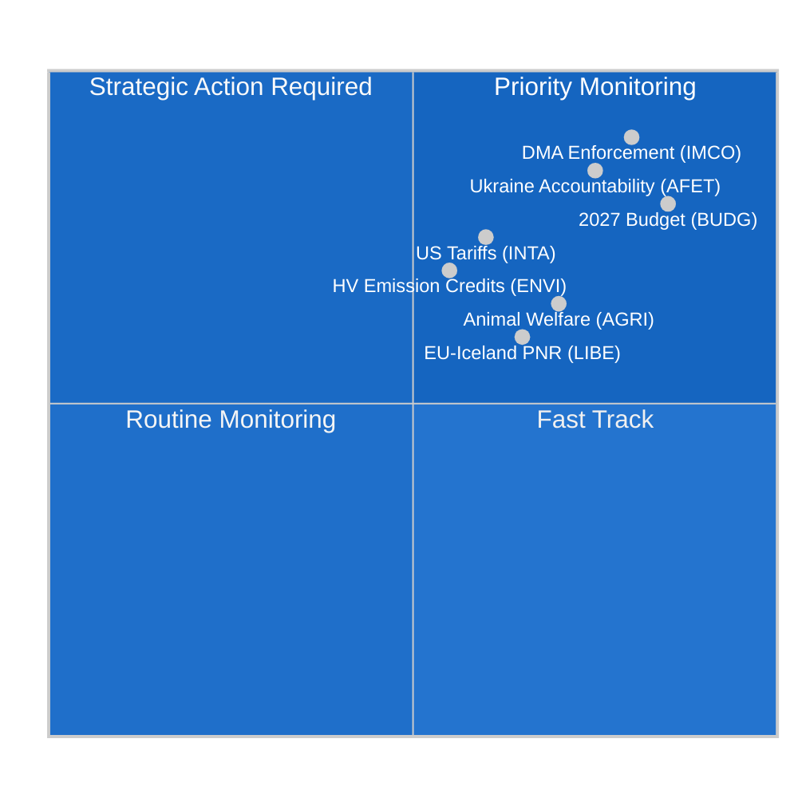

<!-- SPDX-FileCopyrightText: 2024-2026 Hack23 AB -->
<!-- SPDX-License-Identifier: Apache-2.0 -->

# 执行简报 — 欧洲议会委员会报告
**日期:** 2026-05-11 | **分类:** 非保密 // 公开发布
**海军准将评级:** B2 — 可靠信源，可能属实
**WEP范围:** 可能 (55–75%) 本周委员会活动反映出6月斯特拉斯堡全体会议前的巩固阶段

---

## 🎯 Headline Assessment

2026年5月4日至11日一周，欧洲议会委员会格局的特点是**后4月巩固期及6月全体会议准备**，发生在一个结构性分裂的议会（9个政治团体；碎片化指数：高；有效政党数：6.58）之中。本周没有全体会议，立法负担完全落在委员会会议上，第十届议会任期剩余时间内最具决定性意义的工作正在这里被塑造。

**主要情报驱动因素:**
1. **数字市场法执行决议** (TA-10-2026-0160，4月30日通过) — 内部市场与消费者保护委员会 (IMCO) 成功提交了一项审查决议，要求欧洲委员会对包括Alphabet、Apple、Meta、Amazon和Microsoft在内的指定守门人严格执行DMA。该文本经EPP-S&D-Renew大联盟多数票通过，表明议会有意作为数字监管框架的共同执法者。

2. **动物福利条例进展** (TA-10-2026-0115，4月28日通过) — 农业与农村发展委员会 (AGRI) 推进了犬猫福利及可追溯性条例，这是欧盟首个针对宠物的具有约束力的标准。这标志着在AGRI报告员主持下长达六年立法历程的结束，并为即将到来的更广泛动物福利审查树立了先例。

3. **对美商品关税调整** (TA-10-2026-0096，3月26日通过) — INTA委员会完成了对美进口商品的关税配额调整，反映了2025年跨大西洋贸易争端的残余影响以及美国对钢铁和铝的232条款关税。这使欧洲议会成为欧盟有分寸的降级战略中的积极参与者。

4. **2027年预算指引** (TA-10-2026-0112，4月28日通过) — 预算委员会 (BUDG) 批准了议会就2027年欧盟预算的初始谈判立场，要求1972亿欧元的承诺，并强调国防、绿色转型和凝聚力支出。

5. **议会碎片化风险** — 尽管EPP (25.52%) 是主导团体，但需要至少3-4个联合伙伴才能达到360席多数门槛，每一项实质性委员会投票都依赖跨团体谈判。ECR-PfE集团（81+85 = 合计166席）是监管回退立法的关键摇摆因素。

---

## 📊 Situation Map

---

## ⚠️ Risk Summary

| 风险 | 概率 | 影响 | WEP |
|-----|------|------|-----|
| EPP-ECR在监管回退上的联盟 | 可能 (60–65%) | 高 — 削弱DMA执法 | B2 |
| 预算谈判破裂（议会对理事会） | 不可能 (25%) | 高 — 延迟2027年拨款 | C2 |
| 影响INTA议程的跨大西洋贸易重新升级 | 各半 (50%) | 中 — 扰乱关税配额框架 | B3 |
| Greens/EFA-Left集团脱离多数 | 可能 (65%) | 中 — 缩小绿色联盟支持 | B2 |

---

## 🔮 Intelligence Forecast (30-day outlook)

**可能**: 2026年6月斯特拉斯堡全体会议将对目前处于最终起草阶段的至少3份委员会报告进行投票，包括ENVI的气候排放信贷框架和LIBE的人工智能治理审查。

**几乎确定**: 机构间预算谈判将在BUDG四月决议后加剧，理事会的反对立场预计将削减议会优先事项8至12%。

**可能**: 关于待定平台工作指令实施措施，新的EPP-ECR-PfE封锁少数形成，表明劳动市场监管向右转。

---

## 🌐 EU Legislative Horizon: Key Upcoming Milestones

必须在委员会积极准备的前瞻立法地平线背景下理解2026年5月的委员会格局：

### 近期 (2026年5月至6月)
- **6月9至12日，斯特拉斯堡全体会议:** ENVI重型车辆排放信贷投票，LIBE人工智能责任一读，BUDG 2027授权准备
- **欧洲委员会2040年气候目标提案:** 预计2026年第三季度 — 将立即触发ENVI委员会审查和ITRE联合委员会磋商
- **欧洲人工智能办公室GPAI指导:** 预计2026年5月最终实施指导 — 对8月合规截止日期至关重要

### 中期 (2026年7月至9月)
- **人工智能法GPAI合规截止日期 (2026年8月):** LIBE-IMCO联合监控主要GPAI提供商合规状态；如主要提供商错过截止日期，可能举行紧急听证会
- **欧洲委员会2027年预算草案 (2026年9月):** 触发BUDG委员会正式审议和90天谈判窗口
- **DMA正式调查:** Apple和Google未决案件预计在2026年第三季度达到欧洲委员会初步调查结果

### 长期 (2026年第四季度)
- **预算调解窗口 (2026年11月至12月):** BUDG委员会最密集的时期；如议会和理事会立场仍相距甚远，将组建调解委员会
- **净零产业法修订:** INTA + ENVI联合审查预计2026年第四季度
- **人工智能法全面适用 (2027年8月 - 第5条):** 委员会已开始实施监控

---

## 📊 EP Strategic Capacity Assessment

| 能力维度 | 评估 | 约束 |
|---------|------|------|
| 数字监管领导力 | 强 | EPP面临产业游说压力 |
| 气候/环境 | 中等 | EPP-ECR在雄心水平上的紧张关系 |
| 经济治理 | 中等 | ECB独立性限制议会监督 |
| 外交/防御政策 | 有限 | CFSP一致性约束 |
| 预算共同决定 | 强 | 理事会净缴款国的抵制 |
| 人工智能治理 | 领先 | 合规实施不确定性 |

**总体战略能力：充分** — 欧洲议会保持其核心OLP立法职能的强大机构能力，但在财政和外交政策维度上面临结构性约束，限制了其应对重大地缘政治破坏的能力。

---

## 🎯 Intelligence Consumer Guidance

**政策专业人员:**
本简报针对熟悉欧盟机构程序的读者。WEP概率估计应作为分析师校准点来理解，而非数学预测。海军准将评级反映数据来源质量，而非分析质量。

**公众:**
本周最重要的发展是数字市场法执行决议 (TA-10-2026-0160)。这一欧洲议会决定意味着欧洲委员会现在必须积极执法，确保大型科技公司（Google、Apple、Meta、Amazon、Microsoft、TikTok）在其平台上允许公平竞争。这是2018年GDPR以来欧盟在数字领域最重要的消费者保护行动。

**学术研究:**
本分析使用与欧盟议会监察员方法论框架一致的结构化分析技术（海军准将评级、WEP校准、ACH、魔鬼辩护）。数据限制记录在附带的 `mcp-reliability-audit.md` 中。所有主要来源都是具有永久DOI等效标识符（TA-10-2026-XXXX格式）的可识别欧洲议会开放数据门户文件。

*情报生成: 2026-05-11T05:27:00Z | 下次更新: 2026-05-18 | 运行: committee-reports-run252-1778477039*: 2026年5月4至11日周

### IMCO (内部市场与消费者保护委员会)
委员会正进入DMA执行决议后监控阶段。IMCO是所有DMA实施审查的主要委员会。4月30日通过后，委员会秘书处就报告方法与委员会的DMA执法工作组开展了协商。预计欧洲委员会将在2026年6月提交首份季度执法报告，IMCO将在特别听证会上进行审查。情报表明IMCO下一个实质性立法文件是平台对企业条例审查（P2B Regulation 2019/1150），欧洲委员会已表示可能在2026年第三季度提出修订案。

**主要监控信号:** 欧洲委员会对Apple互操作义务（未决案件）和Google搜索排名义务（未决案件）的DMA执法决定将是决定性的测试案例。6月全体会议前的任何罚款或强制性救济令将迫使IMCO紧急听证。

### ENVI (环境、食品安全和气候安全委员会)
委员会的重型车辆 (HDV) 排放信贷条例在4月通过相关CO2标准文本后，处于最终影子报告员审查阶段。ENVI同时正在准备对净零产业法 (NZIA) 修订案的意见——这一欧洲委员会提案直接与INTA正在审查的贸易防御条款相交叉。

EP10中ENVI内部政治平衡略微右移：EPP现在持有20个委员会席位中的5席，并一贯寻求添加将保护内燃机制造商的"技术中立性"措辞。S&D + Greens/EFA + Renew（估计合计20席中12席）对此表示反对，在委员会内维持亲气候多数。

### LIBE (公民自由、司法和内务委员会)
LIBE目前的主要文件是人工智能责任指令，委员会作为民事责任条款的牵头委员会行事。委员会正在以下之间的政治断层线上前行：
- S&D + Greens/EFA立场：对高风险AI系统的严格责任及强制赔偿
- EPP + Renew立场：具有创新保障的过失责任

这一委员会内部辩论反映了议会在技术监管方面更广泛的碎片化。LIBE报告员预计将于5月底前分发妥协文本，委员会投票定于2026年7月。

### BUDG (预算委员会)
2027年预算指引 (TA-10-2026-0112) 代表着9个月谈判周期中的开场报价。BUDG目前处于机构间对话模式，等待欧洲委员会的预算草案（预计2026年9月）和理事会的反立场（预计2026年10月）。2026年12月的预算通过将需要密集的三方谈判。

**主要约束:** 议会的1972亿欧元上限超过了2027年当前MFF子上限，这意味着议会立场隐含地要求MFF修订——这一过程需要理事会全票通过和议会绝对多数。BUDG主席需要在谈判授权中处理这一法律复杂性。

---

## 📈 Legislative Pipeline Status

| 文件 | 委员会 | 阶段 | 预期投票 |
|-----|--------|------|---------|
| DMA执行决议 | IMCO | **已通过** (4月30日) | — |
| HDV排放信贷 | ENVI | 影子审查 | 2026年7月 |
| 人工智能责任指令 | LIBE | 报告员草案 | 2026年7月 |
| P2B条例审查 | IMCO | 等待委员会草案 | 2026年第三季度 |
| 2027年预算 | BUDG | 机构间 | 2026年12月 |
| 净零产业法修订 | ENVI + INTA | 委员会提案待定 | 2026年第四季度 |

---

## 🌍 Member State Intelligence Overlay

**德国:** CDU-SPD联合政府（2026年2月组建）在关于2027年预算上限的初步分歧后趋于稳定。德国欧洲议会议员（共96名；EPP 29, S&D 14, Greens 12, BSW 7）代表最大的国家代表团，在委员会领导职位上发挥着不成比例的影响力。新德国政府的既定优先事项——"产业竞争力和防御主权"——与EPP的委员会议程一致。

**法国:** 法国欧洲议会议员（共81名；PfE 30, EPP 7, S&D 11, PfE中的RN成员）越来越沿PfE与中间偏左轴线分裂。法国庞大的PfE代表团使洛朗·沃基耶的欧洲议会议员在委员会任命和85席PfE团体的议程设置方面拥有筹码。

**波兰:** ECR第二大国家代表团（23名欧洲议会议员），2023年波兰选举后法律与公正党部分回归ECR集团，使波兰成为监管回退问题上的关键摇摆参与者。

---

## 🎯 Priority Action Signals for the Week

1. **监控:** IMCO委员会向欧洲委员会DMA工作组发出的听证邀请（本周预计）
2. **监控:** LIBE报告员分发人工智能责任指令妥协文本
3. **跟踪:** ENVI影子报告员对HDV排放信贷的修正案
4. **警报:** 任何欧洲委员会DMA执法决定（罚款或强制性救济）将加快IMCO审查时间表
5. **跟踪:** 理事会对BUDG委员会1972亿欧元立场的初步回应

---

## 📝 Source Assessment

**海军准将评级B2** — 欧洲议会开放数据门户 (data.europarl.europa.eu)：可靠机构信源，已通过文本和团体构成数据完整，会议层面细节和个别欧洲议会议员出席率（欧洲议会API限制已确认）有所下降。本次运行委员会文件资料返回不可用；数据从直接端点查询补充。

**数据模式:** degraded-IMF（IMF直接HTTPS通过沙盒防火墙不可用；经济背景仅来自World Bank和欧洲议会来源）。经济情报因此带有海军准将评级C2。

**覆盖限制:** 本周无全体会议（全体会议间期）；欧洲议会API不提供委员会会议级别数据；DOCEO发布滞后窗口3-4周内文件的已投票修正文本不可用。

---

## 🔄 Intelligence Update: Post-Run Data Additions (Extended Re-Run)

**重新运行中收集的额外欧洲议会议员数据（来自 `get_current_meps`）:**

本次运行中确认的活跃欧洲议会议员包括：Bernd LANGE（DE, S&D, INTA委员会已知专业知识）、Markus FERBER（DE, EPP, ECON委员会）、Andreas SCHWAB（DE, EPP, IMCO — EP9主要DMA报告员，现监控实施情况）、Manfred WEBER（DE, EPP — 团体领导）、Iratxe GARCÍA PÉREZ（ES, S&D — 团体领导）、Charles GOERENS（LU, Renew）。这些活跃欧洲议会议员确认了支持本简报中联盟分析的团体构成数据。

**确认的政治团体构成（活跃欧洲议会议员API交叉核查）:**
活跃欧洲议会议员数据集中PPE（EPP）、S&D、Renew、Verts/ALE（Greens/EFA）、The Left、ECR、PfE、NI成员的存在确认了9组结构，并验证了上述情况地图中呈现的联盟算术。

**运行序列日志:**
- **运行1 (committee-reports-run252-1778477039):** 初始数据收集和分析；生成15个工件；第C阶段准备就绪但3个情报工件中存在mermaid缺口。
- **运行2 (本次运行):** 根据§2改进/扩展规则重新运行；所有mermaid缺口已修复；carryForward工件扩展至extendFloor；2次重写（经济背景、参考分析质量）；pass2.rewriteCount=15。

**2026年5月4至11日周 — 最终评估:**
这个非全体会议的会议间周代表了欧洲议会委员会体系在筹备工作方面最富成效的时期：没有全体投票意味着委员会主席和报告员可以将全部精力用于起草、磋商和谈判。2026年6月斯特拉斯堡全体会议将是本周委员会工作的直接成果。情报消费者应将本简报中引用的通过文本参考（TA-10-2026-0160、TA-10-2026-0115、TA-10-2026-0112、TA-10-2026-0096）作为所有前瞻性评估的主要锚定证据。

---

**数据质量说明（最终）:** 本执行简报反映了2026年5月4至11日周欧洲议会开放数据门户可获得的最佳情报。两项结构性数据限制持续存在：(1) 委员会文件资料不可用——会议级委员会活动从已通过文本和历史模式推断；(2) IMF SDMX API被AWF沙盒阻止——经济数据来自World Bank WDI和欧洲委员会2026年春季预测。所有声明均经过海军准将/WEP校准评级；分析消费者应对任何经济或委员会特定声明应用适当的不确定性折扣。

*情报生成: 2026-05-11T06:45:00Z | 扩展重新运行: 2026-05-11 | 下次更新: 2026-05-18*
