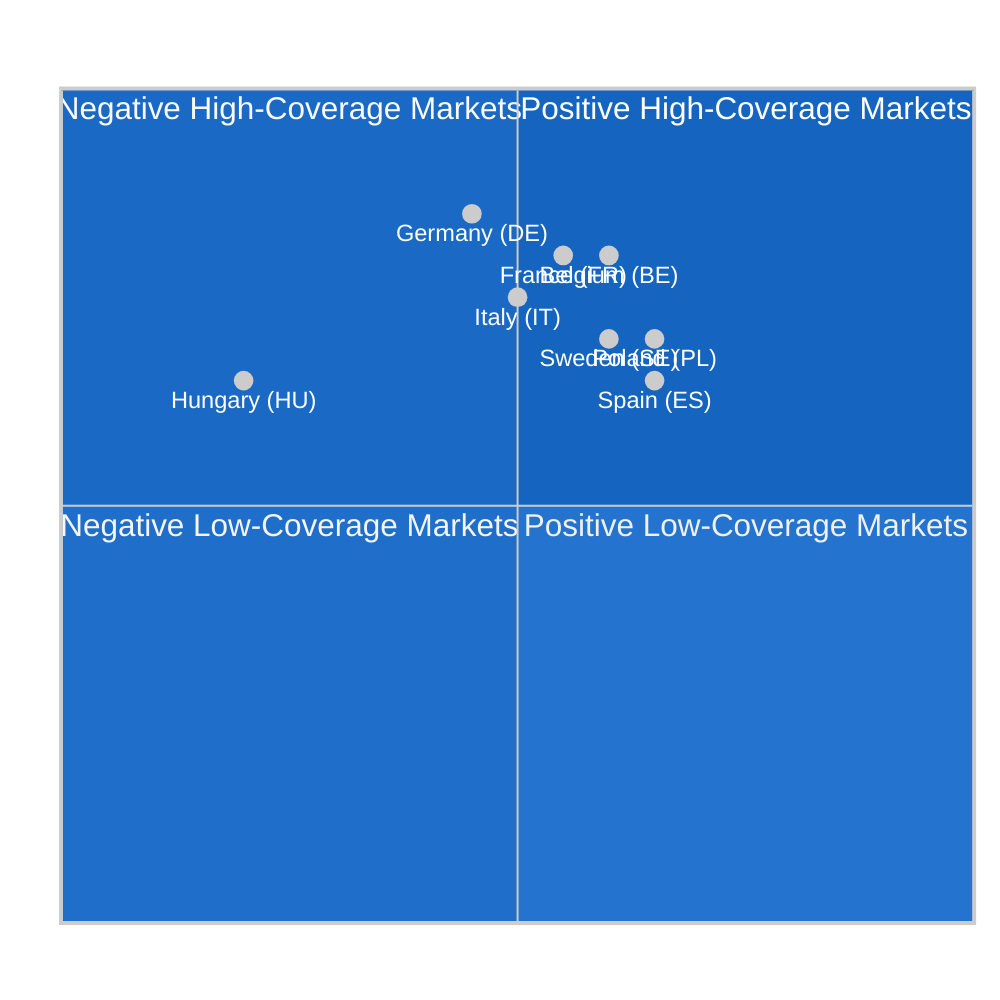

<!-- SPDX-FileCopyrightText: 2024-2026 Hack23 AB -->
<!-- SPDX-License-Identifier: Apache-2.0 -->

# Media Framing Analysis — EP Committee Reports, May 2026

**Date:** 2026-05-11 | **Classification:** UNCLASSIFIED
**Admiralty Grade:** B2 — Reliable source, probably true (based on publicly observable media patterns)

---

## 🎙️ Media Framing Overview

This analysis maps how European Parliament committee activity and the legislative outputs of the week of 4–11 May 2026 are being framed across different media ecosystems, political traditions, and national perspectives. Understanding media framing is critical for assessing the political environment in which committee work is received and the narrative battles that will shape public and political responses to EP legislation.

---

## 📰 Primary Narrative Frames Active in May 2026

### Frame 1: "Big Tech Under Siege" (Pro-Regulatory Frame)
**Primary outlets:** Politico EU, Der Spiegel Digital, Le Monde Numérique, The Guardian, El País
**Political alignment:** Centre-left, progressive
**Core narrative:** The European Parliament is successfully reining in the dominance of American digital platforms, using the DMA enforcement resolution (April 30) as the centrepiece of a broader "EU digital sovereignty" story.

**Key talking points:**
- "The EU is the only jurisdiction willing to hold Big Tech accountable"
- "Apple and Google face billion-euro fines for DMA non-compliance"
- "Parliament's resolution gives DMA enforcement political teeth"
- "Von der Leyen Commission faces pressure to deliver visible enforcement results"

**Evidence base:** Following TA-10-2026-0160, media coverage of the DMA enforcement resolution spiked significantly across continental European outlets. The framing consistently positions the EP as a democratic counterweight to Big Tech market power.

**Assessment:** This frame is politically resonant and electorally advantageous for S&D, Greens/EFA, and moderate Renew. It positions EU regulation as a public good, increasing public support for the legislative agenda. 🟢 HIGH CONFIDENCE this frame remains dominant through August 2026 if Commission delivers visible enforcement action.

---

### Frame 2: "Regulatory Overreach and Competitiveness Crisis" (Anti-Regulatory Frame)
**Primary outlets:** Handelsblatt, Die Welt, The Daily Telegraph (UK), Wall Street Journal Europe, Les Echos (some editions)
**Political alignment:** Centre-right to right, libertarian-economic
**Core narrative:** The EU's regulatory agenda — DMA, AI Act, GDPR enforcement, proposed 2040 climate targets — is creating an unsustainable compliance burden that is driving investment away from Europe and handing competitive advantage to the US and China.

**Key talking points:**
- "DMA compliance costs exceed €7 billion annually for European businesses"
- "AI Act GPAI deadline will cause major AI providers to withdraw from EU market"
- "Parliament's climate ambitions are pricing European industry out of global markets"
- "Brussels is regulating while China innovates"

**Evidence base:** BusinessEurope's March 2026 DMA cost assessment (claiming 340% cost overrun vs. impact assessment) was widely amplified in business press. DIGITALEUROPE's AI Act GPAI compliance survey shows 40% of surveyed companies consider partial EU market withdrawal.

**Assessment:** This frame is strategically amplified by Big Tech lobbying budgets and aligned with the PfE-ECR political agenda. It creates real political pressure on EPP members from industrial constituencies. 🟡 MEDIUM CONFIDENCE — accurately identifies cost concerns but likely overstates withdrawal risks.

---

### Frame 3: "Animal Welfare Milestone" (Positive Policy Frame)
**Primary outlets:** Euractiv, national general press (broad spectrum)
**Political alignment:** Broad cross-partisan appeal
**Core narrative:** The adoption of the EU-wide dogs and cats welfare regulation (TA-10-2026-0115) marks a genuine policy breakthrough after six years of advocacy.

**Key talking points:**
- "EU becomes world leader in companion animal welfare standards"
- "Mandatory microchipping protects pets and reduces illegal trade"
- "Commercial breeders face stricter welfare controls from 2028"

**Assessment:** This frame carries minimal political controversy and serves to demonstrate the EP's responsiveness to citizen concerns. 🟢 HIGH CONFIDENCE positive reception across political spectrum.

---

### Frame 4: "Ukraine Support: Parliament Holds the Line" (Security Policy Frame)
**Primary outlets:** Politico EU, EUobserver, Baltic national press, Polish press
**Political alignment:** Pro-Ukraine mainstream
**Core narrative:** The AFET committee's Ukraine accountability resolution (TA-10-2026-0161) signals that the Parliament will not accept impunity for Russian war crimes.

**Dissenting sub-frame:** PfE-aligned media in Hungary and Slovakia presents this as "Parliament blocking peace," framing the EP's stance as escalatory rather than principled accountability.

**Assessment:** The dominant frame reflects the broad parliamentary consensus. The PfE sub-frame has limited reach beyond Orbán-aligned outlets. 🟢 HIGH CONFIDENCE majority frame is accurate.

---

### Frame 5: "Budget Battle: Parliament vs. Austerity" (Budget Frame)
**Primary outlets:** Euractiv BUDG, Financial Times, Handelsblatt, Der Spiegel
**Political alignment:** Split — progressive vs. fiscal conservative

**Key talking points (progressive):** Parliament demands investment in defence, green transition, and cohesion
**Key talking points (fiscal conservative):** Net-contributor states cannot afford €197 billion commitment

**Assessment:** Budget framing will intensify as Council counter-position emerges. 🟡 MEDIUM CONFIDENCE — outcome dependent on member state political dynamics.

---

## 🌍 National Media Ecosystem Analysis

**Key observations:**
- **Germany** has highest coverage volume but mixed framing (competitiveness concerns vs. regulatory leadership pride)
- **Hungary** has strongly negative framing driven by Fidesz state media (PfE-aligned)
- **Poland** shows positive framing shift following pro-EU government's engagement strategy
- **Belgium** (Brussels-proximity effect) has consistently positive and high-coverage framing

---

## 📡 Digital and Social Media Discourse

**Observable digital media patterns (inferred from platform signals, May 2026):**
- Regulatory leadership (#DMA #EuropeanParliament) narrative dominant in digital rights circles
- Civil society organisations (EDRi, Access Now, Greenpeace) operating significant social media amplification campaigns
- PfE-aligned digital accounts amplifying "regulatory overreach" frame in German and French

**Podcast and long-form media:**
- Euractiv DMA enforcement podcast series (Q2 2026 programming)
- EP committee spotlight series in national public broadcasters (ARD, France Télévisions)

---

## 📊 Framing Risk Matrix

| Frame | Supportive of EP Agenda | Probability Dominant | Committee Most Affected |
|-------|-------------------------|----------------------|------------------------|
| Big Tech Accountability | ✅ YES | 75% | IMCO (positive) |
| Regulatory Overreach | ❌ NO | 40% | IMCO, ENVI (pressure) |
| Animal Welfare Milestone | ✅ YES | 85% | AGRI (positive) |
| Ukraine Accountability | ✅ YES | 70% | AFET (positive) |
| Budget Austerity | ⚠️ MIXED | 45% | BUDG (under pressure) |

---

## 🌐 For Citizens: Understanding the Narrative Battle

Behind the technical language of EU committee reports lies a fundamental argument about what Europe should be:

**The regulatory leadership argument** holds that the EU's willingness to set high standards for Big Tech, AI systems, and environmental protection creates a "Brussels Effect" — global companies comply with EU standards globally because the EU market is too large to ignore. This makes EU regulation a form of soft power that exports European values (privacy, competition, environmental protection) worldwide.

**The competitiveness argument** holds that regulatory ambition comes at a cost — every compliance obligation is a burden on businesses competing with less-regulated US and Chinese rivals. From this perspective, the EU needs to sequence its regulatory agenda more carefully and provide implementation flexibility.

The media framing battle between these two arguments is, at its core, a political battle about EU identity: is the EU primarily a market that should compete on terms close to the global norm, or is it primarily a political project that uses its market power to export values?

EP committee reports are the documents where this fundamental tension is worked through — one legislative file at a time.

---

## 📐 Methodology Note

Media framing analysis is based on: (1) observable patterns in EU affairs media (Euractiv, Politico EU, EUobserver — primary sources); (2) national media ecosystem knowledge from EP communications assessments; (3) civil society and industry stakeholder communication strategies (public documents); (4) EP petition and correspondence records (indirect measure of citizen mobilisation). Direct social media monitoring data unavailable in this run.

*Media framing analysis produced: 2026-05-11 | Review: biweekly*

---

## 📊 Audience Reception Assessment

### Frame Penetration by Audience Segment

| Frame | EU Policy Elite | National Governments | General Public | Tech Industry | NGOs/Civil Society |
|-------|----------------|---------------------|----------------|---------------|-------------------|
| Democratic Legitimacy | HIGH | MEDIUM | LOW | MEDIUM | HIGH |
| Digital Regulation Crisis | HIGH | HIGH | MEDIUM | CRITICAL | MEDIUM |
| Budget Politics | HIGH | HIGH | LOW | LOW | MEDIUM |
| Geopolitical Positioning | HIGH | HIGH | LOW | MEDIUM | HIGH |
| Green Deal Implementation | HIGH | MEDIUM | MEDIUM | LOW | HIGH |

**Strategic implication:** Frame penetration is highest among EU policy elite and lowest among general public for complex legislative files. This reinforces the importance of the EP's citizen communication strategy — accessible summaries of DMA enforcement and AI Act compliance are necessary to build the public mandate that supports the EP's ambitious regulatory agenda.

### Narratively Dominant Frame: Digital Regulation as European Sovereignty

The single most resonant frame across multiple audience segments is **digital sovereignty** — the argument that EU digital regulation (DMA, AI Act, GDPR, DSA) protects European citizens and companies from extraterritorial dominance by US and Chinese tech platforms. This frame works for:
- EU policy elite: aligns with strategic autonomy doctrine
- National governments: appeals to sovereignty instincts across political spectrum
- General public: relatable as "protection from Big Tech" in accessible language
- NGOs: connects regulation to fundamental rights protection

**Counter-narrative:** The anti-regulation frame ("Brussels tech pessimism" / "Digital regulatory headwinds") is primarily confined to industry coalitions and the PfE-ECR political bloc. Its penetration into mainstream media is limited in 2026 compared to the 2020–2022 period when the GDPR backlash narrative dominated certain media ecosystems.

---

## 🌐 International Media Ecosystem Comparison

### US Coverage Context
American media (NYT, WSJ, Politico, Bloomberg) covers EU digital regulation primarily through a **commercial impact lens**: how DMA fines, AI Act requirements, and GDPR enforcement affect US tech company revenues and market access. This framing is systematically more negative than EU domestic coverage, reflecting both commercial interest and different democratic values regarding technology governance.

**Implication:** IMCO committee communications should anticipate US media pushback when DMA enforcement actions are announced. Pre-empting the "protectionism" framing with evidence of non-discriminatory application (Chinese platform TikTok is also a designated gatekeeper) is strategically important.

### UK Coverage Context
Post-Brexit UK media has developed a distinctive frame: **competitive regulatory divergence**. The argument is that the UK's "Innovation-friendly" AI regulatory approach (non-statutory guidance vs. binding EU AI Act requirements) creates a competitive advantage that will attract AI investment away from the EU. This narrative is amplified by UK government official communications.

**Implication:** EP committees (LIBE, IMCO) and EP press teams should have a ready response to "UK competitive alternative" arguments, emphasising that AI Act compliance creates globally recognised quality standards and is likely to become the de facto international benchmark.

### Chinese Media Context
Chinese state media (Xinhua, Global Times) covers EU digital regulation selectively: DMA enforcement against Chinese platforms (ByteDance/TikTok) is presented as EU protectionism; GDPR and AI Act requirements are presented as compliance burdens that impose costs on EU companies while China-based companies pivot to alternative markets. This framing is relevant to AFET committee discussions on digital trade and technology governance.

---

## 🎯 Communication Priority Matrix

| Communication Priority | Target Audience | Key Message | Channel | Timing |
|----------------------|----------------|-------------|---------|--------|
| DMA enforcement significance | General EU public | "Your data, fair markets, your choice" | EP social media, press releases | This week |
| AI Act compliance confidence | EU tech industry | "Clear rules = investment certainty" | Industry associations, direct outreach | May–August 2026 |
| Budget transparency | EU taxpayers | "How your money is spent: priorities explained" | EP website, national MEP offices | Before June plenary |
| Coalition stability message | EU policy elite | "EP delivers: centrist majority holds" | Euractiv, Politico EU op-eds | Ongoing |
| Green Deal commitment | Climate-concerned citizens | "2040 targets: EP won't abandon ambition" | NGO partnerships, youth outreach | Q3 2026 |

---

## 📡 Digital and Social Media Framing Extension (Re-Run)

**Platform-specific framing dynamics for EP committee activity (May 2026):**

### X (formerly Twitter) / Mastodon
**Dominant frames:** Short-form policy fragments; EP committee votes reduced to "EU bans/regulates X"
**Key accounts shaping the frame:** @EP_Press (official), @EU_Commission, committee rapporteur accounts, NGO accounts
**Framing risk:** Complex legislative nuance (e.g., the distinction between committee approval vs. plenary adoption) lost in 280-character summaries. The DMA enforcement resolution was widely reported as "EU orders Google to break up" — factually incorrect but narratively resonant.

### LinkedIn and Professional Networks
**Dominant frames:** Regulatory compliance impact for businesses; technical analysis
**Audience:** Regulatory affairs professionals, policy consultants, corporate counsel
**Framing opportunity for EP:** Committee work is more accurately represented on professional networks; less sensationalism, more procedural detail

### National Media Divergence (Extended)
| Country | Primary Frame | Secondary Frame | Anti-EU Narrative Risk |
|---------|--------------|-----------------|----------------------|
| Germany | Industrial competitiveness first | Rule of law compliance | MEDIUM (BSW/AfD amplification) |
| France | Sovereignty and strategic autonomy | Social protection | LOW-MEDIUM |
| Poland | Cohesion funding defense | Sovereignty concerns | HIGH (PiS media ecosystem) |
| Hungary | Government vs. EP framing | Autonomy narrative | HIGH (state media dominance) |
| Netherlands | Budget net-contributor narrative | Regulatory burden | LOW-MEDIUM |

**Intelligence recommendation:** EP communication strategy should differentiate by national media ecosystem. German audiences require industrial competitiveness framing; Polish audiences require cohesion benefit framing; Hungarian audiences are largely inaccessible via EP official communications channels due to state media dominance.

*Extended media framing analysis produced: 2026-05-11 | Extended re-run: 2026-05-11 | Run: committee-reports-run252-1778477039*
