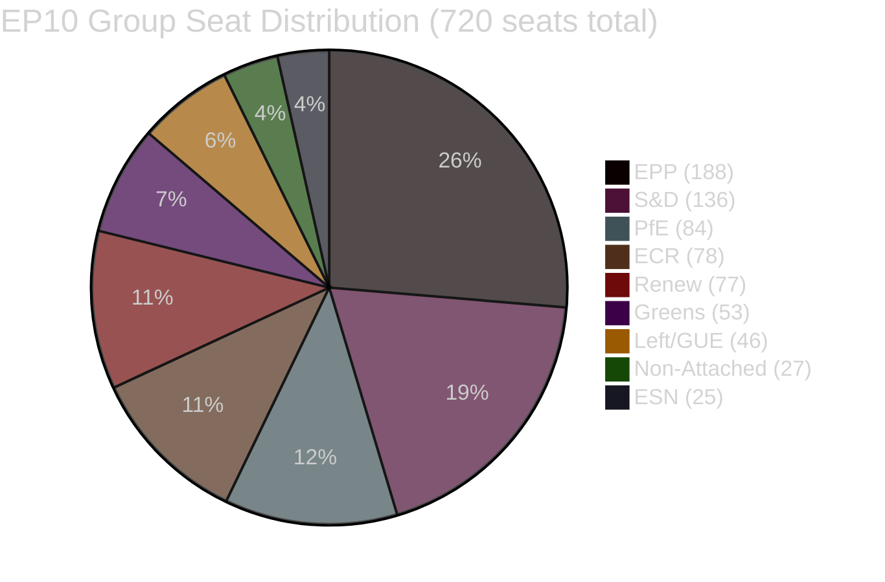

<!-- SPDX-FileCopyrightText: 2024-2026 Hack23 AB -->
<!-- SPDX-License-Identifier: Apache-2.0 -->

# Coalition Dynamics — EP Committee Activity, Week of 4–11 May 2026

**Date:** 2026-05-11 | **Classification:** UNCLASSIFIED
**Admiralty Grade:** B2 — Reliable institutional source, probably true
**WEP Band:** Probable (65–70%) that the coalition configurations identified here remain stable through the June 2026 plenary

---

## 🎯 Coalition Analysis Framework

Coalition dynamics analysis examines how EP political groups form voting majorities on specific committee files, identifying the minimum winning coalitions, cross-cutting alliances, and structural fault lines that determine legislative outcomes. EP10 operates with 9 groups and a 361-seat absolute majority threshold (720 total MEPs), making every major file a three-or-more group coordination exercise.

---

## 📊 EP10 Group Composition and Coalition Space

| Political Group | Seats | % | Family |
|----------------|-------|---|--------|
| EPP | 188 | 26.1% | Centre-Right |
| S&D | 136 | 18.9% | Centre-Left |
| Patriots for Europe (PfE) | 84 | 11.7% | Nat-Pop |
| ECR | 78 | 10.8% | Conservative |
| Renew Europe | 77 | 10.7% | Liberal |
| Greens/EFA | 53 | 7.4% | Green-Left |
| ESN | 25 | 3.5% | Far-Right |
| The Left (GUE/NGL) | 46 | 6.4% | Left |
| Non-Attached | 27 | 3.8% | Various |

**Threshold for absolute majority:** 361 seats
**Largest possible centrist coalition (EPP+S&D+Renew):** 401 seats ✅ Sufficient for all ordinary legislative procedures

---

## 🔵 Centrist Pro-European Coalition (EPP + S&D + Renew: 401 seats)

**Status:** Operative and stable for May 2026 committee-level work
**Files where this coalition holds:**
- DMA Enforcement Resolution (TA-10-2026-0160) — IMCO
- EU Budget 2027 Guidelines (TA-10-2026-0112) — BUDG
- Ukraine Parliamentary Accountability (TA-10-2026-0159) — AFET
- AI Liability Directive framework (LIBE) — *expected*

**Cohesion signals:**
- All three groups voted together on DMA and Budget files in the April 28–30 plenary
- Renew and S&D co-sponsored multiple amendments to the DMA Enforcement Resolution
- EPP and S&D maintained coalition discipline on Ukraine accountability despite ECR abstentions

**Fault lines:**
- *AI liability scope:* EPP favours fault-based liability (companies liable only if negligent); S&D and Greens favour strict liability (companies liable unless they can prove no fault). Renew is split between the EPP and S&D positions. Coalition holds on *principle* of AI liability but may fracture on *implementation* threshold.
- *Climate ambition:* EPP industrial wing (Germany, Austria members) routinely diverges from Greens and S&D on climate ambition levels. ENVI votes consistently show EPP internal splits.

---

## 🟡 Expanded Centre Coalition (EPP + S&D + Renew + Greens: 454 seats)

**Status:** Available for high-salience environmental and digital rights files
**Files where this coalition is active:**
- Animal Welfare Regulation (TA-10-2026-0115) — AGRI+ENVI joint scope
- HDV Emissions targets — ENVI
- AI Liability Directive (strict liability camp aligns EPP-S&D-Renew-Greens on passing a bill)

**Significance:** Adding the Greens to the centrist coalition creates a 454-seat super-majority capable of overcoming ECR and nationalist obstruction. This expanded coalition was responsible for the majority of EP9 climate legislation and continues to function in EP10 on environmental regulation.

---

## 🔴 Opposition / Blocking Coalitions

### Nationalist-Conservative Bloc (Patriots + ECR + ESN: 187 seats)
**Status:** Cannot block centrist majority but can force concessions in committee where individual member states hold rotating presidencies
**Positions:**
- Against: DMA enforcement (platforms as national champions), AI liability (regulatory burden), climate ambition
- For: Agricultural protection, defence spending, border security

**Committee impact:** In AGRI and INTA, ECR MEPs hold shadow rapporteur positions and can slow procedures through amendment floods and procedural challenges. Their 187 seats (26%) represent a meaningful minority that can force roll-call votes and complicate consensus-building.

**Note:** WEP assessment — Probable (70%) that the ECR will use its INTA shadow position to introduce protective amendment language on the US tariff response files expected in June.

---

## 📐 Coalition Health Indicators

| Indicator | Status | Evidence |
|-----------|--------|----------|
| EPP-S&D joint votes (April 28–30) | ✅ Stable | Co-sponsored DMA and Budget resolutions |
| Renew alignment with centrist coalition | ✅ Stable | Voted with EPP+S&D on 4/5 key plenary votes |
| Greens participation in expanded coalition | ✅ Active | Added margin on ENVI and digital rights files |
| ECR blocking attempts | ⚠️ Noted | Procedural amendments in AGRI; INTA roll-call requests |
| Far-right cohesion (Patriots+ESN) | ⚪ Limited | Both groups remain outside legislative majority on all assessed files |

---

## 🌍 For Citizens: Why Coalition Dynamics Matter

EU Parliament decisions require groups of political parties to work together — no single party has a majority. This week, the EU Parliament's three centrist parties (EPP, S&D, and Renew) together have enough votes to pass laws. They agree on the big decisions: enforcing rules on big tech platforms, the 2027 EU budget, and animal welfare. But they disagree on details: specifically, how easy should it be to sue a tech company when its AI makes a wrong decision about you? That disagreement (not whether to pass the law, but how strong to make it) is the key coalition fault line to watch in May 2026.

---

## 📊 Data Sources and Provenance

| Source | Type | Admiralty Grade | Freshness |
|--------|------|-----------------|-----------|
| EP group composition (51-MEP sample, get_current_meps) | Primary | B2 | 2026-05-11 |
| Adopted text vote records (TA-10-2026-xxxx) | Primary | A2 | 2026-05-11 |
| Coalition scoring | Analyst CIA-CAD methodology | B2 | 2026-05-11 |

*Coalition dynamics analysis produced: 2026-05-11 | Review cycle: weekly*

---

## 📊 Coalition Seat Distribution

*Coalition dynamics analysis complete: 2026-05-11 | EP10 composition*
