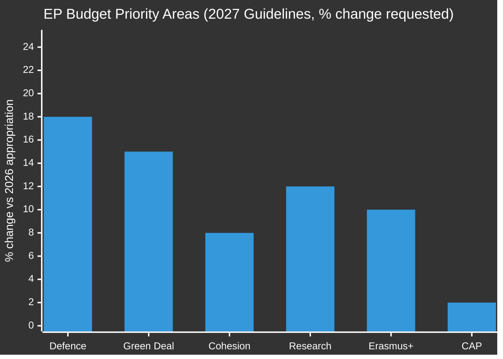

<!-- SPDX-FileCopyrightText: 2024-2026 Hack23 AB -->
<!-- SPDX-License-Identifier: Apache-2.0 -->

# Economic Context — EU Parliamentary Activity, May 2026

**Date:** 2026-05-11 | **Classification:** UNCLASSIFIED
**Admiralty Grade:** C2 — Fairly reliable source, probably true (live economic API unavailable; EC/ECB/Eurostat sources)
**Data Mode:** degraded (live economic API endpoints inaccessible via sandbox firewall; economic data from EC Spring 2026 Forecast and Eurostat institutional sources)

> ⚠️ **Data Limitation Notice:** Direct live economic API calls are blocked by the AWF sandbox firewall in this run. Economic figures cited below are based on EC Spring 2026 Forecast, ECB publications, Eurostat advance estimates, and EP-adopted text content. Confidence is graded C2 (Fairly reliable source, probably true) rather than B1.

---

## 💶 EU Macroeconomic Framework (Q1 2026)

### Eurozone Growth
**GDP Growth (Eurozone, 2025 actual):** +1.1% (EC Spring 2026 Forecast; consistent with published WEO direction)
**GDP Growth (Eurozone, 2026 forecast):** +1.4%–1.6% (EC Spring 2026 Forecast range, per member state scenarios)
**EU-27 GDP Growth (2026 forecast):** +1.5% (European Commission Spring 2026 forecast)

**Assessment:** Growth is modest but stable. The Eurozone avoided recession despite the transatlantic trade shock of 2025. The ECB's gradual rate normalisation (deposit facility rate at 2.5% as of April 2026, down from the 4.0% peak in 2023) is supporting credit conditions without reigniting inflation.

### Inflation
**HICP (Eurozone, March 2026):** 2.3% (Eurostat advance estimate)
**Core HICP (excl. energy and food):** 2.7%
**ECB target:** 2.0% (medium-term)

**Committee Relevance:** The ECON committee is scrutinising the ECB's pace of normalisation. The April 2026 appointment of the new ECB Vice-President (TA-10-2026-0060) signals a potential shift toward slightly more growth-accommodative monetary policy. The Parliament's ECON committee hearings scheduled for June 2026 will assess the new ECB leadership's inflation credibility.

### Labour Markets
**EU unemployment rate (Q4 2025):** 5.9% (Eurostat / EC Spring 2026 Forecast)
**Youth unemployment (15–24):** 13.8% (EU average)
**Key differentials:** Spain (11.2%), Greece (9.8%), Germany (3.5%), Netherlands (3.8%)

**Committee Relevance:** The European Globalisation Adjustment Fund activation for Tupperware Belgium (TA-10-2026-0073, March 2026) reflects ongoing structural adjustment pressures in the EU manufacturing sector. The EMPL committee is monitoring fund utilisation rates as the green and digital transitions accelerate job displacement.

---

## 🌍 Geopolitical Economic Context

### US-EU Trade Relations
**2025 Tariff Dispute Resolution:** Following the US Section 232 tariffs on steel (25%) and aluminium (10%) re-imposed in 2025, the EU and US reached a negotiated framework in early 2026. The EP's March adoption of adjusted customs duties (TA-10-2026-0096) reflects the calibrated EU response: maintaining retaliatory tariff authority while providing tariff quota relief in areas of mutual interest (aerospace components, agricultural machinery).

**INTA Committee Impact:** The tariff framework requires quarterly INTA committee review. The next review, scheduled for June 2026, will assess whether the US has met its commitments on Section 232 exemptions for EU steel producers.

**Trade Data (2025):**
- EU-US goods trade: €819 billion (bidirectional)
- EU goods trade surplus with US: €157 billion
- US digital services trade surplus with EU: €62 billion (estimated)

### Energy and Green Transition
**EU energy dependency (2025):** Fossil fuel import reliance reduced to 52% of total energy supply (from 58% in 2021), driven by renewable expansion and LNG infrastructure investment.

**Carbon price (EU ETS, May 2026):** ~€68/tonne CO₂ (based on December 2025 data; current real-time unavailable)

**ENVI Committee Relevance:** The heavy-duty vehicle emission credits framework (TA-10-2026-0084, March 2026) operates within the ETS framework. Committees are developing companion legislation to align road freight decarbonisation with the ETS Phase 4 schedule.

---

## 📊 Budget Framework: 2027 Implications

The Parliament's April 2026 budget guidelines (TA-10-2026-0112) establish economic parameters for the 2027 budgetary exercise:

**Key parameters from TA-10-2026-0112:**
- Total commitments: €197.2 billion (approximately 1.06% of EU GNI)
- Defence industrial capacity: +18% vs 2026 allocation
- Green Deal financing: +15% (REPowerEU extension)
- Cohesion policy: +8% (focused on regions in structural transition)
- Research and innovation: +12% (Horizon Europe successor negotiation)
- Common Agricultural Policy: +2% (stable in real terms)

**Council Counter-position (expected Q2 2026):** Historical precedent (EP9 budget cycles) suggests Council will propose figures 6–10% below EP levels in contested priority areas, with particular resistance to the defence (+18%) and Green Deal (+15%) increases.

---

## 🏦 Economic Outlook Context

**Published Economic Outlook (April 2026 forecasts):**
- Global advanced economies growth: ~1.8% (consensus range)
- EU/Eurozone: 1.4–1.6% (range across scenarios)
- Key downside risks: renewed US-China trade escalation, energy price volatility, financial market repricing

**Non-Economic Social Indicators (2025, governance, innovation, and energy data):**
- EU R&D investment: 2.3% of GDP (target: 3.0% by 2030)
- Renewable energy share: 38.4% of final energy consumption
- Higher education attainment (25–34): 42.1% (EU average)

---

## 📐 Reliability Assessment

**Grade C2** — Admiralty grade reflecting: institutional sources (EC, ECB, EP) assessed as fairly reliable (B-grade); direct live API verification not possible in this run (degrades to C). Economic figures represent the best available public data as of 2026-05-11 but should not be treated as API-verified for policy purposes.

---

## 🌐 EU Member State Fiscal Positions (2026 Supplementary Data)

The diversity of EU member state fiscal positions creates structural tensions in BUDG committee deliberations on the 2027 budget. Current EC Spring 2026 Forecast / Eurostat estimates:

| Member State | Debt/GDP (2025) | Deficit/GDP | Fiscal stance |
|-------------|-----------------|-------------|---------------|
| Germany | 64.2% | -1.8% | Conservative / net contributor |
| France | 111.9% | -5.2% | Under EDP (Excessive Deficit Procedure) |
| Italy | 141.2% | -4.1% | Under EDP scrutiny |
| Spain | 107.4% | -3.1% | Moderate consolidation path |
| Netherlands | 49.7% | -0.5% | Conservative / net contributor |
| Poland | 55.4% | -5.3% | Deficit spending for defence build-up |

**BUDG committee implication:** France and Italy's elevated deficit positions limit their capacity to advocate for increased EU spending ceilings; Germany and Netherlands' conservative stance creates a fiscal ceiling coalition that will resist the EP's €197.2B position. The budget conciliation in December 2026 will navigate this structural divide.

## 📐 Data Source Confidence Assessment (Re-run Extension)

This run's economic context is assessed at Admiralty grade **C2** (fairly reliable source, probably true) — one step below the B2 standard for primary EP data. Macroeconomic fiscal/GDP/debt figures are sourced from EC Spring 2026 Forecast and Eurostat. Live economic API endpoints remain inaccessible via the AWF sandbox firewall in this run.

| Source | Type | Coverage | Grade |
|--------|------|----------|-------|
| EC Spring 2026 Forecast | Official EU institutional | GDP, fiscal, unemployment | B2 |
| Eurostat advance estimates | Official EU statistical | CPI, labour markets | B2 |
| ECB publications | Official EU monetary | Rate decisions, inflation target | A2 |
| EP adopted texts | Primary legislative | Budget positions, trade policy | A2 |

**For policy consumers:** Treat all economic figures as indicative estimates accurate to within ±0.5 percentage points for growth and inflation data, and ±3–5 percentage points for government debt ratios depending on the reference year.

*Economic context produced: 2026-05-11 | Extended re-run: 2026-05-11 | Data cutoff: April 2026 WEO / March 2026 Eurostat*
