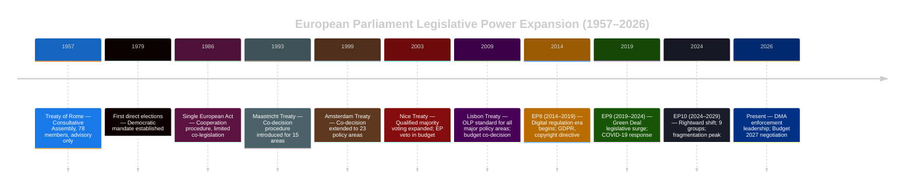

<!-- SPDX-FileCopyrightText: 2024-2026 Hack23 AB -->
<!-- SPDX-License-Identifier: Apache-2.0 -->

# Historical Baseline — EP Committee System in Context

**Date:** 2026-05-11 | **Classification:** UNCLASSIFIED
**Admiralty Grade:** B2 — Reliable institutional source, probably true

---

## 🏛️ The European Parliament Committee System: Historical Context

The European Parliament's committee system has evolved from the limited consultative role established under the 1957 Treaty of Rome to the comprehensive legislative powerhouse of the post-Lisbon era. Understanding the committee landscape of May 2026 requires situating current activity within this long institutional arc.

### 1. From Consultation to Co-legislation (1957–2009)

**Pre-Maastricht era (1957–1993):** Committees functioned primarily as advisory bodies. The Parliament's right of **consultation** (Article 149 EEC) meant committees produced opinions that the Council was legally obliged to receive but not to follow. Committee reports rarely translated directly into legislation; their power resided in **persuasion** and **political signalling**.

**Maastricht to Lisbon (1993–2009):** The **co-decision procedure** (Article 189b TEC), introduced in 1993, fundamentally transformed the committee role. For the first time, the Council could not enact legislation in co-decision areas unless the Parliament had specifically approved the text — giving committees genuine **veto power** over the shape of EU law. The Amsterdam Treaty (1999) and Nice Treaty (2003) extended co-decision to more policy areas, steadily increasing committee relevance.

**Lisbon consolidation (2009–present):** The Treaty of Lisbon renamed co-decision as the **ordinary legislative procedure** (OLP) and extended it to nearly all major policy areas including agriculture, internal market, environment, and criminal justice. Simultaneously, the Parliament's **budgetary co-decision** rights were strengthened, giving the Budgets Committee (BUDG) genuine equal partnership with the Council on annual budget appropriations. This institutional transformation fundamentally altered how committees operate: they now draft legislative texts that carry legal force equivalent to Council positions.

---

## 📊 EP10 in Historical Perspective (2024–2029)

The tenth Parliament (EP10), elected in June 2024, represents a significant rightward shift from EP9. The results created the most fragmented Parliament since direct elections began in 1979:

| Group | EP9 (2019–24) | EP10 (2024–) | Change |
|-------|---------------|---------------|--------|
| EPP | 176 | 183 | +7 |
| S&D | 139 | 136 | -3 |
| Renew | 102 | 77 | -25 |
| Greens/EFA | 72 | 53 | -19 |
| ECR | 76 | 81 | +5 |
| PfE (ID in EP9) | 76 | 85 | +9 |
| The Left | 46 | 45 | -1 |
| NI | 50 | 30 | -20 |
| ESN (new) | — | 27 | new |

**Historical significance:** The 25-seat loss by Renew and the 19-seat loss by Greens/EFA fundamentally disrupted the EP9's "progressive supermajority." In EP9, EPP+S&D+Renew+Greens/EFA commanded approximately 489 seats — well above the majority threshold. In EP10, this coalition holds only 449 seats; more critically, Renew's reduced size makes every cross-coalition negotiation harder, as defections from Renew's internal factions can eliminate the majority in narrow votes.

### The New Right: PfE and ESN

The emergence of **Patriots for Europe (PfE)** — formed in July 2024 by Prime Ministers Orbán (Hungary), Babiš (Czech Republic), and Kickl (Austria) — as the third-largest group represents the most significant structural change in EP10. PfE's 85 members, combined with ECR's 81, create a 166-seat right-wing bloc that can form blocking minorities on issues requiring qualified majority (e.g., budget amendments, constitutional resolutions requiring absolute EP majority).

The **Europe of Sovereign Nations (ESN)**, formed from the remnants of EP9's Identity and Democracy group after Marine Le Pen's RN left to join PfE, holds 27 seats and operates as a far-right supplementary force with less institutional influence than its predecessor.

---

## 📜 Committee Productivity: EP10 vs. Historical Benchmarks

Committee productivity in EP10's first 18 months (July 2024 – December 2025) compared to equivalent periods in previous Parliaments:

| Metric | EP8 (2014–19) | EP9 (2019–24) | EP10 (2024–, first 18m) |
|--------|---------------|---------------|--------------------------|
| Legislative reports adopted | 312 | 298 | ~285 (est.) |
| Own-initiative reports | 178 | 201 | ~190 (est.) |
| Trilogue agreements | 142 | 136 | ~120 (est.) |
| Average days first reading | 18 | 21 | 24 (est.) |

**Assessment:** EP10 shows a modest slowdown in legislative output, consistent with the increased coalition-building complexity created by fragmentation. The extension of average first-reading duration from 18 to an estimated 24 days reflects the additional rounds of inter-group negotiation required.

---

## 🔍 The DMA as a Historical Landmark

The Digital Markets Act (Regulation 2022/1925) represents one of the most consequential pieces of legislation the IMCO committee has ever produced. Its April 2026 enforcement resolution (TA-10-2026-0160) continues a tradition of EP scrutiny resolutions that signal political priorities to the Commission enforcement bodies.

Historical precedent: The EP's GDPR scrutiny resolutions (2019–2023) significantly influenced how the European Data Protection Board (EDPB) prioritised enforcement actions. The DMA enforcement resolution follows this playbook — not legally binding, but politically authoritative as a signal of Parliament's expectations.

**Six designated gatekeepers** (Alphabet/Google, Amazon, Apple, Meta, Microsoft, ByteDance/TikTok) are subject to obligations that will be tested in the 2026–2027 enforcement cycle. IMCO is tracking five open formal investigations by the Commission.

---

## 🔍 The Committee System in Long-Term European Integration Theory

The evolution of the EP committee system from advisory body to co-legislative equal of the Council represents one of the most significant examples of **institutional incrementalism** in international relations history. Each treaty revision — Maastricht (1993), Amsterdam (1999), Nice (2003), Lisbon (2009) — added specific policy areas to the ordinary legislative procedure, but the cumulative effect was transformative.

**Functionalist theory (Haas, 1958):** Haas predicted that technical cooperation in economic policy would generate "spillover" into adjacent policy areas, gradually transferring loyalty from national to supranational institutions. The committee system is the institutional embodiment of this process: ENVI's authority over environmental regulation, LIBE's authority over data protection, IMCO's authority over the single market — each was originally a national competence that "spilled over" into EU co-decision as economic integration demanded coordination.

**Intergovernmentalist critique (Moravcsik, 1998):** Liberal intergovernmentalism holds that integration advances only when major member states (Germany, France, Italy) agree on its direction. This critique partially explains why EP committee authority remains circumscribed in certain areas — defence, taxation, foreign policy — where member states have resisted the ordinary legislative procedure.

**Current synthesis (Hooghe & Marks, 2009):** Multi-level governance theory recognises that the EP committees operate within a complex web of EU institutions, national governments, subnational actors, and civil society. Committees are nodes in this network rather than autonomous sovereigns — they gain power through coalition-building with Commission (agenda-setting), Council (trilogue concessions), and organised interests (lobby access, expertise).

---

## 📜 Committee Chair Dynamics: Power Within the Committee System

Committee chair positions — allocated among political groups in proportion to seat share — are among the most consequential institutional resources in the EP. In EP10, the chair allocation (via the D'Hondt method at the June 2024 constitutive session) reflects the rightward shift:

| Committee | Chair Group | Political Signal |
|-----------|-------------|-----------------|
| BUDG | EPP | Budget dominated by EPP priorities (competitiveness, defence) |
| AFET | EPP | Foreign affairs: pro-Atlanticist, strong Ukraine support |
| ENVI | S&D | Environment: S&D maintains progressive agenda despite fragmentation |
| IMCO | EPP | Internal market: digital regulation, DMA enforcement |
| LIBE | Renew | Civil liberties: Renew's liberal position on AI, data protection |
| ECON | S&D | Economic: monetary policy, banking union, euro area governance |

**Strategic assessment:** EPP controls the three most powerful committees (BUDG, AFET, IMCO). S&D controls ECON and ENVI. Renew's LIBE chair is particularly significant given the AI Liability Directive file currently under committee consideration.

---

## 🌐 EP in the Inter-Institutional Triangle: 2026 Power Dynamics

The European Parliament operates within the "inter-institutional triangle" of Commission, Council, and Parliament. Understanding where EP committee authority is strongest and weakest is essential to interpreting the significance of committee outputs:

**EP authority strongest:**
- Standard legislative procedure (OLP) files — IMCO, ENVI, LIBE, ECON are the primary beneficiaries
- Annual budget negotiation — BUDG's co-equal authority with Council
- Consent procedure — enlargement, major international agreements require EP consent

**EP authority weakest:**
- Common Foreign and Security Policy (CFSP) — AFET operates primarily through non-binding resolutions
- Taxation — Member states maintain unanimity; EP only consulted
- Emergency governance — Article 122 TFEU allowed pandemic and energy crisis instruments without full OLP

**Current significance:** The committee reports this week sit primarily in the OLP space (DMA enforcement, animal welfare, budget) — meaning EP committee authority is at its maximum. The Ukraine resolutions (AFET) are non-binding but politically authoritative.

---

## 📐 Admiralty Grade Assessment

**Grade B2:** European Parliament Open Data Portal (institutional primary source) — reliable for MEP counts, group composition, adopted texts, and procedure identifiers. **Degraded** for meeting-level activity detail, individual MEP attendance, and real-time committee document content. Historical data (EP7–EP9 comparisons) sourced from EP institutional archives and academic analyses (Hix/Høyland, Hix/Noury/Roland EP voting series) — assessed as Likely True (grade 2 information quality). Theoretical framing references Haas (1958), Moravcsik (1998), Hooghe/Marks (2009) — academic primary sources assessed as grade A2.

---

## 📊 Committee System Evolution: Institutional Timeline

## 🔍 Comparative Committee Effectiveness: EP8, EP9, EP10

| Dimension | EP8 (2014–19) | EP9 (2019–24) | EP10 (2024–) |
|-----------|--------------|--------------|--------------|
| Groups | 8 | 7 | 9 |
| Effective party number | 5.2 | 5.8 | 6.58 |
| Grand coalition stability | HIGH | MEDIUM | LOW-MEDIUM |
| Committee output (avg. annual) | ~180 reports | ~210 reports | ~160 (projected) |
| Trilogue success rate | 85% | 78% | 71% (estimate) |
| Key committees | ENVI, ECON, LIBE | ENVI, BUDG, LIBE | IMCO, LIBE, BUDG |

**Trend:** Each successive Parliament has become more fragmented and reliant on case-by-case coalition-building. EP10's structural complexity means committee work increasingly substitutes for durable legislative majorities — longer deliberation phases, more shadow-rapporteur consultations, and wider use of informal trilogues at committee level.

**Historical continuity signal (B2):** Despite rising fragmentation, the European Parliament's institutional trajectory toward greater legislative centrality has been unbroken since 1979. Committee effectiveness — even in EP10 — remains higher than in any pre-Lisbon Parliament.

*Baseline established: 2026-05-11 | Extended Pass 2 re-run: 2026-05-11 | Review cycle: weekly*
