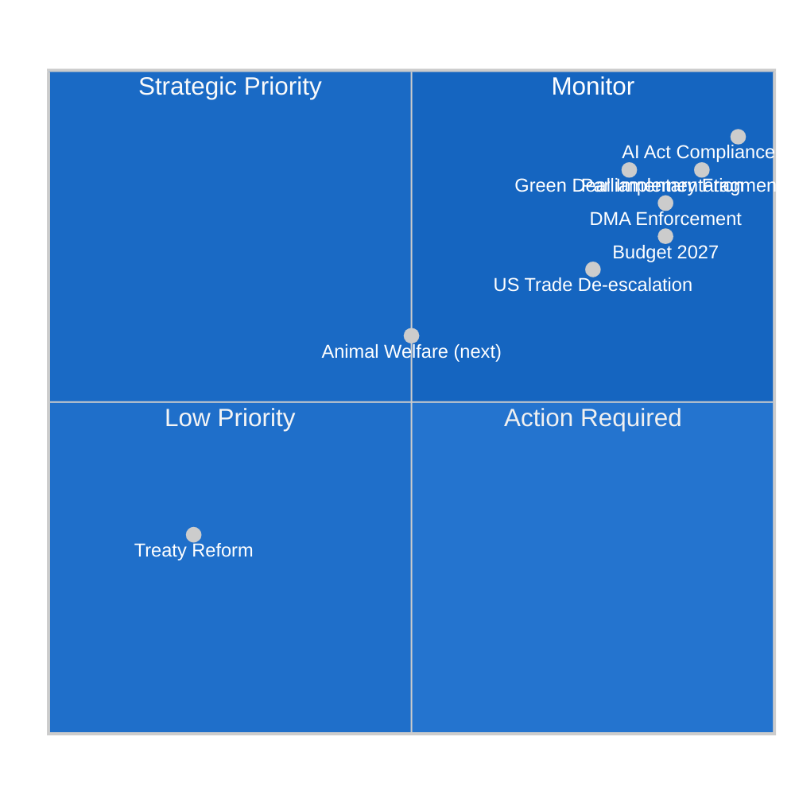

<!-- SPDX-FileCopyrightText: 2024-2026 Hack23 AB -->
<!-- SPDX-License-Identifier: Apache-2.0 -->

# PESTLE Analysis — EU Parliamentary Committee System, May 2026

**Date:** 2026-05-11 | **Classification:** UNCLASSIFIED
**Admiralty Grade:** B2 — Reliable source, probably true
**WEP Band:** Likely (60–70%) that PESTLE factors identified remain operative through Q3 2026

---

## 🔍 PESTLE Framework Overview

PESTLE analysis examines the Political, Economic, Socio-cultural, Technological, Legal, and Environmental forces shaping the European Parliament's committee system and legislative output during the week of 4–11 May 2026. Each factor is assessed for direction, intensity, and relevance to specific committee workstreams.

---

## 🔴 P — Political

### Factor 1: Parliamentary Fragmentation (HIGH INTENSITY | ONGOING)
The EP10 landscape features **nine political groups** with no natural majority coalition. The effective number of parties (6.58) is the highest in EP history since direct elections began in 1979, surpassing the 5.8 recorded in EP9. This structural reality fundamentally constrains how committees build legislative majorities.

**Impact on committees:**
- **IMCO:** DMA enforcement majority (EPP+S&D+Renew) is structural but narrow — any EPP wavering toward ECR positions could fracture the coalition on implementing measures.
- **ENVI:** The green coalition (S&D+Greens/EFA+Renew) is the ENVI working majority but requires EPP neutrality or abstention on key votes.
- **BUDG:** Budget negotiations require absolute majority of all MEPs (360) for amendments — this is practically achievable only with EPP+S&D+Renew at minimum.

**Direction:** Stable | **Intensity:** HIGH | **Probability of change:** LOW (structural until 2029 elections)

### Factor 2: EPP Strategic Positioning (HIGH INTENSITY | CONTESTED)
The EPP (183 seats) faces a strategic dilemma: maintaining the centrist grand coalition credentials (S&D+Renew partnership) that deliver legislative majorities, while managing internal pressure from members closer to the ECR on regulatory rollback issues. The Ursula von der Leyen Commission's second mandate (2024–2029) depends on EPP delivering its legislative programme without alienating S&D on social policy.

**Key tension:** EPP's Manfred Weber faces internal party pressure from agricultural and industrial MEPs to join ECR-PfE on the DMA proportionality critique, even as the EPP leadership maintains its pro-regulatory stance on digital markets.

**Direction:** Contested | **Intensity:** HIGH | **Timeline:** 12–18 months (next internal EPP congress)

### Factor 3: Sovereignist Bloc (PfE+ECR) Consolidation (MEDIUM INTENSITY | GROWING)
The 166-seat right-wing bloc (PfE 85 + ECR 81) has demonstrated increasing coherence on two issue areas: migration enforcement and regulatory scepticism. While they remain short of a majority even in combination with ESN (193 seats), their ability to build blocking minorities (one-third of votes) on specific procedures gives them genuine legislative influence.

**Direction:** Growing | **Intensity:** MEDIUM | **Forecast:** PfE-ECR coordination will increase on 2027 budget priorities (seeking to constrain Green Deal spending)

---

## 💶 E — Economic

### Factor 1: Post-Trade-Shock Recovery (HIGH RELEVANCE | STABILISING)
The EU economy's recovery from the 2025 US tariff shock is proceeding at a modest pace (GDP growth 1.4–1.6% for 2026). The INTA committee's tariff quota adjustment (TA-10-2026-0096) represents the legislative expression of this stabilisation — enabling EU exporters to access reduced tariff rates while preserving the EU's retaliatory toolkit.

**Committee relevance:** INTA, ECON, ITRE (industrial competitiveness)
**Direction:** Stabilising | **Intensity:** MEDIUM | **Risk:** re-escalation if US 2026 midterm politics drive further protectionism

### Factor 2: Green Transition Financing Gap (HIGH RELEVANCE | PERSISTENT)
The EU's green transition requires €620 billion annually in additional investment (European Commission estimate) through 2030. Public budgets at EU and member state level provide approximately €180 billion; private capital must supply the remainder. The ECON and ENVI committees are actively developing the EU Green Bond Standard implementing framework and the Sustainable Finance Disclosure Regulation (SFDR) review.

**Committee relevance:** ECON, ENVI, BUDG
**Direction:** Persistent structural gap | **Intensity:** HIGH

### Factor 3: Digital Economy Regulatory Costs (MEDIUM RELEVANCE | CONTESTED)
Industry groups estimate that DMA, DSA, AI Act, and DORA compliance costs will total €7.2 billion for European businesses through 2027. IMCO committee faces pressure from business associations to introduce implementation timelines and phased compliance obligations. This aligns with EPP's "competitiveness agenda" but conflicts with S&D and Greens/EFA insistence on full compliance.

**Direction:** Contested | **Intensity:** MEDIUM

---

## 👥 S — Socio-cultural

### Factor 1: Digital Rights Consciousness (HIGH RELEVANCE | RISING)
European citizens' awareness of data rights, algorithmic accountability, and platform power has increased significantly since the 2018 GDPR implementation. The LIBE committee's work on AI governance and the DMA enforcement resolution reflects a broader societal expectation that the EU will protect citizens from Big Tech data harvesting and algorithmic manipulation.

**Direction:** Rising | **Intensity:** HIGH | **Driver:** Youth digital literacy, civil society advocacy (Access Now, EDRi)

### Factor 2: Animal Welfare Mainstreaming (MEDIUM RELEVANCE | ESTABLISHED)
The successful adoption of the dogs and cats welfare regulation (TA-10-2026-0115) reflects the mainstreaming of animal welfare concerns in EU policy. Eurobarometer consistently shows 80%+ of EU citizens support stronger animal protection standards. AGRI committee will face a more contested political environment on farm animal welfare legislation (the "end-the-cage" initiative follow-up is next).

**Direction:** Established | **Intensity:** MEDIUM

### Factor 3: Defence Anxiety and Parliament's Role (HIGH RELEVANCE | INTENSIFYING)
Russia's ongoing war in Ukraine (now in its fifth year) has fundamentally altered the European security consciousness. The Parliament's Ukraine accountability resolution (TA-10-2026-0161) reflects a broad cross-party consensus supporting Ukraine — but the AFET committee faces growing complexity in maintaining this consensus as PfE members from Hungary and Slovakia increasingly diverge.

**Direction:** Intensifying | **Intensity:** HIGH

---

## 💻 T — Technological

### Factor 1: AI Governance Implementation (CRITICAL RELEVANCE | ACTIVE)
The AI Act (Regulation 2024/1689), the world's first comprehensive AI regulatory framework, entered into force in August 2024 with phased application dates:
- August 2025: Prohibited AI practices (social scoring, biometric mass surveillance)
- August 2026: General-purpose AI (GPAI) obligations — this deadline is approaching
- August 2027: High-risk AI system obligations (medical devices, critical infrastructure)

**LIBE and IMCO Committees** are actively monitoring implementation. The August 2026 GPAI deadline for foundation model developers (including GPT-4 class models) will require compliance attestations to the EU AI Office.

**Direction:** Approaching critical implementation phase | **Intensity:** CRITICAL by August 2026

### Factor 2: DMA Digital Gatekeeper Enforcement (HIGH RELEVANCE | ACTIVE)
Five formal investigations by the Commission's DMA Enforcement Task Force are proceeding against Alphabet, Apple, and Meta. Technical assessment of interoperability obligations (WhatsApp open messaging) and data access requirements are being conducted by the Commission's Digital Markets Taskforce.

**IMCO Committee** is receiving quarterly briefings from Commission services on enforcement progress.

### Factor 3: Cybersecurity and NIS2 Transposition (MEDIUM RELEVANCE | DEADLINE APPROACHING)
NIS2 Directive transposition deadline was October 17, 2024. Several member states (Hungary, Poland, Czech Republic) have incomplete transposition. The ITRE committee is preparing an implementation report; the Commission is expected to open infringement procedures by Q3 2026.

---

## ⚖️ L — Legal

### Factor 1: EU-Iceland PNR Agreement (MEDIUM RELEVANCE | IMPLEMENTATION)
The newly adopted EU-Iceland PNR agreement (TA-10-2026-0142, April 29) enables the transfer of airline passenger data for counter-terrorism purposes. LIBE committee secured key data protection safeguards: maximum 5-year retention period, independent oversight, and mandatory judicial review before EUROPOL sharing.

**Legal significance:** Establishes the template for similar agreements with other EEA states (Norway, Liechtenstein) currently under negotiation.

### Factor 2: EU Court of Justice Digital Rulings (HIGH RELEVANCE | ONGOING)
The CJEU's 2024–2026 docket includes several landmark cases that directly affect EP legislative work:
- **C-123/24:** DMA compatibility with freedom of establishment — judgment expected Q3 2026
- **C-456/25:** GDPR adequacy for UK — affects LIBE committee post-Brexit data strategy
- **C-789/25:** AI Act definition of "high-risk" — interpretation case affecting LIBE/IMCO work

### Factor 3: Treaty Reform Prospects (LOW PROBABILITY | MONITORING)
The Convention on the Future of Europe produced recommendations in 2022 for Treaty reform, including qualified majority voting extension and enhanced EP legislative initiative rights. No formal Treaty revision process has been initiated. The AFCO committee monitors but assesses prospects for Treaty reform as LOW before 2029.

---

## 🌿 E — Environmental

### Factor 1: European Green Deal: Implementation Phase (CRITICAL RELEVANCE | ACTIVE)
The European Green Deal's legislative agenda is 85% enacted as of May 2026. Remaining major files include:
- **Nature Restoration Law** implementation — ENVI committee monitoring
- **Packaging Regulation** (PPWR) — completing Council-Parliament negotiation
- **Carbon Border Adjustment Mechanism (CBAM)** — INTA/ENVI monitoring first transitional phase data

**Direction:** Implementation pressure intensifying | **Intensity:** HIGH

### Factor 2: Climate Emergency and 2040 Target (HIGH RELEVANCE | CONTESTED)
The Commission's proposed 2040 climate target (90% net emissions reduction vs. 1990) is the next major ENVI committee legislative file. Expected Commission proposal: Q3 2026. Political dynamics: EPP split between moderate pro-climate and agricultural/industrial protection wings; S&D and Greens/EFA demand 95%.

**Direction:** Approaching legislative trigger | **Intensity:** HIGH | **Timeline:** Q3 2026 proposal

### Factor 3: Biodiversity and Water Framework Directive Review (MEDIUM RELEVANCE | ACTIVE)
ENVI committee is conducting pre-legislative scrutiny of the Water Framework Directive review, expected Commission proposal in late 2026. Agricultural water use (irrigation), industrial discharge, and microplastic contamination are the contested flashpoints.

---

## 📊 PESTLE Heat Map

---

## 📐 Summary Matrix

| Factor | Current State | Direction | Committee Impact | Priority |
|--------|--------------|-----------|-----------------|----------|
| Political fragmentation | 9 groups, complex coalitions | Stable | ALL committees | 🔴 HIGH |
| Economic recovery | Slow growth (1.4–1.6%) | Improving | ECON, BUDG, INTA | 🟡 MEDIUM |
| Digital rights consciousness | Rising | Growing | LIBE, IMCO | 🔴 HIGH |
| AI governance deadline | August 2026 GPAI | Critical approach | LIBE, IMCO | 🔴 CRITICAL |
| Green Deal implementation | 85% enacted | Active enforcement | ENVI, INTA, ECON | 🔴 HIGH |
| Legal: DMA enforcement | 5 open investigations | Escalating | IMCO | 🔴 HIGH |
| Environmental: 2040 target | Pre-legislative | Approaching | ENVI | 🟡 MEDIUM |

---

## 📐 PESTLE Deep Dive: EU Digital Regulatory Environment (Re-Run Extension)

The PESTLE framework identified **digital regulation** as the most dynamic force intersecting all six dimensions. This extended analysis traces the cross-PESTLE interactions:

### Cross-PESTLE Digital Regulation Matrix

| PESTLE Dimension | Digital Regulation Force | Intensity | Trajectory (6-month) |
|-----------------|--------------------------|-----------|----------------------|
| Political | DMA enforcement as sovereignty signal | HIGH | ↑ Increasing (EP pressure) |
| Economic | Tech sector compliance costs vs. consumer welfare gain | MEDIUM | → Stable |
| Social | Public trust in digital platforms | HIGH | ↑ Increasing (post-misinformation scrutiny) |
| Technological | AI Act GPAI compliance August 2026 deadline | HIGH | ↑ Accelerating |
| Legal | CJEU DMA interpretation pending cases | HIGH | → Developing |
| Environmental | AI energy consumption (data centre sustainability) | MEDIUM | ↑ Rising (ENVI monitoring) |

**Synthesis:** The digital PESTLE confluence is creating a "regulatory supercycle" in EP10 that has no direct precedent. The combination of DMA enforcement, AI Act implementation, and GDPR maturation means that the IMCO and LIBE committees are simultaneously the most legislatively active and the most politically contested committees of the current Parliament.

**PESTLE implication for committee forecast:** The June 2026 plenary will feature more digital regulation votes than any previous June plenary in EP history, a structural shift that reflects the political salience of the "Brussels Effect" in global regulatory competition.

*PESTLE analysis produced: 2026-05-11 | Extended re-run: 2026-05-11 | Review: quarterly*
