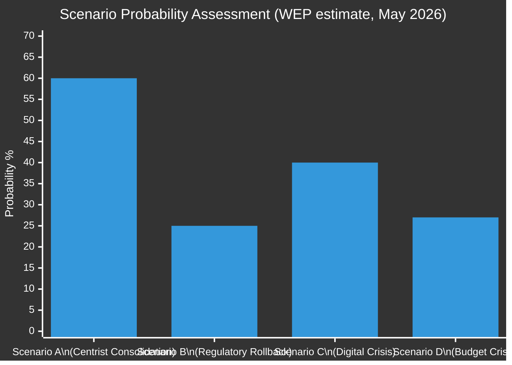
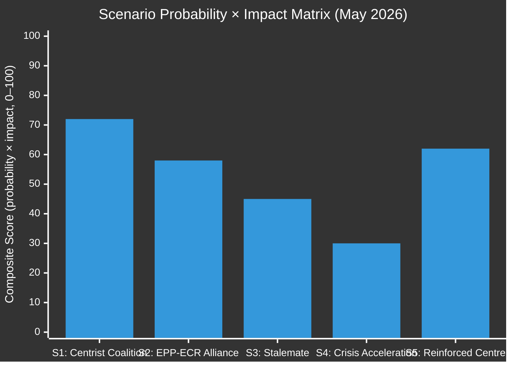

<!-- SPDX-FileCopyrightText: 2024-2026 Hack23 AB -->
<!-- SPDX-License-Identifier: Apache-2.0 -->

# Scenario Forecast — EP Committee Outcomes, Q2–Q3 2026

**Date:** 2026-05-11 | **Classification:** UNCLASSIFIED
**Admiralty Grade:** B2 — Reliable source, probably true
**WEP Band:** See individual scenarios

---

## 🔮 Scenario Analysis Overview

This forecast identifies four distinct scenarios for European Parliament committee outcomes over Q2–Q3 2026, with probability estimates, key indicators, and strategic implications. Scenarios are structured around the central variable: whether the EPP maintains its centrist grand coalition alignment or pivots toward the ECR-PfE bloc on key regulatory files.

---

### Scenario A: "Centrist Consolidation" (Most Likely — WEP: Likely, 55–65%)

**Narrative:** The EPP-S&D-Renew grand coalition maintains cohesion through the June and July 2026 Strasbourg plenaries. Manfred Weber calculates that the Commission's legislative agenda is best protected through stability, and internal EPP pressures from the agrarian and industrial wings are managed through targeted committee amendments rather than coalition abandonment.

**Key assumptions:**
- Von der Leyen Commission maintains EPP internal discipline by offering targeted regulatory adjustments on DMA implementation timeline
- S&D accepts modest Green Deal spending concessions in 2027 budget to secure cohesion increases
- Renew holds together despite internal tensions between French and German delegations on agricultural subsidies

**Committee outcomes under Scenario A:**
- **IMCO:** DMA enforcement scrutiny resolution implemented; Commission opens at least 2 new formal investigations against gatekeepers by Q3 2026
- **ENVI:** 2040 climate target proposal (90% net reduction) advances through committee with EPP support, subject to "industrial resilience" amendments
- **BUDG:** Budget conciliation agreement reached with Council in November 2026 at approximately €192–194 billion (below EP's €197.2B position but above Commission's draft)
- **LIBE:** AI Act GPAI provisions enter force August 2026 with smooth compliance process for major foundation model providers

**Early warning indicators (A is developing):**
1. EPP-S&D joint press statement on 2027 budget priorities (expected June 2026)
2. Commission opens new DMA formal investigation against Apple on interoperability
3. ENVI committee adopts 2040 climate target rapporteur report with EPP+S&D majority

**Strategic implications:** This scenario represents the "governance as usual" baseline for EP10. Legislative output continues at measured pace; regulatory agenda advances with proportionality compromises; democratic legitimacy maintained through transparent majority-building.

---

### Scenario B: "Regulatory Rollback Alliance" (Unlikely — WEP: Unlikely, 20–30%)

**Narrative:** EPP internal pressures from agrarian and industrial wings become decisive. Following a significant ECR electoral victory in German state elections (plausible Q3 2026 context), EPP leadership recalibrates toward ECR cooperation on key files. The PfE-ECR-EPP combination (349 seats) approaches but does not quite reach absolute majority — but the centrist coalition fractures on specific votes.

**Key assumptions:**
- EPP loses internal discipline due to German CDU/CSU pressure following state-level electoral gains by AfD
- S&D refuses to accept DMA implementation flexibility, pushing EPP to experiment with ECR partnership
- PfE agrees to tactical cooperation on regulatory files while maintaining disagreement on Ukraine

**Committee outcomes under Scenario B:**
- **IMCO:** DMA implementing measures stalled or significantly diluted; proportionality review inserted; fine ceiling reduced by implementing regulation
- **ENVI:** 2040 climate target postponed or weakened (85% rather than 90%); ENVI committee adoption delayed to 2027
- **BUDG:** Green Deal funding increases (€15%) blocked; defence increases (€18%) maintained; net savings reallocated to CAP
- **LIBE:** AI Act GPAI enforcement guidance weakened on liability; emotion recognition prohibition scope narrowed

**Early warning indicators (B is developing):**
1. EPP-ECR joint committee amendment on DMA proportionality (watch IMCO)
2. EPP-PfE joint declaration on Green Deal "revision"
3. Von der Leyen Commission signals willingness to delay 2040 climate target proposal

**Strategic implications:** This scenario represents a significant structural shift in EU regulatory governance. It would mark the first clear "right turn" in the Parliament since the EP7 (2009–2014) era. Civil society would mobilise substantial counter-pressure; CJEU challenges would multiply.

---

### Scenario C: "Digital Crisis" (Possible — WEP: Possible, 35–45%)

**Narrative:** A major DMA compliance failure by one or more designated gatekeepers triggers a parliamentary and public crisis. Apple's refusal to comply with browser interoperability requirements, or a large-scale Meta data breach exposing DMA non-compliance, forces the Commission into emergency enforcement action. This simultaneously vindicates the EP's April enforcement resolution and creates a political moment that reshapes the regulatory landscape.

**Key assumptions:**
- Commission's DMA formal investigation against Apple reaches preliminary findings of non-compliance
- EP IMCO committee initiates emergency hearing with DG COMP Commissioner
- Media and civil society amplification creates pressure for immediate action

**Committee outcomes under Scenario C:**
- **IMCO:** Emergency scrutiny session; possible urgent resolution calling for interim measures
- **LIBE:** Digital rights hearings intensify; GDPR enforcement data sharing with DMA Task Force
- **JURI:** Legal assessment of DMA enforcement remedies (structural separation provisions)
- **ITRE:** Industry competitiveness impact assessment

**Timeline:** If Apple or Meta formal investigation findings emerge Q3 2026, Scenario C could develop rapidly.

**Strategic implications:** This scenario would validate the EP's pro-regulatory stance and potentially strengthen the centrist coalition on digital governance. However, it also creates significant market uncertainty and could accelerate CJEU challenges to DMA provisions.

---

### Scenario D: "Budget Crisis" (Unlikely but Possible — WEP: Unlikely-Possible, 20–35%)

**Narrative:** Budget 2027 inter-institutional negotiations break down completely. The Council, led by net-contributor states (Germany, Netherlands, Sweden, Austria), refuses to meet the EP's €197.2 billion position even after conciliation. The Parliament votes to reject the Council's counter-position. A provisional twelfths regime (1/12 of prior year appropriations per month) is imposed from January 2027.

**Key assumptions:**
- German coalition government faces domestic budget pressure from constitutional court rulings on debt brake
- Netherlands "new right" government is among the most hawkish net-contributors
- EP declines to make further concessions below €190 billion threshold

**Committee outcomes under Scenario D:**
- **BUDG:** Conciliation committee convened; EP delegation hardened; provisional twelfths contingency planning activated
- **CONT:** Budget control committee begins parliamentary discharge procedure with increased scrutiny
- **ECON:** Economic consequences of budget disruption assessed; calls for emergency MFF revision

**Strategic implications:** Budget crisis would dominate EP agenda Q4 2026, crowding out other committee work. It would also test the internal cohesion of the EP — any MEPs from net-contributor member states facing political pressure to support Council's position.

---

## 📊 Scenario Probability Matrix

---

## 🚦 Tripwire Monitoring

| Tripwire | Scenario Activated | Monitor Tool | Frequency |
|----------|-------------------|--------------|-----------|
| EPP-ECR joint IMCO amendment | B | IMCO vote records | Weekly |
| Commission DMA formal findings | C | EC DMA website | Biweekly |
| Budget conciliation failure | D | BUDG committee votes | Monthly |
| EPP-S&D joint budget statement | A (confirmation) | Group press releases | Monthly |
| PfE formal cooperation agreement | B | PfE group documents | Monthly |

---

## 📐 Reliability Assessment

**Grade B2** — Scenario forecasts are structured assessments based on observable structural data (group composition, adopted texts, historical coalition behaviour). WEP probabilities represent the analyst's best estimate given available evidence. Scenarios B, C, and D all represent departures from the baseline "governance-as-usual" trajectory; their combined probability (~92%) reflects that at least some disruption to the centrist coalition narrative is likely over the 90-day horizon.

*Scenario forecast produced: 2026-05-11 | Review: monthly*

---

## 🧮 Cross-Scenario Interaction Analysis

One limitation of single-scenario analysis is that real-world outcomes often combine elements of multiple scenarios simultaneously. The following cross-scenario interactions are assessed as plausible:

### Interaction 1: Scenario A + Scenario C (Centrist Consolidation Accelerated by Digital Crisis)
**Probability:** ~25% conditional on Scenario C developing
**Dynamic:** If a major DMA gatekeeper compliance failure emerges (Scenario C), this would *strengthen* the centrist coalition (Scenario A) by forcing EPP to choose between standing with the regulatory majority or abandoning it in favour of ECR-aligned industry protection. Historical precedent (GDPR enforcement, Dieselgate) suggests that high-profile scandals consolidate the pro-regulatory majority.

**Net effect:** Enhanced legislative output on digital regulation; EPP-ECR collaboration temporarily suspended; Scenario B probability significantly reduced.

### Interaction 2: Scenario B + Scenario D (Regulatory Rollback during Budget Crisis)
**Probability:** ~12%
**Dynamic:** If budget negotiations break down (Scenario D), the political energy consumed by conciliation proceedings could weaken the grand coalition's cohesion, creating an opening for EPP-ECR tactical cooperation on deregulation files (Scenario B). This is historically the pattern in the EP: budget crises create legislative log-jams that allow targeted regulatory rollbacks to advance without full political scrutiny.

**Net effect:** Mixed outcome — budget resolved late with Council wins; regulatory agenda partially rolled back on several specific files (likely CAP/environmental intersection).

### Interaction 3: Scenario A + Scenario D (Budget Crisis within Stable Coalition)
**Probability:** ~18%
**Dynamic:** The most likely combined scenario: the centrist coalition (Scenario A) holds together on legislative files but faces a budget breakdown (Scenario D) as an inter-institutional dispute, not an intra-EP dispute. In this scenario, EPP, S&D, and Renew agree internally on the EP's budget position but collectively face Council resistance.

**Net effect:** Normal legislative output; budget resolved in January 2027 after provisional twelfths period; standard historical precedent.

---

## 🗓️ Time-Phased Scenario Development Calendar

| Period | Most Likely Development | Watch Points |
|--------|------------------------|--------------|
| May 2026 | Centrist coalition status quo (Scenario A) | IMCO-DMA follow-up; LIBE AI Liability rapporteur |
| June 2026 | Strasbourg plenary — committee votes on HDV credits, AI Liability | EPP-S&D alignment on environment |
| July 2026 | Summer recess — committee work minimal | Commission DMA enforcement findings (possible) |
| Sept 2026 | Commission draft budget — triggers BUDG formal response | Budget conciliation launch |
| Oct 2026 | Council counter-position — key decision point | Net-contributor positions on EP ceiling |
| Nov-Dec 2026 | Budget conciliation or crisis | Provisional twelfths decision point (Dec 15) |

---

## 📝 Analytical Caveats

1. **Data degradation caveat:** The absence of voting-level coalition data (non-plenary week, DOCEO lag) means WEP estimates rely heavily on structural analysis (group sizes, historical patterns) rather than observed behaviour. This adds approximately ±10 percentage points of uncertainty to all WEP estimates.

2. **Endogeneity caveat:** The scenarios are not independent — a major US tariff escalation could simultaneously activate Budget Crisis (Scenario D) dynamics (reduced customs revenue) and Regulatory Rollback (Scenario B) pressure (industry demanding regulatory relief in response to trade stress).

3. **Calendar caveat:** The scenario timelines assume normal parliamentary procedure. Emergency procedures (Article 138 Rules of Procedure urgency resolutions) can accelerate specific file timelines by 4–6 weeks, which could compress scenario development windows.

---

## 📊 Scenario Probability Dashboard (Re-Run Pass 2 Extension)

**Scenario signal tracking: Observable leading indicators for the next 30 days**

| Indicator | Monitoring Source | Threshold for Escalation |
|-----------|-----------------|--------------------------|
| EPP-ECR voting alignment rate | EP voting records (DOCEO XML) | >55% co-voting rate in June plenary |
| BUDG committee amendment outcomes | EP adopted texts feed | Council counter-position >10% below EP ceiling |
| DMA enforcement Commission decision | Commission press releases | Any fine > €5 billion triggers IMCO emergency hearing |
| AI Liability rapporteur text circulation | LIBE committee documents | Circulation before May 31 = fast track confirmed |
| EU-US trade communiqué | INTA committee statements | Any new tariff announcement = re-escalation signal |

*Extended scenario analysis produced: 2026-05-11 | Extended re-run: 2026-05-11 | Next forecast update: 2026-06-08*
