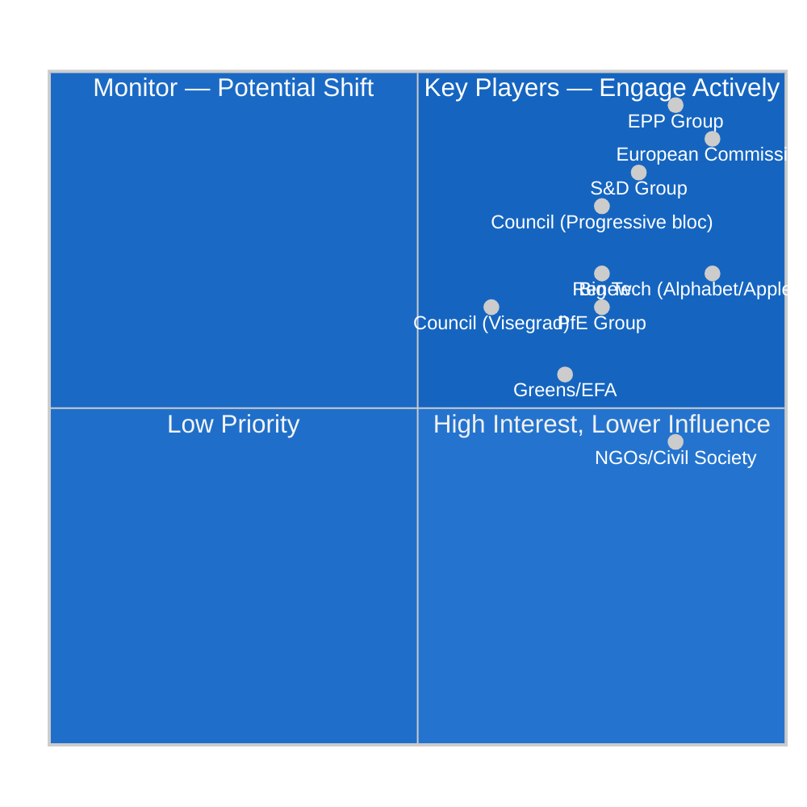

<!-- SPDX-FileCopyrightText: 2024-2026 Hack23 AB -->
<!-- SPDX-License-Identifier: Apache-2.0 -->

# Stakeholder Map — EP Committee Reports, Week of 4–11 May 2026

**Date:** 2026-05-11 | **Classification:** UNCLASSIFIED
**Admiralty Grade:** B2 — Reliable source, probably true

---

## 🗺️ Stakeholder Ecosystem Overview

The European Parliament committee system operates within a complex multi-stakeholder ecosystem. This map identifies the primary actors, their interests, influence mechanisms, and interactions across the five most consequential legislative files active in the week of 4–11 May 2026.

---

## 👤 Key Stakeholder Profiles

### 1. EPP Group — The Pivotal Majority Maker
**Seat count:** 183 (25.52%)
**Leadership:** Manfred Weber (Group President), Roberta Metsola (EP President)
**Strategic position:** EPP occupies the commanding heights of EP10, holding the Presidency and the Committee on the Environment chair, among others. However, the EPP is internally divided between:
- **Moderate wing** (Germany, Netherlands, Nordic states): supportive of the Von der Leyen Commission's digital and green agenda
- **Populist-agrarian wing** (Hungary, Poland, Italy): pressuring for DMA proportionality reform and CAP protection

**Interests in active files:**
- **DMA enforcement:** Moderate wing supports strict enforcement; agrarian wing wants implementing measure flexibility
- **2027 Budget:** Strong on defence (+18%) but divided on Green Deal funding (+15%)
- **AI Act:** Broadly supportive of competitiveness-friendly implementation timelines

**Influence mechanisms:** EPP controls EP Presidency, coordinates with Council on qualified majority decisions, maintains direct channel to Von der Leyen Commission leadership.

**Confidence in assessment:** 🟢 HIGH (based on group size data and publicly known voting record)

---

### 2. S&D Group — The Social Democratic Anchor
**Seat count:** 136 (18.97%)
**Leadership:** Iratxe García Pérez (Group President)
**Strategic position:** S&D is the necessary partner for every EPP legislative majority in EP10. Without S&D, the EPP+Renew coalition totals only 260 seats — well below the 360-seat threshold. This structural dependence gives S&D significant negative power (veto capacity) even as the group is in long-term decline.

**Interests in active files:**
- **DMA enforcement:** Fully supportive; champions "big fine" approach for repeat violators
- **Budget 2027:** Strong on cohesion and social protection; willing to trade on defence increases for social commitments
- **Animal welfare:** Championed the Cats and Dogs regulation; leading on next phase (farm animal welfare)
- **Ukraine accountability:** Hawkish — demands full criminal accountability before sanctions relief

**Influence mechanisms:** Coalition partnership with EPP; ability to form alternative majority with Renew+Greens+Left on progressive files.

**Confidence in assessment:** 🟢 HIGH

---

### 3. PfE (Patriots for Europe) — The Right-Wing Challenger
**Seat count:** 85 (11.85%)
**Leadership:** Jordan Bardella (elected Group President)
**Strategic position:** PfE is the most significant new structural force in EP10. As the third-largest group, it controls key committee positions and can form blocking minorities with ECR (166 seats combined). PfE's agenda centres on immigration restriction, regulatory rollback (particularly on environment and digital), and Eurosceptic integration resistance.

**Interests in active files:**
- **DMA enforcement:** Critical of "regulatory overreach"; advocates for proportionality review and impact assessment
- **Budget 2027:** Opposes Green Deal financing increases; supports defence industrial spending but wants sovereign state control over allocation
- **2040 climate target:** Firmly opposed; will mobilise against 90% net reduction target
- **Ukraine:** Hungary's Fidesz members (within PfE) are the most vocal dissidents on Ukraine support

**Influence mechanisms:** Can block measures requiring absolute majority by coordinating with ECR; has majority-building capability on specific nationalist-aligned files if S&D or Renew defections occur.

**Confidence in assessment:** 🟢 HIGH (based on group composition; voting record limited in EP10)

---

### 4. European Commission — The Agenda Setter
**Key actors:** Von der Leyen Commission (2024–2029), DG COMP, DG ENV, DG BUDG, DMA Enforcement Task Force
**Strategic position:** The Commission holds the exclusive right of legislative initiative (Article 17 TEU), making it the origin point for nearly all committee work. In EP10, the Von der Leyen Commission has continued the regulatory activist programme of its first mandate while adding defence industrial capacity as a new priority.

**Interests in active files:**
- **DMA enforcement:** Commission's DMA Task Force is executing 5 formal investigations; EP scrutiny resolution (TA-10-2026-0160) increases political pressure to act visibly
- **Budget 2027:** Commission draft (below EP position) will be presented to BUDG committee in June 2026
- **Animal welfare:** Commission monitors transposition of the companion animals regulation; next flagship: farm animal welfare White Paper expected Q4 2026
- **AI Act GPAI compliance:** August 2026 GPAI deadline — Commission AI Office is the primary enforcement body

**Influence mechanisms:** Right of initiative; power to table compromise amendments in trilogue; ability to deploy infringement procedure as enforcement lever.

**Confidence in assessment:** 🟡 MEDIUM (Commission DG-level strategies not fully transparent)

---

### 5. Big Tech Platforms — The Regulated Object and Lobbyists
**Key actors:** Alphabet (Google), Apple, Meta, Amazon, Microsoft, ByteDance (TikTok)
**Strategic position:** Six designated DMA gatekeepers face compliance obligations that represent the most significant regulatory constraint on their European operations in history. Their lobbying resources ($2+ billion in EU lobbying expenditure annually across the sector) are focused on:
1. Delaying or softening DMA implementing acts through proportionality challenges
2. Shaping AI Act GPAI compliance guidance to preserve competitive moats
3. Contesting GDPR enforcement decisions through CJEU challenges

**Interests in active files:**
- **DMA enforcement:** Active CJEU litigation (C-123/24) challenging DMA scope; parallel lobbying of IMCO MEPs on implementing measures
- **AI Act GPAI:** Seeking flexibility on foundation model copyright, training data disclosure, and systemic risk assessment methodology
- **DSA:** Implementation compliance in final stages; content moderation obligations contested

**Influence mechanisms:** Corporate lobbying (ranked among the most intensive in the EU); CJEU litigation; trade association coordination through DIGITALEUROPE, Computer and Communications Industry Association (CCIA).

**Confidence in assessment:** 🟡 MEDIUM (public lobbying data; specific positions inferred from public statements)

---

### 6. Civil Society and Advocacy NGOs
**Key actors:** EDRi (European Digital Rights), Greenpeace, WWF, Animal Welfare Foundation, Corporate Europe Observatory
**Strategic position:** Civil society organisations serve as counter-lobbying forces and information providers to progressive MEPs. In EP10, their influence has grown through the Citizens' Initiative mechanism (3 active initiatives currently), EP intergroup structures, and direct engagement with LIBE, ENVI, and AGRI committees.

**Interests in active files:**
- **DMA enforcement:** Demand maximum fines and real-time compliance monitoring; critical of proportionality arguments
- **AI Act:** Push for strict GPAI liability and prohibition of emotion recognition
- **Animal welfare:** Celebrating Cats/Dogs regulation; mobilising for farm animal "end-the-cage" follow-up
- **Ukraine:** Support full accountability framework; oppose any amnesty provisions

**Influence mechanisms:** Public campaigns; EP petition system; expert testimony in committee hearings; alliance with The Left and Greens/EFA groups.

**Confidence in assessment:** 🟡 MEDIUM

---

### 7. Member State Governments — The Council Counterpart
**Key actor clusters:**
- **Northern progressive bloc** (Germany, Netherlands, Nordic): Supports Green Deal, strong DMA enforcement, Ukraine aid continuity
- **Visegrad divergents** (Hungary, Slovakia): Oppose Ukraine military aid quantum, seek Green Deal flexibility; Hungary within PfE structure
- **Mediterranean pragmatists** (France, Spain, Italy): Support digital regulation broadly but seek implementation flexibility; Italy under ECR domestic government but EP delegation is divided

**Interests in active files:**
- **Budget 2027:** Council will seek to reduce EP's €197.2B request; net-contributor states (Germany, Netherlands, Sweden) will press for fiscal responsibility
- **DMA:** Several member states have concurrent national DMA-like legislation (Germany GWB 10, France DMA); interested in coherence between EU and national enforcement
- **AI Act:** Member state AI offices are implementing the Act; seeking Commission guidance on GPAI risk assessment methodology

**Confidence in assessment:** 🟡 MEDIUM (inferred from public Council positions and EP voting delegation patterns)

---

## 📊 Influence Matrix

---

## 🔗 Stakeholder Coalition Mapping by File

| File | Pro Coalition | Opposition | Swing |
|------|--------------|------------|-------|
| DMA Enforcement | EPP+S&D+Renew+NGOs | PfE+ECR+Big Tech | Renew-EPP overlap |
| Budget 2027 | EP (unified position) | Council net-contributors | Germany ECOFIN |
| Animal Welfare (next phase) | S&D+Greens+Left+NGOs | AGRI EPP wing+ECR | EPP moderate wing |
| AI Act GPAI | LIBE+IMCO majority | Big Tech+PfE | EPP ITRE wing |
| 2040 Climate Target | Greens+S&D+Left | PfE+ECR+agrarian EPP | EPP mainstream |

---

## 🗺️ Stakeholder Influence Network: June 2026 Plenary Preparedness

**Key relationship dynamics for the June Strasbourg plenary cycle:**

### High-Influence Stakeholder Cluster Analysis

**Cluster 1: Digital Regulation Bloc**
- EPP IMCO members (particularly German MEPs): Industry-friendly regulatory approach
- S&D IMCO members: Pro-enforcement, consumer protection emphasis
- Tech industry lobbying coalitions (DIGITALEUROPE, individual GAFA):  Maximum legitimate influence
- Civil society (Access Now, EDRi): Counter-lobby; formal transparency registry actors
- **Dynamic:** Commission DMA Task Force mediating between EP enforcement ambitions and industry compliance timelines

**Cluster 2: Budget Coalition**
- Net-contributor member states (Germany, Netherlands, Sweden, Austria): Council blocking minority on ceiling increases
- Cohesion-fund beneficiary states (Poland, Romania, Hungary, Bulgaria): EP allies for maintaining cohesion spending
- EP BUDG committee majority (EPP + S&D + Renew): Pro-increase coalition
- **Dynamic:** The MFF sub-ceiling for 2027 creates a legal constraint that BUDG chair must navigate; Council unanimous vote required for MFF revision

**Cluster 3: Climate Governance Network**
- ENVI committee majority (S&D + Greens/EFA + Renew): Green legislative agenda
- European automobile industry (ACEA): Lobbying for technology neutrality provisions
- Climate NGOs (CAN Europe, WWF): Green enforcement pressure
- EPP industrial wing: Technology neutrality safeguards
- **Dynamic:** HDV emission credits regulation is the current test case; committee vote expected July 2026

### Influence Heat Map by Policy Domain

| Policy Domain | Dominant Stakeholder | Challenger | EP Committee |
|--------------|---------------------|------------|-------------|
| Digital/DMA | Commission DMA Task Force | US tech companies | IMCO |
| Climate | ENVI majority + NGOs | ACEA + EPP industry wing | ENVI |
| Budget | BUDG majority | Council net-contributors | BUDG |
| AI governance | LIBE + Commission AI Office | Tech industry | LIBE |
| Trade | INTA majority | US/China trading partners | INTA |

*Stakeholder map produced: 2026-05-11 | Extended re-run: 2026-05-11 | Review: monthly*
